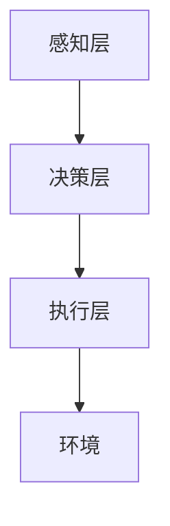
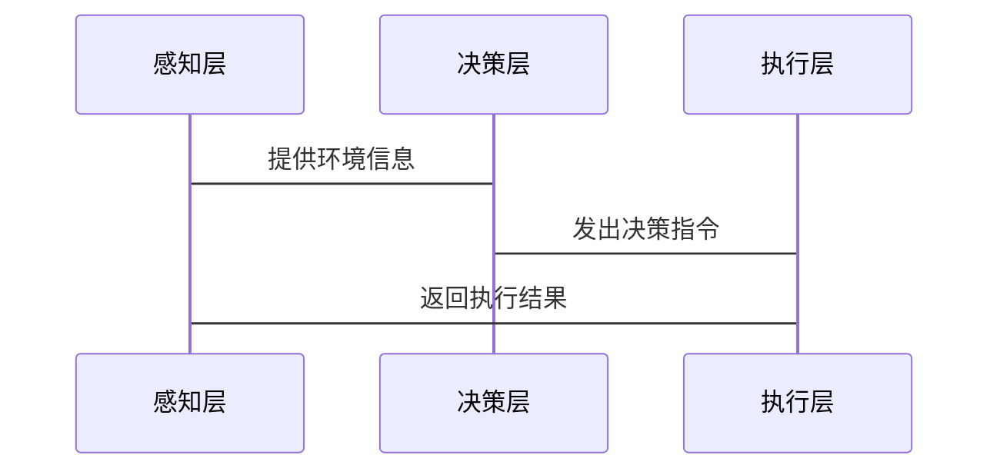

                 


# 构建具有多目标平衡能力的AI Agent

> 关键词：多目标优化、AI Agent、强化学习、深度学习、平衡能力  
> 摘要：本文详细探讨如何构建具有多目标平衡能力的AI Agent，涵盖背景、算法、系统架构和项目实战，提供全面的技术指导。

---

## 第一部分: 构建具有多目标平衡能力的AI Agent概述

### 第1章: 多目标优化与AI Agent的背景

#### 1.1 多目标优化的基本概念

##### 1.1.1 什么是多目标优化
多目标优化是指在多个目标之间寻找最优解的过程。与单目标优化不同，多目标优化需要在多个互相冲突的目标之间找到平衡点，例如在资源分配中，既要最大化利润，又要最小化成本。

##### 1.1.2 多目标优化的特点
- **多样性**：存在多个可能的最优解。
- **冲突性**：目标之间往往存在冲突，无法同时达到最优。
- ** Pareto 优性**：找到一组非支配解，这些解在某些目标上优于其他解。

##### 1.1.3 多目标优化与单目标优化的区别
单目标优化仅考虑单一目标，而多目标优化需要同时处理多个目标，寻找 Pareto 最优解。

#### 1.2 AI Agent的基本概念

##### 1.2.1 什么是AI Agent
AI Agent是一个能够感知环境、做出决策并采取行动的智能实体。它可以自主执行任务，适应环境变化。

##### 1.2.2 AI Agent的核心特征
- **自主性**：无需外部干预。
- **反应性**：能感知并实时响应。
- **主动性**：主动采取行动。
- **社会性**：能与其他 Agent 或人类交互。

##### 1.2.3 AI Agent的应用场景
- 智能助手：如 Siri、Alexa。
- 自动驾驶：处理复杂的驾驶决策。
- 金融交易：自动进行投资决策。

#### 1.3 多目标平衡能力在AI Agent中的重要性

##### 1.3.1 多目标平衡能力的定义
指AI Agent在面对多个目标时，能够权衡并找到最优解的能力。

##### 1.3.2 多目标平衡能力的应用价值
在复杂环境中，AI Agent需要在多个目标间找到平衡，例如在自动驾驶中，既要安全又要高效。

##### 1.3.3 当前AI Agent在多目标平衡能力方面的挑战
- 复杂性：目标之间的相互影响。
- 计算复杂度：寻找 Pareto 最优解需要大量计算。
- 动态环境：目标优先级可能变化。

---

## 第2章: 多目标优化的数学模型与算法

### 2.1 多目标优化的数学模型

#### 2.1.1 目标函数的定义
目标函数表示需要优化的指标，通常表示为：
$$ f(x) = (f_1(x), f_2(x), ..., f_n(x)) $$

#### 2.1.2 约束条件的表达
约束条件限制了优化的范围，通常表示为：
$$ g_i(x) \leq 0, \quad i = 1, 2, ..., m $$

#### 2.1.3 多目标优化问题的数学形式化
数学形式化为：
$$ \text{minimize } f(x) $$
$$ \text{subject to } g_i(x) \leq 0 $$

### 2.2 常见的多目标优化算法

#### 2.2.1 基于权重的优化算法
通过调整权重来平衡不同目标的优化。例如，加权和法：
$$ f(x) = \sum_{i=1}^n w_i f_i(x) $$

#### 2.2.2 基于 Pareto 前沿的优化算法
寻找 Pareto 最优解，使用NSGA-II算法，通过排序和选择来优化。

#### 2.2.3 基于进化策略的优化算法
使用遗传算法（GA）或进化策略（ES）进行优化，通过变异和选择来寻找最优解。

### 2.3 多目标优化算法的实现步骤

#### 2.3.1 确定目标函数
定义需要优化的目标函数，例如最大化利润和最小化成本。

#### 2.3.2 设定约束条件
设定优化的约束条件，例如预算限制。

#### 2.3.3 选择优化算法
根据问题特点选择合适的算法，例如NSGA-II。

#### 2.3.4 迭代优化过程
通过多次迭代，逐步逼近最优解。

#### 2.3.5 评估 Pareto 最优解
评估 Pareto 最优解，选择最合适的解。

---

## 第3章: 多目标平衡能力在AI Agent中的实现

### 3.1 AI Agent的多目标决策模型

#### 3.1.1 多目标决策模型的构建
构建一个多目标决策模型，考虑多个目标和约束。

#### 3.1.2 多目标决策模型的属性
- **目标权重**：调整目标的优先级。
- **决策空间**：所有可能的决策集合。
- ** Pareto 最优解集**：最优决策集合。

### 3.2 AI Agent的多目标决策模型实现

#### 3.2.1 基于强化学习的多目标优化
使用强化学习算法，如PPO，通过奖励函数平衡多个目标。

#### 3.2.2 基于深度学习的多目标优化
使用深度学习模型，如神经网络，进行多目标优化。

#### 3.2.3 基于进化算法的多目标优化
使用遗传算法生成 Pareto 最优解。

---

## 第4章: 系统分析与架构设计

### 4.1 系统分析

#### 4.1.1 问题场景介绍
描述AI Agent需要解决的多目标优化问题。

#### 4.1.2 系统功能需求
定义系统需要实现的功能，如目标感知、决策制定。

### 4.2 系统架构设计

#### 4.2.1 系统功能模块
- **感知层**：获取环境信息。
- **决策层**：进行多目标优化。
- **执行层**：执行决策动作。

#### 4.2.2 系统架构图
使用 Mermaid 绘制系统架构图：



### 4.3 系统接口设计

#### 4.3.1 系统接口定义
定义系统与外部交互的接口，如API。

#### 4.3.2 系统交互流程
使用 Mermaid 序列图描述交互流程：



---

## 第5章: 项目实战

### 5.1 环境安装

#### 5.1.1 安装Python
安装Python 3.8或更高版本。

#### 5.1.2 安装相关库
安装必要的库，如numpy、pymo、scipy。

### 5.2 核心实现

#### 5.2.1 多目标优化算法实现
实现NSGA-II算法，生成 Pareto 最优解。

#### 5.2.2 AI Agent实现
实现AI Agent，集成多目标优化算法，做出最优决策。

### 5.3 代码示例

#### 5.3.1 多目标优化算法代码
```python
import numpy as np

def objective(x):
    return (x[0]**2 + x[1]**2, -x[0] * x[1])

def constraint(x):
    return x[0] + x[1] <= 1

# 初始化种群
population = np.random.rand(100, 2)
# 计算目标和约束
objs = np.array([objective(x) for x in population])
cons = np.array([constraint(x) for x in population])
# 选择可行解
feasible = cons <= 0
objs_feasible = objs[feasible]
# 找出 Pareto 最优解
pareto = np.zeros(len(feasible), dtype=bool)
for i in range(len(feasible)):
    pareto[i] = True
    for j in range(i+1, len(feasible)):
        if (objs_feasible[j, 0] <= objs_feasible[i, 0] and objs_feasible[j, 1] <= objs_feasible[i, 1]) or \
           (objs_feasible[j, 0] >= objs_feasible[i, 0] and objs_feasible[j, 1] >= objs_feasible[i, 1]):
            pareto[i] = False
            break
# 输出 Pareto 最优解
print(pareto)
```

#### 5.3.2 AI Agent实现代码
```python
class AI_Agent:
    def __init__(self):
        self.pareto_front = self.compute_pareto_front()

    def compute_pareto_front(self):
        # 计算 Pareto 最优解
        pass

    def make_decision(self, state):
        # 根据当前状态做出决策
        pass
```

### 5.4 实际案例分析

#### 5.4.1 投资组合优化
实现一个多目标投资组合优化，平衡风险和收益。

#### 5.4.2 实际结果展示
展示 Pareto 最优解，并分析实际效果。

---

## 第6章: 最佳实践与小结

### 6.1 最佳实践 tips

#### 6.1.1 算法选择
根据具体问题选择合适的多目标优化算法。

#### 6.1.2 系统设计
确保系统架构合理，便于扩展和维护。

### 6.2 小结

#### 6.2.1 核心内容回顾
回顾文章的核心内容，强调多目标平衡能力的重要性。

#### 6.2.2 未来研究方向
提出未来可能的研究方向，如动态多目标优化。

#### 6.2.3 注意事项
在实际应用中，注意目标的动态变化和计算复杂度。

### 6.3 拓展阅读

#### 6.3.1 推荐书籍
推荐一些相关的书籍和论文。

#### 6.3.2 在线资源
推荐一些在线学习资源。

---

## 作者

作者：AI天才研究院/AI Genius Institute & 禅与计算机程序设计艺术 /Zen And The Art of Computer Programming

---

以上是文章的详细内容，涵盖了构建具有多目标平衡能力的AI Agent的各个方面，从理论到实践，逐步展开，确保读者能够全面理解并掌握相关技术。

