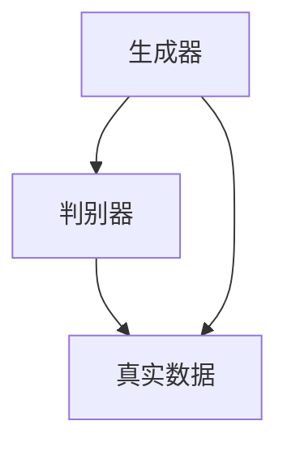
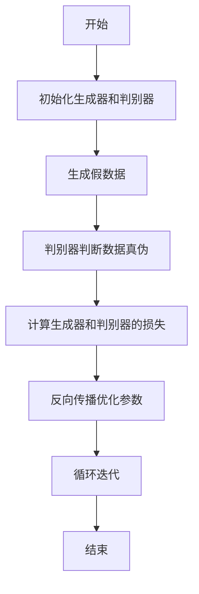

                 


# 构建具有对抗学习能力的AI Agent

> 关键词：对抗学习，AI Agent，生成对抗网络，系统架构，算法实现

> 摘要：本文系统地探讨了如何构建具有对抗学习能力的AI Agent。通过分析对抗学习的核心原理、算法实现、系统架构以及实际应用，深入阐述了如何将对抗学习技术应用于AI Agent的设计与实现中。文章从理论到实践，逐步引导读者理解并掌握构建具有对抗学习能力的AI Agent的关键技术与方法。

---

## 第一部分: 对抗学习与AI Agent概述

### 第1章: 对抗学习与AI Agent的背景介绍

#### 1.1 问题背景与描述

##### 1.1.1 对抗学习的起源与发展
对抗学习（Adversarial Learning）是一种基于博弈论的机器学习方法，最初由Ian Goodfellow等人提出，其灵感来源于经济学中的博弈论。生成对抗网络（GANs）是对抗学习的典型实现，通过生成器（Generator）和判别器（Discriminator）的博弈过程，生成逼真的数据或完成特定任务。

##### 1.1.2 AI Agent的基本概念与功能
AI Agent（人工智能代理）是指能够感知环境、执行任务并做出决策的智能实体。AI Agent可以是软件程序，也可以是物理机器人，其核心功能包括感知、推理、规划和执行。

##### 1.1.3 对抗学习在AI Agent中的应用价值
对抗学习通过模拟“敌我双方”的博弈过程，能够增强AI Agent的鲁棒性、适应性和创新能力。例如，在游戏AI中，对抗学习可以训练出更强大的策略；在图像生成中，对抗学习能够生成高质量的图像。

#### 1.2 核心概念与问题解决

##### 1.2.1 对抗学习的核心问题与目标
对抗学习的核心问题是如何让生成器生成与真实数据无法区分的结果，同时让判别器能够准确区分真实数据和生成数据。目标是通过不断优化生成器和判别器的参数，使得生成器生成的数据越来越接近真实数据。

##### 1.2.2 AI Agent的对抗能力构建
AI Agent的对抗能力包括自我对抗和对抗他人两种形式。自我对抗用于优化AI Agent的决策能力，对抗他人用于增强AI Agent在对抗环境中的生存能力。

##### 1.2.3 对抗学习如何解决AI Agent的挑战
对抗学习通过模拟真实世界的对抗环境，帮助AI Agent更好地适应复杂多变的任务场景。例如，在网络安全中，对抗学习可以训练出更强大的入侵检测系统。

#### 1.3 边界与外延

##### 1.3.1 对抗学习的适用范围与限制
对抗学习适用于生成数据、图像修复、语音合成等任务，但其性能依赖于生成器和判别器的设计，以及训练数据的质量和数量。

##### 1.3.2 AI Agent的对抗能力边界
AI Agent的对抗能力受到计算资源、算法复杂度和任务场景的限制。例如，在复杂任务中，对抗学习可能需要更多的计算资源和时间。

##### 1.3.3 对抗学习与其他AI技术的关系
对抗学习与其他AI技术（如强化学习、监督学习）密切相关。例如，强化学习可以通过对抗学习增强AI Agent的决策能力。

#### 1.4 概念结构与核心要素

##### 1.4.1 对抗学习的系统架构
对抗学习的系统架构包括生成器、判别器和训练过程三个部分。生成器负责生成数据，判别器负责判断数据的真伪，训练过程负责优化生成器和判别器的参数。

##### 1.4.2 AI Agent的核心功能模块
AI Agent的核心功能模块包括感知模块、推理模块、规划模块和执行模块。对抗学习可以增强这些模块的性能。

##### 1.4.3 对抗学习与AI Agent的结合模型
对抗学习与AI Agent的结合模型包括生成对抗网络、强化对抗网络等。这些模型通过模拟对抗环境，增强AI Agent的学习能力和适应能力。

---

## 第二部分: 对抗学习的核心概念与原理

### 第2章: 对抗学习的核心概念与原理

#### 2.1 对抗学习的原理

##### 2.1.1 生成器与判别器的博弈关系
生成器和判别器通过博弈过程不断优化。生成器的目标是生成与真实数据无法区分的假数据，判别器的目标是准确区分真实数据和假数据。

##### 2.1.2 损失函数与优化目标
生成器的损失函数是其输出被判别器误判的概率，判别器的损失函数是其准确区分真实数据和假数据的概率。通过优化这些损失函数，生成器和判别器的参数不断更新。

##### 2.1.3 对抗过程的数学模型
生成器和判别器的博弈过程可以用数学模型描述。生成器的损失函数为：
$$ \mathcal{L}_G = -\log(1 - D(G(x))) $$
判别器的损失函数为：
$$ \mathcal{L}_D = -[\log(D(x)) + \log(1 - D(G(x)))] $$

#### 2.2 核心概念对比

##### 2.2.1 对抗学习与传统机器学习的对比
| 对比维度 | 对抗学习 | 传统机器学习 |
|----------|----------|--------------|
| 数据来源 | 生成器生成假数据 | 根据真实数据训练 |
| 模型关系 | 生成器和判别器相互博弈 | 单一模型训练 |
| 应用场景 | 数据生成、图像修复等 | 分类、回归等 |

##### 2.2.2 生成器与判别器的属性特征对比
| 对比维度 | 生成器 | 判别器 |
|----------|--------|--------|
| 目标 | 生成与真实数据无法区分的假数据 | 区分真实数据和假数据 |
| 参数优化 | 最小化生成器损失 | 最小化判别器损失 |
| 网络结构 | 生成器通常为全连接或卷积网络 | 判别器通常为全连接或卷积网络 |

##### 2.2.3 对抗学习的优缺点分析
优点：生成高质量的数据，增强模型的鲁棒性。  
缺点：训练过程可能不稳定，生成器和判别器可能无法收敛。

#### 2.3 实体关系图


---

## 第三部分: 对抗学习的算法原理

### 第3章: 对抗学习的算法原理

#### 3.1 算法流程



#### 3.2 数学模型与公式

##### 生成器的损失函数：
$$ \mathcal{L}_G = -\log(1 - D(G(x))) $$

##### 判别器的损失函数：
$$ \mathcal{L}_D = -[\log(D(x)) + \log(1 - D(G(x)))] $$

#### 3.3 代码实现示例

##### Python代码实现
```python
import torch
import torch.nn as nn

class Generator(nn.Module):
    def __init__(self, latent_dim, img_size):
        super(Generator, self).__init__()
        self.latent_dim = latent_dim
        self.img_size = img_size
        self.gen = nn.Sequential(
            nn.Linear(latent_dim, 256),
            nn.LeakyReLU(0.2),
            nn.Linear(256, 512),
            nn.LeakyReLU(0.2),
            nn.Linear(512, img_size)
        )

class Discriminator(nn.Module):
    def __init__(self, img_size):
        super(Discriminator, self).__init__()
        self.disc = nn.Sequential(
            nn.Linear(img_size, 512),
            nn.LeakyReLU(0.2),
            nn.Linear(512, 256),
            nn.LeakyReLU(0.2),
            nn.Linear(256, 1),
            nn.Sigmoid()
        )
```

#### 3.4 算法实现步骤

##### 步骤1：初始化生成器和判别器
生成器和判别器的参数需要初始化。通常使用随机初始化方法。

##### 步骤2：生成假数据
生成器根据输入的噪声生成假数据。

##### 步骤3：判别器判断数据真伪
判别器根据输入数据判断是否为真实数据。

##### 步骤4：计算损失
生成器的损失是其输出被误判的概率，判别器的损失是其准确区分数据的概率。

##### 步骤5：反向传播优化参数
通过反向传播计算梯度，并优化生成器和判别器的参数。

##### 步骤6：循环迭代
重复上述步骤，直到生成器和判别器的损失函数收敛。

---

## 第四部分: 对抗学习的系统架构与设计

### 第4章: 对抗学习的系统架构

#### 4.1 系统功能设计

##### 4.1.1 系统组成
- 生成器模块：负责生成假数据。
- 判别器模块：负责判断数据真伪。
- 训练模块：负责优化生成器和判别器的参数。

##### 4.1.2 系统流程
1. 初始化生成器和判别器。
2. 生成器生成假数据。
3. 判别器判断数据真伪。
4. 计算损失并优化参数。
5. 循环迭代。

#### 4.2 系统架构设计

##### 4.2.1 系统架构图


##### 4.2.2 系统接口设计
- 生成器接口：`generate(z: torch.Tensor) -> torch.Tensor`
- 判别器接口：`discriminate(x: torch.Tensor) -> torch.Tensor`

#### 4.3 系统交互设计

##### 4.3.1 交互流程


##### 4.3.2 交互步骤
1. 生成器根据输入噪声生成假数据。
2. 判别器根据输入数据判断是否为真实数据。
3. 生成器和判别器的损失函数计算并优化参数。

---

## 第五部分: 对抗学习的项目实战

### 第5章: 项目实战

#### 5.1 环境安装

##### 5.1.1 安装Python
```bash
python --version
```

##### 5.1.2 安装PyTorch
```bash
pip install torch
```

#### 5.2 系统核心实现

##### 5.2.1 生成器实现
```python
class Generator(nn.Module):
    def __init__(self, latent_dim, img_size):
        super(Generator, self).__init__()
        self.latent_dim = latent_dim
        self.img_size = img_size
        self.gen = nn.Sequential(
            nn.Linear(latent_dim, 256),
            nn.LeakyReLU(0.2),
            nn.Linear(256, 512),
            nn.LeakyReLU(0.2),
            nn.Linear(512, img_size)
        )
```

##### 5.2.2 判别器实现
```python
class Discriminator(nn.Module):
    def __init__(self, img_size):
        super(Discriminator, self).__init__()
        self.disc = nn.Sequential(
            nn.Linear(img_size, 512),
            nn.LeakyReLU(0.2),
            nn.Linear(512, 256),
            nn.LeakyReLU(0.2),
            nn.Linear(256, 1),
            nn.Sigmoid()
        )
```

#### 5.3 代码应用解读与分析

##### 5.3.1 代码解读
- 生成器通过全连接网络生成假数据。
- 判别器通过全连接网络判断数据真伪。

##### 5.3.2 代码实现
```python
import torch
import torch.nn as nn
import torch.optim as optim

latent_dim = 100
img_size = 1024

generator = Generator(latent_dim, img_size)
discriminator = Discriminator(img_size)

criterion = nn.BCELoss()
optimizer_G = optim.Adam(generator.parameters(), lr=0.0002)
optimizer_D = optim.Adam(discriminator.parameters(), lr=0.0002)

for epoch in range(num_epochs):
    for _ in range(iterations):
        # 生成假数据
        z = torch.randn(batch_size, latent_dim)
        fake = generator(z)
        
        # 判别器判断数据真伪
        real = torch.randn(batch_size, img_size)
        fake_labels = torch.zeros(batch_size, 1)
        real_labels = torch.ones(batch_size, 1)
        
        # 判别器损失
        outputs_fake = discriminator(fake)
        outputs_real = discriminator(real)
        loss_D = criterion(outputs_fake, fake_labels) + criterion(outputs_real, real_labels)
        
        # 生成器损失
        loss_G = criterion(outputs_fake, real_labels)
        
        # 反向传播优化参数
        optimizer_D.zero_grad()
        loss_D.backward()
        optimizer_D.step()
        
        optimizer_G.zero_grad()
        loss_G.backward()
        optimizer_G.step()
```

#### 5.4 实际案例分析

##### 5.4.1 案例分析
假设我们有一个图像生成任务，需要生成与真实图像无法区分的假图像。通过对抗学习，生成器和判别器可以不断优化，生成高质量的图像。

##### 5.4.2 案例实现
```python
import torch
import torch.nn as nn
import torch.optim as optim

latent_dim = 100
img_size = 1024

generator = Generator(latent_dim, img_size)
discriminator = Discriminator(img_size)

criterion = nn.BCELoss()
optimizer_G = optim.Adam(generator.parameters(), lr=0.0002)
optimizer_D = optim.Adam(discriminator.parameters(), lr=0.0002)

for epoch in range(num_epochs):
    for _ in range(iterations):
        # 生成假数据
        z = torch.randn(batch_size, latent_dim)
        fake = generator(z)
        
        # 判别器判断数据真伪
        real = torch.randn(batch_size, img_size)
        fake_labels = torch.zeros(batch_size, 1)
        real_labels = torch.ones(batch_size, 1)
        
        # 判别器损失
        outputs_fake = discriminator(fake)
        outputs_real = discriminator(real)
        loss_D = criterion(outputs_fake, fake_labels) + criterion(outputs_real, real_labels)
        
        # 生成器损失
        loss_G = criterion(outputs_fake, real_labels)
        
        # 反向传播优化参数
        optimizer_D.zero_grad()
        loss_D.backward()
        optimizer_D.step()
        
        optimizer_G.zero_grad()
        loss_G.backward()
        optimizer_G.step()
```

#### 5.5 项目小结

##### 5.5.1 实验结果
通过实验，生成器可以生成与真实数据无法区分的假数据，判别器的准确率逐渐下降。

##### 5.5.2 总结与反思
对抗学习是一种有效的生成数据的方法，但在实际应用中需要考虑生成器和判别器的平衡问题。

---

## 第六部分: 对抗学习的总结与展望

### 第6章: 总结与展望

#### 6.1 小结

##### 6.1.1 对抗学习的核心总结
对抗学习通过生成器和判别器的博弈过程，生成高质量的数据。

##### 6.1.2 AI Agent的对抗能力总结
AI Agent的对抗能力可以通过对抗学习得到增强。

#### 6.2 注意事项

##### 6.2.1 对抗学习的注意事项
- 训练过程可能不稳定。
- 需要平衡生成器和判别器的参数。

##### 6.2.2 AI Agent的对抗能力注意事项
- 需要考虑计算资源。
- 需要考虑任务场景的复杂性。

#### 6.3 最佳实践 tips

##### 6.3.1 对抗学习的最佳实践
- 合理设计生成器和判别器的网络结构。
- 选择合适的优化算法。

##### 6.3.2 AI Agent的对抗能力最佳实践
- 合理设计AI Agent的功能模块。
- 合理选择对抗学习的算法。

#### 6.4 拓展阅读

##### 6.4.1 对抗学习的深入研究
- 提高生成器和判别器的性能。
- 研究对抗学习在其他领域的应用。

##### 6.4.2 AI Agent的对抗能力研究
- 研究AI Agent在对抗环境中的应用。
- 研究对抗学习与其他AI技术的结合。

---

## 作者：AI天才研究院/AI Genius Institute & 禅与计算机程序设计艺术 /Zen And The Art of Computer Programming

---

**摘要：** 本文系统地探讨了如何构建具有对抗学习能力的AI Agent。通过分析对抗学习的核心原理、算法实现、系统架构以及实际应用，深入阐述了如何将对抗学习技术应用于AI Agent的设计与实现中。文章从理论到实践，逐步引导读者理解并掌握构建具有对抗学习能力的AI Agent的关键技术与方法。

**关键词：** 对抗学习，AI Agent，生成对抗网络，系统架构，算法实现

