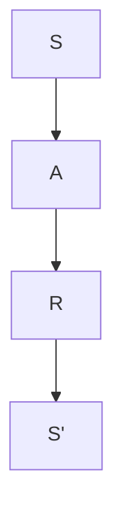
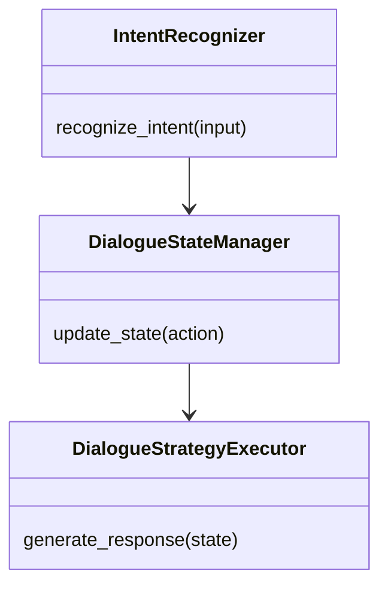
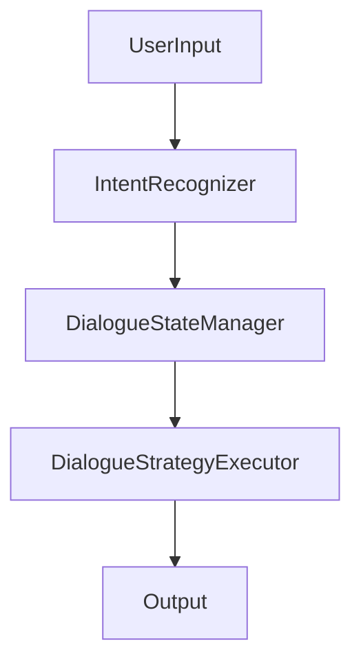
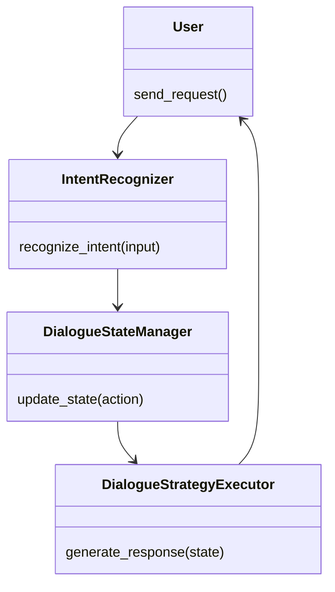

                 


# 构建具有对话管理能力的AI Agent

## 关键词：
AI Agent, 对话管理, 自然语言处理, 马尔可夫决策过程, 系统架构, 项目实战

## 摘要：
本文旨在详细介绍如何构建一个具有对话管理能力的AI Agent。从AI Agent的基本概念到对话管理的核心算法，从系统架构设计到实际项目实现，全面解析对话管理的关键技术。通过理论与实践相结合的方式，帮助读者掌握构建高效对话管理系统的技能。

---

# 第一部分: 构建具有对话管理能力的AI Agent概述

## 第1章: AI Agent与对话管理概述

### 1.1 AI Agent的基本概念
AI Agent（人工智能代理）是指能够感知环境、自主决策并执行任务的智能实体。它通过与用户或环境交互，完成特定目标。AI Agent的核心特征包括自主性、反应性、目标导向性和社会性。

#### 1.1.1 AI Agent的定义与特点
- **自主性**：AI Agent能够自主决策，无需外部干预。
- **反应性**：能够实时感知环境并做出反应。
- **目标导向性**：基于目标驱动行为。
- **社会性**：能够与人类或其他AI Agent交互协作。

#### 1.1.2 对话管理在AI Agent中的作用
对话管理是AI Agent实现人机交互的核心能力。通过对话管理，AI Agent能够理解用户意图、生成合适回应，并维护对话上下文。

#### 1.1.3 AI Agent的应用场景与挑战
- **应用场景**：智能客服、虚拟助手、智能音箱、教育机器人等。
- **挑战**：对话理解的准确性、对话策略的灵活性、多轮对话的连贯性等。

---

### 1.2 对话管理的核心概念
对话管理是AI Agent实现高效人机交互的关键技术。它涉及对话状态的维护、用户意图的识别以及对话策略的执行。

#### 1.2.1 对话流程的基本模型
对话流程可以分为以下几个阶段：
1. **输入处理**：接收用户输入。
2. **意图识别**：分析用户意图。
3. **对话状态更新**：维护对话上下文。
4. **生成回应**：根据对话状态生成回复。
5. **输出反馈**：将回复返回给用户。

#### 1.2.2 对话状态与上下文的关系
对话状态（Dialogue State）是指当前对话的上下文信息，包括用户身份、当前任务、对话历史等。对话上下文（Context）是对话状态的具体体现，用于指导AI Agent的下一步行动。

#### 1.2.3 对话管理的实现方式
对话管理的实现方式可以分为以下几类：
1. **基于规则的方法**：通过预定义的规则进行对话控制。
2. **基于统计的方法**：利用机器学习模型进行对话预测。
3. **基于深度学习的方法**：采用端到端模型进行对话生成。

---

## 第2章: 对话管理的原理与核心算法

### 2.1 对话管理的数学模型
对话管理可以通过数学模型进行描述。常见的数学模型包括马尔可夫决策过程（MDP）和强化学习（Reinforcement Learning）。

#### 2.1.1 对话状态表示的数学模型
对话状态可以用一个向量表示，其中每个元素对应一个状态特征。例如：
$$
s = (s_1, s_2, \dots, s_n)
$$
其中，$s_i$ 表示第i个状态特征。

#### 2.1.2 对话动作的选择模型
对话动作的选择可以看作是一个概率分布问题。假设对话动作空间为$A$，则每个动作$a \in A$的概率可以表示为：
$$
P(a|s) = \text{softmax}(W s + b)
$$
其中，$W$ 和 $b$ 是模型参数。

#### 2.1.3 对话目标的优化函数
对话管理的目标是最大化用户满意度。优化函数可以表示为：
$$
\arg\max_{\theta} \sum_{i=1}^N \log P(a_i|s_i; \theta)
$$
其中，$\theta$ 是模型参数，$N$ 是训练样本数量。

#### 图2.1: 对话管理的马尔可夫决策过程（使用 Mermaid）


---

### 2.2 基于马尔可夫决策过程的对话管理
马尔可夫决策过程（MDP）是一种常用的对话管理模型，适用于处理具有马尔可夫性质的对话任务。

#### 2.2.1 马尔可夫决策过程的定义
马尔可夫决策过程由以下五元组定义：
$$
\text{MDP} = (S, A, T, R, \gamma)
$$
其中：
- $S$ 是状态空间。
- $A$ 是动作空间。
- $T$ 是转移概率矩阵。
- $R$ 是奖励函数。
- $\gamma$ 是折扣因子。

#### 2.2.2 对话管理中的状态转移矩阵
状态转移矩阵$T$描述了从当前状态$s$执行动作$a$后到达新状态$s'$的概率：
$$
T(s, a, s') = P(s' | s, a)
$$

#### 2.2.3 对话策略的优化算法
对话策略的优化可以采用值迭代（Value Iteration）或策略迭代（Policy Iteration）算法。以值迭代为例，其更新公式为：
$$
v_{k+1}(s) = \max_a \sum_{s'} T(s, a, s') [r(s, a, s') + \gamma v_k(s')]
$$

---

### 2.3 对话管理的算法实现
对话管理的实现可以采用多种算法，包括基于规则、统计和深度学习的方法。

#### 2.3.1 基于规则的对话管理
基于规则的对话管理通过预定义的规则进行对话控制。例如：
- 如果用户输入“天气”，则回复当前天气情况。

#### 2.3.2 基于统计的对话管理
基于统计的对话管理利用机器学习模型进行对话预测。例如：
- 使用朴素贝叶斯模型预测用户意图。

#### 2.3.3 基于深度学习的对话管理
基于深度学习的对话管理采用端到端模型进行对话生成。例如：
- 使用Transformer模型生成对话回复。

---

## 第3章: 对话管理的系统架构与实现

### 3.1 对话管理系统的架构设计
对话管理系统由多个模块组成，包括意图识别、对话状态管理、对话策略执行等。

#### 3.1.1 系统功能模块划分
- **意图识别模块**：识别用户意图。
- **对话状态管理模块**：维护对话上下文。
- **对话策略执行模块**：生成对话回复。

#### 3.1.2 系统组件之间的关系
系统组件之间的关系可以用类图表示：



#### 3.1.3 系统的输入输出接口
- **输入接口**：接收用户输入。
- **输出接口**：输出对话回复。

---

### 3.2 对话管理系统的详细设计
对话管理系统的详细设计包括模块功能、数据流和交互流程。

#### 3.2.1 对话状态管理模块
对话状态管理模块负责维护对话上下文，包括用户身份、当前任务等。

#### 3.2.2 对话策略执行模块
对话策略执行模块根据对话状态生成回复，可以选择基于规则、统计或深度学习的方法。

#### 3.2.3 对话历史记录模块
对话历史记录模块用于存储对话历史，以便后续分析和优化。

---

### 3.3 对话管理系统的实现
对话管理系统的实现需要考虑代码结构、数据存储和接口设计。

#### 3.3.1 系统功能流程图
系统功能流程图可以用Mermaid表示：



#### 3.3.2 系统组件交互图
系统组件交互图可以用类图表示：



---

## 第4章: 对话管理系统的项目实战

### 4.1 项目环境与工具安装
#### 4.1.1 开发环境搭建
- 操作系统：建议使用Linux或macOS。
- 开发工具：推荐使用PyCharm或VS Code。

#### 4.1.2 第三方库的安装与配置
- Python库：`numpy`, `pandas`, `scikit-learn`, `transformers`。
- 安装命令：`pip install numpy scikit-learn transformers`

#### 4.1.3 开发工具的选择与使用
推荐使用Jupyter Notebook进行快速原型开发。

---

### 4.2 对话管理系统的核心实现
对话管理系统的实现包括意图识别、对话状态管理和对话策略执行。

#### 4.2.1 对话状态管理的代码实现
```python
class DialogueStateManager:
    def __init__(self):
        self.state = {}

    def update_state(self, key, value):
        self.state[key] = value

    def get_state(self, key):
        return self.state.get(key, None)
```

#### 4.2.2 对话策略执行的代码实现
```python
from transformers import AutoModelForSeq2Seq, AutoTokenizer

class DialogueStrategyExecutor:
    def __init__(self):
        self.model = AutoModelForSeq2Seq.from_pretrained('t5-base')
        self.tokenizer = AutoTokenizer.from_pretrained('t5-base')

    def generate_response(self, state):
        input_str = "Current state: " + str(state)
        inputs = self.tokenizer(input_str, return_tensors='pt')
        outputs = self.model.generate(inputs.input_ids, max_length=50)
        response = self.tokenizer.decode(outputs[0], skip_special_tokens=True)
        return response
```

#### 4.2.3 对话历史记录的代码实现
```python
class DialogueHistory:
    def __init__(self):
        self.history = []

    def add_to_history(self, utterance):
        self.history.append(utterance)

    def get_history(self):
        return self.history
```

---

### 4.3 项目测试与调试
测试是确保对话管理系统正常运行的关键步骤。

#### 4.3.1 测试用例的设计与编写
设计测试用例时，需要覆盖不同的对话场景，例如：
- 用户输入“天气”，系统返回当前天气。
- 用户输入“预订”，系统引导完成预订流程。

#### 4.3.2 系统功能的测试与验证
通过单元测试和集成测试验证系统的功能是否正常。

#### 4.3.3 系统性能的优化与调试
通过日志分析和性能监控工具，优化系统的响应时间和资源利用率。

---

## 第5章: 总结与展望

### 5.1 本章总结
本文详细介绍了构建具有对话管理能力的AI Agent的关键技术，包括对话管理的数学模型、算法实现和系统架构设计。

### 5.2 未来展望
未来的研究方向包括：
- 更高效的对话管理算法。
- 更智能的对话理解模型。
- 更自然的对话生成方式。

---

## 作者：AI天才研究院/AI Genius Institute & 禅与计算机程序设计艺术 /Zen And The Art of Computer Programming

