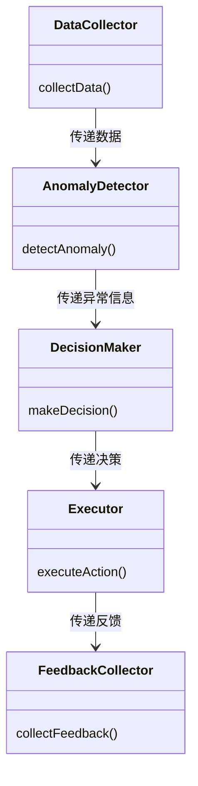
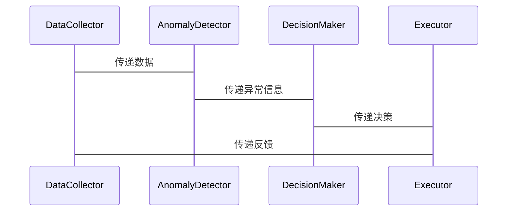

                 


```markdown
# 构建具有异常检测能力的AI Agent

> 关键词：AI Agent, 异常检测, 系统架构, 算法实现, 实战案例

> 摘要：本文详细讲解了如何构建一个具有异常检测能力的AI Agent，从核心概念到系统架构，从算法原理到实战案例，全面覆盖了构建过程中的关键点。文章首先介绍了异常检测与AI Agent的基本概念及其结合的重要性，然后深入分析了异常检测的核心算法与AI Agent的系统架构，接着通过具体的实战案例展示了如何实现异常检测与AI Agent的结合，最后对未来的扩展与优化方向进行了展望。

---

## 第一部分: 异常检测与AI Agent基础

### 第1章: 异常检测的核心概念

#### 1.1 异常检测的核心概念

##### 1.1.1 什么是异常检测
异常检测（Anomaly Detection）是一种数据分析方法，用于识别数据中与预期模式或行为不一致的异常点。异常点可能是数据中的噪声、错误数据或潜在的有价值的信息（如欺诈行为、系统故障等）。

##### 1.1.2 异常检测的分类与特点
异常检测可以分为以下几类：
- **统计异常检测**：基于统计学方法，如均值、方差等，检测数据点是否偏离均值超过一定标准差。
- **基于机器学习的异常检测**：使用无监督学习算法（如聚类、深度学习）检测异常。
- **基于规则的异常检测**：根据预定义的规则或阈值检测异常。

##### 1.1.3 异常检测的应用场景
- 网络安全：检测攻击行为。
- 金融领域：检测欺诈交易。
- 系统监控：检测服务器异常。
- 医疗健康：异常检测可以用于疾病早期预警。

#### 1.2 AI Agent的基本概念

##### 1.2.1 什么是AI Agent
AI Agent（智能代理）是一种能够感知环境、自主决策并采取行动以实现目标的智能系统。它可以是一个软件程序，也可以是一个物理设备。

##### 1.2.2 AI Agent的类型与特点
- **简单反射型Agent**：基于当前感知做出简单反应。
- **基于模型的反射型Agent**：维护环境模型，能够基于模型进行推理和规划。
- **目标驱动型Agent**：基于目标进行决策和行动。
- **效用驱动型Agent**：基于效用函数进行优化决策。

##### 1.2.3 AI Agent的应用领域
- 智能家居：控制家中的设备。
- 自动驾驶：感知环境并做出驾驶决策。
- 机器人：执行复杂任务。
- 个性化推荐系统：根据用户行为推荐内容。

#### 1.3 异常检测与AI Agent的结合

##### 1.3.1 异常检测在AI Agent中的作用
异常检测可以增强AI Agent的感知能力，帮助其识别环境中的异常情况，从而做出更合理的决策。

##### 1.3.2 异常检测如何增强AI Agent的能力
通过异常检测，AI Agent能够及时发现环境中的异常情况，提前采取预防措施，避免潜在风险。

##### 1.3.3 异常检测与AI Agent的协同工作原理
AI Agent通过异常检测模块实时监控环境数据，当检测到异常时，触发相应的决策流程，采取应对措施。

---

### 第2章: 异常检测的核心概念与原理

#### 2.1 异常检测的核心概念

##### 2.1.1 异常检测的定义与目标
异常检测的目标是识别数据中的异常点，这些异常点可能代表潜在的问题或机会。

##### 2.1.2 异常检测的分类与应用场景
- **统计学方法**：适用于数据分布已知的场景。
- **机器学习方法**：适用于数据分布未知的场景。
- **深度学习方法**：适用于高维复杂数据的场景。

##### 2.1.3 异常检测的挑战与解决方案
- **数据稀疏性**：异常点数量少，难以训练模型。
- **计算复杂度**：高维数据计算复杂。
- **模型解释性**：深度学习模型难以解释。

---

### 第3章: AI Agent的核心概念与架构

#### 3.1 AI Agent的核心概念

##### 3.1.1 AI Agent的定义与组成
AI Agent由感知模块、决策模块、执行模块和反馈模块组成，能够实现与环境的交互。

##### 3.1.2 AI Agent的感知与决策机制
- **感知模块**：收集环境数据，识别异常点。
- **决策模块**：基于感知数据和目标函数，制定决策策略。

##### 3.1.3 AI Agent的执行与反馈机制
- **执行模块**：根据决策模块的指令采取行动。
- **反馈模块**：收集执行结果，更新感知模块。

#### 3.2 AI Agent的架构设计

##### 3.2.1 分层架构
- **感知层**：负责数据采集和预处理。
- **决策层**：负责异常检测和决策制定。
- **执行层**：负责行动执行和结果反馈。

##### 3.2.2 微服务架构
- **服务分解**：将AI Agent的功能分解为多个微服务。
- **服务通信**：通过API进行服务间通信。
- **服务治理**：通过网关和监控系统实现服务管理。

##### 3.2.3 混合架构
- **结合分层和微服务架构**：适用于复杂场景。

---

### 第4章: 异常检测与AI Agent的系统分析

#### 4.1 系统分析与需求定义

##### 4.1.1 问题场景介绍
假设我们正在开发一个智能安防系统，需要实时监控摄像头数据，检测异常行为。

##### 4.1.2 项目目标与范围
目标：实现异常行为检测，提升安全性。
范围：摄像头视频流数据处理，异常行为识别。

##### 4.1.3 系统功能需求
- **实时监控**：持续采集视频流数据。
- **异常检测**：识别异常行为。
- **决策与反馈**：触发报警或采取其他措施。

#### 4.2 系统功能设计

##### 4.2.1 领域模型设计（Mermaid类图）


##### 4.2.2 系统架构设计（Mermaid架构图）
```mermaid
server
    [AI Agent]
    [感知模块]
    [决策模块]
    [执行模块]
    [反馈模块]
    -- 数据流 --
    --> 数据源
    <-- 反馈结果
```

##### 4.2.3 系统接口设计
- 数据采集接口：REST API。
- 异常检测接口：WebSocket实时传输。
- 决策反馈接口：队列。

##### 4.2.4 系统交互流程（Mermaid序列图）


---

## 第五章: 异常检测算法的实现与优化

### 5.1 异常检测算法原理

#### 5.1.1 统计学方法
- **Z-score方法**：用于检测离群点。
  $$ Z = \frac{x - \mu}{\sigma} $$
- **IQR方法**：基于四分位数。
  $$ IQR = Q3 - Q1 $$

#### 5.1.2 机器学习方法
- **Isolation Forest**：基于树结构的无监督学习算法。
- **One-Class SVM**：用于检测异常点的线性分类器。

#### 5.1.3 深度学习方法
- **自动编码器（AE）**：通过重构误差检测异常。
  $$ \text{重构误差} = |x - \hat{x}| $$

#### 5.1.4 算法实现（Python代码示例）
```python
from sklearn.ensemble import IsolationForest

# 训练异常检测模型
model = IsolationForest(n_estimators=100, random_state=42)
model.fit(X_train)

# 预测异常点
y_pred = model.predict(X_test)
abnormal_indices = np.where(y_pred == -1)
```

---

## 第六章: 系统实现与项目实战

### 6.1 项目实战

#### 6.1.1 环境安装
- 安装Python和相关库（如scikit-learn、tensorflow、flask）。
- 安装Jupyter Notebook用于开发和测试。

#### 6.1.2 核心代码实现
- 数据预处理：标准化、归一化。
- 模型训练：使用Isolation Forest训练异常检测模型。
- 集成到AI Agent系统中：实现数据采集、异常检测、决策反馈的流程。

#### 6.1.3 案例分析与详细讲解
- 以智能安防系统为例，展示如何实现异常行为检测。
- 通过代码示例展示如何集成异常检测模块到AI Agent系统中。

#### 6.1.4 项目小结
- 强调代码实现的关键点和注意事项。

---

## 第七章: 扩展与展望

### 7.1 未来的研究方向
- **自适应异常检测**：根据环境变化动态调整检测模型。
- **强化学习的结合**：通过强化学习优化AI Agent的决策策略。
- **边缘计算的应用**：在边缘设备上实现异常检测，减少数据传输延迟。

### 7.2 小结
构建具有异常检测能力的AI Agent是一个复杂的系统工程，需要综合运用多种技术。未来，随着技术的发展，AI Agent将在更多领域发挥重要作用。

---

作者：AI天才研究院/AI Genius Institute & 禅与计算机程序设计艺术 /Zen And The Art of Computer Programming
```

