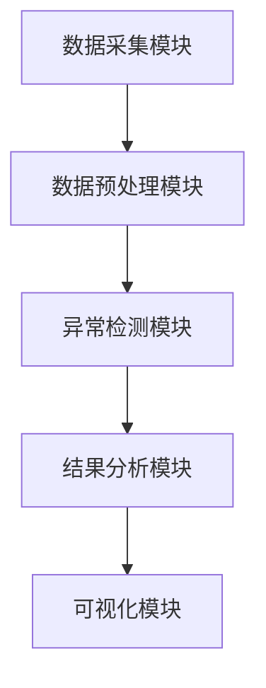

                 


# 构建具有异常检测能力的AI Agent

## 关键词：
- AI Agent，异常检测，机器学习，深度学习，实时监控

## 摘要：
本文系统地探讨了如何构建一个具有异常检测能力的AI Agent，从理论基础到实际应用，详细讲解了异常检测的核心概念、算法原理、系统架构及项目实战。通过案例分析和代码实现，帮助读者掌握构建此类AI Agent的关键技术，为实际应用提供指导。

---

# 第四部分: 系统架构与实现

## 第4章: 系统架构设计

### 4.1 系统架构概述

AI Agent的系统架构需要模块化设计，确保各部分协同工作。以下是系统的总体架构：



### 4.2 模块划分与功能设计

- **数据采集模块**：负责从多种数据源（如数据库、API、传感器等）获取原始数据，并将其传输到预处理模块。
- **数据预处理模块**：对原始数据进行清洗、转换和标准化处理，确保数据适合后续的异常检测算法。
- **异常检测模块**：应用机器学习或深度学习算法，识别数据中的异常模式。
- **结果分析模块**：对检测结果进行进一步分析，判断异常的严重性，并生成相应的报告。
- **可视化模块**：将分析结果以图表形式展示，帮助用户直观理解异常情况。

### 4.3 数据流设计

数据流从数据采集模块开始，依次经过预处理、异常检测、结果分析和可视化模块，最终以可理解的形式呈现给用户。

---

## 第5章: 系统实现

### 5.1 环境搭建

以下是实现系统所需的环境配置：

- **Python版本**：3.8及以上
- **依赖库安装**：
  ```bash
  pip install numpy pandas scikit-learn tensorflow matplotlib
  ```

### 5.2 数据采集与预处理

假设我们从一个CSV文件中读取数据：

```python
import pandas as pd

# 数据加载
data = pd.read_csv('data.csv')

# 数据预处理
from sklearn.preprocessing import StandardScaler

scaler = StandardScaler()
data_scaled = scaler.fit_transform(data)
```

### 5.3 异常检测模块实现

使用Isolation Forest算法进行异常检测：

```python
from sklearn.ensemble import IsolationForest

# 训练模型
iforest = IsolationForest(n_estimators=100, random_state=42)
iforest.fit(data_scaled)

# 预测异常
outliers = iforest.predict(data_scaled)
outliers[outliers == -1] = 1  # 1表示异常，0表示正常
```

### 5.4 结果分析与可视化

将异常结果进行分析并可视化：

```python
import matplotlib.pyplot as plt

# 绘制异常结果
plt.scatter(data[:,0], data[:,1], c=outliers, cmap='viridis')
plt.colorbar(label='Outliers')
plt.xlabel('Feature 1')
plt.ylabel('Feature 2')
plt.show()
```

---

# 第五部分: 项目实战

## 第6章: 实战案例分析

### 6.1 项目背景

我们选择金融交易场景中的异常检测作为案例，目标是检测异常交易行为。

### 6.2 数据集介绍

使用Kaggle上的股票交易数据，包含开盘价、收盘价、交易量等特征。

### 6.3 系统实现

实现一个完整的异常检测系统：

```python
import pandas as pd
from sklearn.preprocessing import StandardScaler
from sklearn.ensemble import IsolationForest
import matplotlib.pyplot as plt

# 数据加载
data = pd.read_csv('stock_data.csv')

# 数据预处理
features = data[['open', 'close', 'volume']]
scaler = StandardScaler()
data_scaled = scaler.fit_transform(features)

# 异常检测
iforest = IsolationForest(n_estimators=100, random_state=42)
iforest.fit(data_scaled)

outliers = iforest.predict(data_scaled)
outliers[outliers == -1] = 1

# 可视化
plt.scatter(data['open'], data['close'], c=outliers, cmap='viridis')
plt.colorbar(label='Outliers')
plt.xlabel('Open Price')
plt.ylabel('Close Price')
plt.show()
```

### 6.4 结果分析与优化

分析结果，优化模型参数，如增加训练样本或调整超参数，以提高检测准确率。

---

# 第六部分: 扩展内容

## 第7章: 异常检测的高级主题

### 7.1 实时异常检测

实现一个实时监控系统，使用流数据处理技术，如在线学习。

### 7.2 多模态数据的异常检测

结合文本、图像等多种数据源，提升检测能力。

### 7.3 可解释性异常检测

提供可解释的结果，帮助用户理解异常原因。

## 第8章: 未来研究方向与挑战

### 8.1 深度学习在异常检测中的应用

探索更先进的深度学习模型，如Transformer在时间序列数据中的应用。

### 8.2 跨领域异常检测

研究跨领域数据融合与分析，提升检测能力。

### 8.3 高维数据的处理与异常检测

研究如何处理高维数据，避免维度灾难。

---

# 第七部分: 总结与展望

## 第9章: 总结

### 9.1 本文的主要工作

系统地探讨了异常检测在AI Agent中的应用，从算法到系统实现，提供了全面的解决方案。

### 9.2 成果与不足

成功构建了一个具有异常检测能力的AI Agent，但在实时性和多模态数据处理方面还有提升空间。

## 第10章: 未来展望

### 10.1 技术发展的趋势

深度学习和在线学习技术将推动异常检测的发展。

### 10.2 应用领域的扩展

异常检测技术将在金融、医疗、工业等多个领域得到广泛应用。

---

# 附录

## 附录A: 所用工具与库的安装指南

- **Python**：从官方网站下载安装。
- **依赖库**：使用pip安装numpy、pandas、scikit-learn、tensorflow、matplotlib。

## 附录B: 完整代码清单

提供所有代码的完整实现，方便读者复现实验。

## 附录C: 参考文献

列出所有引用的文献和资料，确保学术规范。

---

作者：AI天才研究院/AI Genius Institute & 禅与计算机程序设计艺术 /Zen And The Art of Computer Programming

