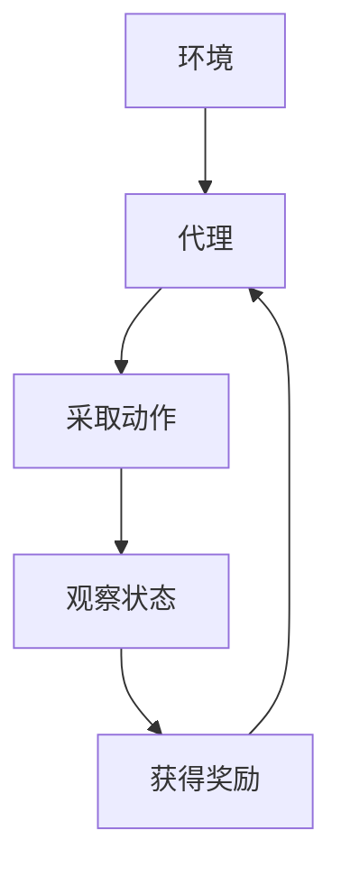
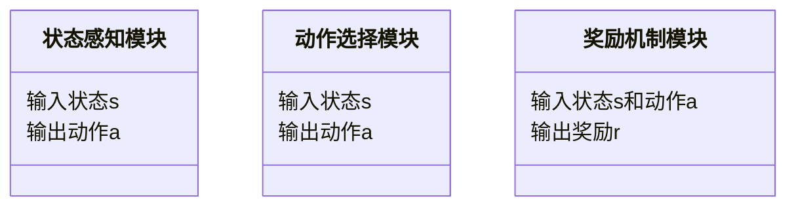
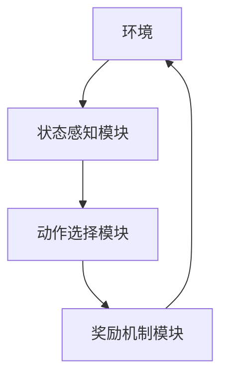
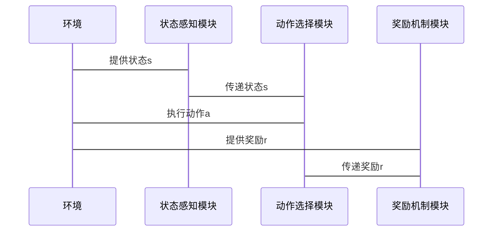

                 


# 构建具有强化学习能力的AI Agent

> 关键词：强化学习，AI Agent，算法，系统架构，项目实战

> 摘要：本文将详细探讨如何构建一个具有强化学习能力的AI Agent。从基础概念到算法原理，再到系统架构设计和项目实战，全面解析AI Agent的核心技术。通过本文，读者将掌握强化学习的基本原理、常见算法及其在AI Agent中的应用，了解如何设计和实现一个完整的AI Agent系统。

---

# 第一部分: 强化学习与AI代理基础

# 第1章: 强化学习与AI代理概述

## 1.1 强化学习的基本概念

### 1.1.1 强化学习的定义
强化学习（Reinforcement Learning，RL）是一种机器学习范式，其中智能体（Agent）通过与环境交互来学习策略（policy），以最大化累积奖励（reward）。与监督学习不同，强化学习不需要标记的训练数据，而是通过试错和奖励机制来优化行为。

### 1.1.2 强化学习的核心要素
- **环境（Environment）**：智能体所处的外部世界，提供状态、动作和奖励。
- **状态（State）**：描述环境当前情况的信息。
- **动作（Action）**：智能体对环境采取的行为。
- **奖励（Reward）**：智能体行为的价值反馈，用于指导优化。
- **策略（Policy）**：智能体选择动作的规则，可以是确定性的或概率性的。

### 1.1.3 强化学习与监督学习的区别
| 特性 | 监督学习 | 强化学习 |
|------|----------|----------|
| 数据 | 标签数据 | 无标签数据，仅通过奖励反馈 |
| 目标 | 最小化预测误差 | 最大化累积奖励 |
| 行为 | 静态预测 | 动态决策 |

## 1.2 AI代理的定义与特点

### 1.2.1 AI代理的定义
AI代理（AI Agent）是指能够感知环境、做出决策并执行动作的智能实体。它可以是一个软件程序、机器人或其他智能系统。

### 1.2.2 AI代理的核心特点
- **自主性**：能够自主决策，无需外部干预。
- **反应性**：能够实时感知环境并做出反应。
- **学习能力**：通过强化学习等方法不断提升性能。
- **适应性**：能够在动态环境中调整策略。

### 1.2.3 强化学习在AI代理中的作用
强化学习为AI代理提供了一种有效的学习方法，使其能够在复杂环境中通过试错优化行为，实现目标。

## 1.3 强化学习在AI代理中的应用

### 1.3.1 游戏AI的发展历程
从简单的基于规则的AI到深度强化学习的应用，游戏AI的进步体现了强化学习的强大能力。

### 1.3.2 机器人控制中的强化学习
机器人通过强化学习掌握复杂的动作，如导航、抓取等。

### 1.3.3 自动驾驶中的强化学习应用
自动驾驶系统利用强化学习优化路径规划和决策过程。

## 1.4 本章小结
本章介绍了强化学习的基本概念、AI代理的特点及其在多个领域的应用，为后续章节奠定了基础。

---

# 第二部分: 强化学习算法原理

# 第2章: 强化学习的核心算法

## 2.1 Q-learning算法

### 2.1.1 Q-learning的基本原理
Q-learning是一种基于值函数的方法，通过更新Q表（Q-table）存储状态-动作对的期望奖励。

### 2.1.2 Q-learning的数学模型
$$ Q(s,a) = Q(s,a) + \alpha [r + \gamma \max Q(s',a') - Q(s,a)] $$

### 2.1.3 Q-learning的优缺点
| 优点 | 缺点 |
|------|------|
| 简单易实现 | 适用于离散状态和动作 |
| 不需要环境模型 | 易陷入局部最优 |

## 2.2 Deep Q-Network (DQN)算法

### 2.2.1 DQN算法的基本原理
DQN通过深度神经网络近似Q值函数，解决了Q-learning在连续状态和动作下的应用问题。

### 2.2.2 DQN的网络结构
- **输入层**：接收状态向量。
- **隐层**：多层感知机（MLP）。
- **输出层**：输出动作的Q值。

### 2.2.3 DQN算法的流程图


## 2.3 Policy Gradient方法

### 2.3.1 Policy Gradient的基本原理
Policy Gradient直接优化策略，通过梯度 ascent 最大化奖励的期望。

### 2.3.2 Policy Gradient的数学模型
$$ \nabla \theta = \frac{1}{N} \sum_{i=1}^{N} \nabla \log \pi_\theta(a_i|s_i) Q_\theta(s_i,a_i) $$

### 2.3.3 Policy Gradient的优缺点
| 优点 | 缺点 |
|------|------|
| 直接优化策略 | �易出现梯度消失或爆炸 |
| 适用于复杂任务 | 计算资源需求较高 |

## 2.4 强化学习算法的对比分析

### 2.4.1 Q-learning与DQN的对比
| 比较维度 | Q-learning | DQN |
|----------|------------|-----|
| 状态空间 | 离散 | 连续 |
| 动作空间 | 离散 | 连续 |
| 实现难度 | 低 | 中 |

### 2.4.2 Policy Gradient与Q-learning的对比
| 比较维度 | Q-learning | Policy Gradient |
|----------|------------|-----------------|
| 优化目标 | Q值 | 策略 |
| 稳定性 | 稳定 | 易波动 |

## 2.5 本章小结
本章详细讲解了Q-learning、DQN和Policy Gradient三种强化学习算法的原理和优缺点，为后续AI代理的实现提供了理论基础。

---

# 第三部分: AI代理的系统架构设计

# 第3章: AI代理的系统架构

## 3.1 代理系统的核心组件

### 3.1.1 状态感知模块
负责接收环境反馈的状态信息，如传感器数据。

### 3.1.2 动作选择模块
基于当前状态，选择并执行动作。

### 3.1.3 奖励机制模块
根据智能体的行为，给予奖励或惩罚。

## 3.2 系统功能设计

### 3.2.1 领域模型设计


### 3.2.2 系统架构图


## 3.3 系统接口设计

### 3.3.1 系统交互流程图


## 3.4 本章小结
本章通过系统架构设计，展示了AI代理的核心组件及其交互流程，为实际实现提供了指导。

---

# 第四部分: 项目实战

# 第4章: 实现一个简单的AI代理

## 4.1 环境安装

```bash
pip install gym numpy tensorflow
```

## 4.2 核心代码实现

### 4.2.1 DQN实现
```python
import numpy as np
import gym
import tensorflow as tf

class DQN:
    def __init__(self, state_space, action_space, lr=0.01, gamma=0.99):
        self.state_space = state_space
        self.action_space = action_space
        self.lr = lr
        self.gamma = gamma
        self.model = self.build_model()

    def build_model(self):
        model = tf.keras.Sequential([
            tf.keras.layers.Dense(24, activation='relu', input_shape=(self.state_space,)),
            tf.keras.layers.Dense(self.action_space, activation='linear')
        ])
        return model.compile(optimizer=tf.keras.optimizers.Adam(learning_rate=self.lr), loss='mse')

    def get_action(self, state):
        prediction = self.model.predict(np.array([state]))
        return np.argmax(prediction[0])

    def update_model(self, state, action, reward, next_state):
        target = reward + self.gamma * np.max(self.model.predict(np.array([next_state]))[0])
        target = np.array([target])
        state = np.array([state])
        action = np.array([action])
        self.model.fit(state, target, epochs=1, verbose=0)
```

### 4.2.2 环境与训练
```python
env = gym.make('CartPole-v1')
agent = DQN(4, 2)

for episode in range(1000):
    state = env.reset()
    for step in range(1000):
        action = agent.get_action(state)
        next_state, reward, done, _ = env.step(action)
        agent.update_model(state, action, reward, next_state)
        if done:
            break
```

## 4.3 案例分析与详细解读
通过训练CartPole环境，展示了DQN算法在AI代理中的应用。

## 4.4 本章小结
本章通过实际项目，详细讲解了AI代理的实现过程，包括环境搭建、算法实现和训练过程。

---

# 第五部分: 总结与展望

## 5.1 最佳实践Tips
- 合理选择算法和超参数。
- 充分利用环境的特性。

## 5.2 小结
本文从基础到实践，全面讲解了如何构建具有强化学习能力的AI Agent。

## 5.3 注意事项
- 确保环境和算法的兼容性。
- 及时调优超参数。

## 5.4 拓展阅读
推荐阅读深度强化学习相关书籍和论文。

---

作者：AI天才研究院/AI Genius Institute & 禅与计算机程序设计艺术 /Zen And The Art of Computer Programming

---

本文通过系统化的分析和实践，全面展示了构建具有强化学习能力的AI Agent的过程。从理论到实践，从算法到系统设计，为读者提供了丰富的知识和实用的指导。

