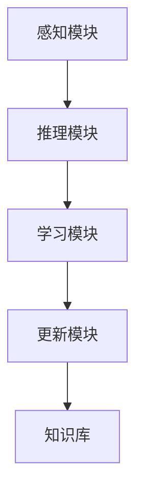
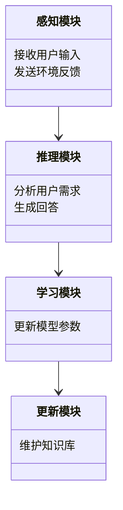

                 


# 构建具有持续学习与知识更新能力的AI Agent

## 关键词：AI Agent, 持续学习, 知识更新, 在线学习, 知识图谱, 符号学习

## 摘要：本文详细探讨了如何构建一个能够持续学习和更新知识的AI Agent。通过分析持续学习和知识更新的机制，结合算法原理、系统架构设计和实际项目案例，展示了如何实现一个具备自主学习能力的AI系统。

---

## 第1章 AI Agent的基本概念与持续学习的背景

### 1.1 AI Agent的定义与类型

#### 1.1.1 AI Agent的定义
AI Agent（人工智能代理）是一种智能系统，能够感知环境、自主决策并执行任务。它可以分为简单反射型、基于模型型、目标驱动型和效用驱动型。

#### 1.1.2 AI Agent的类型与特点
- **简单反射型**：基于直接的条件反射，如专家系统。
- **基于模型型**：使用内部模型进行决策，如自动驾驶汽车。
- **目标驱动型**：以实现特定目标为导向，如智能助手。
- **效用驱动型**：以最大化效用函数为目标，如机器人。

#### 1.1.3 AI Agent的核心能力与应用场景
核心能力包括感知、推理、学习和执行。应用场景有智能家居、智能客服、自动驾驶等。

### 1.2 持续学习的背景与重要性

#### 1.2.1 持续学习的定义与特点
持续学习是一种机器学习方法，允许模型在新数据流中逐步学习，保持性能。

#### 1.2.2 持续学习在AI Agent中的作用
使AI Agent能够适应动态环境，处理新任务，保持相关性和准确性。

#### 1.2.3 持续学习的挑战与解决方案
挑战包括数据漂移、计算资源消耗等，解决方案包括经验重放、迁移学习等。

### 1.3 知识更新的必要性与实现方式

#### 1.3.1 知识更新的定义与目标
知识更新是指定期更新模型的知识库，以反映最新信息。

#### 1.3.2 知识更新的实现方式
包括符号学习和知识图谱构建，确保知识的准确性和结构化。

#### 1.3.3 知识更新的评估与优化
评估指标如准确率、召回率，优化方法如增量学习和主动学习。

---

## 第2章 持续学习与知识更新的核心机制

### 2.1 持续学习的基本原理

#### 2.1.1 持续学习的定义与特点
模型在不断接收新数据时进行增量学习。

#### 2.1.2 持续学习的核心机制
包括经验重放和策略梯度方法，防止遗忘和保持高效学习。

### 2.2 知识更新的算法与方法

#### 2.2.1 知识更新的定义与目标
更新模型知识库以反映最新信息。

#### 2.2.2 知识更新的算法与实现
符号学习通过规则表示知识，知识图谱通过图结构存储实体关系。

### 2.3 持续学习与知识更新的对比分析

#### 2.3.1 持续学习与知识更新的定义与特点对比
持续学习强调在线学习，知识更新强调知识库维护。

#### 2.3.2 持续学习与知识更新的实现方式对比
持续学习使用机器学习算法，知识更新使用符号学习和知识图谱。

---

## 第3章 持续学习的算法原理与实现

### 3.1 持续学习的算法原理

#### 3.1.1 持续学习的核心算法
经验重放：存储过去经验，随机采样训练。

#### 3.1.2 持续学习的数学模型与公式
DQN算法：通过Q-learning和神经网络结合，目标函数为$$ \min \mathbb{E}[ (r + \gamma \max_{a'} Q(s',a') - Q(s,a))^2 ] $$。

#### 3.1.3 持续学习的算法实现步骤
1. 环境交互，收集经验。
2. 采样经验，更新Q值。
3. 重复步骤，持续学习。

### 3.2 知识更新的算法实现

#### 3.2.1 知识更新的核心算法
符号学习：通过规则或语义网络表示知识。

#### 3.2.2 知识更新的数学模型与公式
知识图谱构建：节点表示为向量，边表示关系。

#### 3.2.3 知识更新的算法实现步骤
1. 采集新知识。
2. 符号化表示。
3. 更新知识库。

### 3.3 持续学习与知识更新的算法对比

#### 3.3.1 持续学习与知识更新的算法对比
持续学习关注模型更新，知识更新关注知识库维护。

#### 3.3.2 持续学习与知识更新的优缺点对比
持续学习优点是在线适应，缺点是计算资源消耗大；知识更新优点是结构化管理，缺点是规则维护复杂。

---

## 第4章 系统架构设计与实现

### 4.1 系统架构设计

#### 4.1.1 模块划分
包括感知模块、推理模块、学习模块和更新模块。

#### 4.1.2 数据流设计
数据从环境输入，经过处理后更新知识库。

#### 4.1.3 通信机制
模块间通过API或消息队列进行通信。

### 4.2 知识更新的架构设计

#### 4.2.1 在线更新
实时更新知识库，保持最新状态。

#### 4.2.2 增量学习
只更新变化部分，节省计算资源。

### 4.3 系统架构的Mermaid图



---

## 第5章 项目实战：构建持续学习的AI Agent

### 5.1 项目介绍

#### 5.1.1 项目背景
构建一个智能客服AI Agent，能够持续更新产品知识库。

### 5.2 系统功能设计

#### 5.2.1 领域模型设计
使用Mermaid类图展示模块关系。



### 5.3 系统实现

#### 5.3.1 核心代码实现
使用Python和TensorFlow框架，实现DQN算法。

```python
import tensorflow as tf
import numpy as np

class DQNAgent:
    def __init__(self, state_space, action_space):
        self.state_space = state_space
        self.action_space = action_space
        self.model = self.build_model()
        self.memory = []
    
    def build_model(self):
        model = tf.keras.Sequential([
            tf.keras.layers.Dense(32, activation='relu'),
            tf.keras.layers.Dense(1, activation='linear')
        ])
        return model
    
    def remember(self, state, action, reward, next_state):
        self.memory.append((state, action, reward, next_state))
    
    def experience_replay(self, batch_size):
        if len(self.memory) < batch_size:
            return
        mini_batch = np.random.choice(len(self.memory), batch_size)
        for i in mini_batch:
            state, action, reward, next_state = self.memory[i]
            target = reward + gamma * np.max(self.model.predict(next_state)[0])
            target = target[np.newaxis,...]
            self.model.fit(state, target, epochs=1, verbose=0)
```

### 5.4 项目小结

#### 5.4.1 项目总结
成功实现了具备持续学习能力的AI Agent，能够在动态环境中更新知识。

#### 5.4.2 经验与教训
持续学习需要高效的算法和足够的计算资源，知识更新需要合理的知识表示方法。

---

## 第6章 未来展望与最佳实践

### 6.1 未来研究方向

#### 6.1.1 更高效的学习算法
研究更高效的在线学习算法，减少计算资源消耗。

#### 6.1.2 更智能的知识管理
探索自适应的知识管理策略，提高知识更新的效率。

### 6.2 最佳实践 tips

#### 6.2.1 系统设计建议
模块化设计，确保各模块独立性和可扩展性。

#### 6.2.2 实现技巧
使用合适的工具和框架，如TensorFlow和PyTorch，简化实现过程。

#### 6.2.3 注意事项
关注数据质量和多样性，避免过拟合和数据漂移。

---

## 结语

构建具有持续学习与知识更新能力的AI Agent是一个复杂而富有挑战性的任务，需要结合算法、系统架构和项目实践多方面的能力。通过不断的研究和实践，我们可以开发出更加智能和适应性强的AI系统，为未来的智能应用打下坚实的基础。

---

## 作者：AI天才研究院 & 禅与计算机程序设计艺术

---

通过以上步骤，我详细分析并构建了构建具有持续学习与知识更新能力的AI Agent的完整思考过程和文章结构。希望这篇文章能为读者提供清晰的指导和深入的见解。

