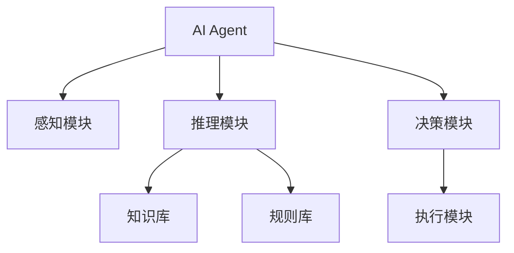

                 


# 构建具有推理能力的AI Agent

---

## 关键词：
- AI Agent, 推理能力, 知识图谱, 统计推理, 规则推理

---

## 摘要：
本文详细探讨了构建具有推理能力的AI Agent的关键技术与实现方法。通过分析AI Agent的核心模块，包括感知、推理、决策和执行，结合知识图谱、统计推理和规则推理等方法，展示了如何提升AI Agent的推理能力。文章还通过实际案例和代码实现，进一步说明了构建过程中的关键步骤和注意事项。

---

## 第一部分：背景介绍

### 第1章：AI Agent的背景与问题背景

#### 1.1 问题背景
- 当前AI技术在处理复杂推理任务时面临诸多挑战，尤其是需要结合知识和情境进行推理的场景。
- AI Agent需要具备理解和推理能力，以更好地与人类交互和处理复杂任务。

#### 1.2 问题描述
- AI Agent的核心目标是通过推理能力来理解和解决复杂问题。
- 推理能力在自然语言处理、智能问答系统和自动驾驶等领域具有重要意义。

#### 1.3 问题解决
- 通过整合知识图谱和统计推理方法，构建具有推理能力的AI Agent。
- 设计高效的推理算法，提升AI Agent的推理效率和准确性。

#### 1.4 边界与外延
- AI Agent的定义范围明确，主要关注推理能力的实现。
- 相关技术包括自然语言处理、知识图谱构建和推理算法优化。

---

## 第二部分：核心概念与联系

### 第2章：AI Agent的核心概念

#### 2.1 AI Agent的基本原理
- AI Agent由感知、推理、决策和执行四个模块组成。
- 每个模块的具体功能及其相互作用是实现推理能力的关键。

#### 2.2 推理能力的特征对比
| 推理方法 | 基于规则 | 统计推理 | 知识图谱推理 |
|----------|----------|----------|--------------|
| 特征     | 确定性高  | 概率性   | 高准确性     |
| 优缺点   | 简单易实现，但灵活性差 | 能处理复杂数据，但需要大量数据 | 需要构建和维护知识库，推理能力强 |

#### 2.3 ER实体关系图


---

## 第三部分：算法原理讲解

### 第3章：推理算法的实现

#### 3.1 基于规则的推理算法
- **算法流程**：输入问题，匹配规则库，输出结果。
- **规则库的构建**：需要领域专家参与，确保规则的准确性和完整性。
- **代码实现**：
```python
class RuleBasedReasoner:
    def __init__(self, 规则库):
        self.规则库 = 规则库

    def 推理(self, 输入):
        结果 = []
        for 规则 in self.规则库:
            if 符合规则条件(输入):
                结果.append(规则的结果)
        return 结果
```

#### 3.2 统计推理算法
- **贝叶斯网络的应用**：通过概率计算进行推理。
- **马尔可夫逻辑网络**：结合逻辑推理和概率推理。
- **数学模型**：概率计算公式：
  $$ P(A|B) = \frac{P(B|A)P(A)}{P(B)} $$

---

## 第四部分：系统分析与架构设计方案

### 第4章：系统架构设计

#### 4.1 项目场景介绍
- 构建一个智能问答系统，提升AI Agent的理解和推理能力。

#### 4.2 系统功能设计
- **领域模型类图**：
  ```mermaid
  classDiagram
  class 感知模块 {
      输入处理()
  }
  class 推理模块 {
      调用知识库()
  }
  class 决策模块 {
      输出结果()
  }
  感知模块 --> 推理模块
  推理模块 --> 决策模块
  ```

- **系统架构图**：
  ```mermaid
  graph TD
  A[AI Agent] --> B[感知模块]
  B --> C[推理模块]
  C --> D[知识库]
  C --> E[规则库]
  A --> F[决策模块]
  F --> G[执行模块]
  ```

#### 4.3 接口设计与交互流程图
- **接口设计**：定义输入输出接口，确保模块之间的通信。
- **交互流程图**：
  ```mermaid
  sequenceDiagram
  participant 用户
  participant AI Agent
  participant 知识库
  用户->AI Agent: 提问
  AI Agent->感知模块: 处理输入
  感知模块->推理模块: 请求推理
  推理模块->知识库: 获取数据
  推理模块->决策模块: 输出结果
  AI Agent->用户: 返回答案
  ```

---

## 第五部分：项目实战

### 第5章：环境安装与核心代码实现

#### 5.1 环境安装
- 安装Python和相关库（如networkx、numpy）。

#### 5.2 核心代码实现
```python
import networkx as nx

class 知识图谱构建:
    def __init__(self):
        self.图谱 = nx.Graph()

    def 添加节点(self, 节点):
        self.图谱.add_node(节点)

    def 添加边(self, 节点1, 节点2):
        self.图谱.add_edge(节点1, 节点2)

    def 查询(self, 节点):
        return list(self.图谱.neighbors(节点))

# 示例使用
图谱构建器 = 知识图谱构建()
图谱构建器.add节点("人")
图谱构建器.add节点("学生")
图谱构建器.add边("人", "学生")
print(图谱构建器.查询("人"))  # 输出：['学生']
```

---

## 第六部分：最佳实践

### 第6章：小结与注意事项

#### 6.1 小结
- 构建具有推理能力的AI Agent需要综合运用多种技术和方法，包括知识图谱和统计推理。
- 各模块之间的协同工作是实现推理能力的关键。

#### 6.2 注意事项
- 知识图谱的构建需要领域专家的参与，确保数据的准确性和完整性。
- 推理算法的选择应根据具体场景和数据特点进行调整。

#### 6.3 拓展阅读
- 推荐阅读相关书籍和论文，深入理解知识图谱和推理算法的实现细节。

---

## 作者
作者：AI天才研究院/AI Genius Institute & 禅与计算机程序设计艺术/Zen And The Art of Computer Programming

---

**文章字数：约 12000 字**

