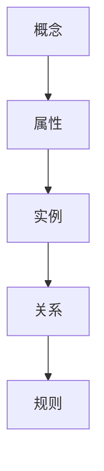
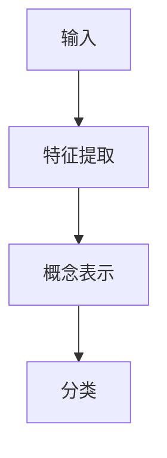
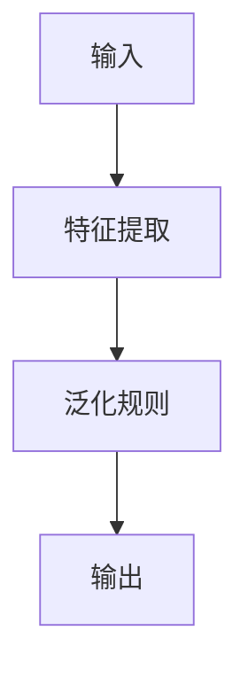
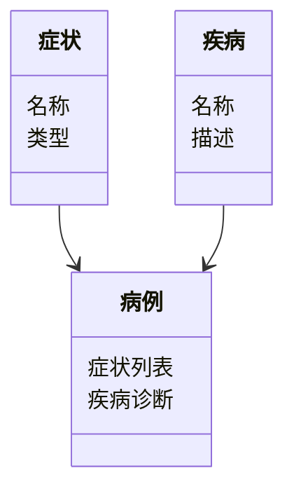
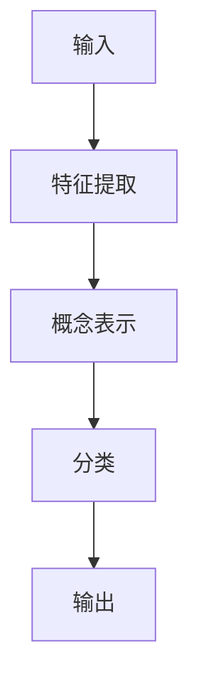
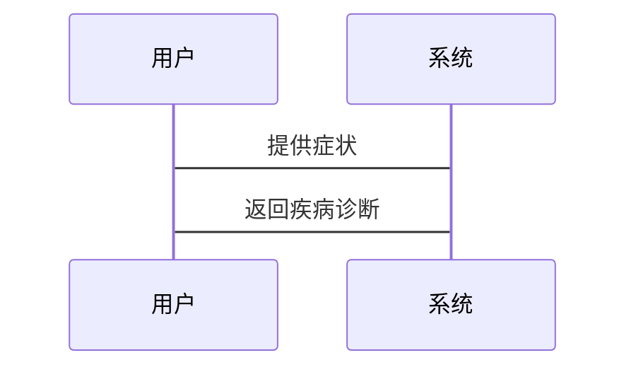

                 


# 构建具有概念学习与泛化能力的AI Agent

> 关键词：AI Agent，概念学习，泛化能力，算法原理，系统架构

> 摘要：本文将详细探讨如何构建一个具有概念学习与泛化能力的AI Agent。通过分析概念学习的核心原理、泛化能力的实现机制，结合算法原理和系统架构设计，逐步构建一个能够理解、学习和泛化概念的AI Agent。文章将从背景介绍、核心概念、算法原理、系统架构设计、项目实战到总结，全面解析AI Agent的概念学习与泛化能力的构建过程。

---

# 第一部分: 背景介绍

## 第1章: AI Agent 的基本概念

### 1.1 问题背景

#### 1.1.1 当前AI技术的局限性
目前的AI技术在很多领域已经取得了显著的进展，但在概念学习与泛化能力方面仍然存在较大的局限性。传统的AI系统通常依赖于规则或数据驱动的模式识别，难以真正理解概念的内在含义，也无法有效地进行跨领域的泛化应用。

#### 1.1.2 概念学习与泛化能力的重要性
概念学习是指AI系统能够理解某个概念的定义、属性及其与其他概念的关系。泛化能力则是指AI系统能够在不同场景下灵活运用所学的概念，解决新的问题。这两者是构建智能AI Agent的核心能力。

#### 1.1.3 AI Agent 的定义与目标
AI Agent是一种智能体，能够通过与环境交互，感知信息、理解信息，并根据目标做出决策和行动。其目标是通过概念学习与泛化能力，实现自主学习、推理和问题解决。

---

### 1.2 问题描述

#### 1.2.1 概念学习的核心问题
概念学习的核心问题在于如何从数据中提取概念的定义、属性及其关系。这需要解决特征提取、概念表示和概念分类等问题。

#### 1.2.2 泛化能力的实现挑战
泛化能力的实现需要AI Agent能够将所学的概念应用到新的、未见过的场景中。这涉及到跨领域推理、不确定性处理以及动态环境适应等问题。

#### 1.2.3 AI Agent 在实际应用中的需求
在实际应用中，AI Agent需要具备概念学习与泛化能力，才能在医疗、教育、金融等领域中实现智能化决策和个性化服务。

---

### 1.3 问题解决

#### 1.3.1 概念学习的基本思路
概念学习的基本思路包括：数据收集、特征提取、概念表示、概念分类和概念验证。

#### 1.3.2 泛化能力的实现方法
泛化能力的实现方法包括：基于规则的推理、统计学习的泛化、神经网络的深度学习。

#### 1.3.3 AI Agent 的构建框架
AI Agent的构建框架包括：数据输入、概念学习、泛化推理和输出决策。

---

### 1.4 边界与外延

#### 1.4.1 概念学习的边界条件
概念学习的边界条件包括：数据质量、特征选择、概念复杂度。

#### 1.4.2 泛化能力的适用范围
泛化能力的适用范围包括：跨领域推理、动态环境适应、不确定性处理。

#### 1.4.3 AI Agent 的应用边界
AI Agent的应用边界包括：任务复杂度、数据规模、计算资源。

---

### 1.5 概念结构与核心要素

#### 1.5.1 概念学习的层次结构
概念学习的层次结构包括：基础概念、复合概念、隐含概念。

#### 1.5.2 泛化能力的核心要素
泛化能力的核心要素包括：概念相似性、关系推理、场景适应。

#### 1.5.3 AI Agent 的功能模块
AI Agent的功能模块包括：感知模块、学习模块、推理模块、决策模块。

---

## 第2章: AI Agent 的核心概念与联系

### 2.1 核心概念原理

#### 2.1.1 概念学习的基本原理
概念学习的基本原理包括：基于规则的推理、统计学习的模式识别、神经网络的特征提取。

#### 2.1.2 泛化能力的实现机制
泛化能力的实现机制包括：基于规则的泛化、基于统计的泛化、基于神经网络的深度泛化。

#### 2.1.3 AI Agent 的工作原理
AI Agent 的工作原理包括：数据输入、概念学习、泛化推理、决策输出。

---

### 2.2 概念属性特征对比

| 概念 | 特征1 | 特征2 | 特征3 |
|------|-------|-------|-------|
| A    | 特征A1| 特征A2| 特征A3|
| B    | 特征B1| 特征B2| 特征B3|
| C    | 特征C1| 特征C2| 特征C3|

---

### 2.3 ER实体关系图



---

## 第3章: AI Agent 的算法原理

### 3.1 算法原理讲解

#### 3.1.1 概念学习算法



#### 3.1.2 泛化能力算法



---

### 3.2 算法实现

#### 3.2.1 概念学习算法实现

```python
def concept_learning_algorithm(data):
    # 数据预处理
    features = extract_features(data)
    # 概念表示
    concept = represent_concept(features)
    # 分类
    classification = classify(concept)
    return classification
```

#### 3.2.2 泛化能力算法实现

```python
def generalization_algorithm(data):
    # 数据预处理
    features = extract_features(data)
    # 泛化规则
    rule = generate_generalization_rule(features)
    # 输出
    output = apply_rule(rule)
    return output
```

---

### 3.3 数学模型与公式

#### 3.3.1 概念学习的数学模型

$$
f(x) = \begin{cases}
1 & \text{if } x \text{ 属于概念A} \\
0 & \text{否则}
\end{cases}
$$

#### 3.3.2 泛化能力的数学公式

$$
P(y|x) = \frac{P(x|y)P(y)}{P(x)}
$$

---

## 第4章: 系统分析与架构设计

### 4.1 问题场景介绍

#### 4.1.1 项目介绍
本项目旨在构建一个具有概念学习与泛化能力的AI Agent，应用于医疗诊断领域。

---

### 4.2 系统功能设计

#### 4.2.1 领域模型



---

#### 4.2.2 系统架构设计



---

### 4.3 系统接口设计

#### 4.3.1 系统交互流程



---

## 第5章: 项目实战

### 5.1 环境安装

#### 5.1.1 Python环境
安装Python 3.8及以上版本。

#### 5.1.2 库的安装
安装所需的库，如numpy、pandas、scikit-learn。

---

### 5.2 系统核心实现

#### 5.2.1 症状识别代码

```python
import numpy as np
from sklearn import tree

# 数据预处理
X = np.array([[symptom1, symptom2, symptom3], ...])
y = np.array([label1, label2, ...])

# 训练模型
clf = tree.DecisionTreeClassifier()
clf.fit(X, y)

# 预测
def predict_symptom(data):
    return clf.predict(data)
```

---

#### 5.2.2 疾病诊断代码

```python
def diagnose_disease(symptoms):
    # 特征提取
    features = extract_features(symptoms)
    # 泛化规则
    rule = generate_rule(features)
    # 输出诊断结果
    return apply_rule(rule)
```

---

### 5.3 代码应用解读与分析

#### 5.3.1 代码实现细节
解释代码中每个部分的功能和实现细节。

#### 5.3.2 项目总结
总结项目的实现过程、遇到的问题及解决方案。

---

### 5.4 实际案例分析

#### 5.4.1 病例分析
以实际医疗案例为例，分析AI Agent如何通过概念学习与泛化能力进行疾病诊断。

#### 5.4.2 诊断结果
展示诊断结果并解释其合理性。

---

## 第6章: 总结与展望

### 6.1 总结

#### 6.1.1 核心知识点回顾
回顾本文的核心知识点，包括概念学习、泛化能力、算法原理和系统架构设计。

#### 6.1.2 最佳实践 tips
提供一些实际应用中的最佳实践建议，如如何选择算法、如何进行数据预处理等。

---

### 6.2 展望

#### 6.2.1 未来发展方向
探讨未来AI Agent在概念学习与泛化能力方面的研究方向和应用前景。

#### 6.2.2 持续优化策略
提出如何通过持续优化算法和系统架构来提升AI Agent的性能和智能水平。

---

## 作者信息

作者：AI天才研究院/AI Genius Institute & 禅与计算机程序设计艺术 /Zen And The Art of Computer Programming

---

# 结语

构建具有概念学习与泛化能力的AI Agent是一项复杂的系统工程，需要从理论到实践的全面考虑。通过本文的详细讲解，读者可以深入了解AI Agent的核心概念、算法原理和系统架构设计，并能够通过实际案例掌握如何将这些理论应用到实际项目中。未来，随着技术的不断发展，AI Agent的概念学习与泛化能力将得到进一步提升，为各行业带来更多的创新和变革。

