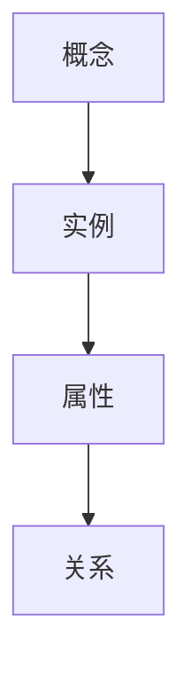
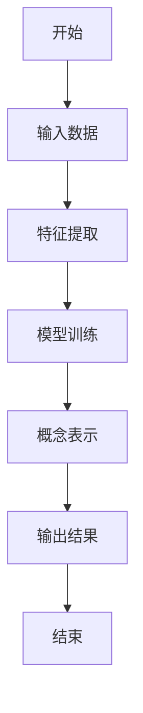
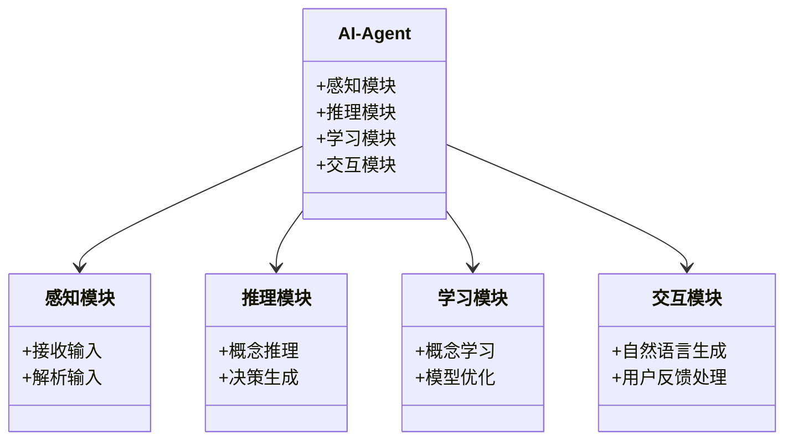
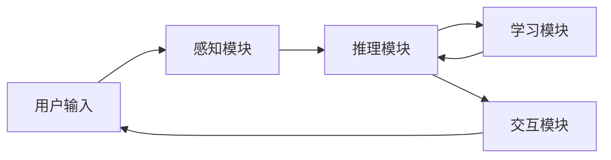
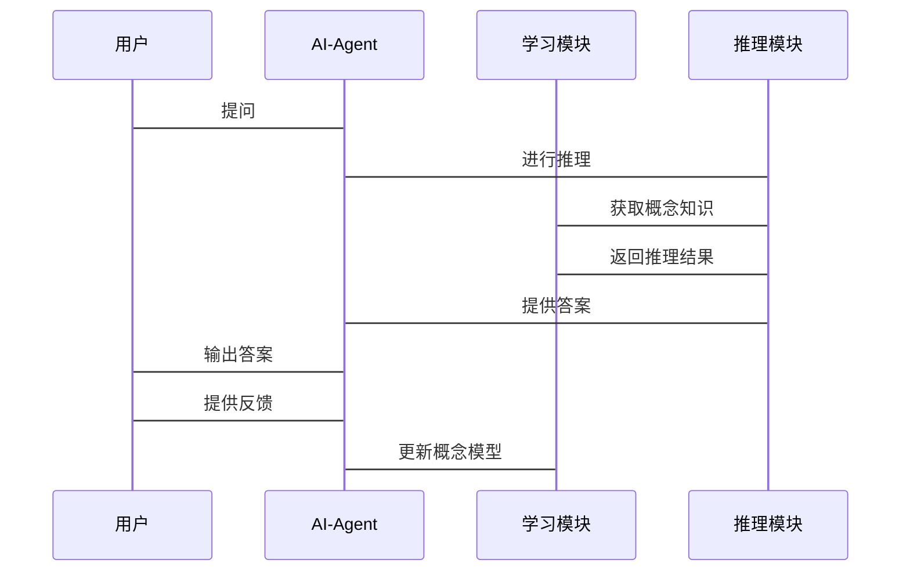

                 


# 构建具有概念学习能力的AI Agent

> 关键词：AI Agent，概念学习，机器学习，深度学习，自然语言处理

> 摘要：本文详细探讨了如何构建具有概念学习能力的AI Agent，从理论基础到算法实现，再到系统架构设计，结合实际案例分析，为读者提供全面的指导。

---

# 第一部分: 构建具有概念学习能力的AI Agent概述

## 第1章: 概念学习与AI Agent的背景介绍

### 1.1 问题背景
#### 1.1.1 当前AI Agent的发展现状
AI Agent（智能体）的发展经历了从简单规则驱动到复杂学习驱动的转变。近年来，随着深度学习和自然语言处理技术的进步，AI Agent在多个领域展现出强大的应用潜力。

#### 1.1.2 概念学习在AI Agent中的重要性
概念学习是AI Agent理解、推理和决策的基础。通过概念学习，AI Agent能够更好地处理复杂任务，如问题解决、知识推理和自然语言理解。

#### 1.1.3 问题解决的核心目标
本文的核心目标是探讨如何通过概念学习提升AI Agent的能力，使其能够更好地理解和处理复杂概念。

### 1.2 问题描述
#### 1.2.1 概念学习的基本定义
概念学习是指通过数据和经验，构建概念表示的过程，目的是使AI能够理解和运用这些概念。

#### 1.2.2 AI Agent的概念与功能
AI Agent是一种能够感知环境、执行任务并做出决策的智能实体，通常具备感知、推理、学习和交互能力。

#### 1.2.3 概念学习与AI Agent的结合
通过概念学习，AI Agent能够更有效地处理复杂任务，如自然语言理解、知识推理和决策优化。

### 1.3 问题解决
#### 1.3.1 概念学习的基本原理
概念学习通过构建概念网络，帮助AI Agent理解概念之间的关系和层次结构。

#### 1.3.2 AI Agent的核心功能实现
AI Agent的核心功能包括感知、推理、学习和交互，这些功能需要通过概念学习来增强。

#### 1.3.3 概念学习在AI Agent中的具体应用
概念学习在自然语言处理、知识图谱构建和智能问答系统中具有广泛应用。

### 1.4 边界与外延
#### 1.4.1 概念学习的边界条件
概念学习的边界包括数据质量和概念复杂度。数据质量和概念复杂度直接影响概念学习的效果。

#### 1.4.2 AI Agent的适用范围
AI Agent适用于需要自主决策和复杂推理的任务，如自动驾驶、智能客服和机器人控制。

#### 1.4.3 概念学习与传统机器学习的对比
概念学习与传统机器学习的主要区别在于，概念学习更注重概念的层次性和关联性，而传统机器学习注重模式识别和分类。

### 1.5 概念结构与核心要素
#### 1.5.1 概念层次结构
概念层次结构包括上位概念、下位概念和相关概念。例如，"动物"是上位概念，"猫"是下位概念。

#### 1.5.2 核心要素的详细分析
概念层次结构、概念关联性和概念约束性是概念学习中的核心要素。

#### 1.5.3 概念间的关系与相互作用
概念间的关系包括层次关系、并列关系和交叉关系。这些关系帮助构建概念网络，增强AI Agent的理解能力。

## 第2章: 概念学习的核心概念与联系

### 2.1 核心概念原理
#### 2.1.1 概念表示的基本方法
概念表示可以通过符号表示、向量表示和图结构表示实现。

#### 2.1.2 概念学习的基本算法
常用的概念学习算法包括层次聚类、关联规则挖掘和深度学习方法。

#### 2.1.3 概念网络的构建与优化
概念网络通过构建层次结构和关联关系，帮助AI Agent更好地理解和运用概念。

### 2.2 概念属性特征对比表
| 概念属性 | 特征描述 | 示例 |
|----------|----------|------|
| 层次性   | 概念间存在层次关系 | 上级概念：动物；下级概念：猫 |
| 关联性   | 概念间存在多种关联 | 关联概念：颜色与形状 |
| 约束性   | 概念受特定规则约束 | 必须满足的颜色范围 |

### 2.3 ER实体关系图


## 第3章: 概念学习的算法原理

### 3.1 算法原理概述
#### 3.1.1 基于符号的学习方法
基于符号的方法通过构建规则和逻辑推理实现概念学习。

#### 3.1.2 基于统计的学习方法
统计方法通过分析数据的分布和模式，发现概念之间的关联性。

#### 3.1.3 深度学习在概念学习中的应用
深度学习通过神经网络模型，自动学习概念的高层次表示。

### 3.2 算法流程图


### 3.3 Python实现示例
```python
def concept_learning_algorithm(data):
    features = extract_features(data)
    model = train_model(features)
    concepts = model.predict(features)
    return concepts
```

### 3.4 数学模型与公式
#### 3.4.1 概念表示的数学模型
$$ c = f(x) $$
其中，$c$ 表示概念，$x$ 表示输入数据，$f$ 表示概念学习函数。

#### 3.4.2 概

---

# 第二部分: 系统分析与架构设计

## 第4章: 问题场景介绍

### 4.1 项目介绍
本项目旨在构建一个能够通过概念学习提升理解能力的AI Agent，使其能够处理复杂的自然语言任务。

### 4.2 系统功能设计
#### 4.2.1 领域模型mermaid类图


### 4.3 系统架构设计
#### 4.3.1 系统架构mermaid架构图


### 4.4 系统接口设计
系统接口包括输入接口、输出接口和反馈接口，确保各模块之间的高效协作。

### 4.5 系统交互mermaid序列图


---

# 第三部分: 项目实战

## 第5章: 环境安装与配置

### 5.1 环境要求
#### 5.1.1 操作系统
建议使用Linux或macOS系统。

#### 5.1.2 开发工具
推荐使用Jupyter Notebook或PyCharm进行开发。

#### 5.1.3 依赖库安装
需要安装的库包括Python 3.8+, TensorFlow 2.0+, Keras 2.4+, 和相关NLP库。

### 5.2 核心实现源代码
#### 5.2.1 感知模块
```python
class PerceptionModule:
    def __init__(self):
        self.nlp = spacy.load("en_core_web_sm")

    def process_input(self, text):
        return self.nlp(text)
```

#### 5.2.2 推理模块
```python
class ReasoningModule:
    def __init__(self, knowledge_base):
        self.knowledge_base = knowledge_base

    def infer(self, context):
        return self.knowledge_base.infer(context)
```

#### 5.2.3 学习模块
```python
class LearningModule:
    def __init__(self, model):
        self.model = model

    def train(self, data):
        self.model.fit(data)

    def predict(self, data):
        return self.model.predict(data)
```

#### 5.2.4 交互模块
```python
class InteractionModule:
    def __init__(self, generator):
        self.generator = generator

    def generate_response(self, prompt):
        return self.generator.generate(prompt)
```

## 第6章: 实际案例分析

### 6.1 案例背景
以构建一个智能问答系统为例，展示概念学习在AI Agent中的应用。

### 6.2 数据准备
使用自然语言处理工具，提取文本数据中的概念和关系。

### 6.3 模型训练
通过深度学习模型训练，构建概念网络，提升AI Agent的理解能力。

### 6.4 模型优化
根据用户反馈，不断优化模型，提升推理和回答的准确率。

### 6.5 实验结果与分析
展示实验结果，分析概念学习对AI Agent性能的提升效果。

---

# 第四部分: 最佳实践与总结

## 第7章: 最佳实践

### 7.1 实验与调优
定期进行模型调优，确保概念学习的准确性和效率。

### 7.2 模型部署与维护
将模型部署到实际应用中，持续监控和维护，确保系统的稳定性和可靠性。

### 7.3 代码规范与文档
遵循良好的代码规范，编写详细的文档，方便团队协作和后续开发。

### 7.4 性能优化
通过优化算法和数据结构，提升AI Agent的运行效率和响应速度。

## 第8章: 小结与展望

### 8.1 小结
本文详细探讨了如何构建具有概念学习能力的AI Agent，从理论到实践，为读者提供了全面的指导。

### 8.2 未来展望
未来，随着AI技术的不断发展，概念学习将在更多领域展现出广泛应用潜力。

---

# 作者：AI天才研究院/AI Genius Institute & 禅与计算机程序设计艺术 /Zen And The Art of Computer Programming

---

这篇文章详细探讨了如何构建具有概念学习能力的AI Agent，从理论基础到算法实现，再到系统架构设计，结合实际案例分析，为读者提供全面的指导。通过本文的学习，读者能够深入了解概念学习的核心原理和应用方法，为实际项目提供有力支持。

