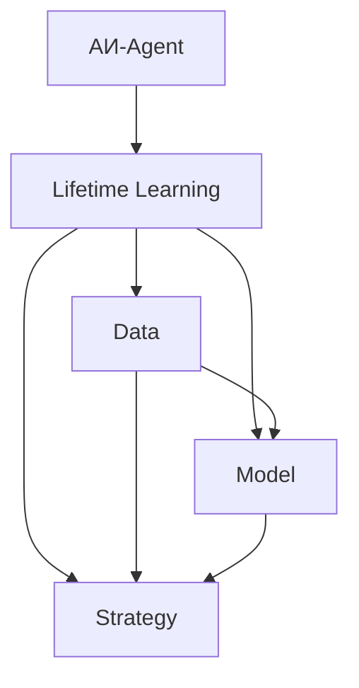
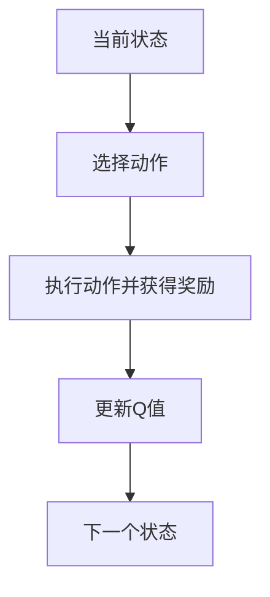
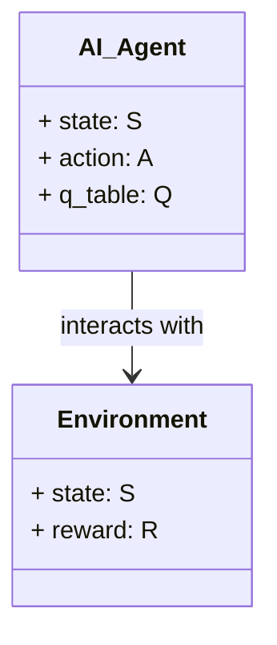
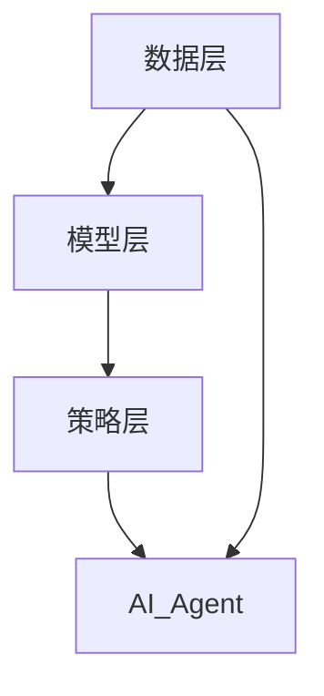

                 


# 构建具有终身学习能力的AI Agent

## 关键词：AI Agent，终身学习，强化学习，自适应算法，系统架构

## 摘要：  
本文将详细探讨如何构建一个具有终身学习能力的AI Agent。通过分析AI Agent的核心概念、终身学习的算法原理、系统架构设计以及实际项目实现，我们将逐步揭示构建这样一个系统的复杂性和挑战性。文章将从背景介绍、核心概念、算法实现、系统设计到项目实战，为读者提供一个全面的视角，帮助读者理解如何设计和实现一个能够持续学习和适应新环境的AI Agent。

---

# 构建具有终身学习能力的AI Agent

## 第一部分: 背景介绍

### 第1章: AI Agent与终身学习概述

#### 1.1 AI Agent的基本概念
- **1.1.1 AI Agent的定义**  
  AI Agent（人工智能代理）是指能够感知环境、自主决策并执行任务的智能实体。它可以是一个软件程序，也可以是一个物理机器人，核心目标是通过与环境交互来实现特定目标。

- **1.1.2 AI Agent的核心特征**  
  - **自主性**：能够在没有外部干预的情况下自主运作。  
  - **反应性**：能够实时感知环境并做出响应。  
  - **目标导向性**：所有行为都围绕实现特定目标展开。  

- **1.1.3 终身学习能力的必要性**  
  AI Agent需要在动态变化的环境中长期运行，环境中的信息、任务和目标可能会不断变化。为了适应这些变化，AI Agent需要具备终身学习的能力，即能够持续更新知识和策略以应对新的挑战。

#### 1.2 终身学习的背景与意义
- **1.2.1 传统AI的局限性**  
  传统AI（如基于规则的系统或静态模型）在面对环境变化时表现不佳，因为它们无法适应新的输入或任务。  
- **1.2.2 终身学习在AI Agent中的作用**  
  终身学习使AI Agent能够不断更新其知识库和策略，以应对环境中的不确定性。  
- **1.2.3 终身学习的应用价值**  
  - **动态环境适应**：在复杂环境中，AI Agent需要不断调整策略以应对变化。  
  - **持续优化**：通过学习，AI Agent可以逐步提高其性能和决策质量。  
  - **多任务处理**：终身学习使AI Agent能够同时处理多种任务，并在任务之间切换时保持高效。

---

## 第二部分: 核心概念与联系

### 第2章: AI Agent与终身学习的核心概念

#### 2.1 AI Agent的属性与特征
- **2.1.1 知识表示**  
  AI Agent需要将环境中的信息表示为某种形式（如符号、概率分布或向量），以便进行处理和推理。  
- **2.1.2 知识更新**  
  AI Agent需要通过与环境交互或接收新数据来更新其知识库。  
- **2.1.3 自我优化**  
  AI Agent通过学习不断优化自身的决策策略和行为模式。

#### 2.2 终身学习的属性与特征
- **2.2.1 数据驱动**  
  终身学习依赖于数据，通过数据驱动的方法不断更新模型和策略。  
- **2.2.2 自适应性**  
  终身学习算法能够根据新的输入动态调整模型参数或策略。  
- **2.2.3 持续改进**  
  通过持续学习，AI Agent能够逐步提高其性能和适应能力。

#### 2.3 核心概念对比表
| **属性**       | **AI Agent**                 | **终身学习**                |
|----------------|------------------------------|-----------------------------|
| **核心目标**   | 实现特定目标                 | 持续更新知识和策略          |
| **自主性**     | 高                          | 高                         |
| **反应性**     | 高                          | 高                         |
| **学习能力**   | 有限（通常依赖外部输入）     | 强大（能够主动更新知识）   |

#### 2.4 实体关系图


---

## 第三部分: 算法原理讲解

### 第3章: 终身学习算法的原理与实现

#### 3.1 基于模型的终身学习算法
- **3.1.1 模型无关算法：Q-learning**  
  Q-learning是一种经典的强化学习算法，通过Q值表记录状态-动作对的最优值，从而实现策略更新。  

**Q-learning公式：**  
$$ Q(s, a) = Q(s, a) + \alpha [r + \max_{a'} Q(s', a') - Q(s, a)] $$  

**流程图：**  


**Python代码示例：**  
```python
import numpy as np

class QLearning:
    def __init__(self, state_space, action_space, alpha=0.1, gamma=0.99):
        self.state_space = state_space
        self.action_space = action_space
        self.alpha = alpha
        self.gamma = gamma
        self.q_table = np.zeros((state_space, action_space))

    def choose_action(self, state, epsilon=0.1):
        if np.random.random() < epsilon:
            return np.random.randint(self.action_space)
        return np.argmax(self.q_table[state])

    def update_q_table(self, state, action, reward, next_state):
        self.q_table[state, action] += self.alpha * (reward + self.gamma * np.max(self.q_table[next_state]) - self.q_table[state, action])
```

---

## 第四部分: 系统分析与架构设计

### 第4章: 系统架构与交互设计

#### 4.1 问题场景介绍
- **4.1.1 问题背景**  
  构建一个能够在复杂环境中持续学习的AI Agent，需要考虑环境的动态变化、数据的实时更新以及算法的高效性。  

#### 4.2 系统功能设计
- **4.2.1 领域模型类图**  
  使用Mermaid绘制领域模型类图，展示系统中的核心组件及其关系。  



- **4.2.2 系统架构设计**  
  系统架构分为数据层、模型层和策略层。  



- **4.2.3 系统接口设计**  
  - 输入接口：接收环境状态和奖励信号。  
  - 输出接口：输出动作并更新Q表。  

- **4.2.4 系统交互序列图**  
  ```mermaid
  sequenceDiagram
      AI_Agent ->> Environment: 请求状态
      Environment ->> AI_Agent: 返回当前状态
      AI_Agent ->> Environment: 选择动作并执行
      Environment ->> AI_Agent: 返回奖励和下一个状态
      AI_Agent ->> AI_Agent: 更新Q表
  ```

---

## 第五部分: 项目实战

### 第5章: 实战与案例分析

#### 5.1 环境安装与配置
- **5.1.1 安装必要的库**  
  ```bash
  pip install numpy matplotlib
  ```

- **5.1.2 安装强化学习框架**  
  ```bash
  pip install gym
  ```

#### 5.2 核心功能实现
- **5.2.1 Q-learning实现**  
  使用Python实现Q-learning算法，包括状态空间、动作空间、Q表更新等核心功能。  

**代码实现：**  
```python
import gym
import numpy as np

def main():
    env = gym.make('CartPole-v0')
    state_space = env.observation_space.shape[0]
    action_space = env.action_space.n

    alpha = 0.1
    gamma = 0.99
    epsilon = 0.1

    q_table = np.zeros((state_space, action_space))

    for episode in range(1000):
        state = env.reset()
        total_reward = 0
        done = False

        while not done:
            if np.random.random() < epsilon:
                action = env.action_space.sample()
            else:
                action = np.argmax(q_table[state])

            next_state, reward, done, info = env.step(action)
            total_reward += reward

            q_table[state, action] += alpha * (reward + gamma * np.max(q_table[next_state]) - q_table[state, action])

            state = next_state

        epsilon = max(0.01, epsilon * 0.99)

    print("训练完成！")

if __name__ == "__main__":
    main()
```

- **5.2.2 训练与评估**  
  使用训练好的Q表对环境进行评估，观察AI Agent在CartPole环境中的表现。  

**评估代码：**  
```python
def evaluate():
    env = gym.make('CartPole-v0')
    state_space = env.observation_space.shape[0]
    action_space = env.action_space.n

    q_table = np.loadtxt('q_table.csv')

    total_rewards = []
    for _ in range(10):
        state = env.reset()
        total_reward = 0
        done = False

        while not done:
            action = np.argmax(q_table[state])
            next_state, reward, done, info = env.step(action)
            total_reward += reward
            state = next_state

        total_rewards.append(total_reward)
    print(f"平均奖励：{np.mean(total_rewards)}")

evaluate()
```

#### 5.3 案例分析与解读
- **5.3.1 训练结果分析**  
  观察训练过程中奖励的变化，评估算法的收敛性和稳定性。  
- **5.3.2 动作选择分析**  
  通过可视化Q表，观察AI Agent在不同状态下的动作选择策略。  

---

## 第六部分: 总结与展望

### 第6章: 总结与展望

#### 6.1 总结
- 本文详细探讨了构建具有终身学习能力的AI Agent的理论基础和实现方法。  
- 通过Q-learning算法的实现，展示了如何在动态环境中实现持续学习和优化。  
- 系统架构设计和项目实战部分为读者提供了从理论到实践的完整指导。

#### 6.2 展望
- **算法优化**：探索更高效的终身学习算法，如深度强化学习和元学习。  
- **复杂环境适应**：研究如何在更复杂的环境中实现终身学习。  
- **应用拓展**：将终身学习能力的AI Agent应用于更多实际场景，如自动驾驶、智能客服等。

---

## 作者信息

作者：AI天才研究院 & 禅与计算机程序设计艺术

