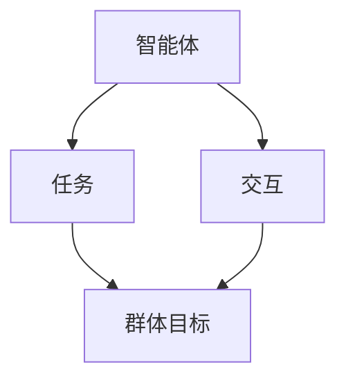

                 


# 构建具有群体智能决策能力的多Agent系统

**关键词**: 多智能体系统, 群体智能, 分布式计算, 自组织系统, 智能决策

**摘要**: 多Agent系统通过多个智能体协作完成复杂任务，而群体智能则通过个体间简单规则实现复杂行为。本文系统地介绍多Agent系统的核心概念，分析群体智能的实现机制，探讨其在实际场景中的应用，并通过案例展示如何构建具备群体智能决策能力的多Agent系统。

---

## 第一部分: 多Agent系统与群体智能概述

### 第1章: 多Agent系统基础

#### 1.1 多Agent系统的基本概念
- **多Agent系统定义**: 由多个智能体（Agent）组成的分布式系统，每个智能体具备感知环境、自主决策和协作的能力。
- **多Agent系统的特征**:
  - 分布式: 智能体独立运行，通过通信协作完成任务。
  - 异步性: 智能体间存在时间差，需处理异步交互。
  - 动态性: 环境动态变化，智能体需自适应调整行为。
- **多Agent系统与传统单体系统的区别**:
  - 单体系统: 单个实体完成任务，决策集中化。
  - 多Agent系统: 多个智能体协作，决策去中心化。

#### 1.2 群体智能的基本概念
- **群体智能的定义**: 群体中多个个体通过简单规则协作，产生复杂智能行为。
- **群体智能的核心特征**:
  - 自组织: 个体间无中心协调，自发形成结构。
  - 去中心化: 无单一点控制，个体自主决策。
  - 涣合性: 群体行为涌现，个体行为简单。
- **群体智能与个体智能的关系**:
  - 个体智能: 单个智能体的智能。
  - 群体智能: 个体智能通过协作产生的整体智能。

#### 1.3 多Agent系统与群体智能的关系
- **多Agent系统如何实现群体智能**:
  - 分布式计算: 智能体通过分布式计算协作。
  - 协作算法: 使用算法实现智能体间的协作。
- **群体智能在多Agent系统中的作用**:
  - 提高系统的鲁棒性: 个体故障不影响整体。
  - 增强系统的适应性: 群体能够自适应环境变化。
- **群体智能与分布式计算的联系**:
  - 分布式计算是实现群体智能的手段。
  - 群体智能需要分布式计算的支持。

### 1.4 本章小结
本章介绍了多Agent系统和群体智能的基本概念，分析了它们的特征和关系。多Agent系统通过多个智能体协作完成任务，而群体智能通过个体协作产生复杂行为，两者结合可以实现高效的群体智能决策。

---

## 第二部分: 多Agent系统的核心概念与联系

### 第2章: 多Agent系统的核心概念

#### 2.1 多Agent系统的组成要素
- **智能体（Agent）的定义与属性**:
  - 定义: 具备感知、决策和行动能力的实体。
  - 属性: 目标、知识、反应能力、自主性。
- **多Agent系统的结构层次**:
  - 个体层: 单个智能体的行为。
  - 群组层: 智能体协作完成特定任务。
  - 群体层: 多个群组协作完成复杂任务。
- **智能体之间的交互方式**:
  - 直接交互: 智能体间直接通信。
  - 间接交互: 通过中间媒介通信。

#### 2.2 群体智能的实现机制
- **分布式计算与协作算法**:
  - 分布式计算: 智能体在不同节点上运行。
  - 协作算法: 智能体间通过算法协作。
- **自适应与自组织特性**:
  - 自适应: 系统能够根据环境变化调整。
  - 自组织: 智能体自主组织结构。
- **群体决策与共识算法**:
  - 群体决策: 群体共同决策。
  - 共识算法: 智能体达成共识的方法。

### 第3章: 多Agent系统与群体智能的关系图解

#### 3.1 多Agent系统与群体智能的对比表格
| 比较维度 | 多Agent系统 | 群体智能 |
|----------|-------------|----------|
| 定义     | 多个智能体协作完成任务 | 群体中个体通过简单规则产生复杂行为 |
| 目标     | 高效完成复杂任务 | 群体协作解决问题 |
| 特性     | 分布式、异步、动态 | 自组织、去中心化、涌现性 |

#### 3.2 多Agent系统与群体智能的ER实体关系图


### 3.3 本章小结
本章分析了多Agent系统和群体智能的核心概念，并通过对比和实体关系图展示了它们之间的联系。多Agent系统通过智能体协作实现任务，而群体智能通过个体协作产生复杂行为，两者结合可以实现高效的群体智能决策。

---

## 第三部分: 多Agent系统中的算法原理

### 第4章: 多Agent系统中的分布式计算算法

#### 4.1 分布式计算
- **一致性算法**:
  - 定义: 确保多个智能体状态一致的算法。
  - 实现: 使用Paxos、Raft等一致性算法。
- **分布式协作算法**:
  - 定义: 智能体间协作完成任务的算法。
  - 实现: 使用分布式锁、任务分配算法。
- **数学模型**:
  - 状态一致性模型: $$S_i = S_j$$
  - 分布式协作模型: $$C_i \rightarrow C_j$$

#### 4.2 群体智能中的协作算法
- **一致性算法**: 使用一致性算法确保智能体间状态一致。
- **分布式计算**: 通过分布式计算实现协作。
- **数学模型**: 使用一致性算法的数学模型。

---

### 第5章: 群体智能中的自适应与优化算法

#### 5.1 自适应优化算法
- **自适应优化算法**: 智能体根据环境变化自适应调整行为。
- **数学模型**: 使用动态优化模型。
  - 优化目标: $$f(x)$$
  - 约束条件: $$g(x) \leq 0$$

#### 5.2 自组织网络算法
- **自组织网络**: 网络结构自动调整。
- **数学模型**: 使用图论模型。
  - 节点关系: $$R_{i,j}$$

### 5.3 本章小结
本章介绍了多Agent系统中的分布式计算算法和群体智能中的自适应优化算法，分析了它们的数学模型和实现方法。这些算法帮助智能体协作完成任务，实现群体智能决策。

---

## 第四部分: 系统分析与架构设计

### 第6章: 系统分析与架构设计

#### 6.1 问题场景介绍
- **问题背景**: 多个智能体协作完成复杂任务。
- **项目介绍**: 构建一个多Agent系统，实现群体智能决策。

#### 6.2 系统功能设计
- **领域模型**: 使用Mermaid类图描述系统功能。
  ```mermaid
  classDiagram
      class 智能体 {
          - 目标
          - 知识
          - 行为
      }
      class 任务 {
          - 目标
          - 状态
      }
      智能体 --> 任务: 执行
  ```

#### 6.3 系统架构设计
- **架构图**: 使用Mermaid架构图描述系统架构。
  ```mermaid
  architecture
      客户端 -->> 代理层
      代理层 -->> 数据层
  ```

#### 6.4 系统接口设计
- **接口设计**: 使用REST API设计系统接口。
  - API接口: `/api/v1/agent/action`

#### 6.5 系统交互设计
- **交互图**: 使用Mermaid序列图描述系统交互。
  ```mermaid
  sequenceDiagram
      客户端 -> 代理层: 请求
      代理层 -> 数据层: 查询
      数据层 --> 代理层: 响应
      代理层 --> 客户端: 响应
  ```

### 6.6 本章小结
本章通过系统分析和架构设计，展示了如何构建一个多Agent系统。通过领域模型、架构图和交互图，详细描述了系统的功能和结构。

---

## 第五部分: 项目实战

### 第7章: 项目实战

#### 7.1 环境安装
- **环境要求**: 安装Python、Django框架、Docker。

#### 7.2 系统核心实现源代码
```python
class Agent:
    def __init__(self, target):
        self.target = target
        self.state = 0

    def update_state(self, value):
        self.state = value

    def get_state(self):
        return self.state

#一致性算法实现
def consensus(agent_list):
    for agent in agent_list:
        if agent.get_state() != agent_list[0].get_state():
            agent.update_state(agent_list[0].get_state())
```

#### 7.3 代码应用解读与分析
- **代码解读**: Agent类实现智能体的基本功能，consensus函数实现一致性算法。
- **功能分析**: 智能体通过一致性算法同步状态。

#### 7.4 案例分析
- **案例介绍**: 多智能体交通管理系统。
- **实现细节**: 使用一致性算法同步交通信号灯状态。

#### 7.5 项目小结
本章通过实际项目展示了如何构建一个多Agent系统，实现群体智能决策。

---

## 第六部分: 最佳实践与总结

### 第8章: 最佳实践

#### 8.1 注意事项
- **系统设计**: 确保系统可扩展性和可维护性。
- **算法选择**: 根据需求选择合适的算法。

#### 8.2 小结
本文系统地介绍了多Agent系统和群体智能的基本概念，分析了其实现机制，并通过实际案例展示了如何构建具备群体智能决策能力的多Agent系统。

---

## 参考文献
- 书籍推荐:《多Agent系统与群体智能》
- 网站推荐: [多Agent系统资源](https://example.com)

---

**作者：AI天才研究院 & 禅与计算机程序设计艺术**

