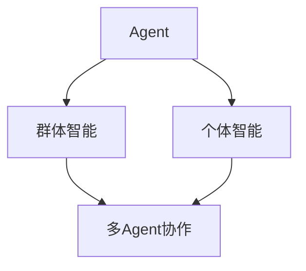
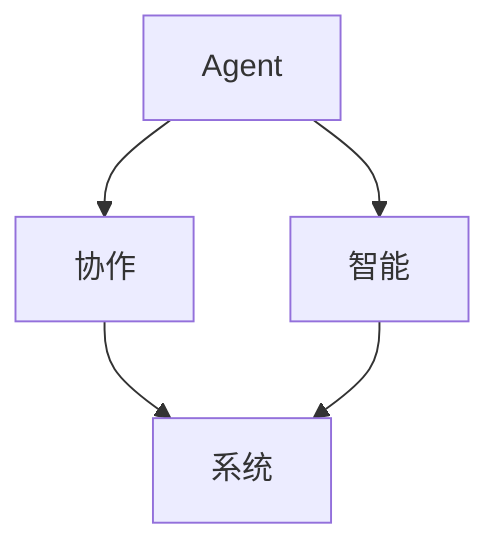
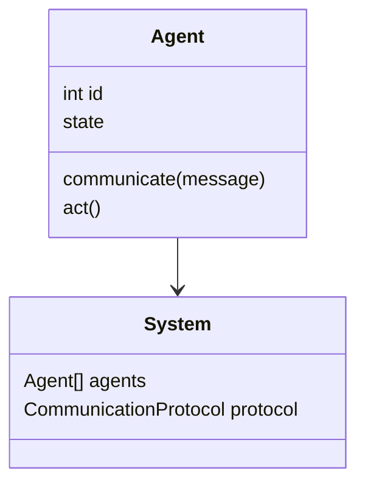
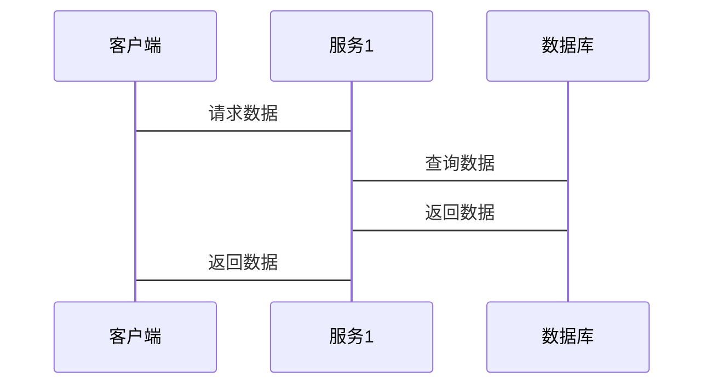

                 


# 《构建具有群体智能的多Agent协作系统》

> 关键词：多Agent系统，群体智能，协作机制，分布式计算，自组织网络，智能算法，系统架构设计

> 摘要：本文将详细介绍构建具有群体智能的多Agent协作系统的各个方面。从基本概念到算法原理，再到系统设计和项目实战，我们将逐步深入探讨如何利用多Agent协作和群体智能来构建高效、智能的分布式系统。通过丰富的案例分析和详细的代码实现，我们将帮助读者掌握这一领域的核心知识和实际应用。

---

# 第1章: 多Agent协作系统与群体智能的背景介绍

## 1.1 问题背景与问题描述

### 1.1.1 多Agent系统的发展背景

多Agent系统是一种分布式计算范式，通过多个智能体（Agent）协作完成复杂任务。近年来，随着分布式系统的广泛应用，多Agent系统在许多领域展现出巨大潜力。

### 1.1.2 群体智能的核心问题与挑战

群体智能研究如何通过个体Agent的协作实现复杂的群体行为。其核心问题包括自组织性、涌现性和分布式计算的高效性。

### 1.1.3 多Agent协作系统在现实中的应用需求

多Agent系统在物流、交通、能源等领域有广泛应用，特别是在需要分布式决策和协同操作的场景中。

## 1.2 问题解决与边界定义

### 1.2.1 多Agent协作的核心问题分析

包括通信机制、任务分配和冲突解决。

### 1.2.2 群体智能的边界与外延

定义了群体智能的范围和相关领域的区别。

### 1.2.3 多Agent协作系统的实现边界

明确了系统的输入、输出和交互方式。

## 1.3 群体智能与多Agent协作的概念结构

### 1.3.1 群体智能的基本概念

### 1.3.2 多Agent协作系统的组成要素

### 1.3.3 群体智能与多Agent协作的关系图解



---

# 第2章: 多Agent协作系统的核心概念与联系

## 2.1 多Agent系统的核心原理

### 2.1.1 Agent的基本定义与属性

Agent是具有感知和行动能力的实体。

### 2.1.2 多Agent系统中的通信机制

包括消息传递和协议设计。

### 2.1.3 多Agent协作的基本原理

通过协作完成复杂任务。

## 2.2 群体智能的关键特征

### 2.2.1 自组织性与涌现性

系统通过局部规则实现全局目标。

### 2.2.2 分布式计算与并行性

多个Agent并行计算，提高效率。

### 2.2.3 学习与适应性

系统能够根据环境变化自适应调整。

## 2.3 多Agent协作与群体智能的对比分析

### 2.3.1 对比特征表格

| 特性         | 多Agent协作       | 群体智能           |
|--------------|------------------|-------------------|
| 核心目标     | 协作完成任务     | 集体智能行为       |
| 智能分布     | 分散             | 分散             |
| 协调机制     | 显式通信         | 隐式规则         |

### 2.3.2 实体关系图（ER图）的 Mermaid 流程图



---

# 第3章: 多Agent协作系统的算法原理

## 3.1 群体智能的核心算法

### 3.1.1 分布式一致性算法

#### 3.1.1.1 基本原理

通过分布式协议实现系统一致性。

#### 3.1.1.2 典型算法

- **Raft一致性算法**：用于分布式系统中达成一致的领导节点。

### 3.1.2 分布式协调算法

#### 3.1.2.1 基于规则的协调

通过预定义规则实现Agent之间的协调。

#### 3.1.2.2 基于学习的协调

通过机器学习模型实现自适应协调。

### 3.1.3 智能体间的通信协议

#### 3.1.3.1 通信协议设计

定义消息格式和交互流程。

#### 3.1.3.2 协议实现

通过代码实现通信逻辑。

---

## 3.2 群体智能的数学模型与公式

### 3.2.1 分布式计算的数学模型

$$ P_i \rightarrow P_j \text{ 表示 Agent } i \text{ 发送消息给 } j $$

### 3.2.2 协作任务分配的公式

$$ C = \sum_{i=1}^{n} w_i x_i $$

### 3.2.3 群体智能的优化目标函数

$$ \min_{x} f(x) + \lambda g(x) $$

---

## 3.3 多Agent协作的实现代码

### 3.3.1 环境安装

```bash
pip install multi-agent
```

### 3.3.2 核心代码实现

```python
class Agent:
    def __init__(self, id):
        self.id = id
        self.state = 0

    def communicate(self, message):
        self.state = message

    def act(self):
        # 根据当前状态采取行动
        pass

# 初始化多个Agent
agents = [Agent(i) for i in range(5)]

# 初始化通信协议
protocol = CommunicationProtocol()

# 执行协作任务
for agent in agents:
    agent.act()
```

---

# 第4章: 多Agent协作系统的系统分析与架构设计

## 4.1 系统分析

### 4.1.1 问题场景介绍

以智能交通系统为例。

### 4.1.2 系统功能设计

设计包括路径规划、交通控制等模块。

### 4.1.3 领域模型设计

使用Mermaid类图展示系统模块。



---

## 4.2 系统架构设计

### 4.2.1 系统架构设计

使用Mermaid架构图展示系统结构。


---

## 4.3 系统接口设计

### 4.3.1 系统接口设计

定义Agent之间的通信接口。

### 4.3.2 系统交互流程

使用Mermaid序列图展示交互流程。



---

# 第5章: 多Agent协作系统的项目实战

## 5.1 项目实战

### 5.1.1 环境安装

```bash
pip install multi-agent
```

### 5.1.2 核心代码实现

```python
class Agent:
    def __init__(self, id):
        self.id = id
        self.state = 0

    def communicate(self, message):
        self.state = message

    def act(self):
        # 根据当前状态采取行动
        pass

# 初始化多个Agent
agents = [Agent(i) for i in range(5)]

# 初始化通信协议
protocol = CommunicationProtocol()

# 执行协作任务
for agent in agents:
    agent.act()
```

### 5.1.3 代码解读与分析

详细解释代码实现。

---

## 5.2 实际案例分析

### 5.2.1 案例分析

以智能交通系统为例，分析系统设计和实现。

### 5.2.2 详细讲解

通过实际案例深入剖析系统实现细节。

---

## 5.3 项目小结

总结项目实现的关键点和经验教训。

---

# 第6章: 多Agent协作系统的最佳实践

## 6.1 最佳实践 tips

### 6.1.1 代码设计 tips

注重模块化和可扩展性。

### 6.1.2 系统设计 tips

考虑可扩展性和可维护性。

### 6.1.3 优化 tips

通过优化通信协议和算法提高性能。

---

## 6.2 小结

总结全文，强调关键点。

---

## 6.3 注意事项

提醒读者注意潜在的误区和问题。

---

## 6.4 拓展阅读

推荐相关领域的书籍和论文。

---

# 作者：AI天才研究院/AI Genius Institute & 禅与计算机程序设计艺术 /Zen And The Art of Computer Programming

