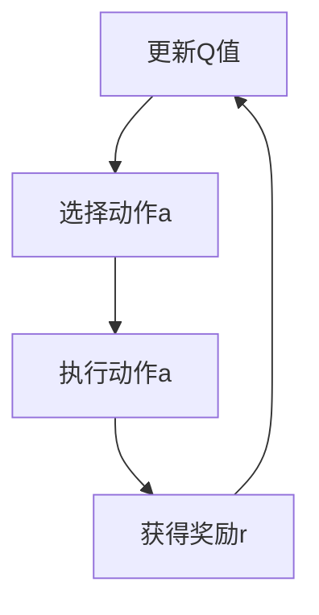
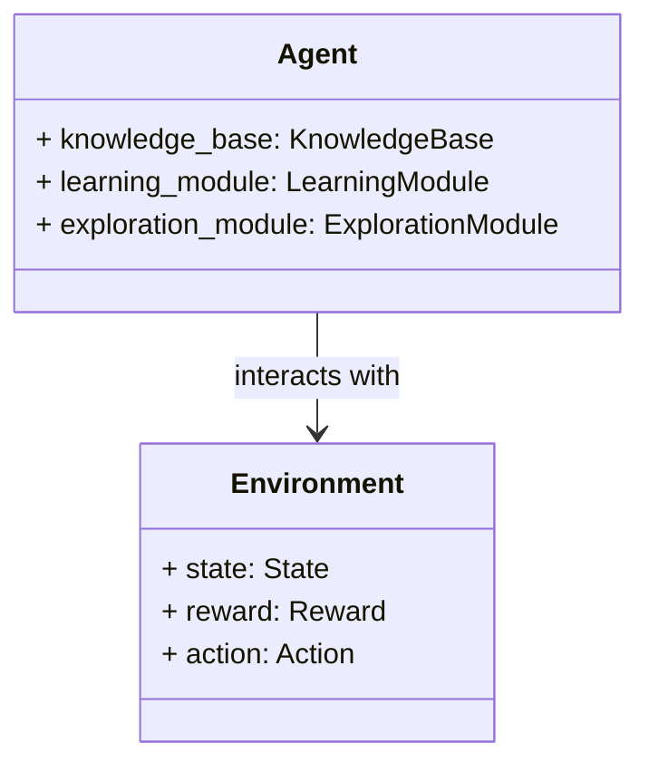
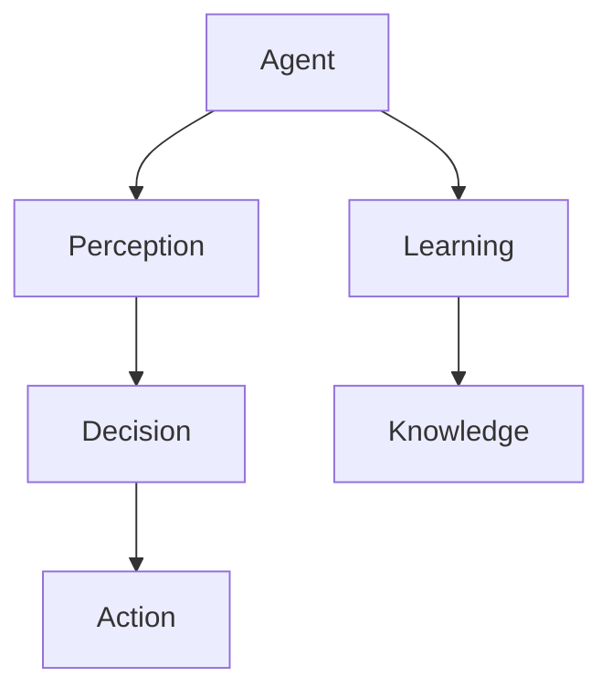
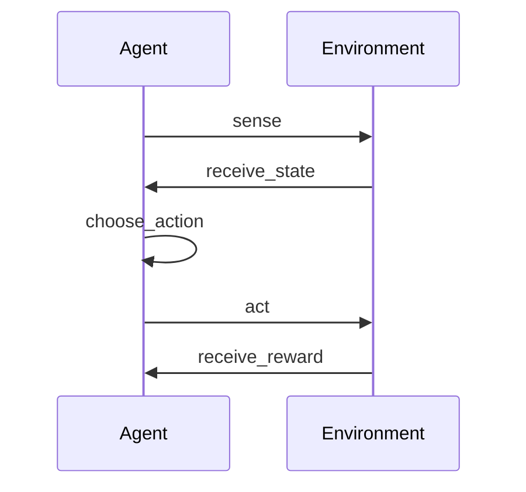

                 


# 构建具有自主学习与探索能力的AI Agent

## 关键词：AI Agent，自主学习，强化学习，知识图谱，系统架构

## 摘要：本文详细探讨了构建具有自主学习与探索能力的AI Agent的各个方面，包括核心概念、算法原理、系统架构设计以及实际项目实现。通过理论与实践相结合的方式，帮助读者理解如何设计和实现能够自主学习和适应复杂环境的智能体。

---

# 第一部分: 背景介绍

## 第1章: 自主学习与探索能力的AI Agent概述

### 1.1 问题背景
#### 1.1.1 传统AI的局限性
传统的AI系统通常依赖于预定义的规则和数据，难以应对动态变化和不确定性。例如，基于规则的专家系统在面对未见过的情况时往往表现不佳。

#### 1.1.2 自主学习与探索能力的重要性
为了使AI能够适应复杂和动态的环境，需要具备自主学习和探索能力，能够通过与环境的交互来改进自身的策略和知识。

#### 1.1.3 当前AI Agent的发展现状
当前，AI Agent在游戏AI、机器人和推荐系统等领域取得了显著进展，但仍面临如何在复杂环境中实现高效学习和探索的挑战。

### 1.2 问题描述
#### 1.2.1 自主学习与探索能力的定义
自主学习是指AI Agent能够通过与环境的交互，主动获取新知识并改进自身能力。探索能力则涉及在未知环境中寻找最优策略。

#### 1.2.2 问题解决的核心目标
构建一个能够自主学习和探索的AI Agent，使其能够在动态环境中实现目标，同时具备适应性和灵活性。

#### 1.2.3 边界与外延
AI Agent的自主学习能力通常在特定环境中实现，边界包括环境的动态性、资源限制以及学习目标。

### 1.3 概念结构与核心要素
#### 1.3.1 核心概念组成
- Agent：具备感知和行动能力的主体。
- 知识库：存储Agent的知识和经验。
- 学习模块：负责更新和扩展知识库。
- 探索模块：负责制定和执行探索策略。

#### 1.3.2 实体关系图（ER图）
```mermaid
er
    entity(Agent) {
        id
        knowledge_base
        learning_module
        exploration_module
    }
    entity(Environment) {
        state
        reward
        action
    }
    relationship(Agent, Environment, "interacts with")
```

---

# 第二部分: 核心概念与联系

## 第2章: 自主学习与探索能力的核心原理

### 2.1 动机与策略
#### 2.1.1 动机的定义与作用
动机是驱动Agent行动的内在动力，通常与奖励机制相关。

#### 2.1.2 策略的制定与优化
策略是Agent在特定状态下的行动选择，优化策略是实现高效探索的关键。

#### 2.1.3 动机与策略的关系
动机影响策略的选择，策略的执行又反过来影响动机的强度。

### 2.2 环境与交互
#### 2.2.1 环境的定义与分类
环境是Agent所处的外部世界，可以是静态、动态或随机的。

#### 2.2.2 Agent与环境的交互机制
通过感知和行动，Agent与环境进行信息交换，从而更新知识和策略。

#### 2.2.3 环境的动态性与不确定性
动态性使得环境的状态和奖励随时变化，不确定性增加了探索的难度。

### 2.3 知识表示与推理
#### 2.3.1 知识图谱的构建
知识图谱用于表示Agent的知识，包括实体、关系和属性。

#### 2.3.2 推理机制的实现
通过逻辑推理或概率推理，Agent能够从已知信息推导出新结论。

#### 2.3.3 知识表示的优化
优化知识图谱的结构和内容，以提高推理效率和准确性。

---

# 第三部分: 算法原理

## 第3章: 强化学习算法

### 3.1 Q-Learning算法
#### 3.1.1 算法原理
Q-Learning是一种基于值的强化学习算法，通过更新Q值表来学习最优策略。

#### 3.1.2 算法流程


#### 3.1.3 Python实现
```python
import numpy as np

class QLearning:
    def __init__(self, state_space, action_space, alpha=0.1, gamma=0.99):
        self.state_space = state_space
        self.action_space = action_space
        self.alpha = alpha
        self.gamma = gamma
        self.q_table = np.zeros((state_space, action_space))

    def choose_action(self, state, epsilon=0.1):
        if np.random.random() < epsilon:
            return np.random.randint(self.action_space)
        else:
            return np.argmax(self.q_table[state])

    def update_q_table(self, state, action, reward, next_state):
        current_q = self.q_table[state, action]
        next_max_q = np.max(self.q_table[next_state])
        target = reward + self.gamma * next_max_q
        self.q_table[state, action] = current_q + self.alpha * (target - current_q)
```

#### 3.1.4 数学模型
$$ Q(s, a) = Q(s, a) + \alpha [r + \gamma \max Q(s', a) - Q(s, a)] $$

---

# 第四部分: 系统分析与架构设计

## 第4章: 系统架构设计

### 4.1 问题场景介绍
描述AI Agent需要解决的具体问题和应用场景，例如智能助手、自动驾驶等。

### 4.2 系统功能设计
#### 4.2.1 领域模型


### 4.3 系统架构设计
#### 4.3.1 分层架构


### 4.4 接口与交互设计
#### 4.4.1 序列图


---

# 第五部分: 项目实战

## 第5章: 项目实现

### 5.1 环境安装
安装Python和相关库，例如numpy、pandas、scikit-learn等。

### 5.2 核心代码实现
实现AI Agent的核心功能，例如感知、决策和学习模块。

### 5.3 实际案例分析
通过具体案例，展示AI Agent在实际问题中的应用和效果。

### 5.4 项目小结
总结项目实现的关键点和经验教训。

---

# 第六部分: 最佳实践

## 第6章: 最佳实践与小结

### 6.1 实践小贴士
- 定期更新知识库
- 优化奖励机制
- 调整学习参数

### 6.2 注意事项
- 避免过拟化
- 确保环境的稳定性
- 处理好探索与利用的平衡

### 6.3 拓展阅读
推荐相关书籍和论文，供读者深入学习。

---

# 小结

本文详细探讨了构建具有自主学习与探索能力的AI Agent的各个方面，从理论到实践，为读者提供了全面的指导。通过本文的学习，读者可以掌握构建此类AI Agent的核心技术和方法。

---

# 作者

作者：AI天才研究院/AI Genius Institute  
禅与计算机程序设计艺术 /Zen And The Art of Computer Programming

