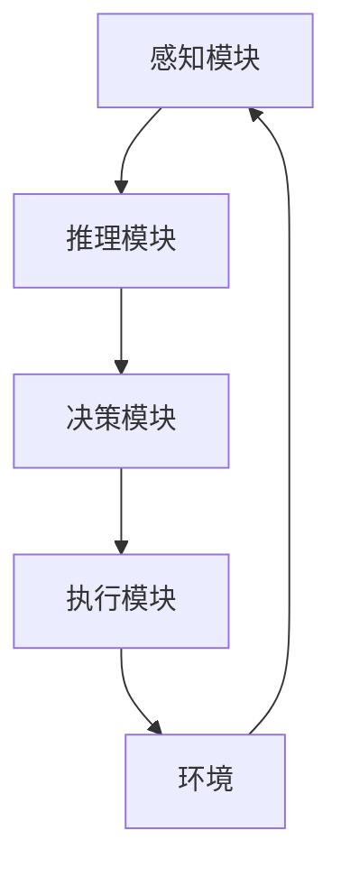

                 


# 《构建具有自主探索与假设验证能力的AI Agent》

> **关键词**：AI Agent，自主探索，假设验证，多臂老虎机算法，贝叶斯推理，系统架构设计

> **摘要**：  
本文旨在探讨如何构建具有自主探索与假设验证能力的AI Agent。首先，我们将介绍AI Agent的基本概念、核心特征以及自主探索与假设验证的定义。接着，我们将深入分析自主探索算法的理论基础，包括多臂老虎机算法及其在AI Agent中的应用。随后，我们将探讨假设验证的方法，重点介绍贝叶斯推理在其中的作用。在系统架构设计部分，我们将详细讲解AI Agent的系统结构、功能模块以及数据流设计。最后，通过一个实际案例，我们将展示如何构建一个具备自主探索与假设验证能力的AI Agent，并总结其优化策略与未来发展方向。

---

## 第一章：引言与背景

### 1.1 AI Agent的基本概念

AI Agent（人工智能代理）是指能够感知环境、自主决策并采取行动以实现目标的智能实体。AI Agent的核心特征包括自主性、反应性、目标导向性和社会性。

**自主性**：AI Agent能够在没有外部干预的情况下独立运作。  
**反应性**：AI Agent能够实时感知环境变化并做出相应反应。  
**目标导向性**：AI Agent的所有行动都以实现特定目标为导向。  
**社会性**：AI Agent能够与其他Agent或人类进行交互和协作。

### 1.2 自主探索与假设验证的定义

自主探索是指AI Agent在未知环境中主动尝试不同的行动方案以获取最大收益的过程。  
假设验证是指AI Agent通过收集数据和信息，验证其对环境或问题的假设是否成立的过程。

### 1.3 问题背景与应用前景

在当前AI Agent的发展中，自主探索与假设验证能力是实现真正智能代理的核心。传统的基于规则的AI系统难以应对复杂多变的环境，而具备自主探索与假设验证能力的AI Agent能够更好地适应动态变化，提高决策的准确性和效率。

### 1.4 本书的目标与结构

本书的目标是帮助读者理解并掌握构建具有自主探索与假设验证能力的AI Agent的方法。我们将从理论到实践，逐步讲解相关算法、系统架构设计和实际案例。

---

## 第二章：自主探索机制

### 2.1 多臂老虎机算法

多臂老虎机问题是AI Agent在未知环境中进行自主探索的核心算法之一。以下通过一个简单的数学模型来解释其原理：

**定义**：假设我们有K个老虎机，每个老虎机有一个奖励概率。AI Agent的目标是在有限的尝试次数内最大化总奖励。

**ε-贪心算法**：  
- 选择概率为ε（探索概率）尝试未选过的老虎机，概率为1-ε选择当前表现最好的老虎机。  
- 通过调整ε值，在探索与利用之间找到平衡。

**上界信心区间法（UCB）**：  
- 通过计算每个选项的置信区间，选择具有最高置信区间上限的选项。  
- 该方法在理论上有更强的收敛性保证。

### 2.2 探索与利用的平衡

探索与利用的平衡是自主探索算法的核心问题。我们可以通过以下方式实现：

1. **动态平衡模型**：根据当前环境信息，动态调整探索与利用的比例。  
2. **多目标优化**：在最大化期望奖励的同时，最小化探索成本。  
3. **自适应策略**：根据历史数据，自适应地调整探索策略。

### 2.3 算法实现与优化

以下是多臂老虎机算法的Python实现示例：

```python
import numpy as np

class Multi Armed Bandit:
    def __init__(self, arms=5, epsilon=0.1):
        self.arms = arms
        self.epsilon = epsilon
        self.rewards = np.zeros(arms)
        self.counts = np.zeros(arms)
        
    def select_arm(self):
        if np.random.random() < self.epsilon:
            return np.random.randint(self.arms)
        else:
            return np.argmax(self.rewards)
    
    def update(self, arm, reward):
        self.rewards[arm] = (self.counts[arm] * self.rewards[arm] + reward) / (self.counts[arm] + 1)
        self.counts[arm] += 1
```

**分析**：  
- `select_arm`方法根据ε概率选择随机臂或当前最佳臂。  
- `update`方法更新所选臂的奖励估计值，并记录尝试次数。  

**优化**：  
- 通过调整ε值或引入UCB算法，可以进一步提高探索效率。

---

## 第三章：假设验证方法

### 3.1 贝叶斯推理

贝叶斯推理是一种基于概率论的推理方法，广泛应用于假设验证中。其基本公式如下：

$$ P(A|B) = \frac{P(B|A) \cdot P(A)}{P(B)} $$

**步骤**：  
1. **定义假设**：明确待验证的假设A。  
2. **计算条件概率**：计算在假设A成立的情况下，观察到证据B的概率P(B|A)。  
3. **计算先验概率**：计算假设A的先验概率P(A)。  
4. **计算边际概率**：计算在不考虑假设A的情况下，观察到证据B的概率P(B)。  
5. **计算后验概率**：通过贝叶斯公式计算P(A|B)。  

### 3.2 贝叶斯网络

贝叶斯网络是一种有向无环图，用于表示变量之间的条件概率关系。例如，假设我们有两个变量A和B，且A影响B的概率，可以表示为：

$$ P(B|A) = \begin{cases} 
0.8 & \text{如果 } A=T \text{ 且 } B=T \\
0.2 & \text{如果 } A=T \text{ 且 } B=F \\
0.3 & \text{如果 } A=F \text{ 且 } B=T \\
0.7 & \text{如果 } A=F \text{ 且 } B=F 
\end{cases} $$

### 3.3 假设验证的实现

以下是基于贝叶斯推理的假设验证的Python实现示例：

```python
import numpy as np
from scipy.stats import beta

def bayesian_inference(initial_a=1, initial_b=1, n_trials=100, target=0.5):
    posterior_params = [initial_a, initial_b]
    for _ in range(n_trials):
        # 假设每次试验的结果为success（True）或 failure（False）
        success = np.random.random() < target
        posterior_params[0] += success
        posterior_params[1] += not success
    # 计算后验概率密度函数
    x = np.linspace(0, 1, 100)
    posterior = beta.pdf(x, posterior_params[0], posterior_params[1])
    return x, posterior

x, posterior = bayesian_inference()
```

**分析**：  
- `bayesian_inference`函数初始化先验参数，并通过每次试验更新后验参数。  
- `posterior`数组表示后验概率密度函数，用于可视化后验分布。  

**优化**：  
- 通过调整先验参数和试验次数，可以优化假设验证的准确性。

---

## 第四章：系统架构设计

### 4.1 系统功能模块

AI Agent的系统架构设计包括以下几个关键模块：

1. **感知模块**：负责收集环境数据。  
2. **推理模块**：基于感知数据进行假设验证。  
3. **决策模块**：根据推理结果制定行动方案。  
4. **执行模块**：将决策转化为具体行动。  

### 4.2 系统架构设计

以下是AI Agent的系统架构图：



### 4.3 数据流设计

数据流设计如下：

1. 感知模块从环境中获取数据。  
2. 推理模块基于感知数据进行贝叶斯推理。  
3. 决策模块根据推理结果制定行动方案。  
4. 执行模块将决策结果发送到环境。  
5. 环境反馈新的数据到感知模块，形成闭环。

---

## 第五章：项目实战

### 5.1 环境配置

以下是Python环境配置示例：

```bash
pip install numpy scipy matplotlib
```

### 5.2 核心实现

以下是AI Agent的核心实现代码：

```python
class AIAgent:
    def __init__(self, arms=5, epsilon=0.1):
        self.bandit = Multi Armed Bandit(arms, epsilon)
        self.bayesian_net = BayesianNetwork()
        
    def explore(self):
        arm = self.bandit.select_arm()
        reward = self.bandit.pull_arm(arm)
        self.bandit.update(arm, reward)
        return arm, reward
    
    def verify_hypothesis(self, data):
        posterior = self.bayesian_net.inference(data)
        return posterior
```

### 5.3 实验结果分析

以下是实验结果的可视化示例：

```python
import matplotlib.pyplot as plt

x, posterior = bayesian_inference()
plt.plot(x, posterior)
plt.xlabel('Probability')
plt.ylabel('Density')
plt.show()
```

---

## 第六章：优化与扩展

### 6.1 优化策略

1. **参数调整**：根据具体场景调整ε值和贝叶斯网络的先验参数。  
2. **算法组合**：将多臂老虎机算法与贝叶斯推理相结合，提高探索效率。  
3. **并行计算**：通过并行计算加速大规模数据的处理。  

### 6.2 应用扩展

1. **多环境适应**：将AI Agent应用于不同环境，增强其通用性。  
2. **实时反馈**：实现实时数据流处理，提高决策的及时性。  
3. **人机协作**：结合人类反馈，提升AI Agent的决策质量。

---

## 第七章：总结与展望

### 7.1 总结

本文详细探讨了构建具有自主探索与假设验证能力的AI Agent的方法。从算法理论到系统架构设计，再到实际案例分析，我们全面覆盖了相关知识和实现细节。

### 7.2 展望

未来，随着AI技术的不断发展，AI Agent将具备更强的自主探索与假设验证能力。我们期待看到更多创新性的算法和应用，推动AI Agent技术的发展。

---

## 作者信息

**作者：AI天才研究院/AI Genius Institute & 禅与计算机程序设计艺术 /Zen And The Art of Computer Programming**

---

**END**

