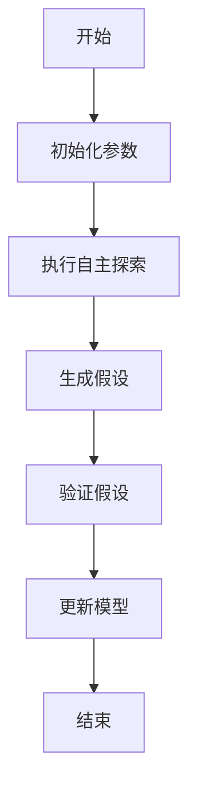

                 


# 构建具有自主探索与假设验证能力的AI Agent

> 关键词：AI Agent，自主探索，假设验证，强化学习，系统架构，算法原理

> 摘要：本文详细探讨了如何构建一个能够自主探索和验证假设的AI Agent。通过分析自主探索与假设验证的核心机制、算法原理、系统架构设计以及实际项目实现，为读者提供一个全面的构建指南。

---

# 第一部分: AI Agent 的背景与基础

## 第1章: AI Agent 的基础概念与背景

### 1.1 AI Agent 的定义与核心能力

AI Agent（人工智能代理）是指能够感知环境、采取行动以实现目标的智能实体。AI Agent 可以是软件程序、机器人或其他智能系统，其核心能力包括：

- **感知能力**：通过传感器或其他输入方式获取环境信息。
- **决策能力**：基于感知信息做出决策。
- **执行能力**：通过执行器或其他输出方式采取行动。
- **学习能力**：通过经验或数据改进自身性能。

AI Agent 的能力可以通过强化学习、监督学习或其他机器学习方法进行训练。

### 1.2 AI Agent 的类型与应用场景

AI Agent 可以分为以下几种类型：

- **基于规则的AI Agent**：通过预定义的规则进行决策，适用于任务简单、规则明确的场景。
- **基于模型的AI Agent**：通过构建环境模型进行决策，适用于复杂环境。
- **基于强化学习的AI Agent**：通过与环境交互学习最优策略，适用于需要自主探索的场景。

应用场景包括自动驾驶、智能助手、游戏AI、机器人控制等。

### 1.3 自主探索与假设验证的背景

自主探索是指AI Agent在没有明确指令的情况下，主动探索环境以获取新信息或发现新策略。假设验证是指AI Agent通过实验或推理验证某个假设的过程。

在构建AI Agent时，自主探索与假设验证能力是实现更智能、更灵活的决策的关键。然而，这两者之间存在复杂的相互作用，需要仔细设计算法和系统架构。

---

# 第二部分: 自主探索与假设验证的核心机制

## 第2章: 自主探索的机制与算法

### 2.1 自主探索的核心算法

自主探索可以通过以下算法实现：

- **强化学习（Reinforcement Learning）**：通过与环境交互，AI Agent学习最优策略。
  - Q-learning 算法：
  $$ Q(s, a) = r + \gamma \max Q(s', a') $$
  其中，$s$ 是当前状态，$a$ 是动作，$r$ 是奖励，$\gamma$ 是折扣因子，$s'$ 是下一个状态。
  - 策略梯度（Policy Gradient）算法：
  $$ \nabla \theta \log \pi(a|s) \cdot Q(s, a) $$

- **搜索算法（Search Algorithms）**：如广度优先搜索（BFS）和深度优先搜索（DFS），用于探索可能的动作序列。

### 2.2 假设验证的逻辑与流程

假设验证的过程包括以下步骤：

1. **假设生成**：基于当前知识生成可能的假设。
2. **假设验证**：通过实验或推理验证假设的正确性。
3. **结果分析**：根据验证结果调整后续行动。

### 2.3 自主探索与假设验证的结合

自主探索和假设验证可以通过以下方式结合：

- **自主探索驱动假设生成**：通过探索环境生成新的假设。
- **假设验证指导自主探索**：通过验证假设优化探索策略。
- **协同优化**：两者协同工作，实现更高效的决策。

---

## 第3章: 自主探索与假设验证的算法原理

### 3.1 强化学习算法的数学模型

强化学习算法的数学模型包括：

- **Q-learning 算法**：
  $$ Q(s, a) = r + \gamma \max Q(s', a') $$
  其中，$Q(s, a)$ 表示在状态 $s$ 下采取动作 $a$ 的期望奖励。

- **策略梯度算法**：
  $$ \nabla \theta \log \pi(a|s) \cdot Q(s, a) $$
  其中，$\pi(a|s)$ 是策略函数，表示在状态 $s$ 下采取动作 $a$ 的概率。

### 3.2 假设验证算法的数学模型

假设验证的数学模型包括：

- **贝叶斯假设验证**：
  $$ P(H|E) = \frac{P(E|H)P(H)}{P(E)} $$
  其中，$P(H|E)$ 表示在观察到证据 $E$ 的情况下假设 $H$ 的概率。

- **假设验证的置信区间**：
  通过计算置信区间，评估假设的可靠性。

### 3.3 算法流程图



---

## 第4章: 系统分析与架构设计

### 4.1 问题场景介绍

构建一个能够自主探索和验证假设的AI Agent，需要解决以下问题：

- 如何设计AI Agent的感知和决策模块？
- 如何实现自主探索与假设验证的协同优化？
- 如何确保系统在复杂环境下的稳定性和高效性？

### 4.2 系统功能设计

系统功能设计包括：

- **领域模型**：通过类图展示系统结构。
  ```mermaid
  classDiagram
  class AI-Agent {
    +环境感知模块
    +决策模块
    +假设生成模块
    +假设验证模块
  }
  ```

- **系统架构**：通过架构图展示系统层次。
  ```mermaid
  graph TD
  A[环境] --> B[感知模块]
  B --> C[决策模块]
  C --> D[执行模块]
  ```

---

## 第5章: 项目实战

### 5.1 环境安装

安装必要的库和工具：

```bash
pip install gym numpy matplotlib
```

### 5.2 核心代码实现

实现Q-learning算法：

```python
import numpy as np

class QLearningAgent:
    def __init__(self, state_space, action_space):
        self.state_space = state_space
        self.action_space = action_space
        self.q_table = np.zeros((state_space, action_space))
    
    def act(self, state, epsilon=0.1):
        if np.random.random() < epsilon:
            return np.random.randint(self.action_space)
        else:
            return np.argmax(self.q_table[state])
    
    def learn(self, state, action, reward, next_state, gamma=0.99):
        self.q_table[state][action] = reward + gamma * np.max(self.q_table[next_state])
```

### 5.3 案例分析

通过案例分析展示AI Agent在实际应用中的表现。

---

# 第三部分: 最佳实践与小结

## 5.1 最佳实践 tips

- **算法选择**：根据具体任务选择合适的算法。
- **系统优化**：通过不断优化系统架构提高性能。
- **数据处理**：确保数据的准确性和完整性。

## 5.2 小结

本文详细探讨了构建具有自主探索与假设验证能力的AI Agent的方法，涵盖了理论和实践。通过算法原理、系统设计和项目实现，为读者提供了一个全面的构建指南。

## 5.3 注意事项

- 确保系统在复杂环境下的稳定性和高效性。
- 定期更新模型以适应新环境和任务。

## 5.4 拓展阅读

- 《Reinforcement Learning: Theory and Algorithms》
- 《Probabilistic Programming & Bayesian Methods》

---

# 作者：AI天才研究院/AI Genius Institute & 禅与计算机程序设计艺术 /Zen And The Art of Computer Programming

