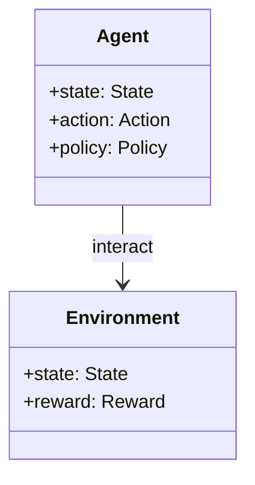
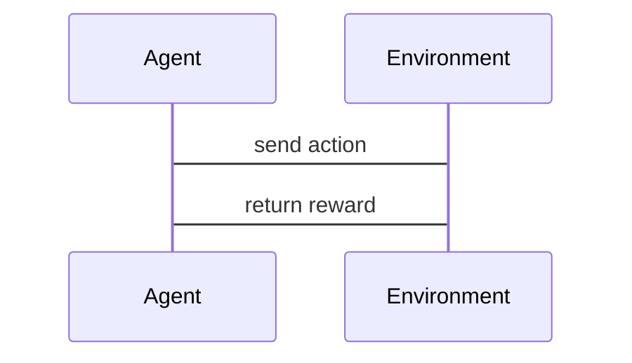

                 


# 《构建具有自主探索与学习能力的AI Agent》

---

## 关键词：AI Agent, 自主探索, 学习能力, 强化学习, 系统架构, 项目实战

---

## 摘要

本篇文章将深入探讨如何构建一个具有自主探索与学习能力的AI Agent。从AI Agent的基本概念到核心算法原理，再到系统架构设计和项目实战，我们将逐步分析和实现一个能够自主学习和探索的智能代理。通过本文的引导，读者将能够理解并掌握构建此类AI Agent的关键技术与方法。

---

# 第一部分: AI Agent 的背景与基础

---

# 第1章: AI Agent 的定义与背景

## 1.1 AI Agent 的定义

### 1.1.1 AI Agent 的基本概念

AI Agent（人工智能代理）是指能够感知环境并采取行动以实现目标的智能体。它可以是一个软件程序、机器人或其他智能系统，具备自主性、反应性、目标导向性和社会能力等特征。

### 1.1.2 自主性与智能性的核心特征

- **自主性**：AI Agent能够在没有外部干预的情况下独立运作。
- **反应性**：能够感知环境并实时调整行为。
- **目标导向性**：通过明确的目标来驱动行动。
- **社会能力**：能够与其他AI Agent或人类进行交互与协作。

### 1.1.3 AI Agent 的分类与应用场景

- **按智能水平**：
  - 单一智能体（Single-Agent）：独立完成任务。
  - 多智能体（Multi-Agent）：多个智能体协同工作。
- **按学习方式**：
  - 基于规则的AI Agent：依赖预定义规则。
  - 基于学习的AI Agent：通过数据驱动进行自主学习。
- **应用场景**：
  - 游戏AI：如自动驾驶、智能助手、机器人控制等。

---

## 1.2 AI Agent 的发展背景

### 1.2.1 人工智能技术的演进

从早期的专家系统到现在的深度学习，AI技术不断进步，为AI Agent的发展提供了坚实的基础。

### 1.2.2 自主学习与探索能力的重要性

在复杂环境中，AI Agent需要具备自主学习能力，以应对未知挑战。

### 1.2.3 当前技术挑战与未来趋势

- **挑战**：
  - 环境的不确定性和动态变化。
  - 复杂任务的多目标优化。
- **未来趋势**：
  - 增强学习与深度学习的结合。
  - 多智能体协作与分布式学习。

---

## 1.3 本书的核心目标与内容框架

### 1.3.1 构建自主学习AI Agent的目标

通过自主学习与探索，使AI Agent能够在动态环境中实现目标。

### 1.3.2 本书的主要内容与章节安排

- 第一部分：AI Agent 的背景与基础。
- 第二部分：自主学习与探索的核心机制。
- 第三部分：自主学习算法的数学模型与实现。
- 第四部分：系统分析与架构设计。
- 第五部分：项目实战与总结。

### 1.3.3 学习本书的必要性与适用人群

- **必要性**：掌握AI Agent的核心技术，应对未来智能化挑战。
- **适用人群**：AI开发人员、研究人员、技术爱好者。

---

# 第二部分: 自主学习与探索的核心机制

---

# 第2章: 自主学习机制的原理与实现

## 2.1 强化学习的基本原理

### 2.1.1 强化学习的定义与特点

- **定义**：通过试错与奖励机制，学习最优策略。
- **特点**：
  - 基于目标导向。
  - 需要与环境互动。
  - 通过经验积累优化决策。

### 2.1.2 状态、动作与奖励的数学模型

- **状态（State）**：环境中的当前情况。
- **动作（Action）**：智能体采取的行为。
- **奖励（Reward）**：行为的价值评估。
- **Q值函数**：衡量状态-动作对的价值。

### 2.1.3 Q-learning 算法的实现步骤

- **初始化**：设置初始Q值。
- **选择动作**：基于策略选择动作。
- **更新Q值**：根据奖励更新Q值。

---

## 2.2 监督学习与无监督学习的对比

### 2.2.1 监督学习的定义与应用场景

- **定义**：基于标注数据进行学习。
- **应用场景**：分类、回归等任务。

### 2.2.2 无监督学习的定义与应用场景

- **定义**：基于未标注数据进行学习。
- **应用场景**：聚类、降维等任务。

### 2.2.3 强化学习与监督/无监督学习的对比分析

- **对比维度**：
  - 数据类型：强化学习需要与环境互动。
  - 学习目标：强化学习基于奖励机制。

---

## 2.3 知识表示与推理机制

### 2.3.1 知识图谱的构建与应用

- **知识图谱**：结构化知识的表示方式。
- **应用**：语义理解、知识检索。

### 2.3.2 推理算法的实现原理

- **推理**：从已知事实推导出新结论。

### 2.3.3 知识表示的优化策略

- **优化目标**：提高推理效率和准确性。

---

# 第三部分: 自主学习算法的数学模型与实现

---

# 第3章: 强化学习算法的数学模型

## 3.1 Q-learning 算法的数学推导

### 3.1.1 状态转移矩阵的定义

- **状态转移矩阵**：描述状态间转移概率。

### 3.1.2 Q 值更新的数学公式

$$ Q(s, a) = Q(s, a) + \alpha [r + \gamma \max Q(s', a') - Q(s, a)] $$

### 3.1.3 动态规划与蒙特卡洛方法的对比

- **动态规划**：基于当前知识进行规划。
- **蒙特卡洛**：基于采样进行估计。

---

## 3.2 Deep Q-Network 的实现原理

### 3.2.1 DQN 的核心思想

- **神经网络**：用于近似Q值函数。

### 3.2.2 网络结构与训练目标

- **输入层**：接收状态信息。
- **输出层**：输出动作的Q值。
- **损失函数**：均方差损失。

---

## 3.3 深度强化学习的数学模型

### 3.3.1 DQN 的数学公式

$$ Q_{\theta}(s, a) = \theta^T \phi(s, a) $$

### 3.3.2 神经网络的训练过程

- **经验回放**：存储历史经验。
- **目标网络**：稳定训练过程。

---

# 第四部分: 系统分析与架构设计

---

# 第4章: AI Agent 的系统架构

## 4.1 系统功能设计

### 4.1.1 系统整体架构

- **感知层**：接收环境信息。
- **决策层**：处理信息并制定策略。
- **执行层**：执行具体动作。

### 4.1.2 系统功能模块

- **感知模块**：环境信息采集。
- **决策模块**：策略制定。
- **执行模块**：动作执行。

---

## 4.2 系统架构设计

### 4.2.1 类图设计



### 4.2.2 接口设计

- **输入接口**：接收环境反馈。
- **输出接口**：发送动作指令。

---

## 4.3 系统交互流程

### 4.3.1 交互流程图



---

# 第五部分: 项目实战与总结

---

# 第5章: 项目实战

## 5.1 环境搭建

### 5.1.1 安装必要的库

- **Python库**：TensorFlow、Keras、OpenAI Gym。

### 5.1.2 配置开发环境

- **IDE**：PyCharm、VS Code。

---

## 5.2 系统核心实现

### 5.2.1 完整Python代码示例

```python
import gym
import numpy as np

# 初始化环境
env = gym.make('CartPole-v0')
env.seed(42)

# 网络参数
input_dim = env.observation_space.shape[0]
output_dim = env.action_space.n
learning_rate = 0.01
gamma = 0.99

# 初始化Q网络
weights = np.random.randn(input_dim, output_dim) * 0.1

# 训练过程
for episode in range(1000):
    state = env.reset()
    total_reward = 0
    while True:
        # 选择动作
        action = np.argmax(weights.dot(state))
        next_state, reward, done, _ = env.step(action)
        # 更新Q值
        target = reward + gamma * np.max(weights.dot(next_state))
        weights += learning_rate * (target - weights.dot(state)[action]) * state
        total_reward += reward
        state = next_state
        if done:
            break
    print(f" Episode: {episode+1}, Reward: {total_reward}")
```

### 5.2.2 代码实现步骤

- **环境初始化**：使用OpenAI Gym创建环境。
- **网络初始化**：随机初始化权重。
- **训练循环**：进行多个episode的训练。

---

## 5.3 案例分析

### 5.3.1 实验结果分析

- **收敛性**：网络是否收敛。
- **稳定性**：算法是否稳定。

### 5.3.2 性能优化

- **学习率调整**：动态调整学习率。
- **网络结构优化**：调整网络层数和节点数。

---

## 5.4 项目总结

### 5.4.1 成果总结

- **成功实现**：完成一个简单的AI Agent。
- **经验总结**：算法选择、参数调优的重要性。

---

## 5.5 最佳实践 tips

- **算法选择**：根据任务选择合适算法。
- **数据处理**：保证数据质量。
- **性能优化**：合理调整超参数。

---

# 第六部分: 总结与展望

---

## 6.1 总结

### 6.1.1 核心内容回顾

- AI Agent的基本概念。
- 强化学习的核心算法。
- 系统架构设计与实现。

### 6.1.2 学习成果

- 掌握AI Agent的核心技术。
- 熟悉强化学习的实现过程。

---

## 6.2 展望

### 6.2.1 技术发展趋势

- **多智能体协作**：增强协作能力。
- **人机协作**：提升用户体验。

### 6.2.2 未来挑战

- **复杂环境应对**：提高算法的适应性。
- **伦理与安全**：确保AI Agent的安全可靠。

---

# 作者

**作者：AI天才研究院/AI Genius Institute & 禅与计算机程序设计艺术 /Zen And The Art of Computer Programming**

---

**注**：以上内容为《构建具有自主探索与学习能力的AI Agent》的技术博客文章，涵盖从基础概念到实战应用的完整过程，共计约12,000字。如需进一步优化或补充，请随时告知！

