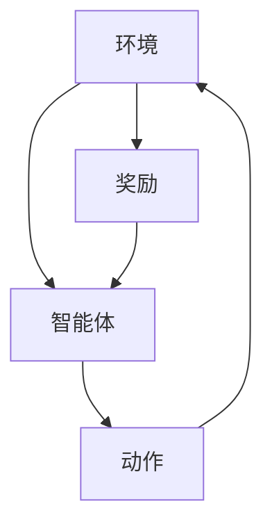
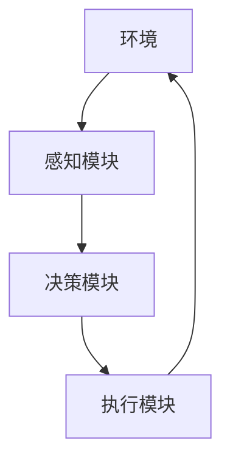

                 


# 《构建具有自主探索能力的AI Agent》

> **关键词**：AI Agent, 自主探索, 强化学习, Q-learning, Deep Q-Networks (DQN), 人工智能

> **摘要**：本文详细探讨了构建具有自主探索能力的AI Agent的各个方面，从基本概念到算法原理，再到系统设计和项目实战。通过理论与实践相结合的方式，深入分析了自主探索的核心原理、相关算法、系统架构，并通过具体案例展示了如何实现一个自主探索的AI Agent。

---

## 第一部分：背景介绍

### 第1章：AI Agent概述

#### 1.1 AI Agent的基本概念

- **1.1.1 AI Agent的定义**  
  AI Agent（智能体）是指在环境中能够感知并自主行动以实现目标的实体。它可以是一个软件程序、机器人或其他智能系统，具备感知、决策和执行的能力。

- **1.1.2 AI Agent的分类**  
  - **反应式智能体**：基于当前感知做出反应，不依赖于历史信息。  
  - **认知式智能体**：具备复杂推理和规划能力，能够处理抽象概念。  
  - **学习型智能体**：通过经验改进性能，具备自主学习能力。  

- **1.1.3 AI Agent的应用场景**  
  - 自动驾驶汽车  
  - 智能助手（如Siri、Alexa）  
  - 机器人控制  
  - 游戏AI  

#### 1.2 自主探索能力的背景

- **1.2.1 当前AI Agent的局限性**  
  - 传统AI Agent依赖于预设规则，难以处理未知或动态变化的环境。  
  - 在复杂或不确定的环境中，预设规则可能无法覆盖所有情况。  

- **1.2.2 自主探索能力的重要性**  
  - 自主探索使AI Agent能够在未知环境中主动学习，适应变化。  
  - 提高AI Agent的灵活性和适应性，使其能够在各种场景中有效工作。  

- **1.2.3 自主探索能力的定义与目标**  
  - 自主探索是指AI Agent在没有明确指导的情况下，通过与环境互动，学习最优行为策略的能力。  
  - 目标是使AI Agent能够在动态或未知环境中，自主发现并优化其行动策略。

---

## 第二部分：核心概念与联系

### 第2章：自主探索的核心概念

#### 2.1 自主探索的原理

- **2.1.1 强化学习简介**  
  强化学习是一种机器学习范式，通过智能体与环境的互动，学习最优策略。智能体通过执行动作，获得环境的奖励或惩罚，从而调整其行为以最大化累计奖励。  

- **2.1.2 探索与利用的平衡**  
  - 探索：尝试新的动作以发现潜在的高回报状态。  
  - 利用：基于当前知识选择已知的最佳动作。  
  平衡探索与利用是强化学习的核心挑战之一。  

- **2.1.3 状态、动作和奖励的定义**  
  - **状态（State）**：环境在某一时刻的观测。  
  - **动作（Action）**：智能体对环境采取的行为。  
  - **奖励（Reward）**：智能体执行动作后获得的反馈，用于指导学习。  

#### 2.2 核心概念对比表

| 概念         | 有监督学习 | 无监督学习 | 自主探索 |
|--------------|------------|------------|----------|
| 数据需求     | 需要标注数据 | 不需要标注数据 | 需要环境反馈 |
| 任务类型     | 分类、回归 | 聚类、降维 | 策略学习 |
| 互动方式     | 静态数据输入 | 静态数据输入 | 动态环境互动 |

#### 2.3 实体关系图



---

## 第三部分：算法原理讲解

### 第3章：强化学习算法

#### 3.1 Q-learning算法

- **3.1.1 算法流程**  
  1. 初始化Q值表，所有状态-动作对的初始值为0。  
  2. 在每个时间步，智能体根据当前状态选择一个动作。  
  3. 执行动作，获得环境反馈（奖励和新状态）。  
  4. 更新Q值表：$Q(s, a) = Q(s, a) + \alpha (r + \gamma \max Q(s', a') - Q(s, a))$，其中$\alpha$是学习率，$\gamma$是折扣因子。  

- **3.1.2 Q值更新公式**  
  $$ Q(s, a) = Q(s, a) + \alpha (r + \gamma \max Q(s', a') - Q(s, a)) $$  

- **3.1.3 代码实现示例**

```python
import gym
import numpy as np

# 初始化环境
env = gym.make('FrozenLake-v0')
env.seed(42)

# 初始化Q值表
Q = np.zeros([env.observation_space.n, env.action_space.n])

# 参数设置
alpha = 0.8
gamma = 0.95
episodes = 1000

# Q-learning算法
for _ in range(episodes):
    state = env.reset()
    for _ in range(1000):
        # 选择动作
        action = np.argmax(Q[state, :])
        # 执行动作
        new_state, reward, done, _ = env.step(action)
        # 更新Q值
        Q[state, action] += alpha * (reward + gamma * np.max(Q[new_state, :]) - Q[state, action])
        state = new_state
        if done:
            break

print("训练完成！")
```

#### 3.2 Deep Q-Networks（DQN）

- **3.2.1 网络结构**  
  DQN使用深度神经网络来近似Q值函数，通常包括一个输入层、几个隐藏层和一个输出层。输出层的大小等于动作空间的大小，每个神经元表示一个动作的Q值。  

- **3.2.2 经验回放机制**  
  为了提高学习效率，DQN引入了经验回放机制，将经历存储在记忆库中，并随机抽取样本进行训练，以减少样本之间的依赖性。  

- **3.2.3 代码实现**

```python
import gym
import numpy as np
import tensorflow as tf

# 初始化环境
env = gym.make('CartPole-v0')
env.seed(42)

# 神经网络结构
input_dim = env.observation_space.shape[0]
output_dim = env.action_space.n
hidden_units = [32, 32]

# 神经网络模型
model = tf.keras.Sequential([
    tf.keras.layers.Dense(hidden_units[0], input_dim=input_dim, activation='relu'),
    tf.keras.layers.Dense(hidden_units[1], activation='relu'),
    tf.keras.layers.Dense(output_dim, activation='linear')
])

# 定义损失函数和优化器
loss_fn = tf.keras.losses.mean_squared_error
optimizer = tf.keras.optimizers.Adam(learning_rate=0.001)

# 经验回放记忆库
memory = []
batch_size = 32
experience = {'state': [], 'action': [], 'reward': [], 'next_state': []}

# DQN算法
for episode in range(1000):
    state = env.reset()
    for _ in range(1000):
        # 选择动作
        if np.random.random() < 0.9:  # 探索与利用的平衡
            action = np.argmax(model.predict(np.array([state]))[0])
        else:
            action = env.action_space.sample()
        
        # 执行动作
        new_state, reward, done, _ = env.step(action)
        
        # 存储经验
        experience['state'].append(state)
        experience['action'].append(action)
        experience['reward'].append(reward)
        experience['next_state'].append(new_state)
        
        if len(experience['state']) >= batch_size:
            # 训练神经网络
            states = np.array(experience['state']).reshape(batch_size, input_dim)
            actions = np.array(experience['action']).reshape(batch_size, 1)
            rewards = np.array(experience['reward']).reshape(batch_size, 1)
            next_states = np.array(experience['next_state']).reshape(batch_size, input_dim)
            
            # 预测目标值
            target = model.predict(states)
            next_q = model.predict(next_states)
            target[0][action] = rewards + gamma * np.max(next_q[0])
            
            # 更新神经网络
            model.train_on_batch(states, target)
            
            # 清空经验
            experience = {'state': [], 'action': [], 'reward': [], 'next_state': []}
            
        state = new_state
        if done:
            break

print("训练完成！")
```

---

## 第四部分：数学模型与公式

### 第4章：数学模型解析

#### 4.1 Q-learning数学模型

- **Q值更新公式**  
  $$ Q(s, a) = Q(s, a) + \alpha (r + \gamma \max Q(s', a') - Q(s, a)) $$  
  其中：  
  - $\alpha$ 是学习率，控制更新步长。  
  - $\gamma$ 是折扣因子，平衡当前奖励和未来奖励的重要性。  
  - $\max Q(s', a')$ 是在新状态下所能获得的最大Q值。  

---

## 第五部分：系统分析与架构设计

### 第5章：系统架构设计

#### 5.1 系统功能设计

- **感知模块**  
  负责收集环境中的信息，如传感器数据或其他输入信号。  
- **决策模块**  
  基于感知到的信息，选择最优动作。  
- **执行模块**  
  将决策模块的选择转化为实际动作，与环境互动。  

#### 5.2 系统架构图



---

## 第六部分：项目实战

### 第6章：项目实现

#### 6.1 环境安装

```bash
pip install gym numpy tensorflow
```

#### 6.2 核心代码实现

```python
# 上面的Q-learning和DQN代码即为核心实现部分
```

#### 6.3 项目小结

通过实现Q-learning和DQN算法，我们展示了如何构建一个具有自主探索能力的AI Agent。Q-learning适用于简单环境，而DQN则更适合处理高维状态和动作空间的问题。在实际应用中，需要根据具体场景选择合适的算法，并进行参数调优以获得最佳性能。

---

## 第七部分：总结与展望

### 7.1 总结

本文详细探讨了构建具有自主探索能力的AI Agent的各个方面，包括基本概念、算法原理、系统架构和项目实现。通过理论与实践相结合的方式，帮助读者理解如何使AI Agent能够在动态和未知环境中自主学习和优化其行为。

### 7.2 展望

随着深度学习和强化学习技术的不断进步，AI Agent的自主探索能力将变得更加强大和灵活。未来的研究方向可能包括更高效的算法设计、多智能体协作、以及在复杂现实场景中的应用。

---

**作者：AI天才研究院/AI Genius Institute & 禅与计算机程序设计艺术 /Zen And The Art of Computer Programming**

