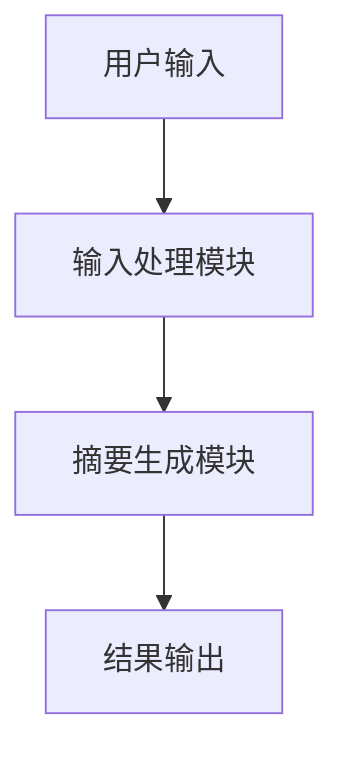

                 


# 构建具有自动摘要能力的AI Agent

## 关键词：AI Agent，自动摘要，自然语言处理，大模型，文本处理

## 摘要：本文将详细讲解如何构建一个具有自动摘要能力的AI Agent。从AI Agent的基本概念到自动摘要的核心原理，再到具体的算法实现和系统架构设计，文章将逐步深入，为读者提供一个全面的解决方案。通过分析问题背景、设计算法流程、实现代码示例以及优化建议，读者将能够掌握构建此类AI Agent的关键技术。

---

# 第一部分: AI Agent与自动摘要能力概述

## 第1章: AI Agent的基本概念与应用

### 1.1 AI Agent的定义与特点

AI Agent，即人工智能代理，是一种能够感知环境、自主决策并执行任务的智能系统。它具备以下特点：

1. **自主性**：能够独立执行任务，无需外部干预。
2. **反应性**：能够实时感知环境并做出反应。
3. **目标导向性**：以实现特定目标为导向。
4. **学习能力**：能够通过数据学习和优化自身性能。

### 1.2 自动摘要能力的重要性

自动摘要能力是AI Agent的核心功能之一，它能够让AI Agent快速从大量文本中提取关键信息，生成简洁的摘要。这种能力在信息检索、文本分析、知识管理等领域具有广泛的应用。

### 1.3 AI Agent与自动摘要的结合

AI Agent通过集成自动摘要技术，能够更高效地处理和分析文本信息，从而提升其整体智能水平。例如，在客服系统中，AI Agent可以通过自动摘要快速理解用户的问题，并生成相应的回答。

---

## 第2章: 自动摘要的核心原理与技术

### 2.1 自动摘要的定义与分类

自动摘要是指从一段或多段文本中，自动提取或生成关键信息，形成简短的摘要。根据生成方式的不同，自动摘要可以分为两类：

1. **抽取式摘要**：从原文中直接抽取关键词或句子，组合成摘要。
2. **生成式摘要**：通过模型生成新的文本作为摘要。

### 2.2 基于大模型的自动摘要技术

随着大模型（如GPT、BERT）的兴起，生成式摘要逐渐成为主流。大模型通过强大的语言理解和生成能力，能够生成高质量的摘要。

#### 2.2.1 大模型的文本生成原理

大模型通过预训练技术，学习了大量文本中的语义信息。在生成摘要时，模型会根据输入文本生成概率分布，选择最符合语义的词汇和句子。

#### 2.2.2 大模型的训练与优化

大模型的训练通常采用大规模数据集，并使用监督学习或无监督学习进行优化。生成摘要时，模型会通过交叉熵损失函数进行优化，以提高生成摘要的质量。

### 2.3 自动摘要的关键技术

#### 2.3.1 文本分词与预处理

在生成摘要之前，通常需要对文本进行分词和预处理，以便模型更好地理解文本内容。

#### 2.3.2 摘要生成的评估指标

常用的评估指标包括：

1. **ROUGE**：基于文本重叠度的评估指标。
2. **BLEU**：基于翻译质量的评估指标。
3. **BERTScore**：基于语言模型的评估指标。

---

# 第二部分: 自动摘要算法的实现与优化

## 第3章: 基于大模型的自动摘要算法

### 3.1 算法实现的流程

#### 3.1.1 模型选择与配置

选择合适的模型（如GPT-3）并进行参数配置。

#### 3.1.2 模型输入与输出

输入文本经过分词和编码后，送入模型进行处理，生成摘要。

#### 3.1.3 模型训练与推理

通过训练数据优化模型参数，使其能够生成高质量的摘要。

### 3.2 算法实现的代码示例

#### 3.2.1 环境配置

```python
import torch
from transformers import AutoTokenizer, AutoModelForSeq2Seq
```

#### 3.2.2 模型训练代码

```python
def train_model(model, optimizer, criterion, train_loader, epochs):
    for epoch in range(epochs):
        for inputs, labels in train_loader:
            outputs = model(inputs)
            loss = criterion(outputs, labels)
            optimizer.zero_grad()
            loss.backward()
            optimizer.step()
```

#### 3.2.3 模型推理代码

```python
def generate_summary(model, tokenizer, text):
    inputs = tokenizer.encode(text, return_tensors="pt")
    outputs = model.generate(inputs, max_length=100)
    summary = tokenizer.decode(outputs[0])
    return summary
```

### 3.3 算法优化与调优

#### 3.3.1 参数调整

调整模型的超参数（如学习率、批次大小）以优化性能。

#### 3.3.2 模型剪枝与压缩

通过模型剪枝和压缩技术，减少模型大小，提高推理速度。

---

## 第4章: 系统架构设计与实现

### 4.1 系统架构概述

AI Agent的系统架构通常包括以下模块：

1. **输入处理模块**：接收用户输入并进行预处理。
2. **摘要生成模块**：调用大模型生成摘要。
3. **输出模块**：将生成的摘要返回给用户或进行后续处理。

#### 4.1.1 系统功能设计

- **文本输入**：接收用户提供的文本内容。
- **摘要生成**：通过大模型生成摘要。
- **结果输出**：将摘要返回给用户或保存到数据库。

#### 4.1.2 系统架构图



### 4.2 系统实现细节

#### 4.2.1 输入处理模块

负责接收文本输入，并将其格式化为模型能够处理的形式。

#### 4.2.2 摘要生成模块

调用大模型生成摘要，并对生成结果进行优化。

#### 4.2.3 输出模块

将生成的摘要返回给用户或进行后续处理，如保存到数据库。

---

## 第5章: 项目实战与优化

### 5.1 项目实战

#### 5.1.1 项目需求

构建一个能够接收文本输入并生成摘要的AI Agent。

#### 5.1.2 项目实现

使用Python和大模型库（如Hugging Face Transformers）实现AI Agent。

#### 5.1.3 代码实现

```python
from transformers import AutoTokenizer, AutoModelForSeq2Seq

class AIAssistant:
    def __init__(self):
        self.tokenizer = AutoTokenizer.from_pretrained('facebook/bart-large')
        self.model = AutoModelForSeq2Seq.from_pretrained('facebook/bart-large')

    def generate_summary(self, text):
        inputs = self.tokenizer.encode(text, return_tensors="pt")
        outputs = self.model.generate(inputs, max_length=100)
        summary = self.tokenizer.decode(outputs[0])
        return summary

# 使用示例
assistant = AIAssistant()
text = "你的输入文本"
summary = assistant.generate_summary(text)
print(summary)
```

#### 5.1.4 代码解读

- **初始化**：加载预训练模型和分词器。
- **生成摘要**：将输入文本编码后送入模型，生成摘要。
- **返回结果**：将生成的摘要解码并返回。

### 5.2 优化建议

#### 5.2.1 模型优化

- 使用更小的模型（如BART-base）以减少资源消耗。
- 对模型进行微调，以适应特定领域的摘要需求。

#### 5.2.2 系统优化

- 并行处理：利用多线程或多进程提高处理效率。
- 缓存机制：缓存常用的摘要结果，减少重复计算。

---

## 第6章: 总结与展望

### 6.1 本章总结

本文详细讲解了如何构建一个具有自动摘要能力的AI Agent。从基本概念到算法实现，再到系统设计和优化，为读者提供了全面的指导。

### 6.2 未来展望

随着大模型技术的不断发展，AI Agent的自动摘要能力将更加智能化和多样化。未来的研究方向包括：

1. **多语言支持**：支持多种语言的文本摘要。
2. **动态调整**：根据上下文动态调整摘要内容。
3. **实时处理**：实现实时文本摘要功能。

---

## 作者：AI天才研究院/AI Genius Institute & 禅与计算机程序设计艺术 /Zen And The Art of Computer Programming

