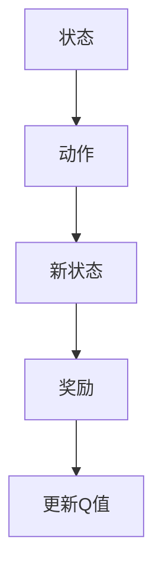
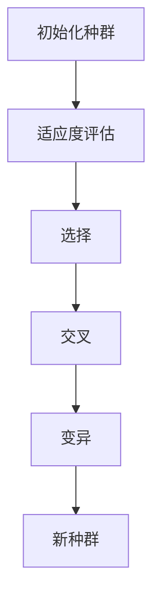
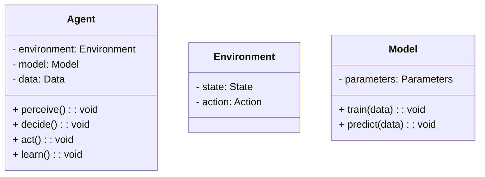
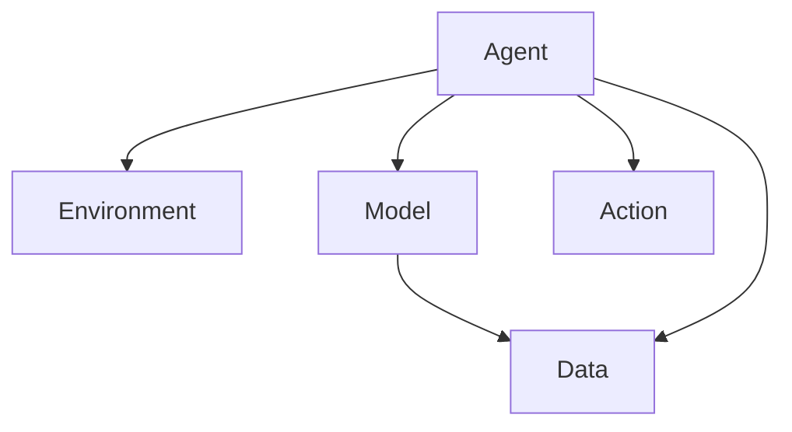
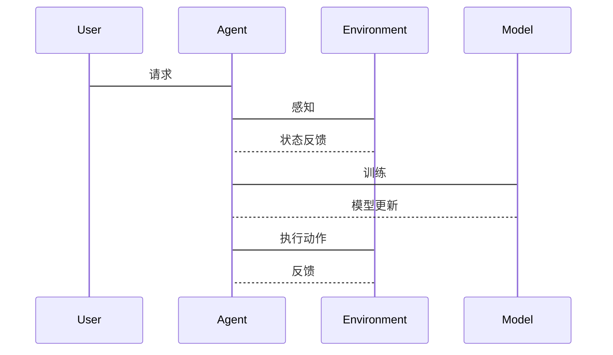

                 


# 《构建具有自动机器学习能力的AI Agent》

## 关键词：
- AI Agent
- 自动机器学习
- 强化学习
- 系统架构设计
- 项目实战

## 摘要：
本文详细介绍了如何构建一个具有自动机器学习能力的AI Agent，涵盖从背景概念到系统架构设计，再到项目实战的全过程。通过分析AI Agent的核心概念、自动机器学习的算法原理，以及系统架构设计，本文为读者提供了从理论到实践的全面指导。结合Python代码实现和实际案例分析，帮助读者掌握构建此类AI Agent的技术要点。

---

# 第1章: AI Agent与自动机器学习的背景

## 1.1 AI Agent的基本概念
### 1.1.1 AI Agent的定义
AI Agent（人工智能代理）是指能够感知环境并采取行动以实现目标的智能实体。它可以是一个软件程序、机器人或其他智能系统，具备自主决策和问题解决的能力。

### 1.1.2 AI Agent的分类与特点
AI Agent可以分为简单反射Agent和基于模型的反射Agent。简单反射Agent基于当前感知直接行动，而基于模型的反射Agent则会构建环境模型，进行规划和推理。AI Agent的特点包括自主性、反应性、目标导向和情境适应性。

### 1.1.3 AI Agent的应用场景
AI Agent广泛应用于自动驾驶、智能助手、机器人控制、游戏AI等领域。例如，自动驾驶汽车通过AI Agent实时感知环境并做出驾驶决策。

## 1.2 自动机器学习的背景
### 1.2.1 机器学习的演变
机器学习从传统机器学习到深度学习，再到自动机器学习（AutoML）的发展历程。AutoML旨在降低机器学习的门槛，使非专家也能轻松构建高效模型。

### 1.2.2 自动机器学习的定义
自动机器学习是通过自动化工具和算法，自动完成数据预处理、特征工程、模型选择和调优的过程，从而简化机器学习的实现。

### 1.2.3 自动机器学习的优势
AutoML的优势包括提高效率、降低门槛、增强可解释性。它使得机器学习技术能够更广泛地应用于各个行业。

## 1.3 AI Agent与自动机器学习的结合
### 1.3.1 结合的意义
AI Agent结合自动机器学习，能够实现自主学习和自适应，提升其在复杂环境中的决策能力和问题解决能力。

### 1.3.2 结合的技术挑战
主要挑战包括数据获取、算法复杂度、计算资源需求以及实时性要求。需要在AI Agent中集成高效的AutoML算法，以适应动态变化的环境。

### 1.3.3 结合的应用前景
未来，AI Agent将广泛应用于智能客服、智慧城市、智能家居等领域，通过自动学习不断提升自身的智能水平。

---

# 第2章: 核心概念与联系

## 2.1 核心概念原理
### 2.1.1 AI Agent的核心要素
AI Agent的核心要素包括感知、决策、行动和学习。感知环境、做出决策、执行行动，并通过学习不断优化自身的性能。

### 2.1.2 自动机器学习的核心算法
AutoML的核心算法包括遗传算法、强化学习和超参数优化。这些算法帮助AI Agent自动选择和优化模型。

### 2.1.3 两者的联系与区别
AI Agent与自动机器学习的联系在于，AI Agent通过自动机器学习提升自身的智能水平，而自动机器学习则为AI Agent提供更高效的决策算法。

## 2.2 核心概念对比表
### 表2.1 AI Agent与传统机器学习的对比
| 特性        | AI Agent                   | 传统机器学习             |
|-------------|-----------------------------|--------------------------|
| 自主性       | 高                          | 低                      |
| 反应性       | 强                          | 弱                      |
| 学习能力     | 强，支持在线学习            | 弱，通常需要重新训练      |

### 表2.2 自动机器学习与传统机器学习的对比
| 特性        | 自动机器学习                | 传统机器学习             |
|-------------|-----------------------------|--------------------------|
| 自动化程度   | 高                          | 低                      |
| 可用性       | 广泛                        | 有限                    |
| 开发效率     | 高                          | 低                      |

## 2.3 ER实体关系图
```mermaid
er
  actor: 用户
  agent: AI Agent
  model: 机器学习模型
  data: 数据
  action: 动作
  actor --> agent: 请求
  agent --> model: 训练
  model --> data: 输入
  model --> action: 输出
  agent --> action: 执行
```

---

# 第3章: 算法原理与实现

## 3.1 强化学习算法
### 3.1.1 强化学习的基本原理
强化学习通过智能体与环境的交互，学习策略以最大化累积奖励。主要组成部分包括环境、状态、动作、奖励和策略。

### 3.1.2 Q-learning算法
Q-learning是一种经典的强化学习算法，适用于离散状态和动作的空间。其核心是更新Q值表，公式为：
$$ Q(s,a) = Q(s,a) + \alpha (r + \gamma \max Q(s',a')) - Q(s,a) $$

### 3.1.3 算法流程图


## 3.2 遗传算法
### 3.2.1 遗传算法的基本步骤
遗传算法通过自然选择和遗传变异，寻找最优解。主要步骤包括初始化种群、适应度评估、选择、交叉和变异。

### 3.2.2 算法流程图


### 3.2.3 Python实现
```python
import random

def fitness(individual):
    # 计算适应度
    return sum(individual)

def evolve_population(population, fitness_func):
    # 适应度评估
    fitness_scores = [fitness(individual) for individual in population]
    # 选择
    selected = random.choices(population, weights=fitness_scores, k=len(population))
    # 交叉
    new_population = []
    for i in range(len(selected)//2):
        parent1 = selected[i]
        parent2 = selected[i+len(selected)//2]
        child1 = [max(p1, p2) for p1, p2 in zip(parent1, parent2)]
        child2 = [min(p1, p2) for p1, p2 in zip(parent1, parent2)]
        new_population.extend([child1, child2])
    return new_population

# 示例使用
initial_population = [[0,1,0], [1,0,1], [0,0,1], [1,1,1]]
evolved = evolve_population(initial_population, fitness)
print(evolved)
```

---

# 第4章: 系统分析与架构设计

## 4.1 问题场景介绍
构建一个AI Agent，能够通过自动机器学习技术，在动态变化的环境中自主学习和优化决策策略。

## 4.2 系统功能设计
### 4.2.1 领域模型设计


### 4.2.2 系统架构设计


### 4.2.3 接口设计
- Agent与Environment的交互接口：`perceive()`, `act()`
- Model与Data的交互接口：`train()`, `predict()`

### 4.2.4 交互流程


---

# 第5章: 项目实战

## 5.1 环境安装
安装所需的Python库，如TensorFlow、Keras、Scikit-learn等。

## 5.2 核心代码实现
### 5.2.1 强化学习实现
```python
import numpy as np

class Agent:
    def __init__(self, state_space, action_space):
        self.state_space = state_space
        self.action_space = action_space
        self.Q = np.zeros((state_space, action_space))

    def perceive(self, state):
        return self.Q[state]

    def decide(self, state):
        q = self.perceive(state)
        return np.argmax(q)

    def learn(self, state, action, reward):
        self.Q[state][action] += reward

# 示例使用
agent = Agent(5, 2)
agent.learn(0, 1, 1)
print(agent.Q)
```

### 5.2.2 自动机器学习实现
```python
from sklearn.model_selection import GridSearchCV
from sklearn.tree import DecisionTreeClassifier

def auto_ml(X, y):
    # 参数搜索
    param_grid = {'max_depth': [2,3,4]}
    clf = GridSearchCV(DecisionTreeClassifier(), param_grid)
    clf.fit(X, y)
    return clf.best_estimator_

X = [[1,0], [0,1], [1,1], [0,0]]
y = [0, 0, 1, 1]
model = auto_ml(X, y)
print(model)
```

## 5.3 实际案例分析
通过一个简单的游戏AI案例，展示AI Agent如何通过自动机器学习技术进行决策优化。

## 5.4 项目小结
总结项目实现的关键点，包括算法选择、系统设计和代码实现。

---

# 第6章: 最佳实践与小结

## 6.1 最佳实践 tips
- 合理选择算法和工具
- 注重系统架构设计
- 加强代码的可维护性

## 6.2 小结
构建具有自动机器学习能力的AI Agent是一个复杂但极具价值的挑战，需要结合AI Agent和AutoML的优势，通过系统的架构设计和高效的算法实现，才能构建出高效的智能系统。

## 6.3 注意事项
- 数据质量和多样性
- 算法的可扩展性
- 系统的安全性和稳定性

## 6.4 拓展阅读
推荐相关书籍和论文，帮助读者深入理解AI Agent和AutoML的技术细节和最新进展。

---

# 作者：
作者：AI天才研究院/AI Genius Institute  
联系邮箱：contact@aiagent.com

