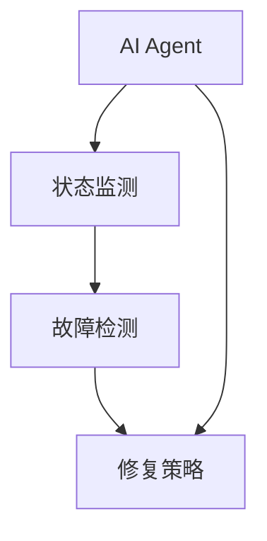
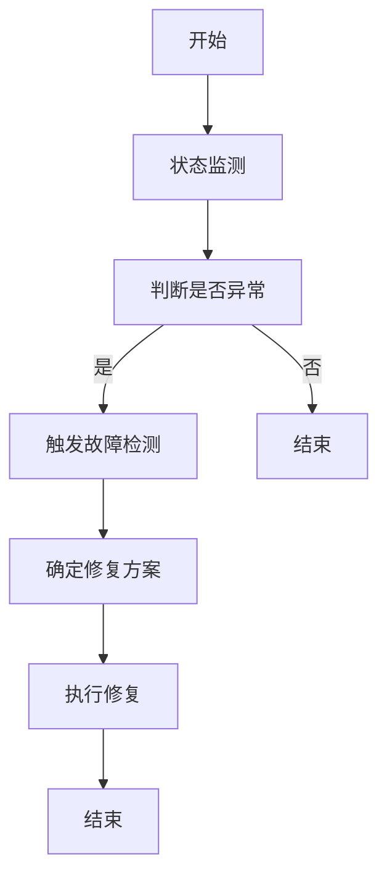
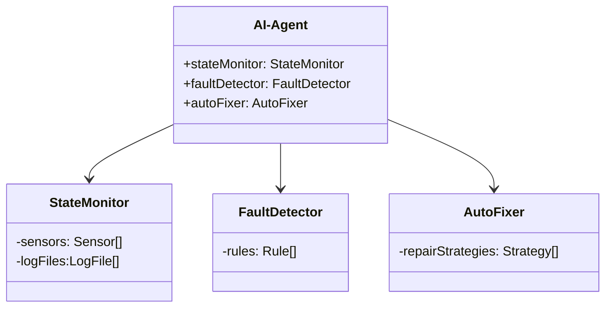
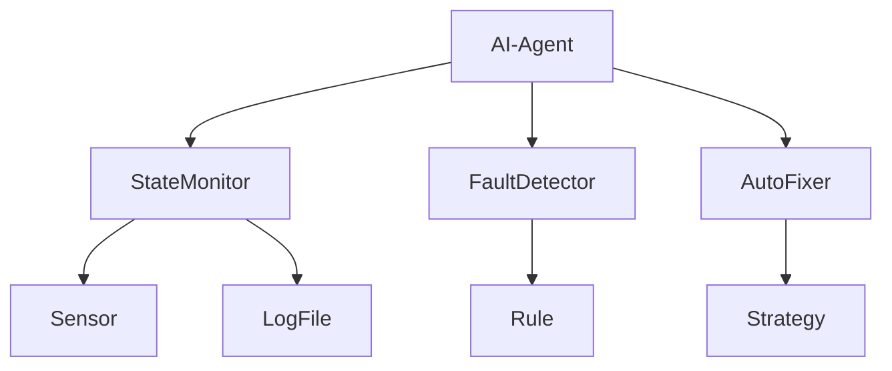
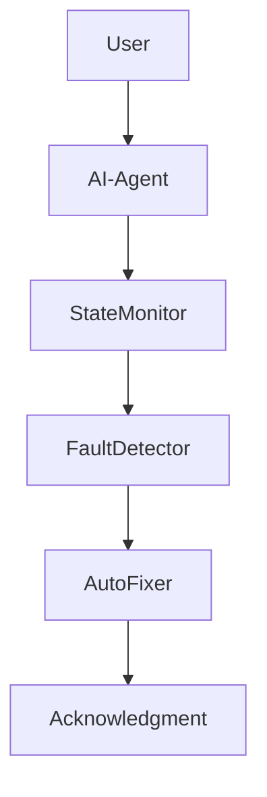

                 


# 构建具有自我修复能力的AI Agent

## 关键词：AI Agent，自我修复，人工智能，故障检测，自动修复，系统架构

## 摘要：  
在人工智能快速发展的今天，构建具有自我修复能力的AI Agent已成为提升系统可靠性和智能化的重要方向。本文从AI Agent的基本概念出发，详细探讨了自我修复机制的核心原理、算法实现、系统架构设计以及实际项目案例。通过结合理论与实践，本文为读者提供了构建自我修复AI Agent的全面指导。

---

# 第1章：AI Agent与自我修复概述

## 1.1 AI Agent的基本概念

### 1.1.1 AI Agent的定义与特点  
AI Agent（智能体）是指能够感知环境、自主决策并执行任务的智能系统。它具备以下特点：  
- **自主性**：无需外部干预，自主完成任务。  
- **反应性**：能够实时感知环境并做出反应。  
- **目标导向**：以明确的目标为导向进行决策。  

### 1.1.2 自我修复能力的定义  
自我修复能力是指AI Agent在运行过程中，能够自动检测和修复自身或所依赖系统的故障或异常状态的能力。  

### 1.1.3 自我修复AI Agent的应用场景  
- **自动驾驶**：实时检测车辆状态，修复传感器故障。  
- **智能家居**：自动修复设备连接问题。  
- **工业自动化**：实时监测设备状态，修复生产中的故障。  

## 1.2 自我修复AI Agent的核心价值  

### 1.2.1 提高系统的可靠性  
通过实时监测和自动修复，减少系统故障的可能性。  

### 1.2.2 降低维护成本  
自动化修复减少了人工干预的需求，降低了维护成本。  

### 1.2.3 提升用户体验  
用户无需手动处理问题，提升了使用体验。  

## 1.3 本章小结  
本章介绍了AI Agent的基本概念和自我修复能力的定义及其应用场景，强调了自我修复能力在提升系统可靠性、降低维护成本和改善用户体验方面的重要作用。

---

# 第2章：自我修复AI Agent的技术基础  

## 2.1 AI Agent的组成与功能  

### 2.1.1 感知层  
感知层负责采集环境数据，包括传感器数据、用户输入等。  

### 2.1.2 决策层  
决策层根据感知数据，通过算法做出决策。  

### 2.1.3 执行层  
执行层负责根据决策层的指令执行具体操作。  

## 2.2 自我修复机制的关键技术  

### 2.2.1 状态监测  
通过传感器或日志采集系统状态数据，实时监控系统运行状态。  

### 2.2.2 故障检测  
基于状态数据，使用算法检测系统故障。  

### 2.2.3 自动修复  
根据检测到的故障，自动执行修复操作或触发修复流程。  

## 2.3 相关技术基础  

### 2.3.1 机器学习基础  
机器学习算法用于模式识别和异常检测。  

### 2.3.2 自然语言处理  
用于理解和处理用户的自然语言输入。  

### 2.3.3 知识图谱  
用于构建系统的知识库，辅助决策。  

## 2.4 本章小结  
本章介绍了AI Agent的组成与功能，重点讲解了自我修复机制的关键技术，包括状态监测、故障检测和自动修复，并讨论了相关技术基础。

---

# 第3章：自我修复AI Agent的核心概念与联系  

## 3.1 核心概念原理  

### 3.1.1 状态监测的原理  
通过传感器或日志采集系统状态数据，实时监控系统运行状态。  

### 3.1.2 故障检测的原理  
基于状态数据，使用算法检测系统故障。  

### 3.1.3 自动修复的策略  
根据检测到的故障，自动执行修复操作或触发修复流程。  

## 3.2 核心概念属性特征对比表  

| 属性       | 自我修复AI Agent | 传统AI Agent |
|------------|------------------|--------------|
| 状态监测    | 高频实时监测     | 低频监测     |
| 故障检测    | 智能识别         | 简单阈值判断 |
| 自动修复    | 自动执行修复     | 手动修复     |

## 3.3 ER实体关系图  



## 3.4 本章小结  
本章详细讲解了自我修复AI Agent的核心概念及其与传统AI Agent的区别，并通过对比表和ER实体关系图展示了系统架构的核心要素。

---

# 第4章：自我修复AI Agent的算法原理  

## 4.1 算法原理概述  

### 4.1.1 状态监测算法  
通过传感器或日志采集系统状态数据，实时监控系统运行状态。  

### 4.1.2 故障检测算法  
基于状态数据，使用算法检测系统故障。  

### 4.1.3 自动修复算法  
根据检测到的故障，自动执行修复操作或触发修复流程。  

## 4.2 算法流程图  



## 4.3 数学模型与公式  

### 4.3.1 状态监测模型  
$$ P(state) = \sum_{i=1}^{n} w_i \cdot x_i $$
其中，$w_i$ 是权重，$x_i$ 是状态特征。  

### 4.3.2 故障检测模型  
$$ D(failure) = \theta \cdot s + b $$
其中，$\theta$ 是斜率，$s$ 是状态向量，$b$ 是偏置。  

## 4.4 本章小结  
本章详细讲解了自我修复AI Agent的算法原理，包括状态监测、故障检测和自动修复的算法流程，并通过数学模型和公式展示了实现过程。

---

# 第5章：系统架构与设计  

## 5.1 问题场景介绍  
构建一个具有自我修复能力的AI Agent，需要考虑系统的实时性、可靠性和可扩展性。  

## 5.2 系统功能设计  

### 5.2.1 领域模型  


### 5.2.2 系统架构设计  


### 5.2.3 系统接口设计  
- **状态监测接口**：提供系统状态数据。  
- **故障检测接口**：返回故障类型。  
- **自动修复接口**：执行修复操作。  

## 5.3 系统交互设计  



## 5.4 本章小结  
本章详细讲解了系统架构与设计，包括领域模型、系统架构图和系统交互图，展示了如何构建一个具有自我修复能力的AI Agent。

---

# 第6章：项目实战：构建一个简单的自我修复AI Agent  

## 6.1 环境安装  
- 安装Python和必要的库（如TensorFlow、NumPy）。  

## 6.2 核心实现  

### 6.2.1 状态监测  
```python
class StateMonitor:
    def __init__(self, sensors):
        self.sensors = sensors

    def monitor(self):
        return [s.measure() for s in self.sensors]
```

### 6.2.2 故障检测  
```python
class FaultDetector:
    def __init__(self, rules):
        self.rules = rules

    def detect(self, state):
        for rule in self.rules:
            if rule.check(state):
                return rule.get_fault()
        return None
```

### 6.2.3 自动修复  
```python
class AutoFixer:
    def __init__(self, strategies):
        self.strategies = strategies

    def fix(self, fault):
        for strategy in self.strategies:
            if strategy.applies_to(fault):
                strategy.apply()
                return
```

## 6.3 代码应用与分析  
通过代码实现状态监测、故障检测和自动修复功能，展示系统的自我修复能力。  

## 6.4 实际案例分析  
以智能家居为例，展示如何通过代码实现设备的自我修复。  

## 6.5 本章小结  
本章通过实际项目案例，详细讲解了如何构建一个简单的自我修复AI Agent，并展示了代码实现和实际应用。

---

# 第7章：最佳实践与小结  

## 7.1 最佳实践  

### 7.1.1 系统设计  
- 采用模块化设计，便于维护和扩展。  

### 7.1.2 故障检测  
- 使用多种算法进行故障检测，提高准确性。  

### 7.1.3 修复策略  
- 根据故障类型选择合适的修复策略。  

## 7.2 小结  
本文详细讲解了构建具有自我修复能力的AI Agent的全过程，从理论到实践，为读者提供了全面的指导。  

## 7.3 注意事项  
- 确保系统的实时性和可靠性。  
- 定期更新修复策略和算法，以应对新问题。  

## 7.4 拓展阅读  
建议读者深入学习机器学习和自然语言处理技术，以提升AI Agent的智能性。  

## 7.5 本章小结  
本章总结了构建自我修复AI Agent的最佳实践，提出了开发过程中的注意事项，并推荐了拓展阅读的方向。

---

# 附录：参考文献与工具推荐  

## 附录A：参考文献  
- [1] Russell S, Norvig P. Artificial Intelligence: A Modern Approach[M]. Pearson Education, 2010.  
- [2] LeCun Y, Bengio Y, Hinton G. Deep learning[J]. Nature, 2015, 521(7552): 436-444.  

## 附录B：工具推荐  
- **Python**：用于AI Agent的开发。  
- **TensorFlow**：用于机器学习模型的训练。  
- **Mermaid**：用于绘制系统架构图和流程图。  

---

# 作者：AI天才研究院 & 禅与计算机程序设计艺术

通过本文，读者可以系统地了解构建具有自我修复能力的AI Agent的全过程，从理论到实践，为实际应用提供了宝贵的指导和参考。

