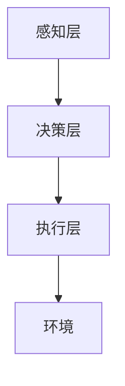

                 

# 《构建具有自我演化能力的AI Agent系统》

## 关键词：自我演化、AI Agent、强化学习、进化算法、系统架构

## 摘要：  
本文详细探讨了构建具有自我演化能力的AI Agent系统的各个方面，从基础概念到核心算法，再到系统设计和实际应用。文章首先介绍了自我演化AI Agent的定义、背景及其重要性，随后深入分析了其核心技术基础，包括机器学习、进化算法和知识表示。接着，详细讲解了自我演化机制的数学模型和核心算法，如强化学习和遗传算法。然后，通过系统架构设计、模块设计和接口设计，展示了如何构建一个高效的自我演化AI Agent系统。最后，通过项目实战和实际案例分析，验证了系统的可行性和效果，并对未来的发展方向进行了展望。

---

# 第一部分: 自我演化AI Agent系统背景与基础

## 第1章: 自我演化AI Agent概述

### 1.1 自我演化AI Agent的定义与核心概念

#### 1.1.1 自我演化AI Agent的定义  
自我演化AI Agent是一种能够通过环境反馈不断优化自身行为和决策能力的人工智能系统。与传统AI Agent不同，它具备自主学习和适应环境变化的能力，能够在动态复杂的环境中持续改进。

#### 1.1.2 自我演化的核心机制  
自我演化的核心机制包括：
- **环境感知**：通过传感器或接口获取环境信息。
- **决策推理**：基于当前状态和历史经验做出决策。
- **行为执行**：将决策转化为具体行动。
- **反馈学习**：根据环境反馈调整行为策略。

#### 1.1.3 自我演化与传统AI Agent的区别  
传统AI Agent通常依赖于预设规则或固定的学习模型，而自我演化AI Agent能够根据环境动态调整策略，具备更强的适应性和自主性。

### 1.2 自我演化AI Agent的背景与应用前景

#### 1.2.1 当前AI Agent技术的发展现状  
AI Agent技术已在多个领域取得显著进展，如自动驾驶、智能助手、机器人控制等，但大多数系统仍依赖于固定的规则或有限的训练数据。

#### 1.2.2 自我演化能力的重要性  
自我演化能力使AI Agent能够应对未知或动态变化的环境，提升系统的鲁棒性和适应性。

#### 1.2.3 自我演化AI Agent在实际场景中的应用  
- **自动驾驶**：在复杂交通环境中实时调整驾驶策略。
- **智能助手**：根据用户行为动态优化交互方式。
- **机器人控制**：在动态环境中自主调整动作策略。

## 第2章: 自我演化AI Agent的技术基础

### 2.1 机器学习基础

#### 2.1.1 监督学习、无监督学习与强化学习  
- **监督学习**：基于标记数据进行分类或回归。
- **无监督学习**：从无标记数据中发现模式。
- **强化学习**：通过与环境交互获得奖励，优化决策策略。

#### 2.1.2 神经网络与深度学习简介  
神经网络（如CNN、RNN）和深度学习技术为AI Agent提供了强大的特征提取和决策能力。

### 2.2 进化算法与自适应系统

#### 2.2.1 进化算法的基本原理  
进化算法模拟自然选择和遗传机制，通过变异、选择和交叉操作优化解空间。

#### 2.2.2 自适应系统的核心思想  
自适应系统能够根据环境反馈动态调整自身的参数或结构，以提高性能。

#### 2.2.3 自我演化机制与进化算法的关系  
自我演化机制可以看作是进化算法的一种应用，通过不断优化行为策略实现系统的自我改进。

### 2.3 知识表示与推理

#### 2.3.1 知识图谱与符号推理  
知识图谱提供了一种结构化的知识表示方式，符号推理则通过逻辑规则进行推理。

#### 2.3.2 基于深度学习的知识表示  
深度学习模型（如BERT）能够从大量数据中学习到丰富的语义信息。

#### 2.3.3 推理引擎与决策过程  
推理引擎将知识表示与环境信息结合，生成决策指令。

---

# 第二部分: 自我演化AI Agent的核心概念与原理

## 第3章: 自我演化机制的数学模型

### 3.1 自我演化模型的构建

#### 3.1.1 状态空间与动作空间的定义  
- **状态空间**：所有可能的状态集合。
- **动作空间**：所有可能的动作集合。

#### 3.1.2 环境模型的构建  
环境模型描述了状态、动作和奖励之间的关系。

### 3.2 基于强化学习的自我演化算法

#### 3.2.1 强化学习的基本公式  
即时奖励公式：
$$ R = r_t \text{ 表示即时奖励} $$
价值函数公式：
$$ V(s) \text{ 表示状态 } s \text{ 的价值函数} $$

#### 3.2.2 自我演化中的策略优化  
策略优化公式：
$$ \theta_{t+1} = \theta_t + \alpha \nabla J(\theta_t) $$
其中，$\alpha$ 是学习率，$\nabla J(\theta_t)$ 是目标函数的梯度。

### 3.3 自我演化机制的数学推导

#### 3.3.1 状态转移概率矩阵的构建  
状态转移概率矩阵描述了从一个状态转移到另一个状态的概率。

#### 3.3.2 奖励函数的设计与优化  
奖励函数的设计直接影响AI Agent的决策策略。

---

## 第4章: 自我演化机制的核心算法

### 4.1 基于遗传算法的自我演化

#### 4.1.1 遗传算法的基本流程  
遗传算法流程如下：
1. 初始化种群。
2. 计算适应度。
3. 选择优秀个体。
4. 进行交叉和变异。
5. 重复步骤2-4直到满足终止条件。

#### 4.1.2 自我演化中的基因编码与变异  
基因编码将策略表示为遗传算法的个体，变异操作用于引入多样性。

### 4.2 基于强化学习的自我演化

#### 4.2.1 强化学习在自我演化中的应用  
强化学习用于优化AI Agent的策略。

#### 4.2.2 多智能体协作的强化学习  
多智能体协作通过分布式强化学习实现。

---

# 第三部分: 自我演化AI Agent的系统架构与设计

## 第5章: 自我演化AI Agent的系统架构设计

### 5.1 系统整体架构

#### 5.1.1 系统架构设计  
系统架构包括感知层、决策层和执行层。

#### 5.1.2 系统架构图（mermaid）  

### 5.2 模块设计

#### 5.2.1 环境感知模块  
环境感知模块负责获取环境信息。

#### 5.2.2 决策推理模块  
决策推理模块基于感知信息生成决策。

#### 5.2.3 行为执行模块  
行为执行模块将决策转化为具体动作。

---

## 第6章: 自我演化AI Agent的项目实战与应用

### 6.1 环境搭建

#### 6.1.1 开发环境安装  
安装Python、TensorFlow、Keras等工具。

#### 6.1.2 代码实现  
实现自我演化AI Agent的核心算法。

---

## 第7章: 自我演化AI Agent的扩展与未来展望

### 7.1 未来研究方向

#### 7.1.1 更复杂的环境建模  
提升环境建模的精度和复杂度。

#### 7.1.2 多智能体协作优化  
优化多智能体协作机制。

### 7.2 最佳实践 tips

#### 7.2.1 系统设计中的注意事项  
确保系统的可扩展性和可维护性。

#### 7.2.2 实验与验证  
通过大量实验验证系统的性能。

---

# 作者：AI天才研究院/AI Genius Institute & 禅与计算机程序设计艺术 /Zen And The Art of Computer Programming

