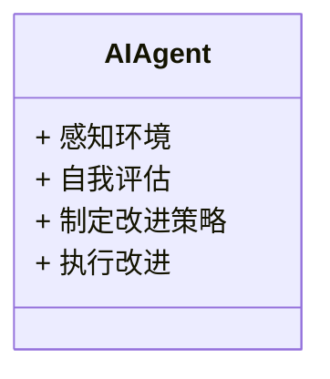
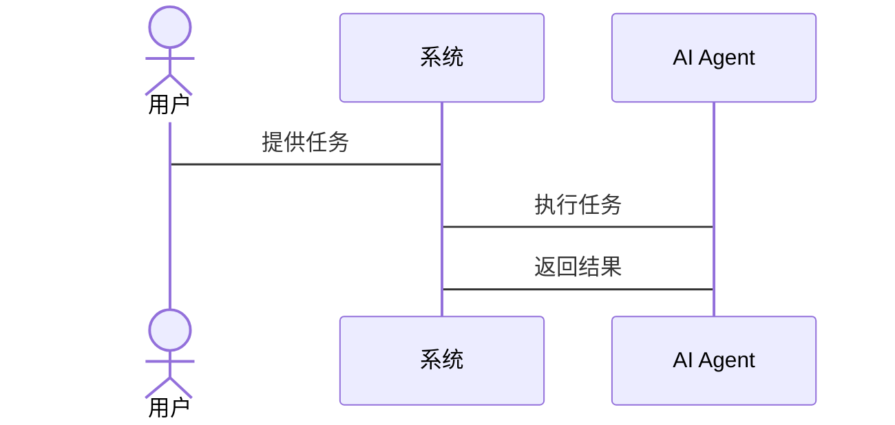

                 


# 构建具有自我评估与改进能力的AI Agent

> 关键词：AI Agent, 自我评估, 改进能力, 系统架构, 机器学习, 自适应算法

> 摘要：本文探讨了如何构建一个具有自我评估与改进能力的AI Agent。通过分析AI Agent的核心功能、自我评估与改进机制、算法原理、系统架构设计以及实际项目实现，本文详细阐述了构建这样一个AI Agent的完整过程。文章还提供了最佳实践建议和未来研究方向。

---

## 第一部分: 背景与概述

### 第1章: 自我评估与改进AI Agent的背景与问题描述

#### 1.1 问题背景
人工智能（AI）技术的快速发展使得AI Agent在各个领域的应用越来越广泛。然而，现有的AI Agent往往依赖于静态的规则或固定的训练数据，缺乏动态调整和优化的能力。在实际应用中，AI Agent需要面对复杂多变的环境，如何让AI Agent具备自我评估与改进能力，成为提升其智能性和适应性的关键。

#### 1.2 问题描述
AI Agent的核心功能包括感知环境、决策、执行和反馈。然而，现有的AI Agent通常缺乏对自身性能的动态评估能力，无法根据反馈结果进行自我优化。例如，在自然语言处理任务中，当AI Agent生成的响应不准确时，它需要能够识别错误并调整生成策略。这种自我评估与改进能力是实现更智能、更适应性更强的AI Agent的关键。

#### 1.3 问题解决思路
为了实现AI Agent的自我评估与改进能力，我们需要从以下几个方面入手：
1. **自我评估机制**：设计一种方法，使AI Agent能够评估自身的性能。
2. **改进策略**：根据评估结果，动态调整AI Agent的行为策略。
3. **反馈循环**：建立一个闭环系统，将改进后的策略重新应用到实际场景中，并持续评估。

---

## 第2章: 自我评估与改进AI Agent的核心概念

### 2.1 自我评估与改进机制
#### 2.1.1 自我评估的定义与实现方式
自我评估是指AI Agent对自身的性能进行测量和分析的过程。常见的实现方式包括：
- **基于任务完成度的评估**：例如，计算AI Agent在任务中的准确率、响应速度等指标。
- **基于用户反馈的评估**：通过用户的交互反馈，评估AI Agent的表现。
- **基于内部状态的评估**：通过分析AI Agent的内部状态，评估其推理和决策能力。

#### 2.1.2 改进策略的核心原理
改进策略是根据评估结果，调整AI Agent的行为参数或算法模型的过程。例如：
- **参数调整**：动态调整模型的超参数，以优化性能。
- **算法改进**：引入新的算法或优化现有算法，以提高任务完成效率。
- **经验迁移**：将之前任务中的经验迁移到新的任务中。

#### 2.1.3 自我评估与改进的循环过程
自我评估与改进是一个循环过程，包括以下几个步骤：
1. **感知环境**：AI Agent感知当前环境的状态和任务要求。
2. **评估自身性能**：根据当前任务，评估自身的表现。
3. **制定改进策略**：根据评估结果，制定改进计划。
4. **执行改进**：将改进策略应用到实际任务中。
5. **反馈与迭代**：根据新的反馈，继续评估和改进。

---

## 第3章: 自我评估与改进AI Agent的核心概念

### 3.1 核心概念的属性对比
#### 3.1.1 不同改进策略的对比分析
以下是几种常见的改进策略的对比：

| 改进策略 | 基于参数调整 | 基于算法改进 | 基于经验迁移 |
|----------|--------------|--------------|--------------|
| 定义     | 调整模型的超参数，优化性能 | 引入新算法或优化现有算法 | 利用之前任务中的经验，提升新任务的性能 |
| 优点     | 简单高效，易于实现 | 提高任务完成效率 | 提高泛化能力 |
| 缺点     | 可能无法根本解决问题 | 需要大量计算资源 | 可能需要额外存储和处理 |

#### 3.1.2 实体关系图（ER图）
以下是AI Agent的实体关系图：

```mermaid
er
actor: AI Agent
goal: 改进策略
action: 执行改进
```

---

## 第4章: 算法原理与数学模型

### 4.1 自我评估与改进算法的数学模型

#### 4.1.1 损失函数与优化目标
损失函数是用来衡量AI Agent的预测值与真实值之间的差异。常用的损失函数包括均方误差（MSE）和交叉熵损失。优化目标是通过最小化损失函数，提高模型的性能。

例如，均方误差的公式为：
$$
MSE = \frac{1}{n}\sum_{i=1}^{n}(y_i - \hat{y_i})^2
$$

其中，$y_i$ 是真实值，$\hat{y_i}$ 是预测值，$n$ 是数据点的数量。

#### 4.1.2 改进策略的数学模型
改进策略通常基于梯度下降算法。例如，随机梯度下降（SGD）是一种常用的优化算法，其更新规则如下：

$$
\theta_{new} = \theta_{old} - \eta \cdot \nabla_{\theta} L
$$

其中，$\theta$ 是模型参数，$\eta$ 是学习率，$\nabla_{\theta} L$ 是损失函数L对参数的梯度。

---

## 第5章: 系统分析与架构设计

### 5.1 问题场景介绍
在实际应用中，AI Agent需要处理的任务可能是复杂的，例如自然语言处理、图像识别等。为了实现自我评估与改进能力，我们需要设计一个灵活且可扩展的系统架构。

#### 5.2 系统功能设计
以下是AI Agent的核心功能模块：



#### 5.3 系统架构设计
以下是AI Agent的系统架构图：


#### 5.4 系统接口设计
以下是AI Agent的系统接口设计：



---

## 第6章: 项目实战

### 6.1 环境安装
为了实现具有自我评估与改进能力的AI Agent，我们需要以下环境：

- Python 3.8+
- TensorFlow或PyTorch
- 其他依赖库（如numpy、scikit-learn等）

### 6.2 系统核心实现源代码
以下是一个简单的Python实现示例：

```python
def self_assessment(y_true, y_pred):
    # 计算准确率
    accuracy = sum(y_true == y_pred) / len(y_true)
    return accuracy

def improve_strategy(model, loss, learning_rate=0.01):
    # 随机梯度下降
    optimizer = tf.keras.optimizers.SGD(learning_rate)
    model.compile(optimizer=optimizer, loss=loss)
    return model

# 示例用法
y_true = [1, 2, 3, 4]
y_pred = [1, 3, 2, 4]
model = create_model()
loss = self_assessment(y_true, y_pred)
improved_model = improve_strategy(model, loss)
```

### 6.3 案例分析与详细讲解
假设我们正在开发一个自然语言处理的AI Agent，用于自动回答用户的问题。通过自我评估与改进能力，AI Agent可以不断优化其回答的准确率和响应速度。具体步骤如下：

1. **感知环境**：AI Agent接收用户的查询。
2. **自我评估**：根据用户的反馈，评估回答的准确率。
3. **制定改进策略**：如果准确率低于阈值，AI Agent会调整其回答策略。
4. **执行改进**：将改进后的策略应用到新的回答中。

---

## 第7章: 最佳实践与未来展望

### 7.1 小结
通过本文的探讨，我们了解了如何构建一个具有自我评估与改进能力的AI Agent。从背景分析到算法实现，再到系统设计和项目实战，我们详细阐述了实现这一目标的完整过程。

### 7.2 注意事项
在实际应用中，需要注意以下几点：
1. **数据质量**：自我评估和改进依赖于高质量的数据。
2. **算法选择**：选择合适的算法和优化策略，以提高性能。
3. **系统架构**：设计一个灵活且可扩展的系统架构，以支持动态调整。

### 7.3 拓展阅读
以下是一些拓展阅读资料：
- 《深度学习》（Deep Learning）—— Ian Goodfellow
- 《机器学习实战》（Machine Learning in Action）—— Peter C. H. Barton

---

## 作者：AI天才研究院 & 禅与计算机程序设计艺术

---

以上是文章的完整结构和内容，您可以根据需要进行调整和补充。

