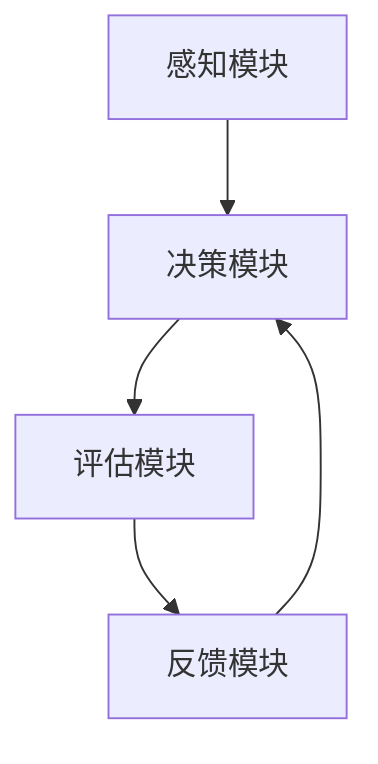
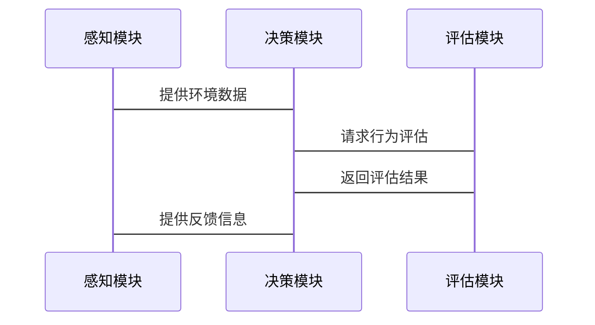
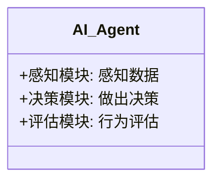

                 


# 构建具有自我评估能力的AI Agent

> 关键词：AI Agent, 自我评估, 机器学习, 系统架构, 项目实战

> 摘要：本文将详细探讨如何构建一个具有自我评估能力的AI Agent。从基础概念到算法实现，再到系统架构设计，我们将一步步构建这一智能化系统。文章内容涵盖背景介绍、核心概念、算法原理、系统架构、项目实战以及最佳实践等方面，旨在帮助读者全面理解并掌握这一技术。

---

## 第一部分：AI Agent基础

### 第1章：AI Agent的定义与类型

#### 1.1 AI Agent的基本概念

AI Agent（人工智能代理）是一种能够感知环境、采取行动以实现目标的智能系统。它可以自主决策，无需人工干预。AI Agent广泛应用于自动驾驶、智能助手、推荐系统等领域。

- **1.1.1 AI Agent的定义**
  AI Agent是具有智能特性的计算机系统，能够根据环境信息做出决策并执行动作，以达到预定目标。

- **1.1.2 AI Agent的类型**
  - **简单反射型**：基于当前感知直接行动，不考虑长期影响。
  - **基于模型型**：维护环境模型，基于模型进行决策。
  - **目标驱动型**：根据目标选择行动。
  - **效用驱动型**：通过最大化效用函数来选择最优行动。

- **1.1.3 AI Agent的核心特征**
  - 自主性：无需外部干预。
  - 反应性：能感知并实时响应。
  - 目标导向性：为实现特定目标而行动。
  - 学习能力：通过经验改进性能。

#### 1.2 自我评估能力的必要性

AI Agent需要自我评估能力来监控和优化自身行为，确保在动态环境中保持高效运作。

- **1.2.1 AI Agent面临的挑战**
  - 动态环境：环境不断变化，需要灵活应对。
  - 不确定性：信息不完全，存在不确定性。
  - 复杂决策：涉及多目标权衡。

- **1.2.2 自我评估能力的作用**
  - 监控性能：实时评估行动效果。
  - 优化决策：根据评估结果调整策略。
  - 提高可靠性：及时发现并纠正错误。

- **1.2.3 自我评估与外部反馈的关系**
  - 自我评估：内部监控机制。
  - 外部反馈：来自环境的评价。
  - 结合两者：提升整体性能。

#### 1.3 当前AI Agent的发展现状

AI Agent技术迅速发展，学术界和工业界都有大量研究和应用。

- **1.3.1 学术研究进展**
  - 基于强化学习的AI Agent：通过奖励机制优化决策。
  - 多智能体协作：研究多个AI Agent协同工作。
  - 自适应推理：提升动态环境下的推理能力。

- **1.3.2 工业应用案例**
  - 自动驾驶：实时感知与决策。
  - 智能助手：如Siri、Alexa，提供个性化服务。
  - 智能客服：自动化处理客户请求。

- **1.3.3 未来发展趋势**
  - 更强的自主性：减少对人工干预的依赖。
  - 更高的智能性：提升问题解决能力。
  - 更广泛的应用：扩展至更多领域。

---

## 第二部分：自我评估机制的设计与实现

### 第2章：自我评估机制的核心概念

#### 2.1 自我评估机制的定义

自我评估机制是AI Agent内部用于监控和评估自身行为的系统，能够提供反馈并指导改进。

- **2.1.1 机制的组成部分**
  - **感知模块**：收集行为数据。
  - **评估模块**：分析数据，生成评估结果。
  - **反馈模块**：将评估结果反馈给决策模块。

- **2.1.2 机制的工作原理**
  通过收集行为数据，应用评估指标进行分析，生成评估结果，并将结果用于优化决策过程。

#### 2.2 评估指标与方法

选择合适的评估指标和方法是确保自我评估准确性的关键。

- **2.2.1 评估指标的选择**
  - **准确性**：评估结果与预期的接近程度。
  - **响应时间**：完成任务所需的时间。
  - **用户满意度**：用户的主观评价。
  - **资源消耗**：执行任务所消耗的资源。

- **2.2.2 基于指标的评估方法**
  - **加权平均法**：根据指标的重要性进行加权计算。
  - **层次分析法（AHP）**：通过层次分析确定指标权重。

- **2.2.3 评估结果的反馈机制**
  - 及时反馈：立即提供评估结果。
  - 延迟反馈：在特定时间点提供评估结果。
  - 综合反馈：结合多种评估结果提供反馈。

#### 2.3 自我评估机制的设计原则

设计自我评估机制时需遵循以下原则：

- **2.3.1 简洁性与高效性**
  - 设计简洁的评估流程，减少计算开销。
  - 采用高效的评估算法，提升评估速度。

- **2.3.2 可扩展性与适应性**
  - 支持新增评估指标，适应不同应用场景。
  - 根据环境变化自适应调整评估策略。

- **2.3.3 可解释性与透明性**
  - 评估结果应易于理解和解释。
  - 机制应保持透明，便于调试和优化。

---

## 第三部分：机器学习模型的构建与应用

### 第3章：机器学习模型的训练与优化

#### 3.1 自我评估模型的训练方法

训练自我评估模型是构建AI Agent自我评估能力的核心步骤。

- **3.1.1 数据收集与预处理**
  - 数据来源：真实场景中的行为数据。
  - 数据清洗：去除噪声数据，确保数据质量。
  - 数据标注：根据实际效果进行标注。

- **3.1.2 模型选择与训练**
  - 选择合适的模型：如支持向量机（SVM）、随机森林（Random Forest）、神经网络等。
  - 模型训练：使用训练数据进行参数优化。
  - 模型验证：通过验证集评估模型性能。

- **3.1.3 模型优化**
  - 调参：调整模型参数，提升性能。
  - 正则化：防止过拟合，提升泛化能力。
  - 集成学习：结合多个模型的结果，提升评估准确性。

#### 3.2 基于机器学习的评估策略

将机器学习模型应用于评估策略，实现智能化的评估。

- **3.2.1 评估指标的数学建模**
  - 设定指标权重：$w_1, w_2, ..., w_n$，其中$\sum w_i = 1$。
  - 评估得分计算：$S = \sum w_i \cdot s_i$，其中$s_i$是指标$i$的得分。

- **3.2.2 模型评估与优化**
  - 使用交叉验证评估模型性能。
  - 通过梯度下降优化模型参数。
  - 引入领域知识，调整模型结构。

#### 3.3 模型结合与优化

将机器学习模型与AI Agent结合，实现自我评估。

- **3.3.1 模型结合方法**
  - 端到端训练：将AI Agent的行为与评估结果作为监督信号。
  - 分步优化：先优化行为，再优化评估。

- **3.3.2 模型优化策略**
  - 在线更新：实时更新模型参数。
  - 离线训练：定期重新训练模型。
  - 迁移学习：利用已有数据提升新场景下的性能。

---

## 第四部分：系统架构设计与实现

### 第4章：系统架构设计

#### 4.1 系统模块划分

AI Agent的自我评估系统由多个模块组成。

- **4.1.1 感知模块**
  - 负责收集环境数据和用户反馈。
  - 使用传感器或API获取实时信息。

- **4.1.2 决策模块**
  - 根据感知数据做出决策。
  - 调用评估模块进行行为评估。

- **4.1.3 评估模块**
  - 分析行为数据，生成评估结果。
  - 提供反馈给决策模块。

#### 4.2 系统架构图

使用Mermaid绘制系统架构图：



- **4.2.1 模块划分**
  - 感知模块：数据采集。
  - 决策模块：行为决策。
  - 评估模块：行为评估。
  - 反馈模块：结果反馈。

- **4.2.2 接口设计**
  - 感知模块接口：提供环境数据。
  - 评估模块接口：接收行为数据，返回评估结果。

#### 4.3 系统交互设计

使用Mermaid绘制系统交互序列图：



---

## 第五部分：项目实战与代码实现

### 第5章：项目实战

#### 5.1 项目背景与目标

设计一个具备自我评估能力的AI Agent，应用于智能客服系统。

- **5.1.1 项目背景**
  - 提供高效的客户支持。
  - 提升客户满意度。
  - 实现自动化服务质量监控。

- **5.1.2 项目目标**
  - 实现AI Agent的自我评估功能。
  - 提供实时的行为评估与反馈。

#### 5.2 系统功能设计

基于领域模型设计系统功能。

- **5.2.1 领域模型设计**
  使用Mermaid绘制类图：



- **5.2.2 功能模块**
  - 感知模块：接收用户输入。
  - 决策模块：生成回复。
  - 评估模块：评估回复质量。

#### 5.3 核心代码实现

编写Python代码实现AI Agent的核心功能。

- **5.3.1 数据预处理**
  ```python
  def preprocess_data(data):
      # 数据清洗和转换
      pass
  ```

- **5.3.2 模型训练**
  ```python
  def train_model(train_data, labels):
      # 使用机器学习模型训练
      pass
  ```

- **5.3.3 行为评估**
  ```python
  def evaluate_behavior(action, model):
      # 使用模型评估行为
      pass
  ```

#### 5.4 项目小结

总结项目实现过程中的经验和教训。

---

## 第六部分：高级主题与未来展望

### 第6章：高级主题

#### 6.1 多智能体协作

探讨多个AI Agent协作的场景。

- **6.1.1 多智能体协作的优势**
  - 提高整体效率。
  - 实现更复杂的任务。

- **6.1.2 协作中的评估机制**
  - 建立协作评估指标。
  - 设计协作反馈机制。

#### 6.2 实时监控与反馈

实现实时监控和反馈机制。

- **6.2.1 实时监控技术**
  - 使用流数据处理技术。
  - 实时分析评估结果。

- **6.2.2 反馈机制优化**
  - 建立实时反馈循环。
  - 调整评估模型参数。

#### 6.3 自我学习与进化

探讨AI Agent的自我学习能力。

- **6.3.1 自我学习的实现**
  - 使用强化学习。
  - 建立奖励机制。

- **6.3.2 进化的策略**
  - 遗传算法优化。
  - 在线学习提升。

### 第7章：总结与展望

#### 7.1 全文总结

总结全文内容，强调自我评估能力的重要性。

- **7.1.1 核心内容回顾**
  - AI Agent的定义与类型。
  - 自我评估机制的设计与实现。
  - 机器学习模型的应用。
  - 系统架构设计。
  - 项目实战经验。

#### 7.2 未来展望

展望AI Agent的发展方向。

- **7.2.1 技术进步**
  - 更强大的学习算法。
  - 更高效的计算能力。

- **7.2.2 应用场景扩展**
  - 更多领域的应用。
  - 更复杂的任务处理。

---

## 第七部分：最佳实践与注意事项

### 第8章：最佳实践

#### 8.1 开发建议

- **模块化设计**：便于维护和扩展。
- **数据质量**：确保数据准确性和完整性。
- **持续优化**：定期更新模型和评估策略。

#### 8.2 注意事项

- **性能监控**：避免资源消耗过大。
- **安全性**：保护用户数据隐私。
- **可解释性**：确保评估结果易于理解。

---

## 第八部分：总结与致谢

### 第9章：总结

本文详细探讨了如何构建具有自我评估能力的AI Agent，从理论到实践，为读者提供了全面的指导。

---

## 作者信息

作者：AI天才研究院/AI Genius Institute & 禅与计算机程序设计艺术 /Zen And The Art of Computer Programming

---

以上是《构建具有自我评估能力的AI Agent》的技术博客文章的完整目录大纲和部分正文内容，后续将根据实际需求继续补充完整。

