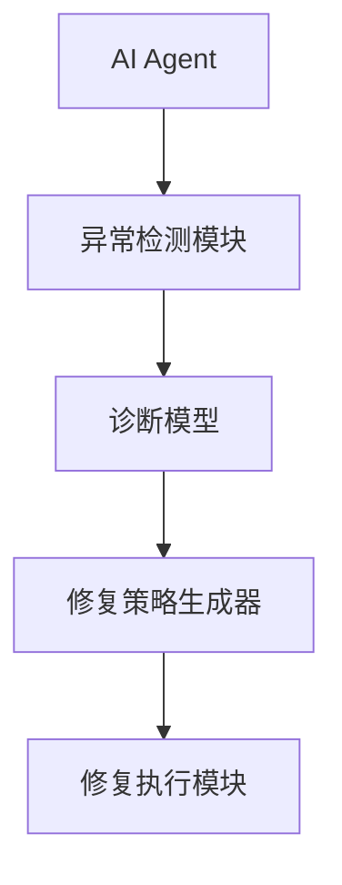
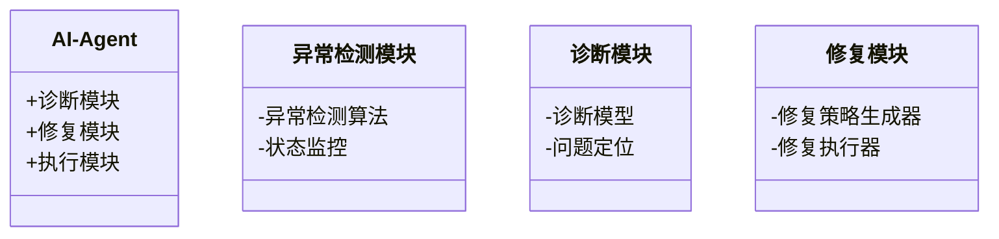
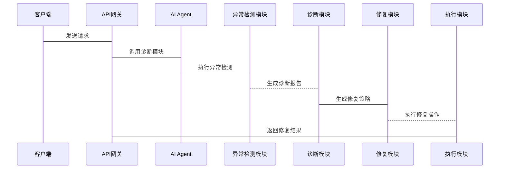

                 


# 构建具有自我诊断与修复能力的AI Agent

## 关键词：AI Agent, 自我诊断, 自我修复, 异常检测, 修复策略, 系统架构

## 摘要：  
本文深入探讨了如何构建一个具有自我诊断与修复能力的AI Agent。通过分析核心概念、算法原理、系统架构、项目实战和最佳实践，本文为读者提供了从理论到实践的全面指导。文章首先介绍了AI Agent的基本概念和自我诊断与修复的必要性，然后详细讲解了自我诊断与修复的核心机制，包括异常检测算法和修复策略生成算法。接着，本文从系统架构的角度分析了AI Agent的设计与实现，最后通过实际案例展示了如何在项目中实现这些功能，并总结了相关经验和最佳实践。

---

# 第一部分: 自我诊断与修复AI Agent的背景与核心概念

## 第1章: AI Agent的基本概念

### 1.1 AI Agent的定义与分类
AI Agent（人工智能代理）是指具有感知环境、理解任务目标，并能够自主决策和执行任务的智能实体。根据功能和应用场景的不同，AI Agent可以分为以下几类：
- **简单反射型AI Agent**：基于规则的简单决策和执行。
- **基于模型的AI Agent**：通过构建内部模型来理解和预测环境。
- **目标驱动型AI Agent**：以特定目标为导向，主动规划和执行任务。
- **学习增强型AI Agent**：通过机器学习不断提升自身的智能水平。

### 1.2 自我诊断与修复能力的必要性
在实际应用中，AI Agent可能会面临各种异常情况，例如数据输入错误、算法失效、外部环境变化等。具备自我诊断与修复能力的AI Agent能够及时发现这些问题并采取有效措施，从而保证系统的稳定性和可靠性。

### 1.3 当前AI Agent的发展现状
目前，AI Agent的应用已经渗透到多个领域，例如智能助手、自动驾驶、智能客服等。然而，大多数AI Agent仍然依赖于人工干预来处理异常情况，具备自我诊断与修复能力的AI Agent仍然是研究和应用的热点。

---

## 第2章: 自我诊断与修复AI Agent的核心机制

### 2.1 自我诊断机制
#### 2.1.1 异常检测算法
异常检测是自我诊断的核心步骤之一。常用的异常检测算法包括：
- **基于统计的方法**：如Z-score、孤立林（Isolation Forest）。
- **基于机器学习的方法**：如支持向量机（SVM）、随机森林（Random Forest）。
- **基于深度学习的方法**：如自动编码器（Autoencoder）、变分自编码器（VAE）。

#### 2.1.2 状态监控与分析
通过实时监控系统的运行状态，AI Agent可以发现潜在的问题。状态监控包括对系统性能指标（如响应时间、错误率）的监控，以及对用户反馈的分析。

#### 2.1.3 诊断模型的构建与优化
诊断模型需要能够准确识别异常情况并定位问题的根本原因。优化诊断模型的关键在于数据质量和特征选择。

### 2.2 自我修复机制
#### 2.2.1 修复策略生成算法
修复策略生成算法的目标是根据诊断结果生成有效的修复方案。常用的策略生成方法包括：
- **基于规则的策略生成**：通过预定义的规则集生成修复方案。
- **基于机器学习的策略生成**：如强化学习（Reinforcement Learning）。
- **基于知识图谱的策略生成**：通过知识图谱推理生成修复方案。

#### 2.2.2 自动修复流程设计
自动修复流程通常包括以下几个步骤：
1. **检测异常**：通过异常检测算法发现系统中的异常情况。
2. **定位问题**：通过诊断模型确定异常的根本原因。
3. **生成修复方案**：根据诊断结果生成修复策略。
4. **执行修复**：自动执行修复操作并验证修复效果。

#### 2.2.3 修复效果评估与反馈
修复效果评估是衡量自我修复能力的重要指标。评估指标包括修复时间、修复成功率、修复对系统性能的影响等。

### 2.3 诊断与修复的协同工作
诊断与修复是两个相辅相成的过程。诊断为修复提供依据，而修复的效果又反过来影响诊断的准确性。

---

## 第3章: 自我诊断与修复AI Agent的核心概念与联系

### 3.1 核心概念对比
| 概念 | 定义 | 优缺点 |
|------|------|--------|
| 异常检测 | 发现系统中的异常情况 | 优点：实时性高；缺点：误报率较高 |
| 修复策略生成 | 根据诊断结果生成修复方案 | 优点：灵活性高；缺点：依赖于诊断的准确性 |

### 3.2 实体关系图（Mermaid）


---

# 第二部分: 自我诊断与修复AI Agent的算法原理

## 第4章: 异常检测算法

### 4.1 异常检测算法的选择与实现
#### 4.1.1 基于统计的方法
使用Z-score公式检测异常值：
$$ Z = \frac{x - \mu}{\sigma} $$
其中，$\mu$是均值，$\sigma$是标准差。

#### 4.1.2 基于机器学习的方法
随机森林异常检测的实现步骤：
1. 训练随机森林模型。
2. 计算每个样本在每个决策树中的路径长度。
3. 统计路径长度的分布，识别异常样本。

#### 4.1.3 基于深度学习的方法
自动编码器的结构：
$$ \text{输入} \rightarrow \text{编码器} \rightarrow \text{解码器} \rightarrow \text{输出} $$

### 4.2 异常检测算法的性能评估
常用的性能评估指标包括准确率、召回率、F1分数等。

---

## 第5章: 修复策略生成算法

### 5.1 修复策略生成算法的选择与实现
#### 5.1.1 基于规则的策略生成
规则生成的实现步骤：
1. 定义修复规则。
2. 根据诊断结果匹配相应的规则。
3. 执行修复操作。

#### 5.1.2 基于机器学习的策略生成
强化学习的实现步骤：
1. 定义状态空间和动作空间。
2. 构建奖励函数。
3. 使用Q-learning算法训练策略。

### 5.2 修复策略生成算法的优化
优化策略生成算法的关键在于提高诊断的准确性，同时降低修复操作的复杂性。

---

# 第三部分: 自我诊断与修复AI Agent的系统分析与架构设计

## 第6章: 系统分析

### 6.1 问题场景介绍
AI Agent在运行过程中可能会遇到各种异常情况，例如数据输入错误、算法失效、外部环境变化等。

### 6.2 系统功能设计
#### 6.2.1 领域模型（Mermaid类图）


### 6.3 系统架构设计
#### 6.3.1 系统架构图（Mermaid架构图）


---

## 第7章: 接口与交互设计

### 7.1 系统接口设计
- **输入接口**：接收外部系统的请求和数据。
- **输出接口**：向外部系统返回诊断结果和修复建议。

### 7.2 系统交互图（Mermaid序列图）


---

# 第四部分: 项目实战

## 第8章: 项目实战

### 8.1 环境安装
- **安装Python环境**：推荐使用Anaconda。
- **安装依赖库**：如scikit-learn、tensorflow、mermaid等。

### 8.2 核心实现

#### 8.2.1 异常检测模块实现
```python
from sklearn.ensemble import IsolationForest

# 初始化异常检测模型
model = IsolationForest(n_estimators=100, random_state=42)

# 训练模型
model.fit(X_train)

# 预测异常值
y_pred = model.predict(X_test)
```

#### 8.2.2 修复策略生成模块实现
```python
import numpy as np
from tensorflow.keras import layers

# 初始化强化学习模型
model = Sequential()
model.add(layers.Dense(64, activation='relu', input_dim=64))
model.add(layers.Dense(1, activation='sigmoid'))

# 定义损失函数和优化器
model.compile(loss='binary_crossentropy', optimizer='adam', metrics=['accuracy'])

# 训练模型
model.fit(X_train, y_train, epochs=100, batch_size=32)
```

### 8.3 实际案例分析
通过一个具体案例，详细分析AI Agent如何实现自我诊断与修复。

---

## 第9章: 最佳实践与注意事项

### 9.1 最佳实践
- **数据质量**：确保数据的完整性和准确性。
- **模型优化**：定期更新模型，提高诊断和修复的准确性。
- **日志记录**：详细记录系统的运行状态和修复过程。

### 9.2 注意事项
- **性能瓶颈**：修复操作可能会对系统性能产生影响。
- **安全性问题**：确保修复操作的安全性，防止恶意攻击。

---

## 第10章: 小结与展望

### 10.1 小结
本文从理论到实践，全面探讨了如何构建一个具有自我诊断与修复能力的AI Agent。

### 10.2 未来展望
随着人工智能技术的不断发展，具备自我诊断与修复能力的AI Agent将在更多领域得到应用，并成为智能化系统的重要组成部分。

---

# 作者：AI天才研究院/AI Genius Institute & 禅与计算机程序设计艺术 /Zen And The Art of Computer Programming

