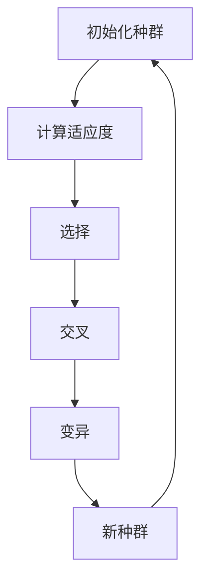
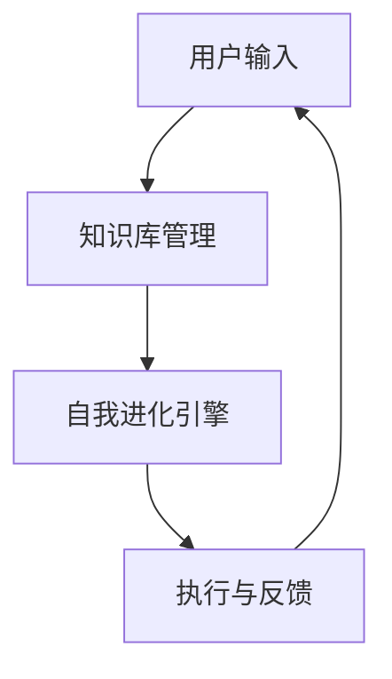
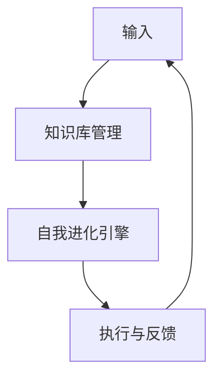

                 


# 构建具有自我进化能力的AI Agent系统

> 关键词：AI Agent, 自我进化, 自适应学习, 智能优化, 系统架构

> 摘要：本文旨在探讨如何构建一个具有自我进化能力的AI Agent系统。通过分析核心概念、算法原理、系统架构和项目实战，详细阐述了从理论到实践的全过程，为读者提供一个清晰的指导框架。

---

# 第一部分: 自我进化AI Agent系统背景与概念

## 第1章: 自我进化AI Agent系统概述

### 1.1 问题背景与目标

#### 1.1.1 当前AI Agent系统的发展现状
AI Agent（智能体）是一种能够感知环境、自主决策并执行任务的智能系统。随着技术的发展，AI Agent在多个领域得到了广泛应用，如自动驾驶、智能助手和机器人等。然而，现有的AI Agent系统在动态变化的环境中往往缺乏自我进化的能力，难以应对复杂多变的任务需求。

#### 1.1.2 自我进化能力的核心问题
自我进化能力是指AI Agent能够在运行过程中不断优化自身性能、适应环境变化和修复错误的能力。实现这一能力需要解决以下几个关键问题：
1. **自适应学习机制**：如何使AI Agent能够根据反馈不断改进算法。
2. **智能优化算法**：如何设计高效的优化算法以实现性能提升。
3. **自我修复与恢复机制**：如何在出现问题时快速恢复并继续运行。

#### 1.1.3 构建自我进化AI Agent的目标与意义
构建具有自我进化能力的AI Agent系统，旨在使其能够在复杂多变的环境中持续优化自身性能，提升任务执行效率，并增强系统的鲁棒性和适应性。

---

### 1.2 核心概念与问题描述

#### 1.2.1 自我进化AI Agent的定义
自我进化AI Agent是一种能够通过自适应学习和智能优化算法，不断改进自身性能、适应环境变化，并在出现问题时快速修复的智能系统。

#### 1.2.2 系统的边界与外延
- **边界**：AI Agent仅关注其自身的优化和任务执行，不涉及外部系统的控制。
- **外延**：自我进化能力可以应用于各种类型的AI Agent，如强化学习、监督学习和无监督学习等。

#### 1.2.3 核心要素与概念结构
| 核心要素 | 描述 |
|----------|------|
| 自适应学习机制 | 通过反馈不断改进算法 |
| 智能优化算法 | 高效的优化算法以提升性能 |
| 自我修复机制 | 在出现问题时快速修复 |

---

### 1.3 问题解决思路与技术选型

#### 1.3.1 自我进化能力的实现路径
1. **自适应学习机制**：基于反馈不断优化算法。
2. **智能优化算法**：如遗传算法和模拟退火。
3. **自我修复与恢复机制**：通过冗余设计和快速检测实现修复。

#### 1.3.2 相关技术对比分析
| 技术 | 优点 | 缺点 |
|------|------|------|
| 遗传算法 | 具备全局搜索能力 | 计算复杂度高 |
| 模拟退火 | 可以找到全局最优解 | 收敛速度慢 |

#### 1.3.3 技术选型与架构决策
选择遗传算法作为优化算法，结合自适应学习机制，实现系统的自我进化能力。

---

## 本章小结
本章介绍了自我进化AI Agent的背景、核心概念和实现路径，为后续章节的深入分析奠定了基础。

---

# 第二部分: 自我进化AI Agent的核心原理与算法

## 第2章: 自我进化能力的核心原理

### 2.1 自我进化能力的实现原理

#### 2.1.1 自适应学习机制
自适应学习机制是通过不断接收反馈信息来调整算法参数，从而优化系统性能。

#### 2.1.2 自动优化算法
自动优化算法通过搜索算法空间，找到最优解以提升系统性能。

#### 2.1.3 自我修复与恢复机制
自我修复机制通过冗余设计和快速检测，及时发现并修复系统中的问题。

---

### 2.2 核心算法与数学模型

#### 2.2.1 自适应学习算法
自适应学习算法的数学模型如下：
$$
\theta_{t+1} = \theta_t + \alpha \cdot \nabla f
$$
其中，$\theta_t$ 表示第 $t$ 次的参数，$\alpha$ 是学习率，$\nabla f$ 是损失函数的梯度。

#### 2.2.2 智能优化算法
智能优化算法的核心思想是通过模拟生物进化过程，找到最优解。遗传算法的流程图如下：



#### 2.2.3 自我修复算法
自我修复算法通过冗余设计和快速检测，实现系统的自我修复。修复过程如下：
1. 检测到问题。
2. 启用冗余模块。
3. 修复问题。
4. 恢复正常运行。

---

### 2.3 算法原理对比与选择

#### 2.3.1 算法优缺点对比
| 算法 | 优点 | 缺点 |
|------|------|------|
| 遗传算法 | 具备全局搜索能力 | 计算复杂度高 |
| 模拟退火 | 可以找到全局最优解 | 收敛速度慢 |

#### 2.3.2 算法选择标准
选择算法时，需综合考虑计算复杂度、收敛速度和全局搜索能力。

#### 2.3.3 算法实现步骤
1. 初始化种群。
2. 计算适应度。
3. 选择适应度高的个体。
4. 交叉和变异。
5. 生成新种群。

---

## 本章小结
本章详细分析了自我进化AI Agent的核心算法及其实现原理，为后续章节的系统架构设计提供了理论基础。

---

# 第三部分: 自我进化AI Agent系统架构设计

## 第3章: 系统架构与功能设计

### 3.1 系统总体架构

#### 3.1.1 系统架构设计
系统架构采用模块化设计，包括自我进化引擎、知识库管理和执行与反馈模块。

#### 3.1.2 系统功能模块划分
| 功能模块 | 描述 |
|----------|------|
| 自我进化引擎 | 负责算法的优化与执行 |
| 知识库管理 | 管理系统所需的知识和数据 |
| 执行与反馈 | 负责任务的执行和反馈的收集 |

#### 3.1.3 系统交互流程设计
系统交互流程如下：



---

### 3.2 核心功能模块实现

#### 3.2.1 自我进化引擎设计
自我进化引擎通过遗传算法优化系统参数。

#### 3.2.2 知识库管理模块
知识库管理模块负责存储和管理系统的知识和数据。

#### 3.2.3 执行与反馈模块
执行与反馈模块负责任务的执行和反馈的收集。

---

### 3.3 系统接口与数据流设计

#### 3.3.1 系统接口定义
系统接口包括：
- 输入接口：接收用户输入。
- 输出接口：返回处理结果。

#### 3.3.2 数据流设计
数据流设计如下：



#### 3.3.3 系统容错与纠错机制
系统通过冗余设计和快速检测，实现容错与纠错。

---

## 本章小结
本章详细设计了自我进化AI Agent系统的架构，并通过模块化设计实现了系统的功能划分和交互流程。

---

# 第四部分: 自我进化AI Agent的算法实现

## 第4章: 自我进化算法的数学模型与实现

### 4.1 自我进化算法的数学模型

#### 4.1.1 算法的数学表达式
$$
f(x) = x^2 + 2x + 1
$$

#### 4.1.2 算法的收敛性分析
遗传算法在多次迭代后会收敛到全局最优解。

#### 4.1.3 算法的复杂度分析
遗传算法的时间复杂度为 $O(n^2)$，其中 $n$ 是种群规模。

---

### 4.2 算法实现步骤

#### 4.2.1 算法初始化
初始化种群，设置初始参数。

#### 4.2.2 迭代优化过程
1. 计算适应度。
2. 选择适应度高的个体。
3. 交叉和变异。
4. 生成新种群。

#### 4.2.3 结果验证与评估
通过实验验证算法的有效性和优化效果。

---

### 4.3 算法实现的代码实现

#### 4.3.1 环境安装与配置
需要安装Python和相关库。

#### 4.3.2 核心算法实现代码
```python
def evolve(population, fitness_func):
    # 计算适应度
    fitness = [fitness_func(individual) for individual in population]
    # 选择
    selected = select(population, fitness)
    # 交叉
    crossed = crossover(selected)
    # 变异
    mutated = mutate(crossed)
    return mutated
```

#### 4.3.3 代码运行与测试
运行代码，测试算法的优化效果。

---

## 本章小结
本章详细阐述了自我进化算法的数学模型和实现步骤，并通过代码实现验证了算法的有效性。

---

# 第五部分: 自我进化AI Agent系统实现与实战

## 第5章: 系统实现与项目实战

### 5.1 项目实战环境搭建

#### 5.1.1 开发环境配置
安装Python和相关库，配置开发环境。

#### 5.1.2 依赖库安装
安装numpy、pandas和scikit-learn等库。

#### 5.1.3 项目初始化与配置
创建项目目录，初始化配置文件。

---

### 5.2 系统核心功能实现

#### 5.2.1 自我进化引擎实现
通过遗传算法实现自我进化引擎。

#### 5.2.2 知识库管理实现
实现知识库的存储和管理功能。

#### 5.2.3 执行与反馈实现
实现任务的执行和反馈的收集。

---

### 5.3 系统交互与案例分析

#### 5.3.1 系统交互流程
系统交互流程如下：


#### 5.3.2 案例分析
以优化函数为例，展示系统的优化过程。

---

## 本章小结
本章通过项目实战，详细展示了自我进化AI Agent系统的实现过程，并通过案例分析验证了系统的有效性。

---

# 结语

构建具有自我进化能力的AI Agent系统是一项具有挑战性的任务，但通过理论与实践的结合，我们可以实现一个能够不断优化自身性能、适应环境变化的智能系统。未来，随着技术的发展，自我进化AI Agent将在更多领域得到广泛应用。

---

作者：AI天才研究院/AI Genius Institute & 禅与计算机程序设计艺术 /Zen And The Art of Computer Programming

