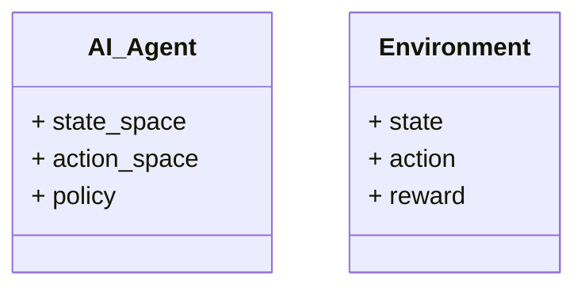
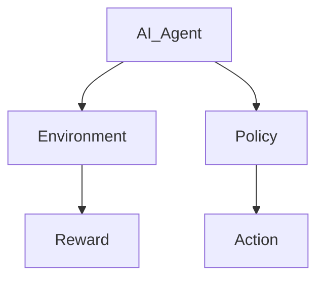
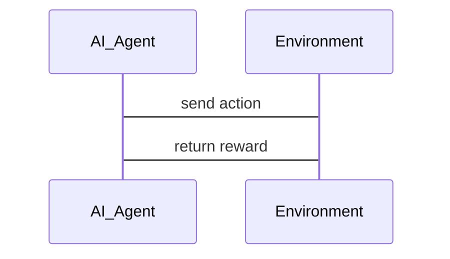

                 


# 构建具有自适应学习策略的AI Agent

## 关键词：
- AI Agent, 自适应学习, 强化学习, 算法实现, 系统架构, 项目实战

## 摘要：
本文详细探讨了构建具有自适应学习策略的AI Agent的方法。从理论基础到算法实现，再到系统架构设计和实际案例分析，系统地介绍了如何设计一个能够根据环境动态调整学习策略的智能体。文章结合强化学习、迁移学习等技术，通过数学模型和代码示例，深入分析了自适应学习策略的核心原理，并通过项目实战展示了如何将这些理论应用于实际场景。

---

# 第1章: AI Agent与自适应学习策略概述

## 1.1 AI Agent的基本概念
### 1.1.1 AI Agent的定义与分类
AI Agent（智能体）是指在环境中能够感知并自主行动以实现目标的实体。AI Agent可以分为简单反射型、基于模型的反应型、目标驱动型和效用驱动型。

### 1.1.2 自适应学习策略的必要性
在动态环境中，AI Agent需要能够根据环境变化调整其行为策略，以提高任务成功率。自适应学习策略通过实时更新模型参数或策略，使AI Agent能够应对不确定性。

### 1.1.3 自适应学习策略与传统学习方法的对比
传统机器学习方法通常需要重新训练整个模型才能适应新任务，而自适应学习策略通过局部更新或在线学习方式，能够快速调整策略以应对变化。

## 1.2 自适应学习策略的核心要素
### 1.2.1 知识表示与更新机制
知识表示是AI Agent理解环境的基础，自适应学习策略需要通过高效的更新机制保持知识的准确性。

### 1.2.2 动态环境感知能力
AI Agent需要实时感知环境变化，并根据感知信息调整其行为策略。

### 1.2.3 多目标优化与权衡
在复杂环境中，AI Agent需要同时优化多个目标，自适应学习策略需要在这些目标之间找到平衡点。

## 1.3 自适应学习策略的应用场景
### 1.3.1 智能推荐系统中的应用
通过自适应学习策略，推荐系统能够根据用户行为实时调整推荐策略。

### 1.3.2 自动化决策系统的应用
在金融、医疗等领域，AI Agent需要根据市场变化或患者状况动态调整决策策略。

### 1.3.3 人机交互中的自适应学习
通过自适应学习，AI Agent能够更好地理解用户需求，提供更个性化的服务。

## 1.4 本章小结
本章介绍了AI Agent的基本概念和自适应学习策略的重要性，分析了其核心要素和应用场景。

---

# 第2章: 自适应学习策略的原理与数学模型

## 2.1 自适应学习策略的原理
### 2.1.1 感知模块: 状态空间的构建
AI Agent通过感知环境获取状态信息，构建状态空间。

### 2.1.2 决策模块: 动作选择机制
基于当前状态，AI Agent选择最优动作。

### 2.1.3 执行模块: 策略更新与反馈
通过执行动作获得反馈，更新策略以提高未来决策的准确性。

## 2.2 自适应学习策略的数学模型
### 2.2.1 状态空间表示
$$ S = \{s_1, s_2, ..., s_n\} $$
### 2.2.2 动作空间表示
$$ A = \{a_1, a_2, ..., a_m\} $$
### 2.2.3 策略函数表示
$$ \pi: S \rightarrow A $$

## 2.3 自适应学习策略的核心公式
### 2.3.1 Q-learning算法
$$ Q(s, a) = Q(s, a) + \alpha (r + \gamma \max Q(s', a') - Q(s, a)) $$
### 2.3.2 策略梯度方法
$$ \nabla \theta J(\theta) = \mathbb{E}[ \nabla \log \pi(a|s) Q(s,a) ] $$

## 2.4 本章小结
本章详细讲解了自适应学习策略的原理和数学模型，为后续的算法实现奠定了理论基础。

---

# 第3章: 强化学习与自适应算法

## 3.1 强化学习基础
### 3.1.1 环境与智能体的交互
智能体通过与环境交互获得奖励，逐步优化策略。

### 3.1.2 奖励机制的设计
合理的奖励机制是强化学习成功的关键。

### 3.1.3 动作空间与状态空间的映射
通过状态和动作空间的映射，智能体能够更好地理解环境。

## 3.2 自适应算法的实现
### 3.2.1 Q-learning算法实现
```python
def q_learning(env, alpha=0.1, gamma=0.99):
    Q = defaultdict(lambda: defaultdict(float))
    for episode in range(max_episodes):
        state = env.reset()
        while not done:
            action = policy(Q, state)
            next_state, reward, done = env.step(action)
            Q[state][action] += alpha * (reward + gamma * max(Q[next_state].values()) - Q[state][action])
```
### 3.2.2 策略梯度方法实现
```python
def policy_gradient(env, episodes=1000):
    model = PolicyNetwork()
    optimizer = Adam(model.parameters(), lr=0.01)
    for episode in range(episodes):
        state = env.reset()
        rewards = []
        for step in range(max_steps):
            action_probs = model.forward(state)
            action = torch.multinomial(action_probs, 1).item()
            next_state, reward, done = env.step(action)
            rewards.append(reward)
            if done:
                break
        optimizer.zero_grad()
        loss = -torch.mean(torch.log(action_probs) * rewards)
        loss.backward()
        optimizer.step()
```

## 3.3 自适应算法的优缺点
### 3.3.1 优点
- 灵活性高
- 能够处理动态环境

### 3.3.2 缺点
- 计算资源消耗大
- 需要大量数据支持

## 3.4 本章小结
本章通过强化学习和自适应算法的实现，展示了如何在实际场景中应用自适应学习策略。

---

# 第4章: 自适应学习策略的系统架构设计

## 4.1 问题场景介绍
### 4.1.1 系统目标
构建一个能够自适应学习的AI Agent，能够在动态环境中完成复杂任务。

### 4.1.2 项目介绍
本项目旨在设计一个自适应学习策略的AI Agent，用于智能推荐系统。

## 4.2 系统功能设计
### 4.2.1 领域模型设计


### 4.2.2 系统架构设计


## 4.3 系统接口设计
### 4.3.1 输入接口
接收环境状态和用户反馈。

### 4.3.2 输出接口
输出动作和策略调整。

## 4.4 系统交互流程图


## 4.5 本章小结
本章通过系统架构设计，展示了如何构建一个具有自适应学习策略的AI Agent。

---

# 第5章: 项目实战: 自适应学习策略在智能推荐系统中的应用

## 5.1 环境安装
安装必要的库：
```bash
pip install numpy scikit-learn tensorflow
```

## 5.2 系统核心实现
### 5.2.1 知识表示
使用矩阵表示用户和物品的特征。

### 5.2.2 策略更新
基于用户反馈实时更新推荐策略。

## 5.3 代码实现
### 5.3.1 知识表示
```python
import numpy as np

user_features = np.random.rand(100, 10)
item_features = np.random.rand(10, 100)
```

### 5.3.2 策略更新
```python
def update_policy(user_id, item_id, reward):
    user_feature = user_features[user_id]
    item_feature = item_features[item_id]
    # 更新策略
    pass
```

## 5.4 案例分析
### 5.4.1 系统性能评估
通过准确率、召回率等指标评估系统性能。

### 5.4.2 策略优化
根据实验结果优化策略参数。

## 5.5 本章小结
本章通过项目实战，展示了如何将自适应学习策略应用于智能推荐系统。

---

# 第6章: 最佳实践与总结

## 6.1 小结
总结了构建具有自适应学习策略的AI Agent的核心要点。

## 6.2 注意事项
在实际应用中需要注意计算资源消耗和数据隐私等问题。

## 6.3 拓展阅读
推荐相关领域的书籍和论文，供读者进一步学习。

---

# 作者：AI天才研究院 & 禅与计算机程序设计艺术

