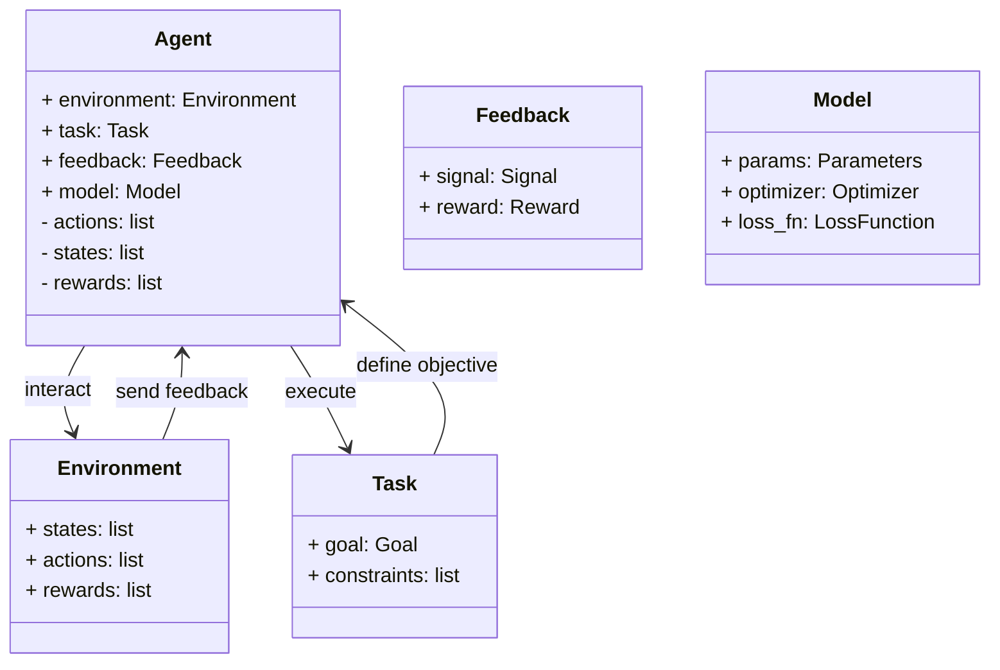
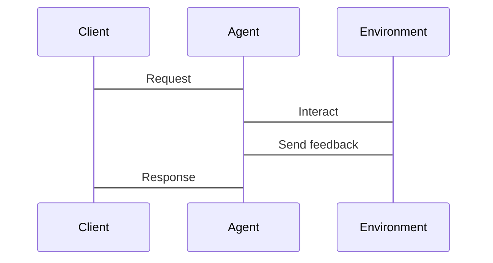

                 


# 《构建具有自适应学习能力的AI Agent》

> 关键词：自适应学习，AI Agent，强化学习，机器学习，系统架构

> 摘要：自适应学习AI Agent是一种能够根据环境变化和用户反馈不断优化自身行为的智能体。本文将从背景、核心概念、算法原理、系统架构、项目实战等方面详细讲解如何构建这样一个智能体，帮助读者掌握从理论到实践的完整过程。

---

# 第一部分: 自适应学习AI Agent的背景与核心概念

# 第1章: 自适应学习AI Agent概述

## 1.1 什么是自适应学习AI Agent
### 1.1.1 AI Agent的基本概念
AI Agent（智能体）是指能够感知环境、做出决策并采取行动以实现目标的实体。自适应学习AI Agent的核心在于其能够根据环境反馈动态调整行为。

### 1.1.2 自适应学习的核心特征
- **动态性**：能够根据实时反馈调整行为。
- **主动性**：主动探索环境以优化目标。
- **鲁棒性**：在复杂环境中保持稳定性能。

### 1.1.3 自适应学习AI Agent的定义与分类
自适应学习AI Agent通过不断学习和优化，能够适应不同环境和任务需求。根据学习方式，可以分为基于强化学习、监督学习和迁移学习的自适应Agent。

## 1.2 自适应学习的背景与重要性
### 1.2.1 当前AI Agent的发展现状
AI Agent在各个领域（如游戏、教育、医疗）的应用日益广泛，但大多数Agent缺乏自适应能力。

### 1.2.2 自适应学习在AI Agent中的作用
自适应学习使AI Agent能够应对复杂多变的环境，提高任务完成效率。

### 1.2.3 自适应学习的商业价值与社会影响
通过提升AI Agent的自适应能力，可以实现更高效的服务，推动智能化社会的发展。

## 1.3 本章小结
本章介绍了自适应学习AI Agent的基本概念、核心特征以及其在现代社会中的重要性。

---

# 第二部分: 自适应学习AI Agent的核心概念与联系

# 第2章: 自适应学习的原理与机制

## 2.1 自适应学习的基本原理
### 2.1.1 感知与理解环境
AI Agent通过传感器或数据接口感知环境信息。

### 2.1.2 基于反馈的决策优化
通过反馈不断优化决策策略。

### 2.1.3 动态调整与执行
根据反馈调整行为，确保目标的实现。

## 2.2 自适应学习的核心机制
### 2.2.1 基于强化学习的自适应策略
通过奖励机制优化决策。

### 2.2.2 基于监督学习的自适应模型
通过标注数据训练模型。

### 2.2.3 基于迁移学习的知识复用
将已学习的知识应用到新任务中。

## 2.3 自适应学习与传统机器学习的对比
### 2.3.1 核心概念对比表格

| 特性         | 传统机器学习 | 自适应学习 |
|--------------|--------------|------------|
| 数据处理     | 静态         | 动态       |
| 模型更新     | 离线         | 在线       |
| 适应性       | 低           | 高         |

### 2.3.2 自适应学习的ER实体关系图

```mermaid
er
    actor: 用户
    agent: 自适应AI Agent
    environment: 环境
    task: 任务
    feedback: 反馈
    actor --> environment: 与环境交互
    environment --> agent: 提供反馈
    agent --> task: 执行任务
    task --> feedback: 生成反馈
    feedback --> agent: 优化模型
```

## 2.4 本章小结
本章详细讲解了自适应学习的原理、核心机制及其与传统机器学习的区别。

---

# 第三部分: 自适应学习AI Agent的算法原理

# 第3章: 自适应学习算法的数学模型

## 3.1 自适应学习的数学基础
### 3.1.1 概率论基础
概率论用于处理不确定性问题。

### 3.1.2 线性代数与矩阵运算
矩阵运算用于处理数据和优化问题。

### 3.1.3 优化理论与梯度下降
优化目标函数是自适应学习的核心。

## 3.2 自适应学习的核心算法公式
### 3.2.1 损失函数定义
$$ L = \frac{1}{n}\sum_{i=1}^{n}(y_i - \hat{y_i})^2 $$

### 3.2.2 优化器选择
$$ \theta_{new} = \theta - \eta \cdot \nabla L $$

## 3.3 强化学习算法
### 3.3.1 Q-learning算法
$$ Q(s, a) = Q(s, a) + \alpha [r + \max Q(s', a') - Q(s, a)] $$

### 3.3.2 Deep Q-Networks (DQN)
使用神经网络近似Q值函数。

## 3.4 监督学习算法
### 3.4.1 线性回归
$$ y = \theta x + b $$

### 3.4.2 支持向量机
$$ \text{minimize} \quad \frac{1}{2}\theta^2 + C\sum_{i=1}^n \xi_i $$
$$ \text{subject to} \quad y_i(\theta x_i + b) \geq 1 - \xi_i $$

## 3.5 迁移学习算法
### 3.5.1 域适配
$$ D_{source} \rightarrow D_{target} $$

### 3.5.2 特征抽取
使用预训练模型提取特征。

## 3.6 本章小结
本章通过数学公式和算法流程图详细讲解了自适应学习的核心算法。

---

# 第四部分: 自适应学习AI Agent的系统架构设计

# 第4章: 自适应学习AI Agent的系统分析

## 4.1 问题场景介绍
### 4.1.1 问题背景
复杂动态环境中的任务执行。

### 4.1.2 问题描述
AI Agent需要在动态环境中自适应调整策略。

## 4.2 系统功能设计
### 4.2.1 领域模型设计
使用Mermaid类图展示系统模块。



### 4.2.2 系统架构设计
使用Mermaid架构图展示系统整体结构。


## 4.3 接口设计与交互
### 4.3.1 接口设计
- 输入接口：接收环境状态和任务目标。
- 输出接口：输出动作和反馈信号。

### 4.3.2 交互流程图
使用Mermaid序列图展示交互流程。



## 4.4 本章小结
本章通过系统分析和架构设计，展示了自适应学习AI Agent的实现框架。

---

# 第五部分: 自适应学习AI Agent的项目实战

# 第5章: 自适应学习AI Agent的实现与应用

## 5.1 环境安装
### 5.1.1 安装Python
```bash
sudo apt-get install python3 python3-dev
```

### 5.1.2 安装依赖库
```bash
pip install numpy matplotlib tensorflow
```

## 5.2 系统核心实现
### 5.2.1 模型训练代码
```python
import numpy as np
import tensorflow as tf

# 定义模型
model = tf.keras.Sequential([
    tf.keras.layers.Dense(64, activation='relu'),
    tf.keras.layers.Dense(1, activation='linear')
])

# 定义损失函数和优化器
loss_fn = tf.keras.losses.MeanSquaredError()
optimizer = tf.keras.optimizers.Adam(learning_rate=0.001)

# 训练模型
model.compile(optimizer=optimizer, loss=loss_fn)
model.fit(X_train, y_train, epochs=100, batch_size=32)
```

### 5.2.2 动态调整策略
```python
def adapt Strategy():
    for feedback in feedbacks:
        update model using feedback
        evaluate performance
```

## 5.3 应用案例分析
### 5.3.1 智能助手应用
设计一个AI助手，能够根据用户反馈优化服务流程。

### 5.3.2 自动驾驶应用
实现自动驾驶中的路径规划和决策优化。

## 5.4 本章小结
本章通过实际项目实现，展示了自适应学习AI Agent的应用场景和实现过程。

---

# 第六部分: 自适应学习AI Agent的最佳实践

# 第6章: 最佳实践与注意事项

## 6.1 最佳实践
### 6.1.1 数据预处理
确保数据质量，进行特征工程。

### 6.1.2 模型调优
选择合适的超参数，进行网格搜索。

### 6.1.3 安全性和伦理问题
确保AI Agent的安全性和符合伦理规范。

## 6.2 小结
总结构建自适应学习AI Agent的关键点和注意事项。

---

# 作者：AI天才研究院/AI Genius Institute & 禅与计算机程序设计艺术 /Zen And The Art of Computer Programming

---

以上是《构建具有自适应学习能力的AI Agent》的详细目录和内容大纲，涵盖了从基础概念到实际应用的各个方面。

