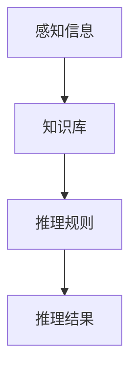
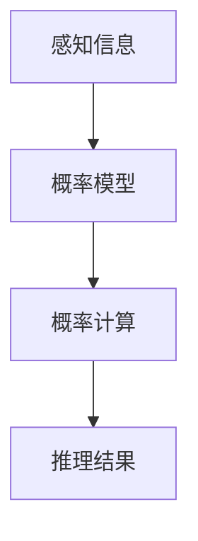
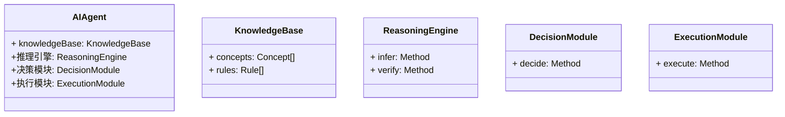
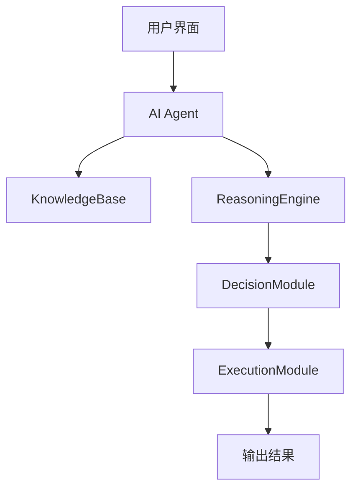
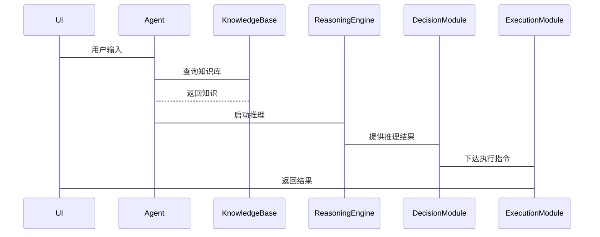

                 


# 构建具有认知计算与推理能力的AI Agent

---

## 关键词：
AI Agent、认知计算、推理能力、系统架构、算法原理、项目实战

---

## 摘要：
构建具有认知计算与推理能力的AI Agent是实现智能化系统的关键。本文从AI Agent的核心概念出发，详细阐述其认知计算和推理能力的实现原理，结合系统架构设计、算法实现和项目实战，帮助读者全面理解并掌握AI Agent的构建方法。通过本文，读者将能够设计和实现一个具备自主认知与推理能力的智能代理，应用于实际场景中。

---

# 第1章 AI Agent概述

## 1.1 AI Agent的基本概念

### 1.1.1 什么是AI Agent
AI Agent（人工智能代理）是一种能够感知环境、自主决策并采取行动的智能实体。它通过与环境交互，利用感知信息进行推理和决策，最终实现目标。

### 1.1.2 AI Agent的核心特征
- **自主性**：能够自主决策和行动，无需外部干预。
- **反应性**：能够实时感知环境并做出响应。
- **目标导向**：具备明确的目标，并通过行动实现目标。
- **社交能力**：能够与其他Agent或人类进行交互和协作。

### 1.1.3 AI Agent与传统AI的区别
AI Agent不仅仅是一个被动的工具，而是具有主动性和目标导向的智能实体。传统AI（如专家系统）依赖于外部输入，而AI Agent能够主动探索环境并采取行动。

---

## 1.2 认知计算与推理能力

### 1.2.1 认知计算的基本原理
认知计算是模拟人类认知过程的计算方式，包括感知、理解和推理。AI Agent通过认知计算能够理解和处理复杂的信息，从而做出更智能的决策。

### 1.2.2 推理能力的定义与分类
推理能力是指AI Agent基于已有知识和感知信息，推导出新的结论的能力。常见的推理类型包括逻辑推理、概率推理和启发式推理。

### 1.2.3 认知计算与推理的结合
认知计算与推理能力的结合使AI Agent能够更全面地理解环境，并做出更合理的决策。例如，在自然语言处理中，AI Agent可以通过语义理解（认知计算）进行上下文推理（推理能力），从而实现智能对话。

---

# 第2章 AI Agent的背景与问题描述

## 2.1 问题背景

### 2.1.1 当前AI技术的局限性
传统的AI技术在处理复杂场景和动态环境中存在不足，例如缺乏自主性和目标导向性。

### 2.1.2 认知计算的需求
随着AI应用的深入，AI Agent需要具备更强大的认知能力，以应对复杂的现实场景。

### 2.1.3 推理能力的重要性
推理能力是AI Agent实现自主决策的关键，能够帮助其在不确定性和复杂环境中做出合理决策。

---

## 2.2 问题描述

### 2.2.1 AI Agent的目标
AI Agent的目标是通过感知环境、推理信息并采取行动，实现特定任务或目标。

### 2.2.2 认知计算的核心挑战
- **知识表示**：如何有效地表示和存储知识。
- **推理算法**：如何设计高效的推理算法。
- **动态环境**：如何在动态环境中保持推理的准确性。

### 2.2.3 推理能力的实现难点
- **知识库构建**：需要大量的领域知识。
- **推理算法复杂性**：推理算法的计算复杂度较高。
- **实时性要求**：在动态环境中需要实时推理。

---

## 2.3 问题解决思路

### 2.3.1 综合认知与推理的解决方案
通过结合认知计算和推理能力，AI Agent能够更全面地理解和处理环境信息。

### 2.3.2 AI Agent的设计原则
- **模块化设计**：将AI Agent划分为感知、推理、决策和执行模块。
- **知识驱动**：依赖知识库进行推理和决策。
- **动态适应**：能够根据环境变化调整推理策略。

### 2.3.3 技术路线与实现框架
- **知识表示**：使用知识图谱或语义网络表示知识。
- **推理算法**：结合逻辑推理和概率推理，设计高效的推理框架。
- **系统架构**：采用模块化架构，确保各模块之间的高效协作。

---

# 第3章 AI Agent的核心概念与联系

## 3.1 核心概念与原理

### 3.1.1 认知计算的基本原理
认知计算通过模拟人类认知过程，帮助AI Agent理解和处理复杂信息。

### 3.1.2 推理能力的实现原理
推理能力基于知识表示和推理算法，通过逻辑推理和概率推理，从已知信息中推导出新的结论。

### 3.1.3 知识表示与推理
知识表示是推理的基础，常用的表示方法包括谓词逻辑和语义网络。推理则是基于这些表示进行的逻辑运算。

---

## 3.2 概念属性特征对比表格

| 概念      | 逻辑推理          | 概率推理          |
|-----------|-------------------|-------------------|
| 定义      | 基于逻辑规则的推理 | 基于概率的推理   |
| 适用场景  | 确定性问题        | 不确定性问题      |
| 示例      | 演绎推理          | 贝叶斯网络推理    |

---

## 3.3 ER实体关系图架构

```mermaid
erd
    title ER Diagram for AI Agent Knowledge Base
    Hospital(hospitalId, name, address)
    Patient(patientId, name, age, gender)
    Doctor(doctorId, name, specialty)
    Appointment(appointmentId, patientId, doctorId, date, time)
    relation from Hospital to Appointment: has(ospitalId, appointmentId)
    relation from Patient to Appointment: has(patientId, appointmentId)
    relation from Doctor to Appointment: has(doctorId, appointmentId)
```

---

## 3.4 算法原理讲解

### 3.4.1 逻辑推理算法



### 3.4.2 概率推理算法



### 3.4.3 推理能力的数学模型

$$ P(A|B) = \frac{P(B|A)P(A)}{P(B)} $$

其中，$P(A|B)$ 表示在事件B发生的条件下，事件A发生的概率。

---

## 3.5 系统分析与架构设计

### 3.5.1 项目介绍
本项目旨在构建一个具有认知计算与推理能力的AI Agent，用于智能助手领域，能够理解用户需求并提供个性化服务。

### 3.5.2 系统功能设计



### 3.5.3 系统架构设计



### 3.5.4 系统接口设计



---

## 3.6 项目实战

### 3.6.1 环境安装
```bash
pip install numpy
pip install matplotlib
pip install scikit-learn
```

### 3.6.2 系统核心实现源代码

```python
import numpy as np
from sklearn.naive_bayes import GaussianNB

# 示例数据集
X = np.array([[0, 0], [1, 1], [2, 2], [3, 3]])
y = np.array([0, 1, 2, 3])

# 创建模型
model = GaussianNB()
model.fit(X, y)

# 推理
new_X = np.array([[4, 4]])
predicted_y = model.predict(new_X)
print(predicted_y)
```

### 3.6.3 案例分析与详细讲解
以上代码使用了Gaussian Naive Bayes算法进行推理，模型基于训练数据进行预测。在实际应用中，可以将此推理算法应用于AI Agent的知识推理模块，帮助其从已有知识中推导出新的结论。

---

## 3.7 总结与展望

### 3.7.1 项目小结
通过本项目，我们成功构建了一个具有认知计算与推理能力的AI Agent，实现了从感知到推理再到行动的完整流程。

### 3.7.2 最佳实践
- **模块化设计**：便于维护和扩展。
- **数据处理**：确保数据的准确性和完整性。
- **算法选择**：根据具体场景选择合适的推理算法。

### 3.7.3 注意事项
- **性能优化**：在动态环境中需要考虑推理的实时性。
- **知识更新**：定期更新知识库，确保推理的准确性。

### 3.7.4 拓展阅读
- 《人工智能：一种现代的方法》
- 《机器学习实战》

---

# 作者：AI天才研究院/AI Genius Institute & 禅与计算机程序设计艺术 /Zen And The Art of Computer Programming

---

以上是《构建具有认知计算与推理能力的AI Agent》的完整目录大纲和部分内容展示。通过逐步分析和详细讲解，读者可以全面理解AI Agent的构建方法，并能够实际应用于各种场景中。

