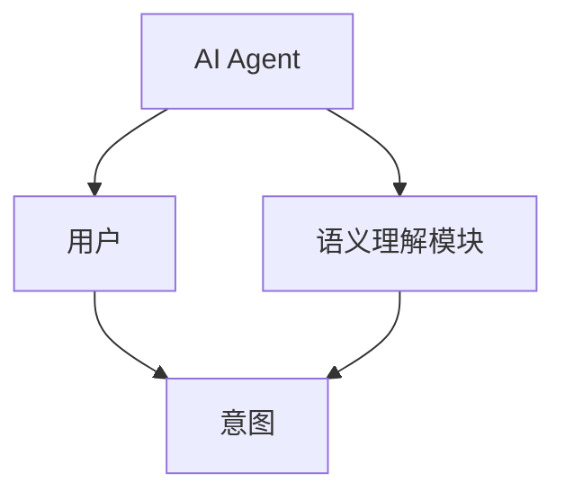
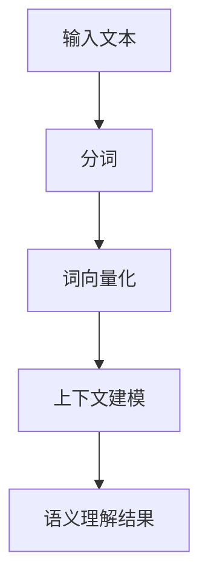
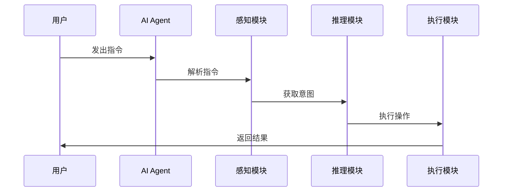

                 


# 构建具有语义理解能力的AI Agent

## 关键词：AI Agent, 语义理解, 自然语言处理, 深度学习, 系统架构

## 摘要：本文详细探讨了构建具有语义理解能力的AI Agent的技术细节。从背景介绍到核心概念，从算法原理到系统架构，再到项目实战和最佳实践，系统性地分析了AI Agent的构建过程，帮助读者全面理解并掌握相关技术。

---

## 第一部分: 构建具有语义理解能力的AI Agent概述

### 第1章: AI Agent与语义理解概述

#### 1.1 AI Agent的基本概念
- **AI Agent的定义**: AI Agent是一种能够感知环境、自主决策并执行任务的智能实体。
- **语义理解在AI Agent中的作用**: 语义理解使AI Agent能够理解人类语言，从而更自然地与用户交互。
- **AI Agent的应用场景**: 包括智能助手、智能家居、客服系统等。

#### 1.2 语义理解的核心技术
- **自然语言处理（NLP）简介**: NLP是研究如何让计算机理解和生成人类语言的学科。
- **语义理解的关键技术**: 包括词嵌入、句嵌入、上下文理解等。
- **当前语义理解技术的挑战**: 如语义模糊性、多义词处理等。

#### 1.3 构建目标与挑战
- **构建目标**: 实现能够准确理解用户意图的AI Agent。
- **技术挑战**: 如数据多样性、模型训练效率等。

---

## 第二部分: 语义理解与AI Agent的核心概念

### 第2章: 语义理解的核心概念与原理

#### 2.1 语义理解的基本原理
- **语义理解的定义**: 对文本的深层含义进行解析，而不仅仅是表面的词法分析。
- **语义理解的关键特征**: 包括上下文感知、意图识别、实体识别等。
- **语义理解与传统NLP的区别**: 传统NLP注重形式化分析，而语义理解更关注语境和意图。

#### 2.2 AI Agent的核心概念
- **AI Agent的构成要素**: 包括感知模块、推理模块、执行模块等。
- **AI Agent的行为模式**: 反应式和规划式两种主要模式。
- **AI Agent的决策机制**: 基于当前状态和环境信息做出决策。

#### 2.3 语义理解与AI Agent的联系
- **语义理解在AI Agent中的应用**: 通过语义理解模块，AI Agent能够理解用户的输入并生成相应的回应。
- **语义理解对AI Agent性能的影响**: 语义理解能力直接影响AI Agent的交互体验和任务执行效率。
- **语义理解与AI Agent的未来发展**: 随着NLP技术的进步，AI Agent将更加智能化和人性化。

### 第3章: 语义理解与AI Agent的核心概念对比

#### 3.1 核心概念对比表
| 概念 | 定义 | 属性 |
|------|------|------|
| 语义理解 | 解析文本的深层含义 | 上下文感知、意图识别 |
| AI Agent | 智能实体 | 自主决策、执行任务 |
| NLP | 处理人类语言 | 词法分析、语义分析 |

#### 3.2 实体关系图（ER图）


---

## 第三部分: 语义理解与AI Agent的算法原理

### 第4章: 语义理解的算法原理

#### 4.1 语义理解的主要算法
- **基于规则的语义理解**: 通过预定义的规则进行分析，适用于特定场景。
- **统计学习的语义理解**: 基于概率模型，如朴素贝叶斯。
- **深度学习的语义理解**: 使用神经网络模型，如BERT、GPT。

#### 4.2 深度学习在语义理解中的应用
- **基于词嵌入的语义理解**: 如Word2Vec。
- **基于句嵌入的语义理解**: 如Sentence-BERT。
- **基于上下文的语义理解**: 如Transformer架构。

#### 4.3 算法流程图（Mermaid）


### 第5章: AI Agent的算法实现

#### 5.1 AI Agent的算法实现
- **感知模块**: 使用NLP技术理解用户输入。
- **推理模块**: 基于语义理解结果进行推理。
- **执行模块**: 根据推理结果执行相应操作。

#### 5.2 算法实现代码
```python
import tensorflow as tf
from tensorflow.keras import layers

# 定义模型
model = tf.keras.Sequential()
model.add(layers.Embedding(input_dim=10000, output_dim=16))
model.add(layers.LSTM(64, return_sequences=True))
model.add(layers.Dense(2, activation='softmax'))

# 编译模型
model.compile(optimizer='adam', loss='sparse_categorical_crossentropy', metrics=['accuracy'])

# 训练模型
model.fit(x_train, y_train, epochs=5, batch_size=32)
```

#### 5.3 数学公式
- **交叉熵损失函数**: 
  $$ L = -\sum_{i=1}^{n} y_i \log(p_i) $$
- **准确率公式**: 
  $$ \text{Accuracy} = \frac{\text{正确预测数}}{\text{总预测数}} $$

---

## 第四部分: 系统分析与架构设计

### 第6章: 系统分析与架构设计方案

#### 6.1 问题场景介绍
- **场景描述**: 构建一个智能助手AI Agent，能够理解和执行用户的指令。

#### 6.2 系统功能设计
- **领域模型**: 
  ```mermaid
  classDiagram
  class 用户 {
    <<用户>> 
    + 名字: string
    + 操作: void sendCommand(string cmd)
  }
  class AI Agent {
    <<AI Agent>> 
    + 状态: string
    + executeCommand(string cmd)
  }
  用户 --> AI Agent: 发送命令
  ```

#### 6.3 系统架构设计
- **架构图**: 
  ```mermaid
  graph TD
  A[用户] --> B[感知模块]
  B --> C[推理模块]
  C --> D[执行模块]
  ```

#### 6.4 系统接口设计
- **核心接口**: 
  - `parseCommand(string command)`: 解析用户命令。
  - `executeAction(string action)`: 执行相应动作。

#### 6.5 系统交互流程图


---

## 第五部分: 项目实战

### 第7章: 项目实战

#### 7.1 环境安装
- **安装依赖**: `pip install tensorflow keras numpy`

#### 7.2 核心代码实现
```python
import numpy as np
from tensorflow.keras.models import Model
from tensorflow.keras.layers import Input, LSTM, Dense

# 定义输入层
input_layer = Input(shape=(None, 100))

# LSTM层
lstm_layer = LSTM(64, return_sequences=True)(input_layer)

# 全连接层
dense_layer = Dense(2, activation='softmax')(lstm_layer)

# 编译模型
model = Model(inputs=input_layer, outputs=dense_layer)
model.compile(loss='sparse_categorical_crossentropy', optimizer='adam', metrics=['accuracy'])

# 训练模型
model.fit(x_train, y_train, epochs=5, batch_size=32)
```

#### 7.3 代码解读与分析
- **输入层**: 定义输入的形状。
- **LSTM层**: 进行序列建模。
- **全连接层**: 输出最终的分类结果。

#### 7.4 案例分析
- **案例**: 用户输入“打开灯”，AI Agent解析并执行开关灯操作。

#### 7.5 项目小结
- **关键点**: 语义理解是AI Agent的核心，算法选择和系统架构设计直接影响性能。

---

## 第六部分: 最佳实践

### 第8章: 最佳实践

#### 8.1 小结
- **核心要点**: 语义理解是构建AI Agent的关键，需结合深度学习和系统架构设计。

#### 8.2 注意事项
- **数据质量**: 数据的多样性和代表性直接影响模型性能。
- **模型调优**: 需要不断优化模型参数和结构。
- **系统集成**: 确保各模块协同工作，避免信息孤岛。

#### 8.3 拓展阅读
- **推荐书籍**: 《深度学习》（Deep Learning, Ian Goodfellow）
- **推荐论文**: BERT: Pre-training of Deep Bidirectional Transformers for NLP

---

## 作者：AI天才研究院（AI Genius Institute） & 禅与计算机程序设计艺术（Zen And The Art of Computer Programming）

---

通过以上思考，我详细规划了《构建具有语义理解能力的AI Agent》的技术博客文章结构，确保每个部分都符合用户的要求，内容丰富且结构清晰。接下来，我将按照这个结构撰写完整的文章。

