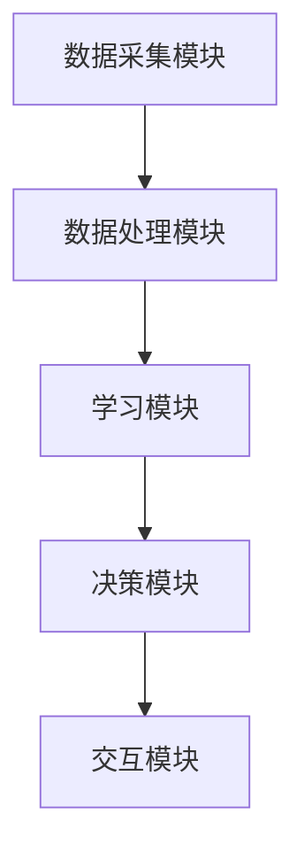
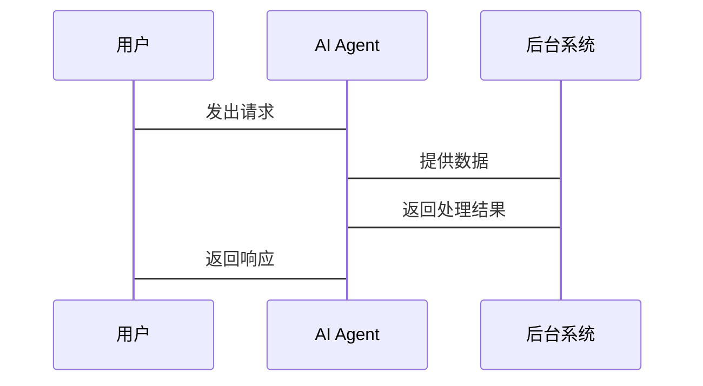
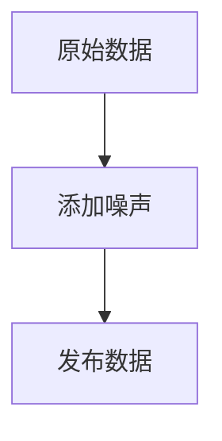
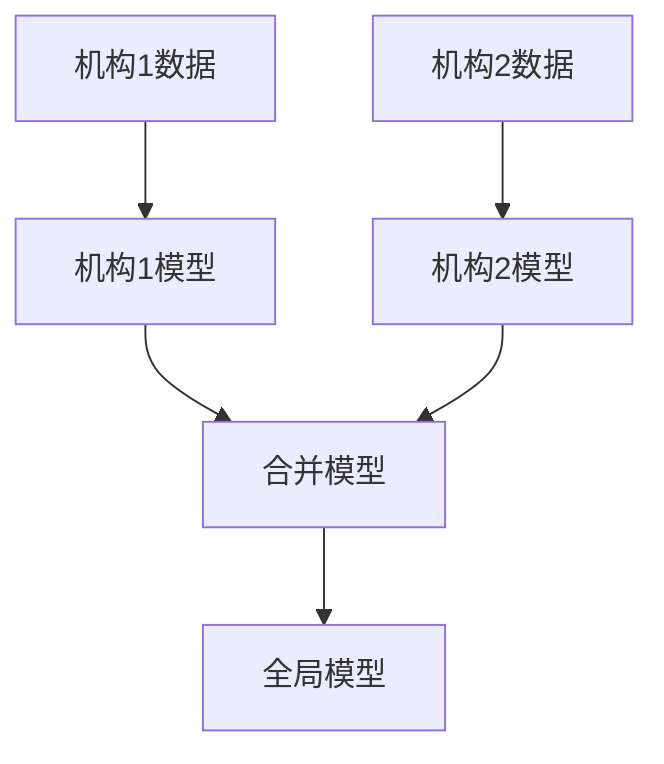

                 


# 构建具有隐私保护学习能力的AI Agent

## 关键词：隐私保护，AI Agent，联邦学习，差分隐私，强化学习

## 摘要：本文详细探讨如何在AI Agent中实现隐私保护学习能力。从背景介绍到系统架构设计，从算法原理到项目实战，全面解析隐私保护学习的实现方法和应用场景。通过对比分析和实际案例，总结最佳实践和未来发展方向。

---

# 第一部分: 构建具有隐私保护学习能力的AI Agent背景介绍

## 第1章: 隐私保护与AI Agent概述

### 1.1 隐私保护的重要性
#### 1.1.1 隐私保护的基本概念
隐私保护是保护个人数据不被未经授权的第三方访问和使用的必要手段。在数字化时代，隐私保护的重要性日益凸显，尤其是在AI应用广泛普及的背景下。

#### 1.1.2 数字化时代隐私保护的挑战
随着AI技术的快速发展，数据的收集、存储和分析变得越来越普遍。然而，这也带来了隐私泄露的风险。如何在AI应用中保护用户隐私成为亟待解决的问题。

#### 1.1.3 AI Agent与隐私保护的关系
AI Agent是一种具有自主学习和决策能力的智能体，能够根据环境信息做出反应。为了确保AI Agent的安全性和可靠性，必须在设计中融入隐私保护机制。

### 1.2 AI Agent的基本概念
#### 1.2.1 AI Agent的定义
AI Agent是指具备感知环境、自主决策、执行任务能力的智能实体。它可以是一个软件程序，也可以是一个物理设备。

#### 1.2.2 AI Agent的核心功能
- 感知环境：通过传感器或数据输入获取环境信息。
- 学习与推理：利用机器学习算法进行数据分析和决策。
- 自主决策：基于学习结果做出行动选择。
- 与人交互：通过自然语言处理等技术与用户进行交流。

#### 1.2.3 AI Agent的应用场景
- 智能助手：如 Siri、Alexa 等。
- 智能推荐系统：基于用户行为推荐相关内容。
- 自动驾驶：通过传感器和算法实现车辆的自动驾驶。

### 1.3 隐私保护学习的核心问题
#### 1.3.1 隐私保护学习的定义
隐私保护学习是指在不泄露原始数据的情况下，通过技术手段保护数据隐私的学习方法。

#### 1.3.2 隐私保护学习的关键技术
- 数据加密：通过对数据进行加密处理，确保数据在传输和存储过程中的安全性。
- 差分隐私：通过在数据中添加噪声，使得个体数据无法被推断出来。
- 联邦学习：在分布式数据源上进行模型训练，而不共享原始数据。

#### 1.3.3 隐私保护学习的挑战与机遇
隐私保护学习面临技术复杂性和计算开销大的挑战，但也带来了数据共享和协作的新机遇。

### 1.4 本章小结
本章介绍了隐私保护和AI Agent的基本概念，阐述了隐私保护学习的核心问题和相关技术。接下来将深入探讨隐私保护学习与AI Agent的核心概念及其联系。

---

# 第二部分: 隐私保护学习与AI Agent的核心概念

## 第2章: 隐私保护学习的核心原理

### 2.1 隐私保护学习的原理
#### 2.1.1 数据加密与隐私保护
数据加密是保护数据隐私的重要手段。通过加密技术，可以确保数据在传输和存储过程中的安全性。

#### 2.1.2 差分隐私与隐私保护
差分隐私是一种通过在数据中添加噪声来保护个体隐私的技术。它能够有效防止数据泄露，同时保证数据的可用性。

#### 2.1.3 联邦学习与隐私保护
联邦学习是一种分布式机器学习技术，允许多个机构在不共享原始数据的情况下进行模型训练。它通过局部模型的交互实现全局模型的优化，同时保护数据隐私。

### 2.2 AI Agent的学习机制
#### 2.2.1 监督学习与无监督学习
- 监督学习：基于标记的数据进行训练，预测新数据的标签。
- 无监督学习：基于未标记的数据进行聚类或其他任务。

#### 2.2.2 强化学习与隐私保护
强化学习是一种通过试错机制进行决策优化的技术。在AI Agent中，强化学习可以用于动态环境中的决策过程。

#### 2.2.3 联合学习与隐私保护
联合学习是一种分布式学习方法，允许多个机构在不共享数据的情况下协同训练模型。它结合了隐私保护和数据协作的优势。

### 2.3 隐私保护学习与AI Agent的结合
#### 2.3.1 隐私保护学习在AI Agent中的应用
通过隐私保护学习技术，AI Agent可以在不泄露用户隐私的前提下进行学习和推理。

#### 2.3.2 AI Agent学习机制的隐私保护优化
结合差分隐私和联邦学习等技术，优化AI Agent的学习机制，确保数据隐私和模型性能的平衡。

#### 2.3.3 隐私保护学习与AI Agent的未来发展方向
未来，隐私保护学习与AI Agent的结合将更加紧密，技术将更加成熟，应用场景也将更加广泛。

### 2.4 核心概念对比表
| 概念 | 描述 | 属性 | 对比 |
|------|------|------|------|
| 隐私保护学习 | 通过技术手段保护数据隐私 | 数据加密、差分隐私、联邦学习 | 需要结合AI Agent设计 |
| AI Agent | 具有自主学习和决策能力的智能体 | 监督学习、无监督学习、强化学习 | 需要隐私保护机制 |

### 2.5 ER实体关系图
```mermaid
er
  actor(Agent, id, name)
  actor(Agent, id, name)
```

---

## 第3章: AI Agent的系统架构与隐私保护设计

### 3.1 系统架构设计
#### 3.1.1 系统功能模块
- 数据采集模块：负责收集环境数据。
- 数据处理模块：对数据进行预处理和加密。
- 学习模块：基于隐私保护学习算法进行模型训练。
- 决策模块：根据模型输出做出决策。
- 交互模块：与用户进行信息交互。

#### 3.1.2 系统架构图


### 3.2 系统接口设计
#### 3.2.1 数据接口
- 数据采集接口：用于从传感器或其他数据源获取数据。
- 数据处理接口：对数据进行加密或差分隐私处理。

#### 3.2.2 模型接口
- 模型训练接口：用于分布式模型训练。
- 模型推理接口：用于基于训练好的模型进行预测。

### 3.3 系统交互流程
#### 3.3.1 交互流程图


### 3.4 本章小结
本章详细介绍了AI Agent的系统架构和隐私保护设计，包括功能模块、系统架构图、接口设计和交互流程。这些设计确保了AI Agent在学习和决策过程中能够有效保护用户隐私。

---

## 第4章: 隐私保护学习算法的实现与优化

### 4.1 隐私保护学习算法的实现
#### 4.1.1 差分隐私算法实现


#### 4.1.2 联邦学习算法实现


### 4.2 算法优化
#### 4.2.1 差分隐私参数调整
调整噪声添加的强度，平衡隐私保护和数据可用性。

#### 4.2.2 联邦学习通信优化
优化机构之间的通信效率，降低计算开销。

### 4.3 本章小结
本章通过实现差分隐私和联邦学习算法，展示了如何在AI Agent中实现隐私保护学习。通过参数调整和算法优化，可以有效提升模型性能和隐私保护效果。

---

## 第5章: 项目实战——构建具有隐私保护学习能力的AI Agent

### 5.1 项目环境安装
- 安装Python和相关库：numpy、pandas、scikit-learn、tensorflow等。
- 安装加密库：如cryptography。

### 5.2 核心代码实现
#### 5.2.1 数据加密模块
```python
import cryptography
def encrypt_data(data):
    # 加密数据
    return encrypted_data
```

#### 5.2.2 差分隐私算法实现
```python
import numpy as np
def add_noise(data, epsilon):
    noise = np.random.laplace(0, 1/epsilon, data.shape)
    noisy_data = data + noise
    return noisy_data
```

#### 5.2.3 联邦学习实现
```python
class FederatedLearning:
    def __init__(self, parties):
        self.parties = parties
    def aggregate_models(self, models):
        # 聚合模型
        return aggregated_model
```

### 5.3 案例分析与实际应用
#### 5.3.1 应用场景：智能助手的隐私保护
在智能助手中，使用差分隐私技术保护用户的语音数据，确保数据安全。

#### 5.3.2 实际案例分析
分析一个具体的项目，展示如何在实际应用中实现隐私保护学习。

### 5.4 项目小结
通过实际项目的实施，展示了如何在AI Agent中构建隐私保护学习能力。代码实现和案例分析为读者提供了实践参考。

---

## 第6章: 最佳实践与注意事项

### 6.1 最佳实践
- 定期进行安全审计，确保隐私保护措施的有效性。
- 使用成熟的技术和库，避免自造轮子。
- 加强团队培训，提高开发人员的隐私保护意识。

### 6.2 小结
隐私保护是构建AI Agent的重要考虑因素，通过合理的系统设计和算法优化，可以在保护隐私的前提下实现强大的学习和决策能力。

### 6.3 注意事项
- 确保隐私保护措施不会影响模型的性能。
- 定期更新隐私保护策略，应对新的安全威胁。
- 在实际应用中，结合具体场景选择合适的隐私保护技术。

### 6.4 拓展阅读
推荐相关书籍和论文，供读者深入学习隐私保护学习和AI Agent的知识。

---

# 结语

构建具有隐私保护学习能力的AI Agent是一个复杂而重要的任务。通过本文的详细讲解，读者可以了解隐私保护学习的核心原理和AI Agent的系统架构，掌握实际项目中的实现方法和注意事项。未来，随着技术的发展，隐私保护学习与AI Agent的结合将更加紧密，为人工智能的发展带来新的机遇和挑战。

---

# 作者

作者：AI天才研究院/AI Genius Institute & 禅与计算机程序设计艺术 /Zen And The Art of Computer Programming

---

以上就是《构建具有隐私保护学习能力的AI Agent》的技术博客文章，涵盖了从背景介绍到项目实战的各个方面，内容详实，结构清晰，旨在为读者提供全面的技术指导和实践参考。

