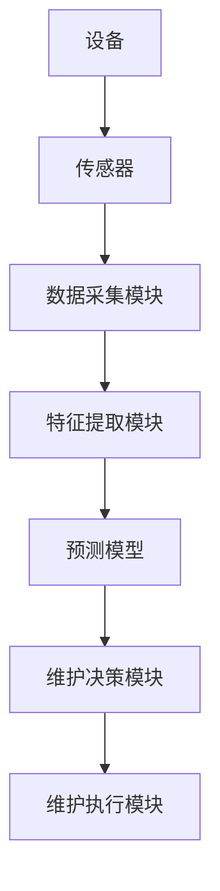
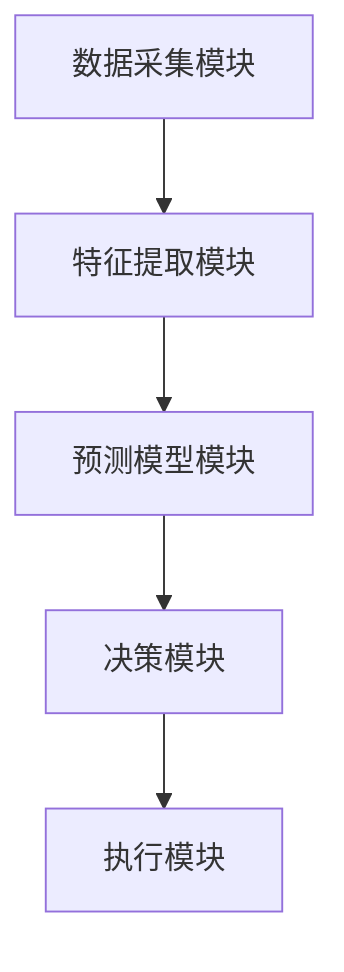
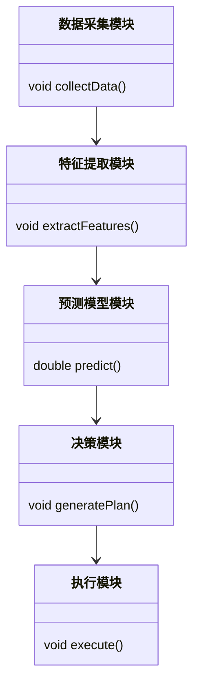
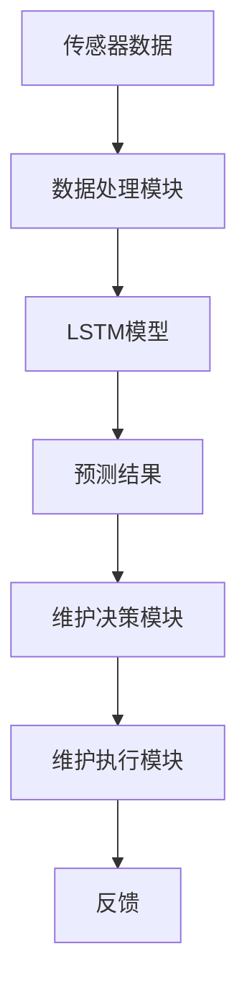

                 


# 《构建具有预测维护能力的AI Agent》

---

## 关键词：预测维护、AI Agent、时间序列分析、机器学习、系统架构

---

## 摘要：  
本文将详细探讨如何构建一个具有预测维护能力的AI Agent。从背景知识到核心概念，从算法原理到系统架构，从项目实战到最佳实践，本文将一步步引导读者理解并掌握构建此类AI Agent的方法。通过具体的案例分析和代码实现，我们将深入探讨预测维护的核心算法、系统设计和实际应用。

---

## 第一部分: 预测维护AI Agent的背景与核心概念

### 第1章: 预测维护AI Agent的背景与问题定义

#### 1.1 预测维护的背景与意义  
预测性维护是一种基于设备运行数据的智能化维护方式，旨在通过预测设备的健康状态，提前发现潜在故障，从而避免设备停机和生产损失。随着工业4.0和物联网技术的普及，预测性维护在制造业、能源、交通等领域的重要性日益凸显。AI Agent作为一种能够自主感知、分析和决策的智能体，能够完美地服务于预测性维护的需求。

#### 1.2 AI Agent的核心概念  
AI Agent（智能体）是指能够感知环境、自主决策并执行任务的智能系统。它具备以下核心特征：  
1. **自主性**：能够独立运行，无需外部干预。  
2. **反应性**：能够实时感知环境变化并做出反应。  
3. **学习能力**：能够通过数据和经验不断优化自身性能。  
4. **决策能力**：能够基于数据和模型做出最优决策。  

#### 1.3 问题背景与问题描述  
在传统设备维护模式中，设备的维护通常是基于固定的周期或等待设备发生故障后进行。这种模式存在以下问题：  
- **维护成本高**：设备故障后修复的成本远高于预防性维护。  
- **生产中断**：设备故障可能导致生产线停工，影响生产效率。  
- **维护周期不灵活**：固定周期的维护可能过早或过晚，导致资源浪费或维护不足。  

预测性维护通过AI Agent的实时监控和预测能力，能够提前发现潜在故障，优化维护计划，从而降低维护成本，减少生产中断。

#### 1.4 核心概念与联系  
预测维护AI Agent的核心要素包括：  
1. **数据采集**：从设备中获取实时数据，如温度、振动、压力等。  
2. **特征提取**：从原始数据中提取有用的特征，用于后续的预测和分析。  
3. **模型训练**：基于历史数据训练预测模型，用于预测设备的健康状态。  
4. **决策与执行**：根据预测结果，生成维护计划并执行维护操作。  

**实体关系图（Mermaid）**：



---

## 第二部分: 预测维护AI Agent的核心原理与算法

### 第2章: 预测维护的核心原理

#### 2.1 数据采集与特征提取  
数据采集是预测性维护的基础，通常包括以下步骤：  
1. **传感器数据采集**：通过传感器获取设备的实时数据。  
2. **数据预处理**：对采集的数据进行清洗、归一化等处理。  
3. **特征提取**：从原始数据中提取有用的特征，如均值、方差、峰值等。  

**特征提取示例（表格）**：

| 特征名称       | 特征描述               | 特征类型   |
|----------------|------------------------|------------|
| 温度均值       | 设备运行过程中的温度平均值 | 数值型     |
| 振动频率       | 设备振动的频率         | 数值型     |
| 压力波动范围   | 压力的最大值与最小值   | 数值型     |
| 时间序列趋势   | 数据的时间序列趋势     | 时间序列型 |

#### 2.2 预测模型的选择与训练  
预测模型是AI Agent的核心，选择合适的模型能够显著提高预测的准确性。以下是几种常见的预测模型：  

1. **时间序列分析（ARIMA）**  
   ARIMA（自回归积分滑动平均模型）是一种广泛应用于时间序列预测的模型。其基本原理如下：  
   - **自回归部分（AR）**：利用过去的误差项来预测当前值。  
   - **滑动平均部分（MA）**：利用过去的预测误差来调整当前预测值。  

   **ARIMA模型公式**：  
   $$ ARIMA(p, d, q) $$  
   其中，\( p \) 是自回归阶数，\( d \) 是差分阶数，\( q \) 是滑动平均阶数。  

   **ARIMA流程图（Mermaid）**：

   ```mermaid
   graph TD
       A[数据输入] --> B[差分]
       B --> C[AR部分]
       C --> D[MA部分]
       D --> E[预测结果]
   ```

2. **长短期记忆网络（LSTM）**  
   LSTM是一种特殊的RNN（循环神经网络），能够有效处理时间序列数据中的长距离依赖关系。  

   **LSTM流程图（Mermaid）**：

   ```mermaid
   graph TD
       A[输入] --> B[遗忘门]
       B --> C[记忆单元]
       C --> D[输入门]
       D --> E[输出门]
       E --> F[输出结果]
   ```

   **LSTM代码示例**：

   ```python
   import numpy as np
   from tensorflow.keras.layers import LSTM, Dense
   from tensorflow.keras.models import Sequential

   model = Sequential()
   model.add(LSTM(64, input_shape=(timesteps, features)))
   model.add(Dense(1))
   model.compile(optimizer='adam', loss='mean_squared_error')
   model.fit(X_train, y_train, epochs=100, batch_size=32)
   ```

3. **集成学习（Ensemble Learning）**  
   集成学习通过将多个模型的预测结果进行融合，能够显著提高预测的准确性和鲁棒性。常用的集成方法包括投票法、加权平均法等。  

   **集成学习代码示例**：

   ```python
   from sklearn.ensemble import VotingRegressor

   regressor = VotingRegressor([
       ('arima', arima_model),
       ('lstm', lstm_model)
   ])
   regressor.fit(X_train, y_train)
   ```

#### 2.3 预测模型的评估与优化  
预测模型的评估通常基于以下指标：  
- **均方误差（MSE）**：衡量预测值与真实值之间的差距。  
- **平均绝对误差（MAE）**：衡量预测值与真实值之间的绝对差距。  
- **R²系数**：衡量模型的拟合优度。  

**评估指标公式**：  
$$ MSE = \frac{1}{n}\sum_{i=1}^{n}(y_i - \hat{y}_i)^2 $$  
$$ MAE = \frac{1}{n}\sum_{i=1}^{n}|y_i - \hat{y}_i| $$  
$$ R^2 = 1 - \frac{\sum_{i=1}^{n}(y_i - \hat{y}_i)^2}{\sum_{i=1}^{n}(y_i - \bar{y})^2} $$  

---

## 第三部分: 预测维护AI Agent的系统架构与设计

### 第3章: 系统架构与设计

#### 3.1 系统架构设计  
预测维护AI Agent的系统架构通常包括以下几个模块：  

1. **数据采集模块**：负责采集设备的实时数据。  
2. **特征提取模块**：对采集的数据进行预处理和特征提取。  
3. **预测模型模块**：基于特征数据进行预测，并输出预测结果。  
4. **决策模块**：根据预测结果生成维护计划。  
5. **执行模块**：执行维护操作并反馈结果。  

**系统架构图（Mermaid）**：



#### 3.2 系统功能设计  
预测维护AI Agent的功能设计需要考虑以下方面：  
1. **实时监控**：能够实时采集设备数据并进行分析。  
2. **预测与报警**：能够预测设备的健康状态，并在潜在故障发生前发出报警。  
3. **维护计划生成**：能够自动生成维护计划，并优化维护周期。  
4. **反馈与优化**：能够根据维护结果优化模型性能。  

**功能设计类图（Mermaid）**：



---

## 第四部分: 项目实战

### 第4章: 项目实战

#### 4.1 项目介绍  
以风力发电机组的预测性维护为例，我们来构建一个预测维护AI Agent。  

**项目目标**：  
- 实时监控风力发电机组的运行状态。  
- 预测潜在故障并生成维护计划。  

#### 4.2 环境安装  
- **硬件环境**：安装风力发电机组传感器，采集温度、振动、压力等数据。  
- **软件环境**：安装Python、TensorFlow、Scikit-learn等工具。  

#### 4.3 数据处理与特征提取  
假设我们已经采集了风力发电机组的运行数据，包括温度、振动、压力等。以下是数据处理的代码示例：  

```python
import pandas as pd
import numpy as np

# 读取数据
data = pd.read_csv('wind_turbine.csv')

# 数据预处理
data['timestamp'] = pd.to_datetime(data['timestamp'])
data.set_index('timestamp', inplace=True)

# 特征提取
features = ['temperature', 'vibration', 'pressure']
data_features = data[features].resample('D').mean().dropna()
```

#### 4.4 模型训练与预测  
基于特征数据，我们可以选择使用ARIMA或LSTM模型进行预测。以下是使用LSTM模型的代码示例：  

```python
from tensorflow.keras.models import Sequential
from tensorflow.keras.layers import LSTM, Dense

# 模型定义
model = Sequential()
model.add(LSTM(64, input_shape=(timesteps, features)))
model.add(Dense(1))
model.compile(optimizer='adam', loss='mean_squared_error')

# 模型训练
model.fit(X_train, y_train, epochs=100, batch_size=32)
```

#### 4.5 模型部署与监控  
将训练好的模型部署到生产环境中，并实时监控模型的预测结果和维护计划的执行情况。  

**部署流程图（Mermaid）**：



---

## 第五部分: 最佳实践与小结

### 第5章: 最佳实践

#### 5.1 小结  
通过本文的介绍，我们详细探讨了如何构建一个具有预测维护能力的AI Agent。从背景知识到核心算法，从系统设计到项目实战，我们一步步深入理解了预测性维护的实现过程。  

#### 5.2 注意事项  
- **数据质量**：数据的准确性和完整性对模型的性能至关重要。  
- **模型选择**：根据实际场景选择合适的模型，避免盲目追求复杂模型。  
- **系统优化**：实时监控和反馈机制能够显著提高系统的稳定性和性能。  

#### 5.3 未来趋势  
随着AI技术的不断发展，预测性维护AI Agent的应用场景将更加广泛。未来的预测性维护将更加智能化、自动化，并能够与其他工业系统无缝集成。  

#### 5.4 扩展阅读  
- 《时间序列分析与应用》  
- 《机器学习实战》  
- 《工业4.0与智能维护》  

---

## 作者：AI天才研究院 & 禅与计算机程序设计艺术

