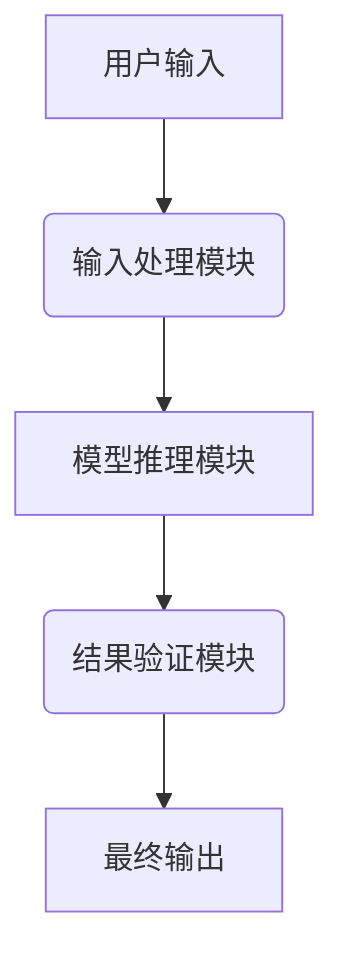

                 


# 构建可信AI Agent：LLM的安全性与可控性设计

> 关键词：可信AI Agent, 大语言模型, LLM安全性, 模型可控性, AI安全

> 摘要：  
在人工智能快速发展的今天，构建可信的AI Agent已成为一个关键挑战。本文深入探讨了大语言模型（LLM）在安全性与可控性方面的设计原则，分析了LLM可能面临的安全风险，并提出了相应的解决方案。通过对模型滥用、对抗攻击、数据安全等问题的详细分析，本文为构建安全、可控且可信的AI Agent提供了理论依据和实践指导。

---

## 第一部分：构建可信AI Agent的背景与核心概念

### 第1章：可信AI Agent与大语言模型概述

#### 1.1 可信AI Agent的基本概念
可信AI Agent是指能够在特定场景下安全、可靠地执行任务，并且其行为可预测、可控制的人工智能代理。其核心目标是确保AI Agent的行为符合人类设定的目标和伦理规范。

- **AI Agent的定义**：AI Agent是一个智能实体，能够感知环境、执行任务并做出决策。
- **可信AI Agent的特性**：
  - **可预测性**：行为符合预期。
  - **可控制性**：能够通过外部指令进行干预。
  - **可解释性**：人类能够理解其决策过程。
  - **安全性**：不会对人类或环境造成损害。

#### 1.2 大语言模型（LLM）的定义与特点
大语言模型（LLM）是一种基于深度学习的自然语言处理模型，具有以下特点：
- **强大的生成能力**：能够生成高质量的文本。
- **广泛的应用场景**：适用于对话、翻译、内容生成等领域。
- **潜在的安全风险**：模型可能被滥用，导致错误决策或恶意行为。

#### 1.3 本文的研究意义
随着LLM的广泛应用，其潜在的安全风险也逐渐显现。本文旨在通过分析LLM的安全性与可控性问题，提出构建可信AI Agent的设计方法，为实际应用提供指导。

---

### 第2章：LLM的安全性与可控性问题

#### 2.1 模型滥用与防护
模型滥用是指恶意用户利用LLM的生成能力进行非法活动。例如：
- **虚假信息生成**：生成虚假新闻或谣言。
- **钓鱼邮件生成**：利用模型生成钓鱼邮件，进行网络攻击。
- **诈骗对话**：通过对话诱导用户泄露敏感信息。

**模型滥用的防护方法**：
- **输入过滤**：对输入内容进行关键词过滤，防止恶意输入。
- **行为监控**：通过日志记录和分析，发现异常行为。
- **多层权限控制**：根据用户权限限制模型的使用范围。

#### 2.2 对抗攻击与模型鲁棒性
对抗攻击是指通过修改输入数据，使得模型产生错误输出。例如：
- **对抗样本生成**：通过修改输入文本，使得模型输出不符合预期的结果。
- **模型中毒攻击**：通过注入恶意数据，影响模型的训练过程。

**模型鲁棒性的提升方法**：
- **数据增强**：在训练过程中加入对抗样本，提高模型的鲁棒性。
- **防御算法**：使用对抗训练方法，增强模型对对抗攻击的抵抗能力。
- **模型监控**：实时监控模型输出，发现异常结果及时干预。

#### 2.3 数据安全与隐私保护
数据安全与隐私保护是构建可信AI Agent的重要环节。模型训练数据可能包含敏感信息，容易被滥用。

**数据安全的防护方法**：
- **数据脱敏**：在训练前对敏感数据进行脱敏处理。
- **数据访问控制**：严格控制数据访问权限。
- **隐私保护技术**：采用联邦学习等技术，保护数据隐私。

---

## 第二部分：可信AI Agent的安全性与可控性设计

### 第3章：模型鲁棒性与安全性设计

#### 3.1 模型鲁棒性的核心要素
模型鲁棒性是指模型在面对异常输入或对抗攻击时仍能保持正常输出的能力。核心要素包括：
- **输入验证**：对输入数据进行合法性验证。
- **异常检测**：通过异常检测算法发现异常输入。
- **容错设计**：在模型输出异常时，触发备用机制。

#### 3.2 模型可控性设计
模型可控性是指通过设计手段，确保模型的行为符合预期目标。关键设计点包括：
- **目标函数设计**：在训练过程中加入可控性相关的损失函数。
- **输出约束**：对模型输出进行内容过滤，确保输出符合规范。
- **行为监控**：通过实时监控模型行为，发现异常及时干预。

### 第4章：系统架构与实现

#### 4.1 系统架构设计
系统架构设计包括以下几个方面：
- **功能模块划分**：包括输入处理模块、模型推理模块、结果验证模块等。
- **系统交互流程**：用户输入请求，系统处理后返回结果。

**系统架构图（Mermaid）**：


#### 4.2 实现细节
实现细节包括：
- **输入处理**：对输入数据进行预处理，确保格式正确。
- **模型推理**：使用大语言模型进行推理，生成候选输出。
- **结果验证**：对候选输出进行验证，确保符合预期。

### 第5章：项目实战

#### 5.1 环境安装
- **Python环境**：安装Python 3.8及以上版本。
- **依赖库安装**：使用pip安装所需库，如TensorFlow、PyTorch等。

#### 5.2 核心代码实现
以下是核心代码实现示例：
```python
def input_processing(input_text):
    # 输入预处理
    return input_text.strip()

def model_inference(model, processed_input):
    # 使用模型进行推理
    output = model.generate(processed_input)
    return output

def result_validation(output):
    # 输出验证
    if output.contains_abusive_content():
        return ""
    else:
        return output

# 主程序
def main():
    input_text = input("请输入文本：")
    processed_input = input_processing(input_text)
    output = model_inference(model, processed_input)
    validated_output = result_validation(output)
    print(validated_output)

if __name__ == "__main__":
    main()
```

#### 5.3 测试与优化
- **测试用例设计**：设计涵盖正常输入和异常输入的测试用例。
- **性能优化**：通过优化算法和代码，提高系统运行效率。

---

## 第三部分：总结与展望

### 第6章：总结与展望
- **总结**：本文从LLM的安全性与可控性角度，探讨了构建可信AI Agent的设计方法。
- **展望**：未来研究方向包括更高效的对抗防御算法、更强大的隐私保护技术等。

### 第7章：附录
- **术语表**：解释文章中涉及的专业术语。
- **工具列表**：列出实现过程中使用的工具和库。
- **参考文献**：引用相关的学术论文和技术文档。

---

作者：AI天才研究院/AI Genius Institute & 禅与计算机程序设计艺术 /Zen And The Art of Computer Programming

