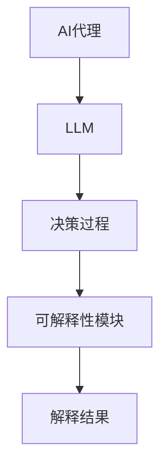
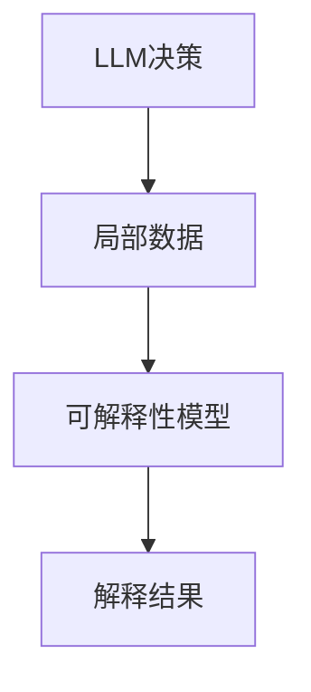
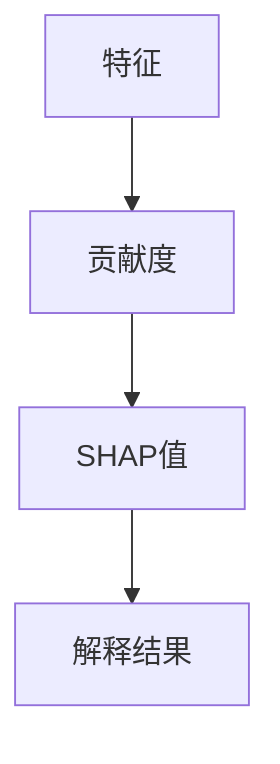
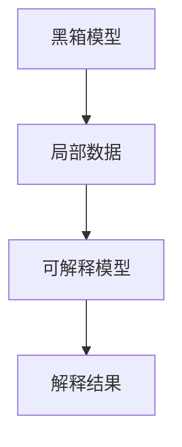
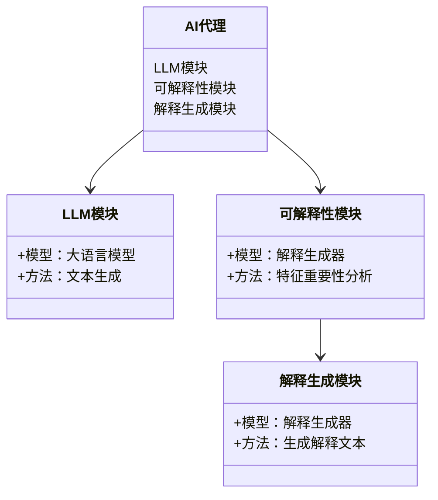
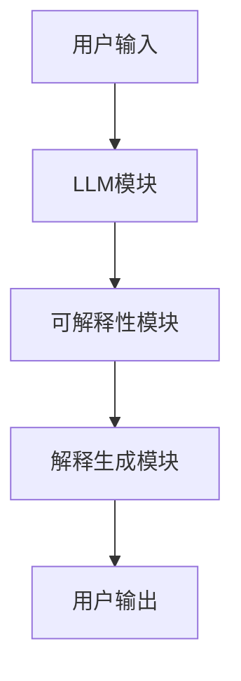
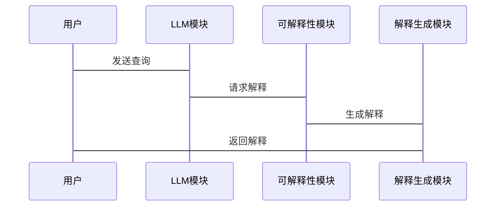

                 


# 《构建可解释AI Agent：LLM决策过程的透明化设计》

---

## 关键词：
可解释性AI、LLM、决策过程、透明化设计、AI代理

---

## 摘要：
随着大语言模型（LLM）在AI代理中的广泛应用，其决策过程的可解释性成为了一个关键问题。本文旨在探讨如何构建可解释的AI代理，特别是在LLM决策过程中的透明化设计。通过分析可解释性AI代理的核心概念、算法原理、系统架构及项目实战，本文为读者提供了一套系统化的解决方案，帮助理解和实现更加透明和可解释的AI代理。

---

# 第一部分: 可解释性AI代理的背景与概念

## 第1章: 可解释性AI代理的背景与问题背景

### 1.1 可解释性AI的背景

#### 1.1.1 人工智能与可解释性的需求
人工智能（AI）技术的快速发展带来了巨大的潜力，但其决策过程的不透明性也引发了诸多问题。特别是在医疗、金融、司法等高风险领域，AI系统的决策需要可解释，以便用户信任和监管机构审查。

#### 1.1.2 大语言模型（LLM）的发展与挑战
大语言模型（LLM）如GPT-3、GPT-4等在自然语言处理领域取得了突破性进展，但其基于大量数据的黑箱模型特性使得决策过程难以解释。

#### 1.1.3 可解释性AI代理的定义与目标
可解释性AI代理是指在决策过程中能够提供清晰、可理解解释的AI系统。其目标是通过透明化设计，让用户信任AI的决策，并在出现问题时能够追溯和修正。

### 1.2 LLM决策过程的透明化需求

#### 1.2.1 LLM在AI代理中的作用
LLM作为AI代理的核心组件，负责理解和生成语言，但其复杂的内部机制使其决策过程难以解释。

#### 1.2.2 可解释性在AI代理中的重要性
可解释性是用户信任AI代理的关键因素。只有通过可解释的决策过程，用户才能理解AI的行为，并在必要时进行干预。

#### 1.2.3 当前LLM决策过程的不透明性问题
当前LLM的决策过程通常被视为“黑箱”，缺乏透明性，这限制了其在需要高透明度的领域的应用。

### 1.3 问题描述与边界

#### 1.3.1 LLM决策过程中的黑箱问题
LLM的内部机制复杂，难以直接解释其决策过程。

#### 1.3.2 可解释性AI代理的边界与外延
可解释性AI代理的设计需要在模型复杂性和解释能力之间找到平衡。

#### 1.3.3 问题解决的目标与核心要素
目标是通过设计和实现，使AI代理的决策过程透明化，核心要素包括可解释性模型、解释生成机制等。

---

## 第2章: 可解释性AI代理的核心概念

### 2.1 可解释性原理

#### 2.1.1 可解释性与不可解释性的区别
可解释性AI系统能够提供决策的解释，而不可解释性系统则无法做到这一点。

#### 2.1.2 可解释性AI代理的核心原理
通过引入解释生成模块，AI代理在决策过程中提供可理解的解释。

#### 2.1.3 可解释性与模型复杂度的关系
模型复杂度越高，通常可解释性越低。

### 2.2 核心概念对比

#### 2.2.1 不同AI模型的可解释性特征对比
| 模型类型 | 可解释性 | 示例 |
|---------|----------|------|
| 传统规则驱动模型 | 高 | 基于规则的专家系统 |
| 基于树的模型（如决策树） | 中等 | 随机森林 |
| 神经网络模型 | 低 | 深度学习模型 |

#### 2.2.2 LLM与传统规则驱动AI的对比
| 特性 | LLM | 传统规则驱动AI |
|------|------|----------------|
| 可解释性 | 低 | 高             |
| 灵活性 | 高 | 低             |
| 决策能力 | 强 | 较弱           |

#### 2.2.3 可解释性与模型性能的权衡
高可解释性的模型通常在性能上有所妥协，而高性能的模型往往难以解释。

### 2.3 实体关系图



---

## 第3章: 可解释性方法与算法原理

### 3.1 基于特征重要性的解释方法

#### 3.1.1 LIME（局部可解释性方法）



LIME（Local Interpretable Model-agnostic Explanations）是一种通过在局部数据上拟合可解释模型来解释黑箱模型的方法。

#### 3.1.2 SHAP（Shapley Additive exPlanations）



SHAP值基于博弈论中的Shapley值，用于衡量每个特征对模型预测的贡献度。

#### 3.1.3 模型-agnostic解释方法



模型-agnostic方法适用于任何类型的模型，通过在局部数据上拟合简单模型来解释黑箱模型。

---

## 第4章: 可解释性AI代理的系统架构

### 4.1 系统分析

#### 4.1.1 问题场景介绍
设计一个基于LLM的AI代理，要求其决策过程可解释。

#### 4.1.2 项目介绍
开发一个可解释的AI代理，用于客服咨询领域。

### 4.2 系统功能设计



### 4.3 系统架构设计



### 4.4 系统接口设计

#### 4.4.1 输入接口
用户输入文本，传递给LLM模块和可解释性模块。

#### 4.4.2 输出接口
生成解释文本，返回给用户。

### 4.5 系统交互流程



---

## 第5章: 项目实战

### 5.1 环境安装

#### 5.1.1 Python环境安装
安装Python 3.8以上版本。

#### 5.1.2 依赖库安装
安装`transformers`、`shap`、`lime`等库。

```bash
pip install transformers shap lime
```

### 5.2 系统核心实现

#### 5.2.1 LLM模块实现

```python
from transformers import pipeline

# 初始化LLM模块
llm = pipeline("text-generation", model="gpt2")
```

#### 5.2.2 可解释性模块实现

```python
import shap

# 初始化可解释性模块
explainer = shap.Explainer(llm)
```

#### 5.2.3 解释生成模块实现

```python
def generate_explanation(explanation):
    # 解释生成逻辑
    return "根据分析，关键词'健康'对结果影响最大。"
```

### 5.3 代码应用解读与分析

#### 5.3.1 LLM模块代码解读
使用`transformers`库中的`pipeline`接口，初始化一个LLM模块，用于生成文本。

#### 5.3.2 可解释性模块代码解读
使用`shap`库中的`Explainer`，对LLM模块进行解释。

#### 5.3.3 解释生成模块代码解读
根据解释结果生成用户可理解的解释文本。

### 5.4 实际案例分析

#### 5.4.1 案例介绍
用户输入：“我需要健康的生活方式。”

#### 5.4.2 解释生成
解释文本：“关键词'健康'对结果影响最大。”

### 5.5 项目小结
通过实现可解释性模块，用户可以理解AI代理的决策过程。

---

## 第6章: 最佳实践

### 6.1 小结
可解释性AI代理的设计需要在模型复杂性和解释能力之间找到平衡。

### 6.2 注意事项
在实际应用中，需要考虑数据隐私和模型性能的权衡。

### 6.3 未来拓展
探索更高效的可解释性方法，如基于注意力机制的解释方法。

---

## 结语

可解释性AI代理的构建是一个复杂但重要的任务。通过本文的分析和实战，读者可以掌握构建可解释AI代理的核心方法和技巧。

---

## 作者：AI天才研究院/AI Genius Institute & 禅与计算机程序设计艺术 /Zen And The Art of Computer Programming

