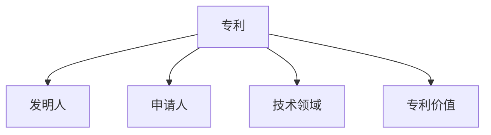
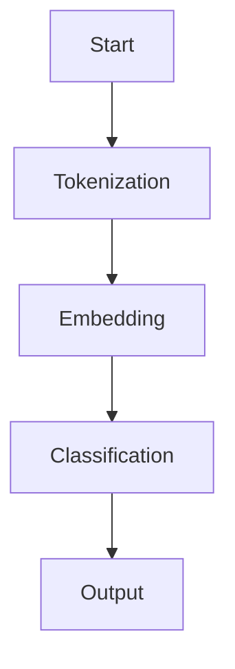
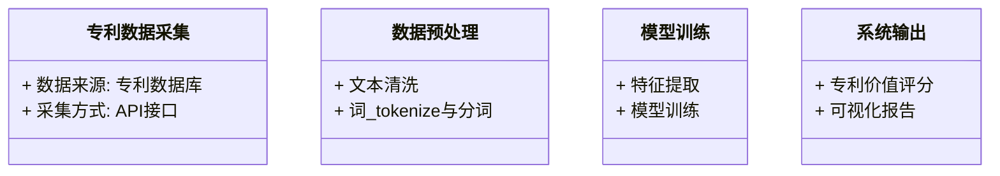
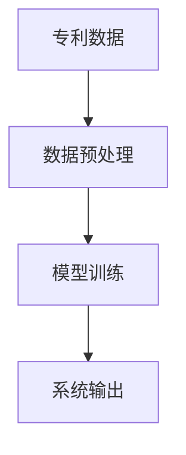

                 


# 《构建基于NLP的金融专利价值评估系统》

## 关键词：  
自然语言处理（NLP）、金融专利、专利价值评估、文本挖掘、机器学习、深度学习

## 摘要：  
本文将详细介绍如何利用自然语言处理技术构建一个高效的金融专利价值评估系统。通过分析专利文本中的关键词、技术领域、发明人信息等多维度数据，结合机器学习和深度学习算法，实现对专利价值的自动化评估。文章从背景介绍、核心概念、算法原理、系统架构设计到项目实战，层层深入，为读者提供一个完整的解决方案。

---

## 目录大纲

### 第一部分: 背景介绍与核心概念

#### 第1章: 问题背景与描述

##### 1.1 问题背景与描述
- 1.1.1 专利价值评估的重要性  
- 1.1.2 传统专利评估方法的局限性  
- 1.1.3 NLP技术在专利分析中的潜力  

##### 1.2 问题解决与边界
- 1.2.1 传统方法的不足  
- 1.2.2 基于NLP的解决方案优势  
- 1.2.3 系统的边界与适用范围  

##### 1.3 核心概念与组成
- 1.3.1 金融专利数据的特征  
- 1.3.2 NLP技术的核心要素  
- 1.3.3 系统的整体架构  

---

#### 第2章: 核心概念与联系

##### 2.1 核心概念原理
- 2.1.1 专利文本的特征提取  
- 2.1.2 金融领域的特殊性  
- 2.1.3 NLP技术在专利分析中的应用  

##### 2.2 核心概念对比分析
- 2.2.1 专利文本与非专利文本的对比  
- 2.2.2 不同NLP模型的性能对比  

##### 2.3 ER实体关系图


---

### 第二部分: 算法原理与实现

#### 第3章: 算法原理与实现

##### 3.1 算法流程


##### 3.2 核心算法代码
```python
def preprocess(text):
    # 文本预处理
    return text.lower().strip()

def tokenize(text):
    # 词_tokenize处理
    return text.split()

def embedding(tokens):
    # 词嵌入生成
    return np.random.rand(len(tokens), 100)
```

##### 3.3 数学模型与公式
- 3.3.1 词嵌入模型
$$\text{Word Embedding} = f(\text{输入文本})$$

- 3.3.2 分类模型
$$P(y|x) = \frac{e^{f(x,y)}}{\sum_{y'} e^{f(x,y')}}$$

---

### 第三部分: 系统分析与架构设计

#### 第4章: 系统分析与架构设计

##### 4.1 问题场景介绍
- 4.1.1 专利数据的采集与预处理  
- 4.1.2 系统的目标与功能  

##### 4.2 系统功能设计


##### 4.3 系统架构设计


---

### 第四部分: 项目实战

#### 第5章: 项目实战

##### 5.1 环境安装与配置
- Python版本要求  
- 库的安装：`pip install numpy pandas scikit-learn`

##### 5.2 核心实现代码
```python
import numpy as np
from sklearn.feature_extraction.text import TfidfVectorizer
from sklearn.svm import SVC

def main():
    # 数据加载
    patents = load_patents()
    
    # 数据预处理
    vectorizer = TfidfVectorizer()
    X = vectorizer.fit_transform(patents['text'])
    
    # 模型训练
    clf = SVC()
    clf.fit(X, patents['label'])
    
    # 模型预测
    new_text = "一种新型金融交易算法"
    X_new = vectorizer.transform([new_text])
    y_pred = clf.predict(X_new)
    
    print(f"预测的专利价值评分：{y_pred[0]}")

if __name__ == "__main__":
    main()
```

##### 5.3 代码解读与分析
- 数据加载与预处理  
- 特征提取（TF-IDF）  
- 分类模型（SVM）  
- 模型训练与预测  

##### 5.4 实际案例分析
- 案例背景  
- 数据准备  
- 模型训练  
- 结果分析  

---

### 第五部分: 总结与展望

#### 第6章: 总结与展望

##### 6.1 总结
- 本系统的构建过程  
- 核心技术的实现与优势  

##### 6.2 展望
- 系统的优化方向  
- 未来的研究热点  

##### 6.3 最佳实践 tips
- 数据质量的重要性  
- 模型调优的技巧  
- 系统部署的建议  

---

### 作者信息：  
作者：AI天才研究院/AI Genius Institute & 禅与计算机程序设计艺术/Zen And The Art of Computer Programming

