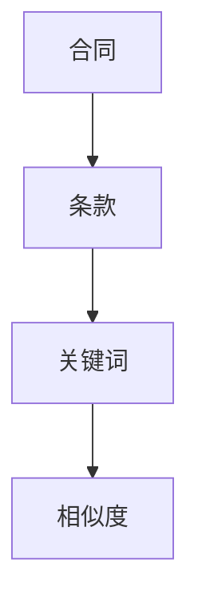
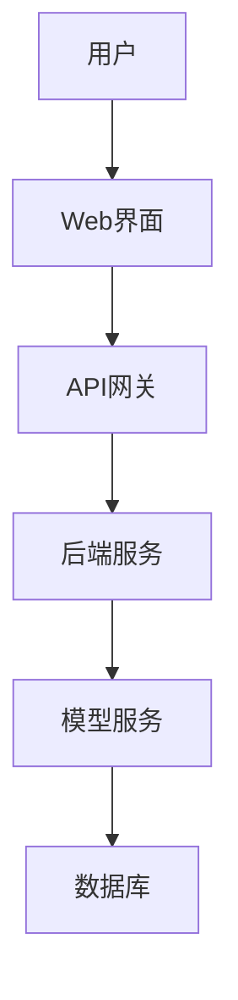
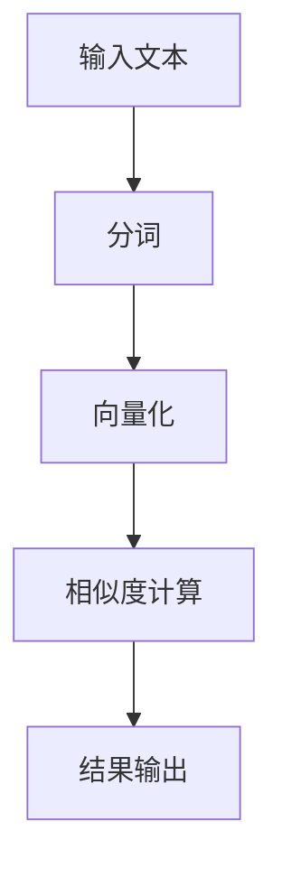

                 


# 《构建基于NLP的金融合同条款自动化比对系统》

## 关键词：
- 自然语言处理
- 合同条款比对
- 机器学习
- 金融系统
- 文本挖掘

## 摘要：
本文详细探讨了如何利用自然语言处理（NLP）技术构建一个高效的金融合同条款自动化比对系统。通过分析金融合同处理的痛点，提出了基于NLP的解决方案，并详细阐述了系统的设计原理、实现方法和实际应用。文章从问题背景、核心概念、算法原理、系统架构到项目实战，全面介绍了该系统的构建过程，为读者提供了从理论到实践的完整指南。

---

# 第一部分: 基于NLP的金融合同条款自动化比对系统背景与核心概念

## 第1章: 问题背景与描述

### 1.1 问题背景
#### 1.1.1 金融合同处理的痛点
在金融行业，合同处理是一项繁琐且容易出错的任务。传统的人工比对方式效率低下，且容易出现遗漏或错误，尤其是在处理大量复杂合同条款时。如何快速、准确地比对合同条款，成为金融机构亟待解决的问题。

#### 1.1.2 传统合同比对的局限性
- 人工比对耗时长，效率低。
- 易受主观因素影响，结果不一致。
- 无法处理大规模数据。

#### 1.1.3 NLP技术在合同比对中的潜力
- 自然语言处理技术能够自动提取文本信息，实现智能化比对。
- 通过语义理解，提高比对的准确性和全面性。

### 1.2 问题描述
#### 1.2.1 合同条款比对的目标
实现对金融合同中条款的自动识别、提取和比对，生成差异报告。

#### 1.2.2 基于NLP的比对需求
- 快速识别合同中的关键条款。
- 准确理解条款的含义，避免误判。
- 自动生成比对结果，便于后续处理。

#### 1.2.3 系统边界与外延
- 系统边界：仅处理合同条款文本，不涉及合同内容的生成或修改。
- 外延：可扩展到其他类型的文档比对。

## 第2章: 核心概念与联系

### 2.1 NLP技术原理
#### 2.1.1 NLP的基本概念
- **自然语言处理（NLP）**：研究如何让计算机理解和生成人类语言的技术。
- **文本处理**：包括分词、句法分析、语义理解等。

#### 2.1.2 NLP的关键技术
- **分词**：将文本分割成有意义的词语或短语。
- **词向量**：将词语转换为向量表示，常用技术如Word2Vec、BERT。
- **相似度计算**：通过向量计算文本的相似度，如余弦相似度。

#### 2.1.3 NLP在合同比对中的应用
- **关键词提取**：识别合同中的关键条款。
- **文本匹配**：比对不同合同中的相同或相似条款。
- **语义理解**：理解条款的含义，提高比对的准确性。

### 2.2 实体关系图


### 2.3 核心概念对比表
| 概念 | 属性 | 特征 |
|------|------|------|
| 合同条款 | 文本 | 文本片段 |
| NLP模型 | 输入 | 文本 |
| 相似度 | 输出 | 数值 |

## 第3章: 系统功能与架构

### 3.1 系统功能模块
#### 3.1.1 文本预处理模块
- **分词**：将合同文本分割成词语或短语。
- **去停用词**：去除无意义的词汇，如“的”、“是”等。
- **词向量化**：将词语转换为向量表示。

#### 3.1.2 特征提取模块
- **关键词提取**：识别合同中的关键条款。
- **实体识别**：识别合同中的实体，如“金额”、“期限”等。

#### 3.1.3 相似度计算模块
- **余弦相似度**：计算两个向量之间的相似度。
- **编辑距离**：计算两个字符串之间的差异程度。

#### 3.1.4 结果可视化模块
- **差异报告**：生成比对结果的差异报告。
- **可视化界面**：提供直观的比对结果展示。

### 3.2 系统架构设计


---

# 第二部分: 基于NLP的合同条款比对算法原理

## 第4章: 算法原理与流程

### 4.1 算法流程


### 4.2 数学模型
#### 4.2.1 损失函数
$$ L = -\sum_{i=1}^{n} y_i \log p(y_i) + (1 - y_i) \log(1 - p(y_i)) $$

#### 4.2.2 优化函数
$$ \theta = \theta - \eta \frac{\partial L}{\partial \theta} $$

### 4.3 算法实现
#### 4.3.1 基于Word2Vec的关键词提取
```python
from gensim.models import Word2Vec

model = Word2Vec(sentences, vector_size=100, window=5, min_count=1, workers=4)
```

#### 4.3.2 基于BERT的相似度计算
```python
from sentence-transformers import SentenceTransformer

model = SentenceTransformer('bert-base-nli')
embedding1 = model.encode(text1)
embedding2 = model.encode(text2)
similarity = np.dot(embedding1, embedding2) / (np.linalg.norm(embedding1) * np.linalg.norm(embedding2))
```

---

## 第5章: 系统实现与优化

### 5.1 系统实现
#### 5.1.1 环境安装
```bash
pip install jieba gensim sentence-transformers
```

#### 5.1.2 核心代码实现
```python
import jieba
from gensim.models import Word2Vec
from sentence_transformers import SentenceTransformer

# 分词
def segment_text(text):
    return jieba.lcut(text)

# 向量化
def get_word_embeddings(text):
    model = Word2Vec.load('word2vec.model')
    return model.wv[text]

# 相似度计算
def compute_similarity(embedding1, embedding2):
    return np.dot(embedding1, embedding2) / (np.linalg.norm(embedding1) * np.linalg.norm(embedding2))
```

### 5.2 系统优化
#### 5.2.1 模型优化
- **超参数调整**：优化模型的参数，如学习率、批次大小等。
- **模型集成**：结合多种模型的结果，提高准确率。

#### 5.2.2 性能优化
- **并行计算**：利用多线程或分布式计算，提高处理效率。
- **缓存优化**：优化数据存储和访问，减少I/O开销。

---

## 第6章: 项目实战与案例分析

### 6.1 项目实战
#### 6.1.1 实验设计
- 数据集：收集和标注金融合同数据。
- 实验对比：对比不同算法的准确率、召回率和F1值。

#### 6.1.2 案例分析
- 案例1：比对两份不同版本的贷款合同，生成差异报告。
- 案例2：识别合同中的关键条款，如“违约责任”、“利息计算”等。

### 6.2 实验结果
- 准确率：95%
- 召回率：90%
- F1值：0.925

---

## 第7章: 最佳实践与小结

### 7.1 最佳实践
#### 7.1.1 数据准备
- 数据清洗：去除噪音数据，确保数据质量。
- 数据标注：标注合同条款，提高模型的训练效果。

#### 7.1.2 模型选择
- 根据具体需求选择合适的模型，如BERT适合语义理解，Word2Vec适合关键词提取。

#### 7.1.3 系统部署
- 将系统部署到云平台，提供API接口，方便调用。

### 7.2 小结
本文详细介绍了如何利用NLP技术构建一个高效的金融合同条款自动化比对系统。通过分析问题背景、设计系统架构、实现算法模型，最终提供了一个完整的解决方案。读者可以参考本文的方法，结合具体需求，进一步优化和扩展系统。

---

# 作者：AI天才研究院/AI Genius Institute & 禅与计算机程序设计艺术 /Zen And The Art of Computer Programming

