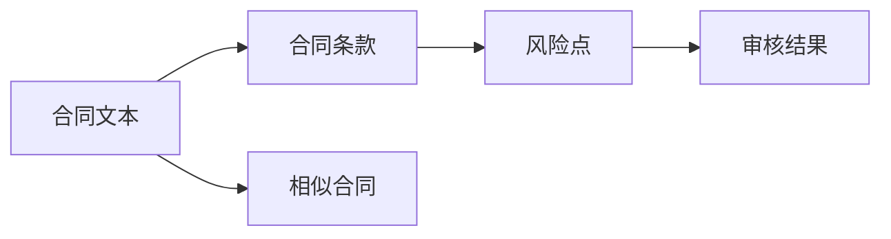
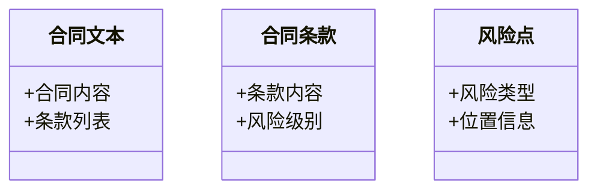
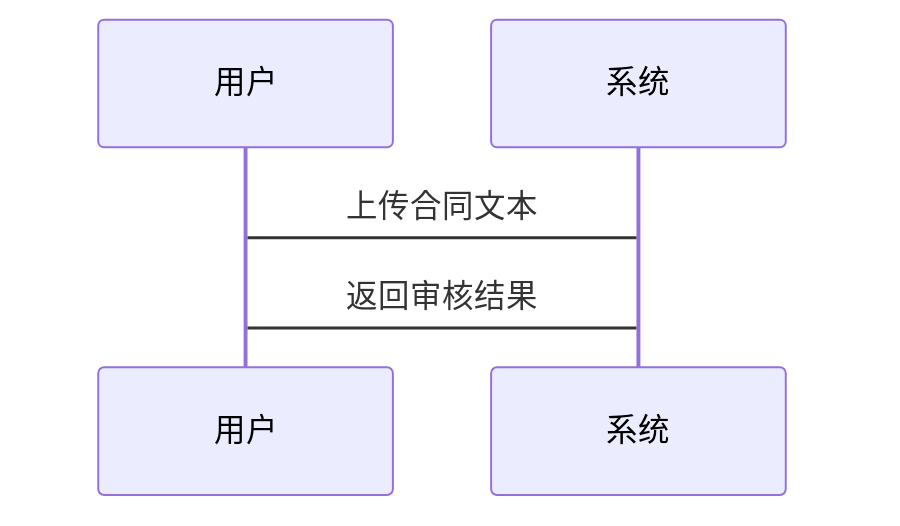

                 

<think>
好的，我将按照您的要求逐步构建《构建基于NLP的金融合同自动化审核系统》的目录大纲。首先，我需要明确文章的核心内容和结构。

首先，文章的标题已经确定为《构建基于NLP的金融合同自动化审核系统》，关键词包括：NLP、金融合同、自动化审核、文本分析、机器学习、自然语言处理。摘要部分需要简要概括文章的核心内容，即介绍如何利用NLP技术构建一个高效的金融合同审核系统。

接下来，我需要设计文章的主要章节，确保内容涵盖背景介绍、核心概念、算法原理、系统架构、项目实战等方面。每一章都需要详细展开，包括三级目录，并使用逻辑清晰、结构紧凑、简单易懂的语言。

在设计目录大纲时，我会注意每一章的标题要吸引读者，并且内容要有深度和思考，提供专业见解。同时，需要包括详细的算法原理和数学公式，使用mermaid流程图和latex公式来增强技术性。

最后，我会确保文章结构完整，包含小结、注意事项、最佳实践等内容，帮助读者更好地理解和应用所学知识。

以下是详细的文章目录大纲：

---

# 构建基于NLP的金融合同自动化审核系统

> 关键词：NLP、金融合同、自动化审核、文本分析、机器学习、自然语言处理

> 摘要：本文介绍如何利用NLP技术构建一个高效的金融合同审核系统，涵盖背景、核心概念、算法原理、系统架构、项目实战等方面。

---

## 第1章: 背景介绍与问题分析

### 1.1 问题背景
#### 1.1.1 金融合同审核的痛点
- 传统审核方式的低效性
- 人工审核的高成本和易出错性
- 合同条款的复杂性和多样性

#### 1.1.2 NLP技术在金融领域的应用潜力
- 自然语言处理技术的快速发展
- 金融领域对文本分析的强烈需求
- NLP在合同审核中的独特优势

### 1.2 问题描述
#### 1.2.1 金融合同审核的关键环节
- 合同内容的理解与解析
- 关键条款的识别与分类
- 风险点的检测与预警

#### 1.2.2 自动化审核的必要性
- 提高审核效率
- 减少人为错误
- 降低成本

### 1.3 问题解决思路
#### 1.3.1 NLP技术的核心作用
- 文本分词
- 实体识别
- 情感分析

#### 1.3.2 系统设计的总体思路
- 整体架构设计
- 功能模块划分
- 技术选型与实现路径

---

## 第2章: 核心概念与理论基础

### 2.1 NLP技术的核心原理
#### 2.1.1 词向量表示
- 词袋模型
- 词嵌入（如Word2Vec）
- Transformer模型

#### 2.1.2 语言模型训练
- 基于概率的NLP模型
- 熵模型
- 熵在文本处理中的应用

#### 2.1.3 文本分类与序列标注
- 分类算法（如SVM、随机森林、神经网络）
- 序列标注（如HMM、CRF）

### 2.2 金融合同审核的关键要素
#### 2.2.1 合同条款识别
- 合同中的关键条款
- 条款的分类与特征提取

#### 2.2.2 风险点提取
- 风险点的定义与分类
- 基于NLP的风险点识别方法

#### 2.2.3 合同相似性分析
- 文本相似度的计算方法
- 基于向量空间模型的相似度计算

### 2.3 实体关系图与领域模型


### 2.4 领域模型的详细解释


---

## 第3章: 算法原理与数学模型

### 3.1 预训练语言模型
#### 3.1.1 BERT模型的原理
- BERT模型的结构与特点
- 如何利用预训练模型进行合同审核

#### 3.1.2 GPT模型的应用
- GPT模型的文本生成能力
- 在合同审核中的潜在应用

#### 3.1.3 模型的微调与迁移
- 基于预训练模型的微调方法
- 迁移学习在合同审核中的应用

### 3.2 分词算法
#### 3.2.1 基于统计的分词方法
- 基于词频的分词算法
- 基于上下文的分词算法

#### 3.2.2 基于深度学习的分词模型
- RNN-based分词模型
- Transformer-based分词模型

#### 3.2.3 正向最大匹配算法
- 算法步骤
- 优缺点分析

### 3.3 实体识别与分类
#### 3.3.1 基于CRF的命名实体识别
- CRF模型的基本原理
- 在合同审核中的应用

#### 3.3.2 基于深度学习的实体分类
- 使用LSTM进行实体分类
- 使用Transformer进行实体分类

#### 3.3.3 模型训练与评估
- 评估指标（如准确率、召回率、F1值）
- 模型优化方法

### 3.4 数学模型与公式
#### 3.4.1 词向量表示的数学公式
$$v_i = \sum_{j=1}^{n} w_{ij} \cdot v_j$$

#### 3.4.2 语言模型的损失函数
$$\text{Loss} = -\sum_{i=1}^{n} \log P(w_i | w_{i-1}, ..., w_{i-k})$$

---

## 第4章: 系统分析与架构设计

### 4.1 问题场景分析
#### 4.1.1 系统目标
- 提供高效的合同审核服务
- 支持多种合同类型和语言

#### 4.1.2 系统边界
- 输入：合同文本
- 输出：审核结果

### 4.2 系统功能设计
#### 4.2.1 功能模块划分
- 文本预处理模块
- 实体识别模块
- 风险点提取模块
- 审核结果生成模块

#### 4.2.2 领域模型设计


### 4.3 系统架构设计
#### 4.3.1 整体架构


#### 4.3.2 接口设计
- 输入接口：合同文本上传
- 输出接口：审核结果下载

### 4.4 系统交互设计
#### 4.4.1 系统交互流程


---

## 第5章: 项目实战与代码实现

### 5.1 环境安装
#### 5.1.1 开发环境
- Python版本：3.8+
- 深度学习框架：TensorFlow/PyTorch
- NLP处理库：spaCy、jieba

#### 5.1.2 依赖安装
- 使用pip安装必要的库

### 5.2 核心代码实现
#### 5.2.1 文本预处理
```python
def preprocess(text):
    # 分词
    words = jieba.lcut(text)
    # 去停用词
    filtered_words = [word for word in words if word not in stop_words]
    return ' '.join(filtered_words)
```

#### 5.2.2 实体识别
```python
def entity_recognition(text):
    doc = nlp(text)
    entities = [(ent.text, ent.label_) for ent in doc.ents]
    return entities
```

#### 5.2.3 风险点提取
```python
def risk_assessment(text):
    # 使用预训练模型进行风险点分类
    model = load_model()
    result = model.predict(text)
    return result
```

### 5.3 案例分析
#### 5.3.1 案例背景
- 合同类型：贷款合同
- 主要风险点：利率、还款期限、违约责任

#### 5.3.2 实施步骤
1. 文本预处理
2. 实体识别
3. 风险点提取
4. 审核结果生成

### 5.4 代码解读与分析
#### 5.4.1 代码实现细节
- 分词算法的选择
- 实体识别模型的训练与优化
- 风险点提取的特征工程

#### 5.4.2 代码优化建议
- 使用更高效的NLP库
- 优化模型训练参数
- 增加更多的特征提取

### 5.5 项目小结
- 实践中的常见问题
- 解决方法与经验总结
- 未来改进方向

---

## 第6章: 总结与展望

### 6.1 系统总结
#### 6.1.1 系统功能总结
- 文本预处理
- 实体识别
- 风险点提取
- 审核结果生成

#### 6.1.2 系统性能总结
- 处理速度
- 准确率
- 召回率

### 6.2 未来展望
#### 6.2.1 技术改进方向
- 更先进的NLP模型
- 多模态数据的融合
- 自动化学习与优化

#### 6.2.2 应用场景扩展
- 更多金融领域的应用
- 跨语言合同的审核
- 自动化决策支持

---

## 第7章: 注意事项与最佳实践

### 7.1 注意事项
#### 7.1.1 数据预处理
- 数据清洗的重要性
- 数据标注的注意事项

#### 7.1.2 模型训练
- 过拟合与欠拟合的防范
- 模型调参的注意事项

### 7.2 最佳实践
#### 7.2.1 数据集的选择
- 使用高质量的标注数据
- 数据增强技术的应用

#### 7.2.2 模型部署
- 高效的部署方式
- 优化的计算资源分配

### 7.3 小结
- 关键点回顾
- 经验总结
- 未来学习方向

---

## 作者：AI天才研究院/AI Genius Institute & 禅与计算机程序设计艺术/Zen And The Art of Computer Programming

---

以上是文章的详细目录大纲，接下来将根据此大纲撰写完整的技术博客文章。

