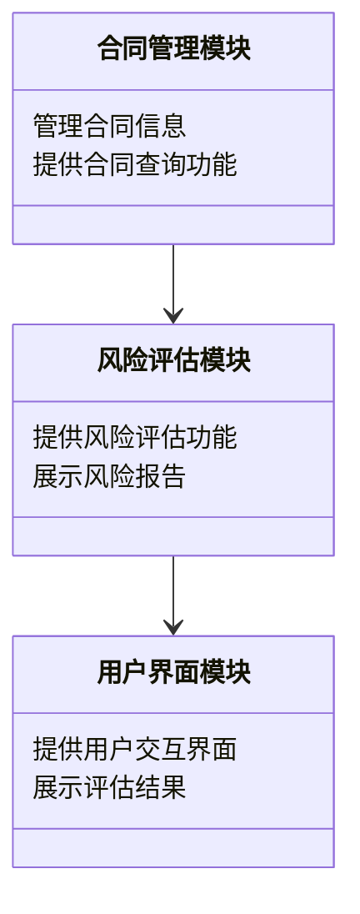
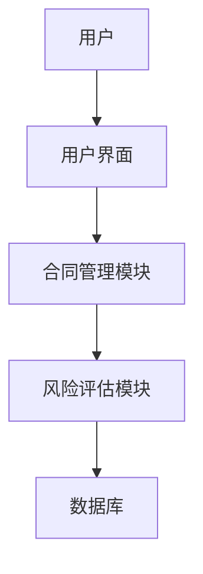
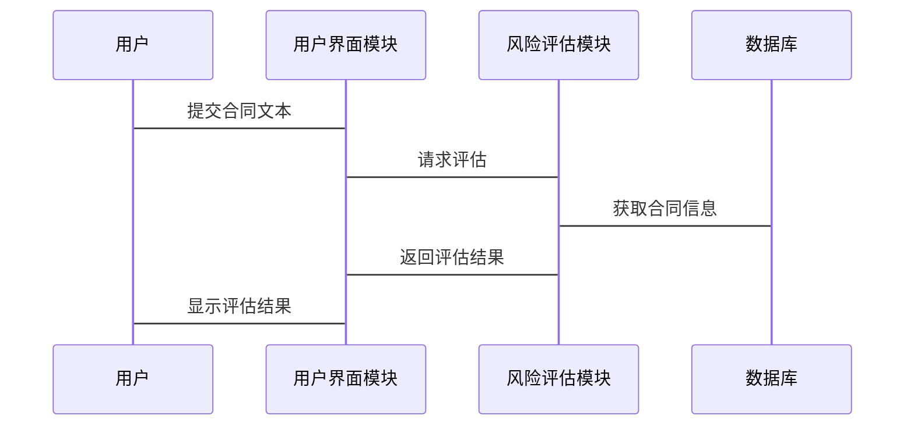

                 


```markdown
# 构建基于NLP的金融合同风险评估系统

> 关键词：NLP，金融合同，风险评估，深度学习，自然语言处理，合同分析

> 摘要：本文详细探讨了如何利用自然语言处理技术构建金融合同风险评估系统。从背景介绍、核心概念到算法原理、系统设计，再到项目实战和最佳实践，系统性地分析了该系统的构建过程，为读者提供了一套完整的解决方案。

## 第1章: 背景与问题描述

### 1.1 问题背景
#### 1.1.1 金融合同风险评估的现状与挑战
金融合同是金融交易的核心文件，其风险评估直接关系到交易的成败和资金的安全。传统的合同风险评估主要依赖人工审查，效率低下且容易出错。随着合同数量的激增，如何快速、准确地评估合同风险成为亟待解决的问题。

#### 1.1.2 自然语言处理（NLP）在金融领域的应用潜力
NLP技术能够从大量文本中提取关键信息，识别潜在风险点，为合同风险评估提供技术支持。通过自动化处理，可以显著提高评估效率和准确性。

#### 1.1.3 传统合同风险评估的局限性
传统方法主要依赖人工审查，存在效率低、主观性强、难以标准化等问题。NLP技术的应用可以弥补这些不足，实现合同风险的智能化评估。

### 1.2 问题描述
#### 1.2.1 合同风险评估的核心目标
准确识别合同中的风险点，评估其潜在风险，为决策提供依据。

#### 1.2.2 基于NLP的风险评估的关键问题
如何有效提取合同文本中的关键信息，建立有效的风险评估模型。

#### 1.2.3 系统边界与外延
系统专注于合同文本的分析与风险评估，不涉及合同的实际执行和后续跟踪。

## 第2章: 核心概念与联系

### 2.1 NLP与金融合同分析的结合
#### 2.1.1 NLP的基本原理与技术
NLP通过文本处理、特征提取和模型训练，实现对文本的语义理解。

#### 2.1.2 金融合同文本的特征与属性
合同文本通常包含合同条款、金额、期限、违约责任等关键信息。

#### 2.1.3 NLP在合同分析中的具体应用
关键词提取、实体识别、情感分析等技术在合同分析中的应用。

### 2.2 实体关系与系统架构
#### 2.2.1 实体关系图（ER图）的构建
通过ER图展示合同中的实体及其关系，如合同、条款、金额等。

#### 2.2.2 系统核心实体的定义与关系
定义合同、条款、风险点等核心实体，并展示它们之间的关系。

#### 2.2.3 Mermaid实体关系图展示
```mermaid
erd
    entity 合同 {
        合同ID
        合同名称
        签署日期
    }
    entity 条款 {
        条款ID
        条款内容
        风险等级
    }
    entity 风险点 {
        风险ID
        风险描述
        风险类型
    }
    合同 --N→ 条款
    条款 --N→ 风险点
```

## 第3章: 基于NLP的合同文本特征提取

### 3.1 文本预处理与特征提取
#### 3.1.1 文本清洗与分词
去除无关信息，进行分词处理，提取关键词。

#### 3.1.2 词袋模型与TF-IDF
使用TF-IDF方法提取文本中的重要特征。

#### 3.1.3 词嵌入（Word2Vec、GloVe）
通过词嵌入技术，将文本转换为向量表示。

### 3.2 基于规则的合同风险特征提取
#### 3.2.1 风险关键词识别
识别合同中的风险关键词，如“违约”、“赔偿”等。

#### 3.2.2 风险条款的模式匹配
通过正则表达式匹配特定的风险条款。

#### 3.2.3 规则库的构建与优化
构建风险关键词库，优化匹配规则，提高识别准确率。

## 第4章: 基于深度学习的合同风险评估模型

### 4.1 神经网络模型简介
#### 4.1.1 RNN与LSTM的基本原理
RNN适用于序列数据处理，LSTM通过门控机制有效处理长序列。

#### 4.1.2 Transformer架构的优缺点
Transformer通过自注意力机制提高模型性能，但计算资源消耗较大。

#### 4.1.3 深度学习模型的训练与调优
包括数据预处理、模型选择、超参数调优等步骤。

### 4.2 深度学习模型的数学基础
#### 4.2.1 RNN的数学模型
$$
\text{RNN}：s_t = \tanh(W_{xs}x_t + W_{ss}s_{t-1} + b)
$$

#### 4.2.2 LSTM的门控机制
$$
\text{LSTM}：
i_t = \sigma(W_{xi}x_t + W_{si}s_{t-1} + b_i)
\\
f_t = \sigma(W_{xf}x_t + W_{sf}s_{t-1} + b_f)
\\
o_t = \sigma(W_{xo}x_t + W_{so}s_{t-1} + b_o)
\\
s_t = i_t \cdot \tanh(W_{xh}x_t + W_{sh}s_{t-1} + b_h)
$$

#### 4.2.3 Transformer的注意力机制
$$
\text{注意力权重}：
\alpha_{ij} = \frac{\exp(\text{score}(q_i, k_j))}{\sum_{l} \exp(\text{score}(q_i, k_l))}
$$

### 4.3 模型训练与优化
#### 4.3.1 数据集的构建与划分
将合同文本分为训练集、验证集和测试集。

#### 4.3.2 模型训练
使用深度学习框架（如TensorFlow）训练模型，调整超参数。

#### 4.3.3 模型评估
通过准确率、召回率、F1值等指标评估模型性能。

## 第5章: 系统分析与架构设计

### 5.1 问题场景介绍
系统用于金融机构的合同风险评估，用户包括合同审查人员和风险管理人员。

### 5.2 项目介绍
本项目旨在开发一个基于NLP的金融合同风险评估系统，实现合同文本的自动化分析和风险评估。

### 5.3 系统功能设计
#### 5.3.1 领域模型


### 5.4 系统架构设计
#### 5.4.1 系统架构图


#### 5.4.2 系统接口设计
- 用户界面模块接口：提交合同文本，获取评估结果。
- 合同管理模块接口：存储合同信息，提供合同查询。
- 风险评估模块接口：接收合同文本，返回风险评估结果。

#### 5.4.3 系统交互设计


## 第6章: 项目实战

### 6.1 环境安装
安装Python、TensorFlow、Keras、NLTK等工具。

### 6.2 核心代码实现
#### 6.2.1 文本预处理
```python
import nltk
from sklearn.feature_extraction.text import TfidfVectorizer

def preprocess(text):
    tokens = nltk.word_tokenize(text.lower())
    return ' '.join(tokens)
```

#### 6.2.2 模型训练
```python
import tensorflow as tf
from tensorflow.keras import layers

model = tf.keras.Sequential([
    layers.Embedding(vocab_size, 100),
    layers.LSTM(64),
    layers.Dense(1, activation='sigmoid')
])
model.compile(optimizer='adam', loss='binary_crossentropy', metrics=['accuracy'])
model.fit(...)
```

### 6.3 案例分析
通过具体案例展示系统如何识别风险点，生成风险评估报告。

### 6.4 项目小结
总结项目的实现过程，分析优缺点，提出改进建议。

## 第7章: 最佳实践、小结、注意事项和拓展阅读

### 7.1 最佳实践
- 数据清洗的重要性
- 模型调优的技巧
- 系统部署的注意事项

### 7.2 小结
本文详细介绍了基于NLP的金融合同风险评估系统的构建过程，从理论到实践，为读者提供了系统的解决方案。

### 7.3 注意事项
- 数据隐私保护
- 模型的泛化能力
- 系统的可扩展性

### 7.4 拓展阅读
推荐相关领域的书籍、论文和在线资源，供读者深入学习。

## 作者：AI天才研究院/AI Genius Institute & 禅与计算机程序设计艺术 /Zen And The Art of Computer Programming
```

