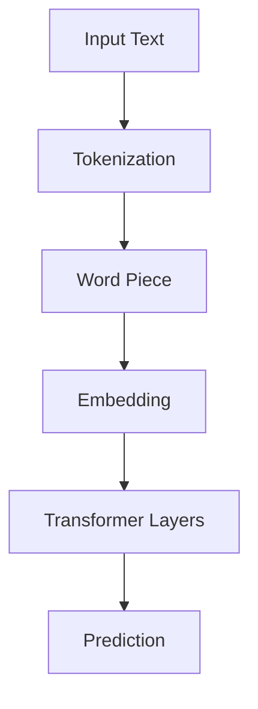
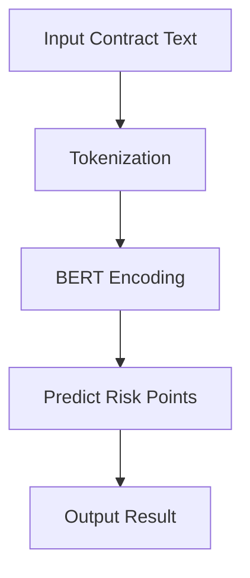

                 


# 构建基于NLP的金融合同风险识别系统

> 关键词：自然语言处理（NLP）、金融合同、风险识别、文本挖掘、深度学习

> 摘要：本文旨在探讨如何利用自然语言处理技术构建一个高效的金融合同风险识别系统。通过分析金融合同文本中的关键信息，结合深度学习模型，实现对潜在风险的自动识别与评估。文章从背景与挑战、核心概念、算法原理、系统架构到项目实战逐步展开，深入剖析构建系统的每个环节，并提供实际案例分析与代码实现。

---

## 第一部分: 基于NLP的金融合同风险识别系统概述

### 第1章: 金融合同风险识别的背景与挑战

#### 1.1 什么是金融合同风险识别
- 1.1.1 金融合同的基本概念
  - 金融合同的分类：贷款合同、担保合同、投资合同等
  - 合同的核心要素：条款、责任、义务、违约风险
- 1.1.2 合同风险的定义与分类
  - 合同风险的类型：信用风险、操作风险、合规风险
  - 风险的量化与评估标准
- 1.1.3 金融合同风险识别的重要性
  - 风险控制与合规要求
  - 提高业务效率与决策能力

#### 1.2 NLP技术在金融领域的应用
- 1.2.1 自然语言处理（NLP）的基本概念
  - 分词、实体识别、句法分析、语义理解
- 1.2.2 NLP在金融合同分析中的优势
  - 自动提取关键信息
  - 快速识别潜在风险点
  - 提供数据驱动的决策支持
- 1.2.3 当前NLP技术在金融合同风险识别中的应用现状
  - 成功案例与技术瓶颈

#### 1.3 金融合同风险识别的挑战
- 1.3.1 数据获取与处理的难点
  - 数据稀疏性与不平衡性
  - 合同文本的复杂性与多样性
- 1.3.2 模型训练与优化的挑战
  - 数据标注成本高
  - 模型泛化能力不足
- 1.3.3 实际应用中的法律与合规问题
  - 数据隐私与合规性
  - 模型解释性与可信赖性

### 第2章: 金融合同风险识别的核心概念与联系

#### 2.1 核心概念原理
- 2.1.1 合同文本的结构化处理
  - 分词与词向量化
  - 语义表示与文本摘要
- 2.1.2 风险点的识别与分类
  - 基于规则的识别方法
  - 基于机器学习的分类方法
- 2.1.3 基于NLP的风险评估模型
  - 文本相似度计算
  - 风险概率预测

#### 2.2 核心概念属性特征对比表格
- 表格内容：
  | 特征 | 合同文本 | 风险点 | 模型特征 |
  |------|----------|--------|----------|
  | 类型 | 文本 | 标签 | 向量表示 |
  | 程度 | 长度 | 数量 | 维度 |
  | 示例 | "贷款期限为5年" | 违约风险 | [0.1, 0.2, 0.3] |

#### 2.3 实体关系图（ER图）架构
```mermaid
erd
    顾客
    合同
    风险点
    模型

    顾客 -|> 合同: 签署合同
    合同 -|> 风险点: 包含风险
    风险点 -|> 模型: 输入数据
    模型 -|> 风险评估结果: 输出结果
```

---

## 第二部分: 基于NLP的金融合同风险识别算法原理

### 第3章: 基于BERT的合同文本表示模型

#### 3.1 BERT模型的基本原理
- BERT的双向Transformer结构
- 预训练目标： MASK、Next Sentence Prediction
- 使用 Mermaid 绘制BERT模型训练流程图：


#### 3.2 合同文本的特征提取
- 3.2.1 分词与词向量化
  - 使用WordPiece分词
  - 词向量表示（如Word2Vec、GloVe）
- 3.2.2 语义向量的计算
  - BERT编码器输出语义向量
  - 向量维度：[batch_size, seq_len, hidden_size]
- 3.2.3 文本表示的优化
  - 平均池化（Mean Pooling）
  - 双向池化（Max Pooling）

#### 3.3 基于BERT的风险点识别算法
- 使用 Mermaid 绘制算法流程图：

- 使用Python代码实现BERT模型的文本分类任务：
```python
from transformers import BertTokenizer, BertModel
import torch

tokenizer = BertTokenizer.from_pretrained('bert-base-uncased')
model = BertModel.from_pretrained('bert-base-uncased')

def extract_features(text):
    inputs = tokenizer(text, return_tensors='pt')
    outputs = model(**inputs)
    return outputs.last_hidden_state

text = "贷款期限为5年，年利率为10%"
features = extract_features(text)
print(features)
```

### 第4章: 风险评估模型的数学模型与公式

#### 4.1 文本相似度计算公式
- 余弦相似度公式：
  $$\cos\theta = \frac{\vec{A} \cdot \vec{B}}{|\vec{A}| |\vec{B}|}$$

#### 4.2 风险概率计算公式
- 贝叶斯公式：
  $$P(R|T) = \frac{P(T|R)P(R)}{P(T)}$$

#### 4.3 模型优化与损失函数
- 损失函数：
  $$L = -\sum_{i=1}^{n} [y_i \log p_i + (1-y_i)\log (1-p_i)]$$
- 优化器：Adam优化器实现

### 第5章: 算法实现与案例分析

#### 5.1 环境安装与配置
- 安装Python、TensorFlow、Keras、BERT库：
  ```bash
  pip install transformers
  ```

#### 5.2 系统核心实现源代码
- 文本预处理代码：
  ```python
  import pandas as pd
  from transformers import BertTokenizer, BertModel
  import torch

  def preprocess(text):
      tokenizer = BertTokenizer.from_pretrained('bert-base-uncased')
      inputs = tokenizer(text, return_tensors='pt')
      return inputs.input_ids
  ```

- 模型训练代码：
  ```python
  model = BertModel.from_pretrained('bert-base-uncased')
  optimizer = torch.optim.Adam(model.parameters(), lr=1e-5)
  criterion = torch.nn.CrossEntropyLoss()
  ```

- 风险评估代码：
  ```python
  def evaluate(model, tokenizer, text):
      inputs = tokenizer(text, return_tensors='pt')
      outputs = model(**inputs)
      return outputs.last_hidden_state
  ```

#### 5.3 实际案例分析
- 案例背景：某贷款合同中的违约风险识别
- 数据准备：贷款合同文本、标注好的违约风险点
- 模型训练：基于BERT的二分类任务
- 结果解读：输出违约风险概率及解释

### 第6章: 系统架构与设计

#### 6.1 系统功能设计
- 领域模型：
  ```mermaid
  classDiagram
      class 合同管理模块 {
          +合同文本库
          +风险点识别接口
      }
      class 风险评估模块 {
          +风险评估模型
          +风险报告生成
      }
      class 用户界面模块 {
          +输入合同文本
          +显示风险报告
      }
      合同管理模块 --> 风险评估模块: 提供合同文本
      风险评估模块 --> 用户界面模块: 提供风险报告
  ```

#### 6.2 系统架构设计
- 使用 Mermaid 绘制系统架构图：
  ```mermaid
  graph TD
      A[用户] --> B[合同管理模块]
      B --> C[风险评估模块]
      C --> D[模型训练模块]
      D --> E[风险报告]
      E --> F[用户界面模块]
  ```

#### 6.3 系统接口设计
- 接口1：合同文本输入接口
- 接口2：风险评估结果输出接口
- 接口3：模型训练与优化接口

#### 6.4 系统交互设计
- 使用 Mermaid 绘制序列图：
  ```mermaid
  sequenceDiagram
      user -> 合同管理模块: 提交合同文本
      合同管理模块 -> 风险评估模块: 请求风险评估
      风险评估模块 -> 模型训练模块: 加载预训练模型
      模型训练模块 -> 风险评估模块: 返回风险评估结果
      风险评估模块 -> user: 显示风险报告
  ```

### 第7章: 项目实战与总结

#### 7.1 项目实战
- 实战背景：构建一个基于BERT的金融合同风险识别系统
- 实战步骤：
  1. 数据收集与预处理
  2. 模型训练与优化
  3. 系统集成与部署
- 实战代码：
  ```python
  # 数据预处理
  import pandas as pd
  from transformers import BertTokenizer, BertModel
  import torch

  def preprocess(text):
      tokenizer = BertTokenizer.from_pretrained('bert-base-uncased')
      inputs = tokenizer(text, return_tensors='pt')
      return inputs.input_ids

  # 模型训练
  model = BertModel.from_pretrained('bert-base-uncased')
  optimizer = torch.optim.Adam(model.parameters(), lr=1e-5)
  criterion = torch.nn.CrossEntropyLoss()

  # 风险评估
  def evaluate(model, tokenizer, text):
      inputs = tokenizer(text, return_tensors='pt')
      outputs = model(**inputs)
      return outputs.last_hidden_state
  ```

#### 7.2 实战案例分析
- 数据集：某银行提供的贷款合同文本
- 模型训练：二分类任务（违约风险 vs 非违约风险）
- 结果分析：混淆矩阵、准确率、召回率、F1值

#### 7.3 总结与展望
- 总结：构建基于NLP的金融合同风险识别系统的优势与不足
- 展望：未来的研究方向与技术改进

---

## 作者：AI天才研究院/AI Genius Institute & 禅与计算机程序设计艺术 /Zen And The Art of Computer Programming

