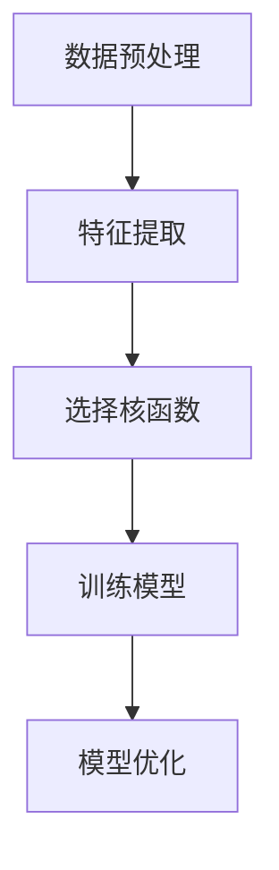
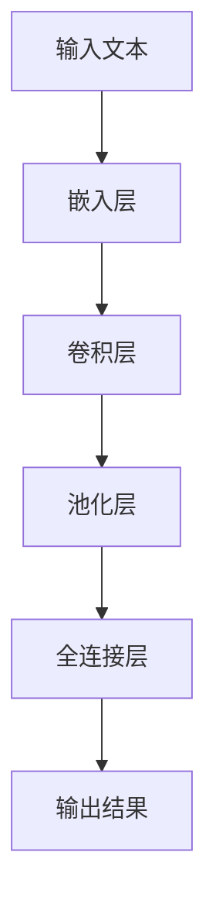
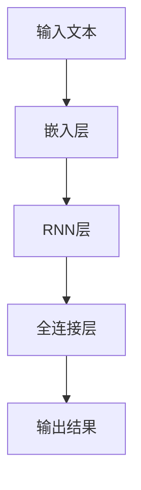
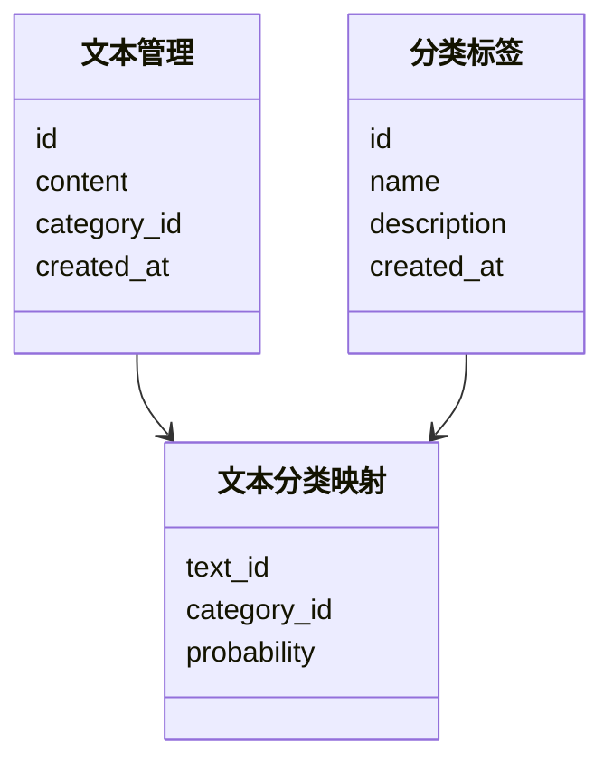
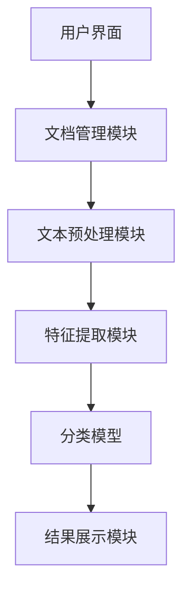
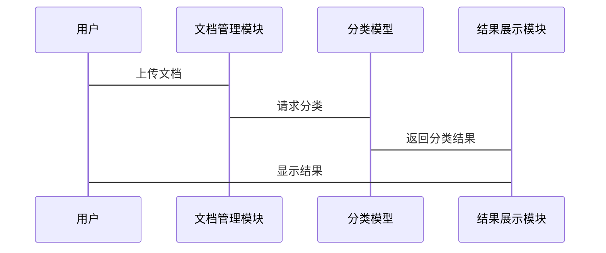

                 


# 《构建基于NLP的金融文档自动分类系统》

> **关键词**: 自然语言处理, 金融分类, 文本挖掘, 机器学习, 深度学习

> **摘要**: 本文详细探讨了如何利用自然语言处理技术构建一个高效的金融文档自动分类系统。通过分析问题背景、核心概念、算法原理、系统架构设计及项目实战，系统地介绍了从理论到实践的全过程。文章结合实际案例，深入浅出地讲解了NLP技术在金融领域的应用，旨在为读者提供一个全面的解决方案。

---

# 第一部分: 背景介绍

## 第1章: 问题背景与描述

### 1.1 问题背景
#### 1.1.1 金融文档分类的现状与挑战
- 金融文档的多样性与复杂性
- 人工分类的低效性与高成本
- 信息提取的及时性需求

#### 1.1.2 自动化分类的必要性
- 提高分类效率与准确性
- 支持实时信息处理与决策
- 降低人工成本

#### 1.1.3 NLP技术在金融领域的应用价值
- 文本挖掘与信息提取
- 情感分析与风险评估
- 类别自动标注

### 1.2 问题描述
#### 1.2.1 金融文档的多样性与复杂性
- 文档类型多样（如新闻、报告、合同等）
- 专业术语与行业特定表达
- 文本长度差异大

#### 1.2.2 分类任务的具体要求
- 分类粒度（粗分类 vs 精分类）
- 分类标签的定义与规范
- 分类结果的可解释性

#### 1.2.3 系统目标与预期输出
- 高精度的分类模型
- 可扩展的系统架构
- 易用的用户界面

### 1.3 问题解决思路
#### 1.3.1 NLP技术的核心作用
- 文本预处理与特征提取
- 分类算法的选择与优化
- 模型调优与性能评估

#### 1.3.2 金融领域知识的结合
- 专业术语的处理
- 领域知识图谱的构建
- 金融场景的适应性优化

#### 1.3.3 系统设计的整体框架
- 数据采集与预处理
- 特征提取与模型训练
- 系统集成与部署

### 1.4 系统的边界与外延
#### 1.4.1 输入数据的范围与格式
- 文档类型：文本、PDF、HTML等
- 数据来源：内部文档、外部新闻、社交媒体等

#### 1.4.2 输出结果的规范与要求
- 分类标签的标准化
- 分类结果的置信度
- 输出格式：JSON、CSV等

#### 1.4.3 系统与其他模块的交互关系
- 数据源模块：数据采集与清洗
- 用户界面模块：结果展示与反馈
- 后台服务模块：模型训练与更新

### 1.5 概念结构与核心要素
#### 1.5.1 核心概念的定义与属性
- 文本：字符、词、句子、段落
- 分类标签：预定义类别、动态更新类别
- 特征：TF-IDF、Word2Vec、BERT嵌入

#### 1.5.2 核心要素之间的关系
- 文本与分类标签的映射
- 特征与分类模型的关联
- 系统模块间的交互

#### 1.5.3 概念结构的ER图
```mermaid
erd
  text (
    id: string,
    content: string,
    category_id: int,
    created_at: timestamp
  )
  category (
    id: int,
    name: string,
    description: string,
    created_at: timestamp
  )
  text_category_mapping (
    text_id: int,
    category_id: int,
    probability: float
  )
  user (
    id: int,
    name: string,
    role: string
  )
```

---

# 第二部分: 核心概念与联系

## 第2章: NLP基础与文本预处理

### 2.1 NLP核心概念
#### 2.1.1 词袋模型与词嵌入
- 词袋模型的基本原理
- 词嵌入（如Word2Vec、GloVe）的优势
- 词袋模型与词嵌入的对比

#### 2.1.2 语言模型与预训练技术
- 语言模型的概念
- 预训练技术（如BERT）的应用
- 预训练与金融分类的结合

#### 2.1.3 NLP任务的分类与特点
- 分类任务：文本分类、情感分析
- 生成任务：文本摘要、机器翻译
- 金融领域的特定任务

### 2.2 文本预处理流程
#### 2.2.1 分词与分句
- 中文分词工具（如jieba）
- 英文分词工具（如NLTK）
- 句子分割

#### 2.2.2 去停用词与词干提取
- 停用词列表的构建
- 词干提取的方法（如Porter Stemmer）
- 去停用词与词干提取的对比

#### 2.2.3 特征提取与向量化
- TF-IDF的计算
- Word2Vec的训练
- BERT嵌入的应用

### 2.3 核心概念对比表
| 概念 | 描述 | 优缺点 | 应用场景 |
|------|------|--------|----------|
| 词袋模型 | 基于词频统计 | 简单高效，但缺乏语义信息 | 适合基础分类任务 |
| 词嵌入 | 词的向量表示 | 捕捉词的语义信息，适合深度学习 | 适合复杂分类任务 |
| 语言模型 | 词与词之间的概率关系 | 需大量数据，适合预训练 | 适合需要上下文理解的任务 |

---

## 第3章: 金融分类任务的核心概念

### 3.1 金融分类任务的特点
#### 3.1.1 专业术语与行业特定表达
- 金融术语的识别与处理
- 行业特定表达的标准化

#### 3.1.2 分类粒度的多样性
- 粗分类（如行业、产品类别）
- 精分类（如具体金融事件）

#### 3.1.3 数据的不平衡性
- 小类样本少，大类样本多
- 数据不平衡的处理方法

### 3.2 金融分类任务的实现流程
#### 3.2.1 数据准备
- 数据采集：金融文档的获取与清洗
- 数据标注：人工标注与自动标注

#### 3.2.2 特征工程
- 选择合适的特征表示方法
- 处理特征维度与稀疏性

#### 3.2.3 模型训练与优化
- 选择合适的分类算法
- 调参与模型优化
- 验证与测试

### 3.3 金融分类任务的挑战与解决方案
#### 3.3.1 数据稀疏性问题
- 数据增强方法
- 预训练模型的迁移学习

#### 3.3.2 领域适应性问题
- 金融领域特定数据的处理
- 跨领域模型的适应性调整

#### 3.3.3 可解释性问题
- 分类结果的可解释性需求
- 模型解释性技术的应用

---

# 第三部分: 算法原理

## 第4章: 常见的金融分类算法与实现

### 4.1 支持向量机（SVM）
#### 4.1.1 算法原理
- SVM的几何解释
- 软边距与核函数

#### 4.1.2 优化问题
$$ \text{目标函数: } \min_{w,b,\xi} \frac{1}{2}||w||^2 + C \sum_{i=1}^n \xi_i $$
$$ \text{约束条件: } y_i(w \cdot x_i + b) \geq 1 - \xi_i, \xi_i \geq 0 $$

#### 4.1.3 算法流程


### 4.2 卷积神经网络（CNN）
#### 4.2.1 算法原理
- 卷积层、池化层的作用
- 文本CNN的结构特点

#### 4.2.2 优化问题
$$ \text{损失函数: } \mathcal{L} = -\sum_{i=1}^n y_i \log(p_i) + (1-y_i)\log(1-p_i) $$
$$ \text{优化目标: } \min_{\theta} \mathcal{L} + \lambda ||\theta||^2 $$`

#### 4.2.3 算法流程


### 4.3 循环神经网络（RNN）
#### 4.3.1 算法原理
- RNN的循环结构
- 长短期记忆网络（LSTM）的优势

#### 4.3.2 优化问题
$$ \text{损失函数: } \mathcal{L} = -\sum_{t=1}^T y_t \log(p_t) + (1-y_t)\log(1-p_t) $$
$$ \text{优化目标: } \min_{\theta} \mathcal{L} + \lambda ||\theta||^2 $$`

#### 4.3.3 算法流程


---

# 第四部分: 系统分析与架构设计

## 第5章: 系统分析与架构设计

### 5.1 需求分析
#### 5.1.1 项目目标
- 构建高效的金融文档分类系统
- 提供可扩展的系统架构

#### 5.1.2 功能需求
- 文档上传与预处理
- 模型训练与部署
- 结果展示与反馈

### 5.2 系统功能设计
#### 5.2.1 领域模型


#### 5.2.2 系统架构设计


#### 5.2.3 接口设计
- 文档管理接口：上传、查询、删除
- 分类模型接口：训练、预测、评估
- 结果展示接口：展示分类结果、调整分类标签

#### 5.2.4 交互流程


---

# 第五部分: 项目实战

## 第6章: 项目实战

### 6.1 环境安装与配置
#### 6.1.1 Python环境
- 安装Python 3.8+

#### 6.1.2 依赖库安装
- 使用pip安装：numpy、scikit-learn、tensorflow、jieba等

### 6.2 系统核心实现
#### 6.2.1 文本预处理
```python
import jieba

def preprocess(text):
    # 分词
    words = jieba.lcut(text)
    # 去停用词
    stopwords = set()
    filtered_words = [word for word in words if word not in stopwords]
    return ' '.join(filtered_words)
```

#### 6.2.2 模型训练与预测
```python
from sklearn.svm import SVC
from sklearn.feature_extraction.text import TfidfVectorizer

# 初始化向量器和分类器
vectorizer = TfidfVectorizer()
clf = SVC()

# 训练模型
clf.fit(vectorizer.fit_transform(X_train), y_train)

# 预测
X_test_vectorized = vectorizer.transform(X_test)
y_pred = clf.predict(X_test_vectorized)
```

#### 6.2.3 案例分析
- 数据准备：收集金融文档数据集
- 模型训练：使用SVM或CNN进行训练
- 结果分析：评估分类性能

### 6.3 项目总结与小结
#### 6.3.1 项目实现的关键点
- 文本预处理的优化
- 模型选择与调优
- 系统架构的设计

#### 6.3.2 项目的经验与教训
- 数据质量对模型性能的影响
- 模型选择与任务需求的匹配
- 系统架构的可扩展性

---

# 第六部分: 总结与展望

## 第7章: 总结与展望

### 7.1 总结
- 本文详细介绍了构建基于NLP的金融文档分类系统的全过程
- 系统地讲解了NLP技术在金融领域的应用
- 提供了从理论到实践的详细指导

### 7.2 未来展望
- 结合深度学习的最新进展，如BERT等预训练模型
- 提高系统的可解释性与透明度
- 扩展系统的应用场景，如金融风险预警、智能投顾等

---

# 附录

## 附录A: 参考文献

## 附录B: 项目代码

---

# 作者

作者：AI天才研究院/AI Genius Institute & 禅与计算机程序设计艺术/Zen And The Art of Computer Programming

---

通过以上目录结构和内容安排，您可以开始撰写详细的博客文章，确保每个章节的内容详实且逻辑清晰。

