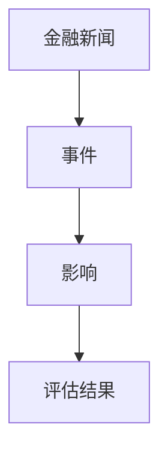

                 


# 构建基于NLP的金融新闻事件影响评估系统

---

## 关键词：
- 自然语言处理（NLP）
- 金融新闻
- 事件影响评估
- 情感分析
- 机器学习

---

## 摘要：
本文详细探讨了如何利用自然语言处理技术构建一个金融新闻事件影响评估系统。文章从背景与概念出发，深入分析了NLP在金融领域的应用潜力，详细讲解了系统设计与实现的关键步骤，包括文本预处理、事件关键词提取、情感分析及影响预测等核心算法。通过具体的项目实战，展示了系统的实际应用场景，并总结了最佳实践经验和未来发展方向。

---

# 正文部分

## 第一部分：背景与概念

### 第1章：基于NLP的金融新闻事件影响评估系统概述

#### 1.1 问题背景
金融市场的波动往往受到新闻事件的影响。例如，公司财报发布、政策变化或重大并购等事件都可能引发市场波动。传统的金融分析依赖于人工解读新闻，效率低下且容易出错。因此，利用NLP技术自动分析新闻事件并评估其影响成为亟待解决的问题。

#### 1.2 核心概念
- **金融新闻事件**：指能够对金融市场产生影响的新闻内容，例如经济数据发布、公司公告等。
- **事件影响评估**：通过分析新闻内容，预测其对市场或特定资产的影响程度。
- **自然语言处理（NLP）**：利用计算机技术对自然语言文本进行处理和分析，提取有用信息。

#### 1.3 核心概念与联系
- **核心概念原理**：NLP技术帮助提取新闻中的关键词和情感倾向，结合金融知识模型，评估事件对市场的影响。
- **概念属性特征对比表格**：
| 特性 | 事件影响评估 | NLP处理 |
|------|--------------|----------|
| 输入 | 文本内容      | 文本、情感 |
| 输出 | 影响程度      | 关键词、情感倾向 |
| 方法 | 统计分析、机器学习 | 分词、情感分析 |

- **ER实体关系图**：


---

## 第二部分：NLP基础与技术实现

### 第2章：自然语言处理基础

#### 2.1 文本预处理
- **分词与词干提取**：将文本分割成词语，并进行词干提取（如将"companies"提取为"company"）。
- **停用词处理**：去除常见的无意义词汇（如"and", "the"）。
- **词向量表示**：使用Word2Vec或BERT将词语转换为向量表示。

#### 2.2 常用NLP模型
- **Word2Vec**：用于生成词向量，捕捉词语之间的语义关系。
- **BERT**：基于Transformer的预训练模型，适用于多种NLP任务。
- **GPT**：用于生成文本，可辅助新闻内容的分析。

#### 2.3 情感分析与文本分类
- **情感分析**：判断文本的情感倾向（如正面、负面、中性）。
- **文本分类**：将文本归类到特定类别（如行业类别、事件类型）。
- **实例分析**：以某公司财报新闻为例，分析其情感倾向。

---

### 第3章：事件影响评估的NLP实现

#### 3.1 事件关键词提取
- **基于TF-IDF的关键词提取**：通过统计词频和逆文档频率，提取重要的关键词。
- **基于深度学习的关键词提取**：使用Transformer模型提取语义相关的关键词。

#### 3.2 事件情感分析
- **单句情感分析**：分析单个句子的情感倾向。
- **事件整体情感分析**：整合新闻中的多个情感信息，得出事件的整体情感倾向。
- **情感强度计算**：量化情感的强弱程度。

#### 3.3 事件影响预测
- **基于NLP的特征提取**：提取文本中的关键词、情感倾向等特征。
- **数学模型构建**：建立线性回归或神经网络模型，预测事件的影响程度。
- **实例分析**：以某次并购事件为例，展示模型的预测过程。

---

## 第三部分：系统设计与实现

### 第4章：金融新闻事件影响评估系统设计

#### 4.1 系统需求分析
- **功能需求**：包括新闻爬取、事件提取、影响评估、结果可视化。
- **性能需求**：要求系统能够实时处理大量新闻数据。
- **接口需求**：提供API供其他系统调用。

#### 4.2 系统架构设计
- **分层架构**：包括数据层、业务逻辑层和表现层。
- **模块划分**：数据预处理模块、事件提取模块、影响评估模块。
- **数据流设计**：从数据输入到结果输出的流程图。

#### 4.3 系统接口设计
- **输入接口**：接收新闻文本数据。
- **输出接口**：返回事件影响评估结果。
- **交互设计**：用户友好的操作界面。

---

## 第四部分：项目实战

### 第5章：项目实战与分析

#### 5.1 环境搭建
- **工具安装**：安装Python、TensorFlow、Keras等工具。
- **数据准备**：收集和整理金融新闻数据。

#### 5.2 核心代码实现
```python
# 示例代码：情感分析模型训练
import tensorflow as tf
from tensorflow.keras import layers

model = tf.keras.Sequential()
model.add(layers.Embedding(input_dim=10000, output_dim=16))
model.add(layers.GlobalAveragePooling1D())
model.add(layers.Dense(1, activation='sigmoid'))

model.compile(optimizer='adam', loss='binary_crossentropy', metrics=['accuracy'])
model.fit(X_train, y_train, epochs=10, batch_size=32)
```

#### 5.3 案例分析
- **案例选择**：选取特定金融事件，分析模型的表现。
- **结果解读**：解释模型输出的事件影响评估结果。

---

## 第五部分：最佳实践

### 第6章：最佳实践与总结

#### 6.1 总结与反思
- **成功经验**：系统在实际应用中的表现。
- **不足之处**：模型的局限性及改进方向。

#### 6.2 注意事项
- **数据质量**：确保数据的准确性和完整性。
- **模型调优**：通过交叉验证优化模型参数。

#### 6.3 未来展望
- **技术发展**：探讨更先进的NLP技术如何应用于金融领域。
- **应用场景拓展**：探索系统在更多金融场景中的应用。

---

## 作者信息
作者：AI天才研究院/AI Genius Institute  
合著者：禅与计算机程序设计艺术/Zen And The Art of Computer Programming

---

以上是《构建基于NLP的金融新闻事件影响评估系统》的技术博客文章的完整内容，希望对您有所帮助！

