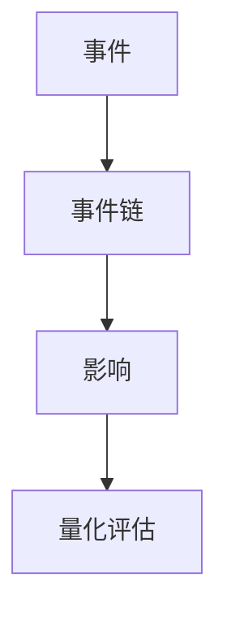
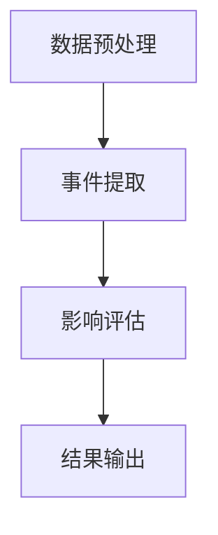

                 


# 构建基于NLP的金融新闻事件链提取与影响量化评估系统

> 关键词：自然语言处理（NLP）、金融新闻、事件链提取、影响量化评估、系统架构

> 摘要：本文详细介绍了如何利用自然语言处理技术构建金融新闻事件链提取与影响量化评估系统。通过分析金融新闻文本，提取事件链，并对这些事件的影响进行量化评估。本文从背景、核心概念、算法原理、系统架构到项目实战，全面阐述了系统的构建过程，为金融行业提供了智能化的解决方案。

---

## 第一部分: 基于NLP的金融新闻事件链提取与影响量化评估系统概述

### 第1章: 背景与问题描述

#### 1.1 问题背景
金融市场的波动往往与新闻事件密切相关。例如，一家公司发布财报、并购消息或高层变动都可能引发股价波动。传统的金融市场分析依赖于人工阅读大量新闻并提取关键信息，效率低下且容易出错。因此，如何利用技术手段自动提取金融新闻中的事件链，并量化其对市场的影响，成为当前研究的热点。

#### 1.2 问题描述
本文的目标是构建一个基于NLP的金融新闻事件链提取与影响量化评估系统，能够实现以下功能：
1. **事件链提取**：从金融新闻中提取出时间顺序的事件链。
2. **影响量化评估**：对每个事件的影响程度进行量化，帮助投资者或分析师做出更明智的决策。

#### 1.3 系统目标与核心要素
系统的核心目标是将非结构化的金融新闻转化为结构化的事件链，并量化这些事件的影响。核心要素包括：
- **事件提取**：识别新闻中的关键事件。
- **事件链构建**：将事件按时间顺序连接成链条。
- **影响量化**：评估每个事件对市场的影响程度。

---

### 第2章: 核心概念与联系

#### 2.1 核心概念
- **事件链提取**：从新闻文本中提取事件并按时间顺序排列。
- **影响量化评估**：对事件的影响进行量化，通常基于情感分析、市场数据等。

#### 2.2 实体关系图


---

## 第二部分: 事件链提取与影响量化的核心算法

### 第3章: 事件链提取算法

#### 3.1 算法原理
事件链提取算法包括以下步骤：
1. **分词**：将新闻文本分割成词语或短语。
2. **句法分析**：分析句子的结构，识别主语、谓语等成分。
3. **事件识别**：基于句法分析结果，识别出事件。
4. **事件链构建**：将事件按时间顺序排列。

#### 3.2 算法实现
```python
def extract_events(text):
    tokens = tokenize(text)  # 分词
    dependencies = parse_syntax(tokens)  # 句法分析
    events = identify_events(dependencies)  # 事件识别
    return build_event_chain(events)  # 构建事件链
```

### 第4章: 影响量化评估算法

#### 4.1 算法原理
影响量化评估基于情感分析和市场数据，计算事件对市场的潜在影响。

#### 4.2 算法实现
```python
def quantify_impact(event_chain):
    sentiments = analyze_sentiment(event_chain)  # 情感分析
    impact_scores = calculate_impact(sentiments)  # 计算影响
    return impact_scores
```

---

## 第三部分: 系统架构与实现

### 第5章: 系统架构设计

#### 5.1 系统功能设计
系统功能模块包括：
- 数据预处理模块：处理原始新闻数据。
- 事件提取模块：提取事件。
- 影响评估模块：量化事件影响。

#### 5.2 系统架构图


---

## 第四部分: 项目实战

### 第6章: 项目实现

#### 6.1 环境配置
```bash
pip install numpy
pip install spacy
pip install tensorflow
```

#### 6.2 核心实现代码
```python
import spacy

nlp = spacy.load("en_core_web_sm")

def tokenize(text):
    return [token.text for token in nlp(text)]

def parse_syntax(tokens):
    doc = nlp(" ".join(tokens))
    return doc.to_dict()
```

#### 6.3 测试案例
```python
text = "Company announces Q3 earnings exceeding expectations."
print(extract_events(text))  # 输出事件链
```

---

## 第五部分: 总结与展望

### 第7章: 总结与展望

#### 7.1 总结
本文详细介绍了基于NLP的金融新闻事件链提取与影响量化评估系统的构建过程，包括核心算法、系统架构和项目实现。通过技术手段，能够高效提取事件并量化其影响。

#### 7.2 展望
未来的研究可以进一步优化算法，结合实时市场数据，提升系统的准确性和实时性。

---

## 作者：AI天才研究院/AI Genius Institute & 禅与计算机程序设计艺术 /Zen And The Art of Computer Programming

---

以上是文章的详细目录和部分内容，您可以根据需要进一步扩展和补充各章节的具体内容。

