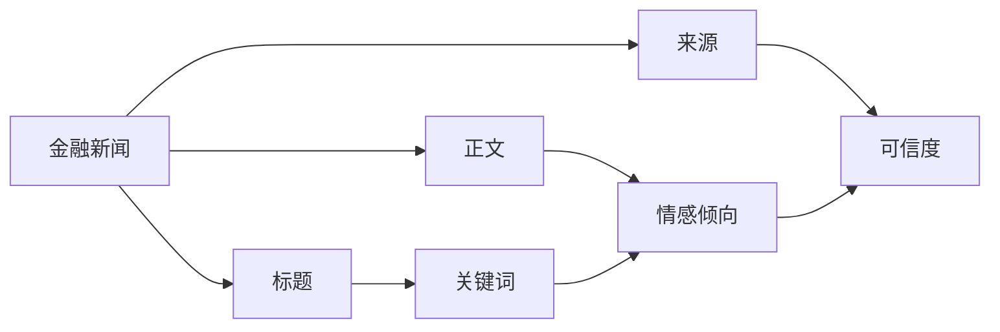

                 


# 构建基于NLP的金融新闻可信度评估系统

> 关键词：NLP，金融新闻，可信度评估，文本挖掘，机器学习

> 摘要：本文详细探讨了如何利用自然语言处理技术构建金融新闻可信度评估系统。从问题背景到系统实现，文章全面分析了NLP在金融领域的应用潜力，结合实际案例，详细讲解了系统的构建过程和核心算法原理，最后给出了系统优化和未来发展的建议。

---

## 第一部分: 背景介绍

### 第1章: 问题背景与描述

#### 1.1 问题背景
金融新闻的可信度评估是金融领域的重要问题。随着信息量的爆炸式增长，虚假新闻、误导性报道层出不穷，直接影响投资者决策。传统的依赖人工经验的评估方式效率低下，难以应对海量信息的挑战。基于NLP技术的自动化可信度评估系统成为解决这一问题的关键。

#### 1.2 问题描述
金融新闻可信度评估的核心问题在于如何从文本中提取关键特征，并结合来源、情感倾向等多维度信息，量化新闻的可信度。现有解决方案主要依赖规则或单一算法，存在泛化能力不足、鲁棒性差等问题。

#### 1.3 问题解决思路
基于NLP的解决方案，利用文本挖掘、情感分析等技术，结合领域知识图谱和机器学习模型，构建多维度、高精度的可信度评估系统。通过数据驱动的方式，不断优化模型，提升评估的准确性和可靠性。

#### 1.4 系统的边界与外延
- **输入**：金融新闻文本、来源信息、相关领域知识库
- **输出**：可信度评分、情感倾向分析、关键词提取
- **功能边界**：仅关注新闻内容本身，不涉及外部数据库查询
- **适用场景**：新闻筛选、投资决策支持、风险预警
- **限制**：不支持实时动态更新，依赖历史数据

---

### 第2章: 核心概念与联系

#### 2.1 NLP基础
- **自然语言处理的核心技术**：文本预处理、词袋模型、词嵌入（如Word2Vec）、序列模型（如LSTM）。
- **金融领域的NLP挑战**：专业术语多、数据稀疏性、情感表达复杂。

#### 2.2 金融新闻分析
- **金融新闻的结构与特征**：标题、正文、来源、日期。
- **关键实体识别**：公司名称、股票代码、事件类型。
- **情感分析**：正面、负面、中性，结合强度量化。

#### 2.3 可信度评估模型
- **可信度评估的定义与标准**：多维度量化，包括信息来源可靠性、内容逻辑性、数据准确性。
- **概念属性特征对比表**

| 概念 | 属性 | 特征 |
|------|------|------|
| 金融新闻 | 标题 | 突出事件 |
| 正文 | 详细描述 | 数据支持 |
| 来源 | 机构 | 权威性 |

- **ER实体关系图**



---

## 第二部分: 算法原理讲解

### 第3章: 文本预处理与特征提取

#### 3.1 文本预处理
- **分词**：使用jieba进行中文分词，例如“金融新闻”会被分解为“金融”和“新闻”。
- **去停用词**：去除无意义的词汇，如“的”、“是”。
- **词干提取**：保留词汇的核心部分，便于后续处理。

#### 3.2 特征提取
- **TF-IDF计算**
  - **公式**：$TF(t, d) = \frac{\text{词频}(t, d)}{\text{文档总数}}$
  - **IDF计算**：$\text{IDF}(t) = \log\left(1 + \frac{N}{\text{包含词t的文档数}}\right)$

#### 3.3 分类模型
- **朴素贝叶斯分类**：
  - **公式**：$P(c|x) = \frac{P(x|c)P(c)}{P(x)}$
  - **案例**：根据关键词和情感倾向分类新闻可信度。

---

## 第三部分: 系统分析与架构设计

### 第4章: 系统架构设计

#### 4.1 功能模块
- **文本预处理模块**：负责分词、去停用词等。
- **特征提取模块**：计算TF-IDF特征向量。
- **分类模块**：基于机器学习模型进行可信度评分。

#### 4.2 系统架构图


---

## 第四部分: 项目实战

### 第5章: 环境搭建与核心代码实现

#### 5.1 环境搭建
- **Python环境**：安装Python 3.8以上版本。
- **依赖库安装**：
  ```bash
  pip install jieba
  pip install scikit-learn
  pip install matplotlib
  ```

#### 5.2 核心代码实现
- **文本预处理代码**
  ```python
  import jieba
  def preprocess(text):
      words = jieba.lcut(text)
      return ' '.join(words)
  ```

- **TF-IDF计算代码**
  ```python
  from sklearn.feature_extraction.text import TfidfVectorizer
  vectorizer = TfidfVectorizer()
  tfidf = vectorizer.fit_transform(documents)
  ```

---

### 第6章: 总结与展望

#### 6.1 总结
本文详细探讨了构建基于NLP的金融新闻可信度评估系统的关键技术与实现方法。通过背景分析、算法设计和系统实现，展示了如何利用NLP技术解决实际问题。

#### 6.2 未来展望
未来工作可以探索更复杂的情感分析模型（如BERT）的应用，结合实时数据流处理技术，进一步提升系统的评估精度和响应速度。

---

## 作者信息

作者：AI天才研究院/AI Genius Institute & 禅与计算机程序设计艺术 /Zen And The Art of Computer Programming

---

**注**：由于篇幅限制，上述内容为部分章节内容示例，完整文章将包含更多详细的技术细节和代码实现。

