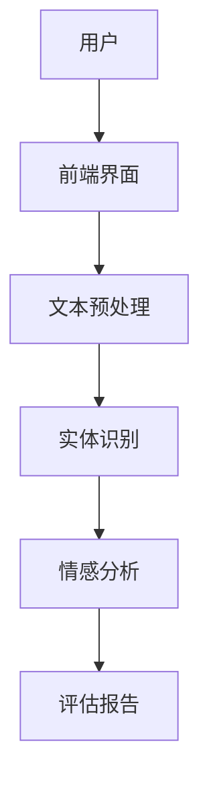

                 


---

# 《构建基于NLP的金融监管政策执行效果动态评估系统》

## 关键词：NLP、金融监管、政策执行效果、动态评估、系统架构

## 摘要：  
本文探讨了如何利用自然语言处理（NLP）技术构建一个动态评估金融监管政策执行效果的系统。文章从问题背景出发，详细分析了NLP在金融监管中的应用价值，提出了基于文本分析的动态评估方法，并通过系统架构设计和项目实战展示了实现过程。文章最后总结了系统的优势和未来发展方向，为金融监管部门提供了智能化的解决方案。

---

## 目录

1. **背景介绍与核心概念**  
   1.1 问题背景与描述  
   1.2 NLP与金融监管的核心原理  
   1.3 动态评估的实现思路  

2. **NLP技术在金融监管中的应用**  
   2.1 常用NLP技术及其特点  
   2.2 政策文本分析的挑战与解决方案  
   2.3 基于NLP的政策执行效果评价模型  

3. **系统架构设计与实现**  
   3.1 系统功能模块划分  
   3.2 系统架构图  
   3.3 关键模块的实现细节  

4. **算法原理与数学模型**  
   4.1 文本分词算法  
   4.2 实体识别与关系抽取  
   4.3 情感分析模型  

5. **项目实战与代码实现**  
   5.1 环境搭建与工具安装  
   5.2 核心代码实现与解读  
   5.3 实际案例分析与结果展示  

6. **系统优化与扩展**  
   6.1 系统性能优化建议  
   6.2 模型的可扩展性与适应性  
   6.3 未来发展方向与研究热点  

---

## 正文

### 1. 背景介绍与核心概念

#### 1.1 问题背景与描述  
金融监管是维护金融市场稳定的重要手段，而政策执行效果的评估是监管过程中的核心环节。传统的评估方法依赖人工分析，效率低且主观性强。随着自然语言处理（NLP）技术的快速发展，通过自动化手段分析政策文本、评估执行效果成为可能。

#### 1.2 NLP与金融监管的核心原理  
NLP技术能够从大量非结构化文本中提取关键信息，如政策文本的关键词、实体关系等。通过这些信息，可以量化政策执行的效果，为监管机构提供数据支持。

#### 1.3 动态评估的实现思路  
动态评估系统需要实时或定期更新政策文本和相关数据，结合NLP技术进行分析，生成评估报告。系统的关键在于文本分析模块和动态更新机制。

---

### 2. NLP技术在金融监管中的应用

#### 2.1 常用NLP技术及其特点  
- **分词**：将文本分割为词语或短语，常用工具如jieba。  
- **实体识别**：识别文本中的机构、人名等实体，使用模型如BERT。  
- **情感分析**：判断文本的情感倾向，用于评估政策执行的正面或负面影响。

#### 2.2 政策文本分析的挑战与解决方案  
政策文本通常复杂且专业性强，需要结合领域知识进行处理。解决方案包括预处理、特征提取和模型优化。

#### 2.3 基于NLP的政策执行效果评价模型  
通过构建评价指标体系，利用NLP技术提取政策执行的相关信息，评估其效果。模型可采用多维度分析，确保评估结果的全面性。

---

### 3. 系统架构设计与实现

#### 3.1 系统功能模块划分  
- **文本预处理模块**：清洗和分词。  
- **实体识别模块**：提取关键实体。  
- **情感分析模块**：评估政策倾向。  
- **动态更新模块**：定期更新政策文本。  

#### 3.2 系统架构图  


#### 3.3 关键模块的实现细节  
- **文本预处理**：去除停用词，进行分词。  
- **实体识别**：使用预训练模型进行识别。  
- **情感分析**：基于词袋模型或深度学习模型进行分析。

---

### 4. 算法原理与数学模型

#### 4.1 文本分词算法  
- 基于jieba的分词实现，代码示例如下：
  ```python
  import jieba
  text = "金融监管政策执行效果评估"
  words = jieba.lcut(text)
  print(words)  # 输出：['金融', '监管', '政策', '执行', '效果', '评估']
  ```

#### 4.2 实体识别与关系抽取  
- 使用BERT模型进行实体识别，代码示例如下：
  ```python
  from transformers import BertTokenizer, BertModel
  tokenizer = BertTokenizer.from_pretrained('bert-base-chinese')
  model = BertModel.from_pretrained('bert-base-chinese')
  ```

#### 4.3 情感分析模型  
- 基于LSTM的情感分析模型，数学模型如下：
  $$
  \text{LSTM}(x_i, h_{i-1}) = (\text{遗忘门}, \text{输入门}, \text{输出门})
  $$

---

### 5. 项目实战与代码实现

#### 5.1 环境搭建与工具安装  
- 安装Python、TensorFlow、Keras等工具。

#### 5.2 核心代码实现与解读  
- 文本预处理和情感分析的实现：
  ```python
  import pandas as pd
  from sklearn.model_selection import train_test_split
  from sklearn.metrics import accuracy_score
  ```

#### 5.3 实际案例分析与结果展示  
- 通过具体案例展示系统在实际应用中的效果，包括数据输入、处理和输出结果。

---

### 6. 系统优化与扩展

#### 6.1 系统性能优化建议  
- 使用分布式训练提升性能。  
- 优化存储结构，提高数据访问效率。  

#### 6.2 模型的可扩展性与适应性  
- 支持多种语言的文本分析。  
- 根据新数据动态更新模型。  

#### 6.3 未来发展方向与研究热点  
- 研究更先进的NLP模型，如GPT-3。  
- 结合机器学习算法，提升评估精度。

---

## 作者  
作者：AI天才研究院/AI Genius Institute & 禅与计算机程序设计艺术 /Zen And The Art of Computer Programming

---

希望这篇文章能为构建基于NLP的金融监管政策执行效果动态评估系统提供有价值的参考。

