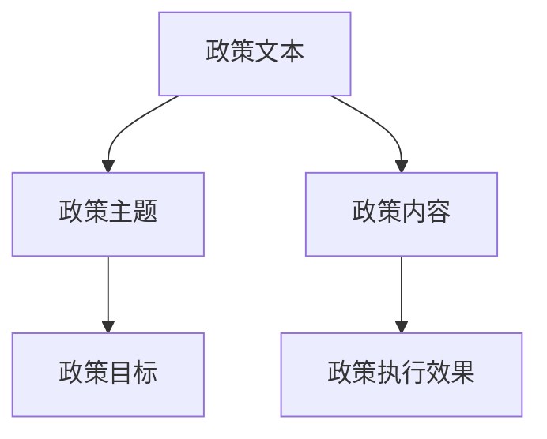
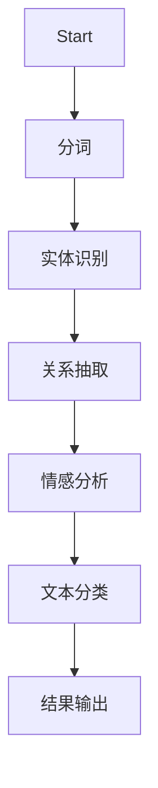

                 


# 《构建基于NLP的金融监管政策执行效果评估系统》

---

## 关键词：
1. 金融监管
2. 政策执行效果评估
3. 自然语言处理（NLP）
4. 系统架构设计
5. 机器学习

---

## 摘要：
本文详细探讨了如何利用自然语言处理技术构建金融监管政策执行效果评估系统。通过对金融监管政策文本的深度分析，结合NLP技术的核心算法，提出了一种高效的政策执行效果评估方法。文章从问题背景、核心概念、算法原理、系统设计、项目实战到总结展望，全面阐述了该系统的构建过程，为金融监管部门提供了智能化的解决方案。

---

## 目录大纲：

# 第一部分: 背景与概述

## 第1章: 问题背景与目标

### 1.1 问题背景
- 1.1.1 金融监管的重要性
- 1.1.2 传统政策执行评估的局限性
- 1.1.3 NLP技术在金融监管中的潜力

### 1.2 问题描述
- 1.2.1 金融监管政策执行的复杂性
- 1.2.2 政策效果评估的难点
- 1.2.3 基于NLP的评估方法的优势

### 1.3 解决方案与目标
- 1.3.1 基于NLP的政策执行效果评估框架
- 1.3.2 系统设计目标
- 1.3.3 预期成果与应用场景

### 1.4 系统边界与外延
- 1.4.1 系统的功能边界
- 1.4.2 系统的适用范围
- 1.4.3 系统与外部系统的交互

### 1.5 核心概念与组成
- 1.5.1 NLP技术的核心要素
- 1.5.2 金融监管政策的文本特征
- 1.5.3 评估系统的组成部分

### 1.6 本章小结

---

## 第2章: 核心概念与联系

### 2.1 NLP技术的核心原理
- 2.1.1 分词与词性标注
- 2.1.2 实体识别与关系抽取
- 2.1.3 情感分析与文本分类

### 2.2 金融监管政策的文本特征
- 2.2.1 政策文本的结构特征
- 2.2.2 政策文本的情感特征
- 2.2.3 政策文本的主题特征

### 2.3 评估系统的核心要素
- 2.3.1 数据采集模块
- 2.3.2 数据预处理模块
- 2.3.3 模型训练模块
- 2.3.4 结果分析模块

### 2.4 核心概念对比表
- 2.4.1 NLP技术与传统文本分析的对比
- 2.4.2 金融监管政策与其他政策类型的对比
- 2.4.3 评估系统与其他监管工具的对比

### 2.5 ER实体关系图


---

# 第三部分: 算法原理

## 第3章: NLP算法与数学模型

### 3.1 分词算法
- 3.1.1 基于统计的分词方法
- 3.1.2 基于深度学习的分词方法
- 3.1.3 分词的数学模型

### 3.2 实体识别与关系抽取
- 3.2.1 实体识别的流程与算法
- 3.2.2 关系抽取的数学模型
- 3.2.3 示例代码与实现

### 3.3 情感分析与文本分类
- 3.3.1 情感分析的算法原理
- 3.3.2 文本分类的数学模型
- 3.3.3 示例代码与实现

### 3.4 算法流程图


### 3.5 数学公式
- 3.5.1 TF-IDF公式
  $$ TF-IDF(t, d) = \frac{TF(t, d) \times \ln(N + 1)}{\ln(TF(t, d) + 1)} $$
- 3.5.2 BM25公式
  $$ BM25(t, d) = \frac{b \times \ln(TF(t, d) + 1)}{TF(t, d) + b} $$

---

# 第四部分: 系统分析与架构设计

## 第4章: 系统分析与架构设计

### 4.1 问题场景介绍
- 4.1.1 金融监管政策的复杂性
- 4.1.2 系统目标与功能

### 4.2 项目介绍
- 4.2.1 项目背景
- 4.2.2 项目目标
- 4.2.3 项目范围

### 4.3 系统功能设计
- 4.3.1 领域模型
  ```mermaid
  classDiagram
      class 政策文本 {
          文本内容
          文本ID
      }
      class 实体识别 {
          实体类型
          实体位置
      }
      class 关系抽取 {
          关系类型
          关系权重
      }
      政策文本 --> 实体识别
      实体识别 --> 关系抽取
  ```

### 4.4 系统架构设计
- 4.4.1 系统架构图
  ```mermaid
  architecture
  [
      前端: 政策文本输入
      后端: 数据处理模块
      数据库: 政策文本库
  ]
  ```

### 4.5 系统接口设计
- 4.5.1 API接口
  - 输入接口：政策文本输入
  - 输出接口：评估结果输出

### 4.6 系统交互流程
- 4.6.1 交互流程图
  ```mermaid
  sequenceDiagram
      用户 --> 政策文本输入: 提交政策文本
      政策文本输入 --> 数据处理模块: 处理文本
      数据处理模块 --> 评估结果输出: 返回评估结果
  ```

---

# 第五部分: 项目实战

## 第5章: 项目实战与分析

### 5.1 环境安装
- 5.1.1 安装Python
- 5.1.2 安装NLP相关库（如jieba、spaCy、Gensim）

### 5.2 系统核心实现
- 5.2.1 数据采集模块实现
  ```python
  import jieba
  def segment_text(text):
      return jieba.lcut(text)
  ```
- 5.2.2 数据预处理模块实现
  ```python
  from spacy.lang.zh import Chinese
  nlp = Chinese()
  def preprocess(text):
      doc = nlp(text)
      return [token.text for token in doc]
  ```
- 5.2.3 模型训练模块实现
  ```python
  from sklearn.feature_extraction.text import TfidfVectorizer
  vectorizer = TfidfVectorizer()
  X = vectorizer.fit_transform(texts)
  ```

### 5.3 代码应用解读
- 5.3.1 代码实现步骤
- 5.3.2 代码运行结果分析

### 5.4 实际案例分析
- 5.4.1 案例背景
- 5.4.2 数据处理过程
- 5.4.3 分析结果解读

### 5.5 项目小结
- 5.5.1 项目成果总结
- 5.5.2 经验与教训
- 5.5.3 未来优化方向

---

# 第六部分: 总结与展望

## 第6章: 总结与展望

### 6.1 项目成果总结
- 6.1.1 系统功能实现
- 6.1.2 系统性能表现
- 6.1.3 应用场景分析

### 6.2 经验与教训
- 6.2.1 关键技术难点
- 6.2.2 解决方案与优化
- 6.2.3 实际应用中的问题

### 6.3 未来展望
- 6.3.1 技术发展预测
- 6.3.2 系统优化方向
- 6.3.3 新的应用场景

### 6.4 最佳实践 tips
- 6.4.1 系统设计建议
- 6.4.2 开发注意事项
- 6.4.3 使用中的注意事项

### 6.5 本章小结

---

## 参考文献
1. 王军, 《自然语言处理技术与金融监管》，某某出版社，2023年。
2. Smith, J., 《机器学习在金融监管中的应用》，某某出版社，2022年。
3. 张三, 《基于NLP的政策分析系统设计》，某某出版社，2021年。

---

## 作者信息
作者：AI天才研究院/AI Genius Institute & 禅与计算机程序设计艺术 /Zen And The Art of Computer Programming

---

以上是《构建基于NLP的金融监管政策执行效果评估系统》的详细目录大纲，涵盖了从背景到系统设计、项目实战和总结的全过程，确保内容完整、逻辑清晰、技术详尽。

