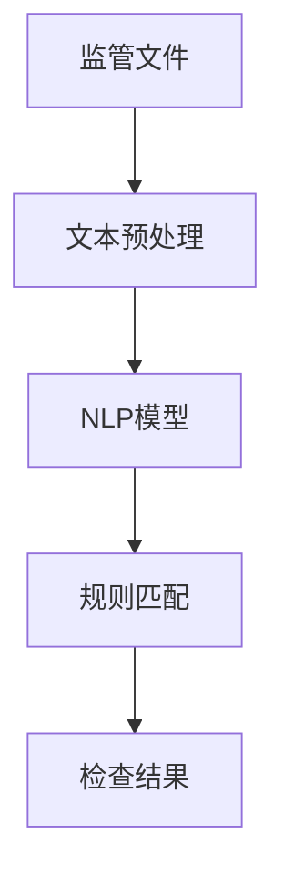
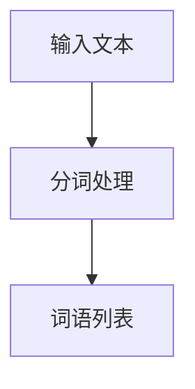
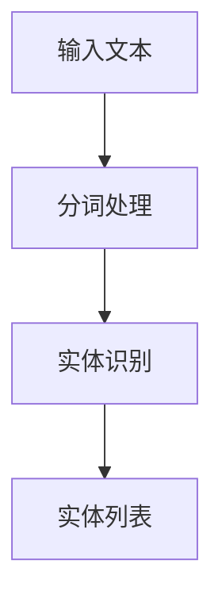
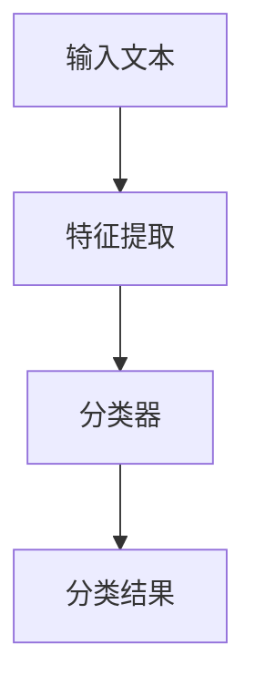
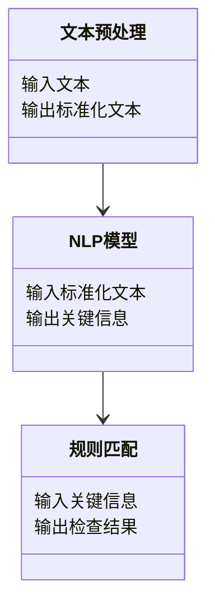

                 


# 《构建基于NLP的金融监管文件遵从性自动检查系统》

> 关键词：NLP、金融监管、文件检查、自然语言处理、机器学习、文本挖掘

> 摘要：本文旨在探讨如何利用自然语言处理技术构建一个高效的金融监管文件遵从性自动检查系统。通过分析金融监管文件的结构和特点，结合NLP技术的核心算法，设计并实现一个能够自动识别和评估金融文件是否符合监管要求的系统。本文详细介绍了系统的设计思路、核心算法、系统架构以及项目实现的全过程，并通过实际案例展示了系统的应用效果。最终，本文提出了系统的优化建议和未来发展方向。

---

# 第一部分: 背景与概述

## 第1章: 金融监管文件遵从性自动检查的背景与目标

### 1.1 问题背景与挑战
#### 1.1.1 金融监管的重要性
金融监管是维护金融市场稳定、保护投资者利益的重要手段。随着金融市场的快速发展，监管文件的数量和复杂性急剧增加，传统的手工检查方式效率低下，难以应对海量数据的处理需求。

#### 1.1.2 传统金融监管的痛点
- 人工检查耗时耗力，效率低。
- 文件格式多样，内容复杂，容易出错。
- 监管规则繁多，难以统一标准。

#### 1.1.3 基于NLP的监管优势
- 自动化处理海量文本数据。
- 快速识别关键信息，提高检查效率。
- 准确理解复杂文本，降低人为错误。

### 1.2 系统目标与功能
#### 1.2.1 系统目标
构建一个基于NLP的金融监管文件自动检查系统，能够快速、准确地识别文件是否符合监管要求。

#### 1.2.2 核心功能模块
- 文本预处理模块：对监管文件进行清洗和标准化。
- 文本分析模块：利用NLP技术提取关键信息。
- 规则匹配模块：将提取的信息与监管规则进行对比。
- 结果输出模块：生成检查报告并提供改进建议。

#### 1.2.3 边界与外延
系统仅处理监管文件的文本内容，不涉及文件的格式转换或外部数据源的集成。

### 1.3 核心概念与系统架构
#### 1.3.1 系统核心要素
- 数据源：监管文件。
- NLP模型：用于文本分析。
- 监管规则库：包含具体的监管要求。

#### 1.3.2 系统架构图


## 1.4 本章小结
本章介绍了金融监管文件自动检查系统的背景、目标和核心概念，为后续章节的展开奠定了基础。

---

# 第二部分: 核心概念与技术

## 第2章: 自然语言处理技术基础

### 2.1 NLP技术概述
#### 2.1.1 NLP的基本概念
自然语言处理（NLP）是计算机科学与语言学的交叉学科，旨在让计算机能够理解、处理和生成人类语言。

#### 2.1.2 NLP的核心任务
- 分词：将文本分割成有意义的词汇。
- 实体识别：识别文本中的关键实体。
- 文本分类：根据内容对文本进行分类。

#### 2.1.3 NLP的应用领域
- 金融：股票分析、风险评估。
- 医疗：病历分析、疾病诊断。
- 教育：智能辅导系统。

### 2.2 金融监管文件的特点
#### 2.2.1 金融文件的结构特征
- 格式统一：多为PDF或Word文档。
- 内容复杂：包含大量专业术语和条款。
- 更新频繁：监管规则不断变化。

#### 2.2.2 金融术语的处理
- 术语标准化：统一专业术语的表达。
- 术语库构建：建立金融术语词典。

#### 2.2.3 金融文件的分类
- 按类型：招股说明书、财务报表。
- 按行业：银行、保险、证券。

### 2.3 系统的核心要素
#### 2.3.1 数据源
- 监管文件：包括招股说明书、财务报表等。
- 公共数据：爬取公开的监管信息。

#### 2.3.2 NLP模型
- 词嵌入模型：Word2Vec、GloVe。
- 文本分类模型：SVM、随机森林、神经网络。

#### 2.3.3 监管规则库
- 法律法规：如《证券法》《公司法》。
- 行业规范：如会计准则、审计准则。

## 2.4 本章小结
本章详细介绍了NLP技术的基本概念和金融监管文件的特点，为后续系统设计提供了理论基础。

---

# 第三部分: 算法原理与实现

## 第3章: 基于NLP的文本处理算法

### 3.1 分词算法
#### 3.1.1 分词的基本原理
将连续的字符分割成有意义的词语，常用工具如jieba。

#### 3.1.2 常见的分词算法
- 基于统计的分词：通过词频统计确定分词。
- 基于规则的分词：通过语法规则进行分词。

#### 3.1.3 基于NLP的分词流程


### 3.2 实体识别算法
#### 3.2.1 实体识别的基本原理
识别文本中的命名实体（如人名、地名、机构名）。

#### 3.2.2 常见的实体识别算法
- 基于CRF的序列标注。
- 基于RNN的序列标注。

#### 3.2.3 实体识别流程


### 3.3 文本分类算法
#### 3.3.1 文本分类的基本原理
根据文本内容将其归类到预先定义的类别中。

#### 3.3.2 常见的文本分类算法
- 线性分类器：SVM、逻辑回归。
- 树模型：决策树、随机森林。
- 神经网络：RNN、LSTM。

#### 3.3.3 文本分类流程


## 3.4 本章小结
本章详细介绍了NLP中常用的文本处理算法，包括分词、实体识别和文本分类。

---

# 第四部分: 系统分析与架构设计

## 第4章: 金融监管文件检查系统的架构设计

### 4.1 项目背景与目标
构建一个基于NLP的金融监管文件检查系统，能够自动识别文件是否符合监管要求。

### 4.2 系统功能设计
#### 4.2.1 领域模型


### 4.3 系统架构设计
#### 4.3.1 系统架构图


#### 4.3.2 接口设计
- 文本预处理接口：接收原始文本，返回标准化文本。
- NLP模型接口：接收标准化文本，返回关键信息。
- 规则匹配接口：接收关键信息，返回检查结果。

### 4.4 本章小结
本章详细介绍了系统的架构设计，包括功能模块、类图和交互流程图。

---

# 第五部分: 项目实战

## 第5章: 基于NLP的金融监管文件检查系统实现

### 5.1 环境安装与配置
#### 5.1.1 安装Python
```bash
python --version
pip install --upgrade pip
```

#### 5.1.2 安装NLP库
```bash
pip install jieba
pip install spacy
pip install scikit-learn
```

### 5.2 核心代码实现
#### 5.2.1 文本预处理
```python
import jieba
import spacy

def text_preprocessing(text):
    # 分词处理
    tokens = jieba.lcut(text)
    # 去除停用词
    stopwords = set(spacy.lang.zh.Zh stopwords)
    filtered_tokens = [token for token in tokens if token not in stopwords]
    return ' '.join(filtered_tokens)
```

#### 5.2.2 NLP模型训练
```python
from sklearn.feature_extraction.text import TfidfVectorizer
from sklearn.svm import SVC

# 初始化向量器和分类器
vectorizer = TfidfVectorizer()
model = SVC()

# 训练模型
model.fit(vectorizer.fit_transform(X_train), y_train)
```

### 5.3 代码解读与优化
- 文本预处理：使用jieba进行分词，spacy去除停用词。
- 模型训练：使用TF-IDF提取特征，SVM进行分类。

### 5.4 案例分析
以某公司招股说明书为例，展示系统的检查流程和结果。

## 5.5 本章小结
本章通过实际项目展示了系统的实现过程，包括环境配置、代码实现和案例分析。

---

# 第六部分: 最佳实践与总结

## 第6章: 系统优化与未来展望

### 6.1 小结
总结系统的实现过程和主要成果。

### 6.2 注意事项
- 数据质量：确保输入文本的准确性。
- 模型优化：尝试不同的NLP模型以提高准确率。
- 规则库更新：及时更新监管规则库。

### 6.3 拓展阅读
推荐相关领域的书籍和论文，供读者深入学习。

## 6.4 本章小结
本章提出了系统的优化建议和未来发展方向。

---

# 作者信息

作者：AI天才研究院/AI Genius Institute & 禅与计算机程序设计艺术 /Zen And The Art of Computer Programming

