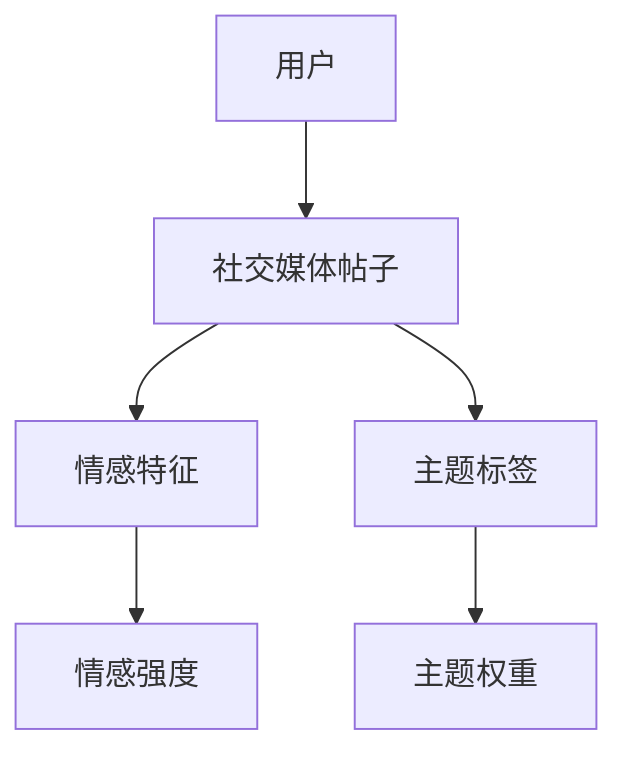
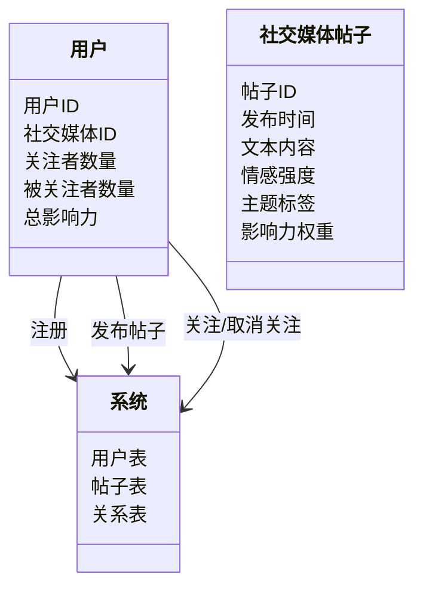
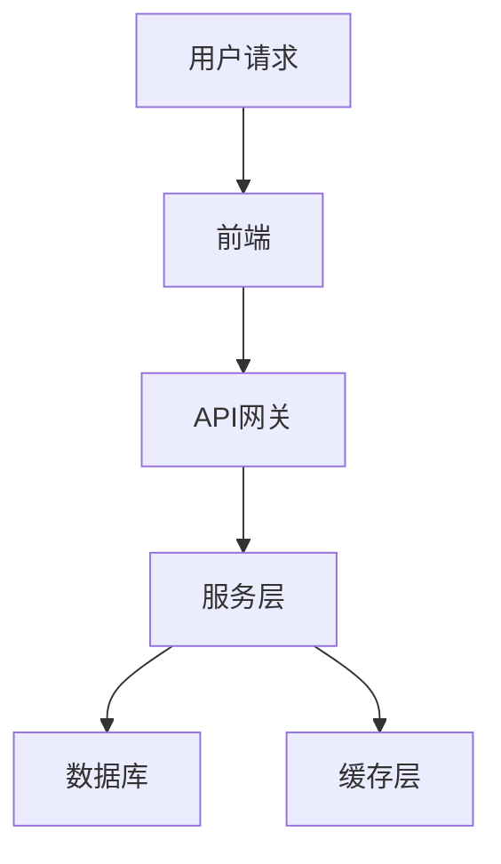
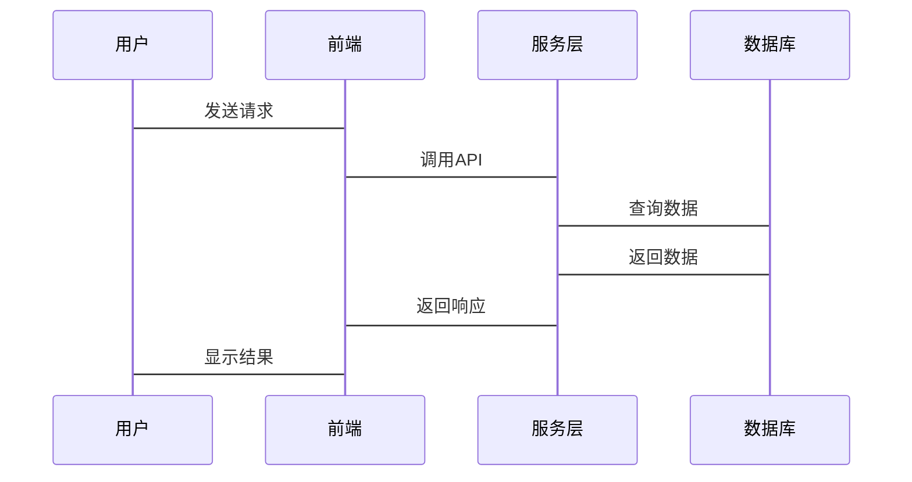

                 


# 《构建基于NLP的金融社交媒体影响力量化模型》

> 关键词：自然语言处理（NLP）、金融社交媒体、影响力量化、情感分析、主题分析、影响力传播模型

> 摘要：本文详细探讨了如何利用自然语言处理技术，量化金融社交媒体中的影响力。文章从背景介绍、核心概念、算法原理、系统架构设计到项目实战，全面解析了构建基于NLP的金融社交媒体影响力量化模型的全过程。通过情感分析、主题分析和影响力传播模型的结合，本文提出了一个创新的解决方案，并通过实际案例展示了模型的应用与效果。

---

## 第一部分: 背景介绍

### 第1章: 问题背景与描述

#### 1.1 问题背景
- **金融社交媒体的兴起**：随着互联网和移动设备的普及，社交媒体在金融领域的影响力日益显著。投资者、分析师和普通用户通过社交媒体分享观点、分析市场趋势，甚至影响市场情绪。
- **社会化媒体对金融市场的影响**：社交媒体上的信息传播速度极快，一条重磅新闻可能在几小时内影响全球市场。然而，如何量化这些信息对市场的影响成为一大挑战。
- **NLP在金融分析中的应用**：自然语言处理技术能够从海量文本数据中提取有用信息，帮助分析市场情绪、识别主题趋势，从而辅助投资决策。

#### 1.2 问题描述
- **社交媒体数据的特点**：数据量大、噪声多、情感复杂，且信息传播具有动态性和不确定性。
- **影响力量化的核心问题**：如何从社交媒体文本中提取情感、主题和影响力，并将其量化为可衡量的指标。
- **当前研究的痛点与难点**：现有模型多关注单一维度（如情感分析），难以综合考虑主题、传播路径和影响力权重。

---

## 第2章: 问题解决与边界

### 2.1 问题解决思路
- **NLP技术在影响力量化中的作用**：通过文本预处理、特征提取和模型训练，从社交媒体文本中提取情感、主题和影响力信息。
- **数据处理与特征提取的关键步骤**：分词、去停用词、向量化，以及基于上下文的特征提取。
- **模型构建与评估的流程**：训练情感分析模型、主题分析模型，结合影响力传播算法，最终构建综合影响力评估模型。

### 2.2 边界与外延
- **数据范围的界定**：仅考虑社交媒体文本数据，不包括其他金融数据（如股价、交易数据）。
- **模型适用的场景**：适用于分析公开社交媒体数据，不涉及用户隐私和敏感信息。
- **与其他金融模型的区分**：与其他金融预测模型不同，本文模型侧重于分析社交媒体文本中的影响力，而非直接预测市场走势。

---

## 第3章: 核心概念与联系

### 3.1 核心概念原理
- **情感分析**：通过NLP技术判断文本的情感倾向（正面、负面、中性）。
- **主题分析**：识别文本的主要主题，帮助理解文本内容的核心。
- **影响力传播模型**：基于社交网络的影响力传播，量化用户在社交网络中的影响力权重。

### 3.2 概念属性对比表

| 概念 | 属性 | 描述 |
|------|------|------|
| 情感分析 | 数据类型 | 文本数据 |
|        | 方法 | 机器学习/深度学习 |
| 主题分析 | 数据类型 | 文本数据 |
|        | 方法 | 主题模型（如LDA） |
| 影响力传播 | 数据类型 | 网络数据 |
|        | 方法 | 图论模型 |

### 3.3 ER实体关系图



---

## 第二部分: 核心概念与联系

### 第4章: 算法原理与流程

#### 4.1 文本预处理
- **分词与词干提取**：将文本分割为词语，并提取词干（如“running”变为“run”）。
- **停用词过滤**：去除无意义的词汇（如“and”、“the”）。
- **向量表示**：使用Word2Vec或GloVe将词语转换为向量表示。

#### 4.2 情感分析
- **方法**：基于深度学习的模型（如LSTM、BERT）。
- **流程**：
  1. 文本预处理（分词、去停用词）。
  2. 特征提取（向量化）。
  3. 模型训练与预测。

#### 4.3 主题分析
- **方法**：主题模型（如LDA、NMF）。
- **流程**：
  1. 文本预处理。
  2. 特征提取（主题向量化）。
  3. 主题识别与权重计算。

#### 4.4 影响力传播
- **方法**：基于社交网络的影响力传播模型（如PageRank、KL-MNC模型）。
- **流程**：
  1. 构建社交网络图。
  2. 计算影响力权重。
  3. 传播影响力。

---

## 第三部分: 系统分析与架构设计

### 第5章: 系统功能设计

#### 5.1 领域模型


### 5.2 系统架构设计



### 5.3 系统接口设计

#### 5.3.1 API接口
- `/api/v1/users`：获取用户信息。
- `/api/v1/posts`：获取帖子信息。
- `/api/v1/influence`：计算影响力权重。

#### 5.3.2 数据接口
- 数据库：用户表、帖子表、关系表。
- 缓存层：Redis缓存用户和帖子信息。

### 5.4 系统交互流程



---

## 第四部分: 项目实战

### 第6章: 环境安装与系统实现

#### 6.1 环境安装
- 安装Python和相关库（如pandas、numpy、scikit-learn、pytorch、transformers）。
- 安装Nginx和Django框架（用于API开发）。
- 安装数据库（如MySQL、MongoDB）。

#### 6.2 核心功能实现

##### 情感分析实现

```python
from transformers import pipeline

sentiment_pipeline = pipeline("sentiment-analysis")
def analyze_sentiment(text):
    result = sentiment_pipeline(text)
    return result[0]['label'], result[0]['score']
```

##### 主题分析实现

```python
from sklearn.decomposition import NMF

# 假设 corpus 是预处理后的文本列表
model = NMF(n_components=5, random_state=42)
model.fit(corpus)
components = model.components_
```

##### 影响力传播实现

```python
import networkx as nx

G = nx.DiGraph()
G.add_edges_from(edges)
# 计算影响力权重
pagerank = nx.pagerank(G)
```

#### 6.3 系统集成与部署

- 部署API服务。
- 部署前端界面。
- 部署后端服务。

#### 6.4 项目总结与优化

---

## 第五部分: 最佳实践与小结

### 第7章: 最佳实践与总结

#### 7.1 小结
- 本文提出了一种基于NLP的金融社交媒体影响力量化模型。
- 通过情感分析、主题分析和影响力传播模型的结合，实现了对社交媒体影响力的量化。

#### 7.2 注意事项
- 数据隐私和合规性问题。
- 模型的实时性和可扩展性。
- 多语言文本的处理。

#### 7.3 拓展阅读
- 《自然语言处理入门》。
- 《社交网络分析与应用》。
- 《影响力传播模型的研究与应用》。

---

# 作者：AI天才研究院/AI Genius Institute  
# 《禅与计算机程序设计艺术》系列丛书  
# 本文版权归作者所有，转载请注明出处。

