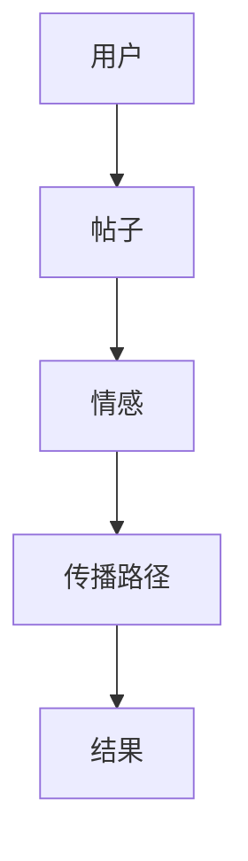
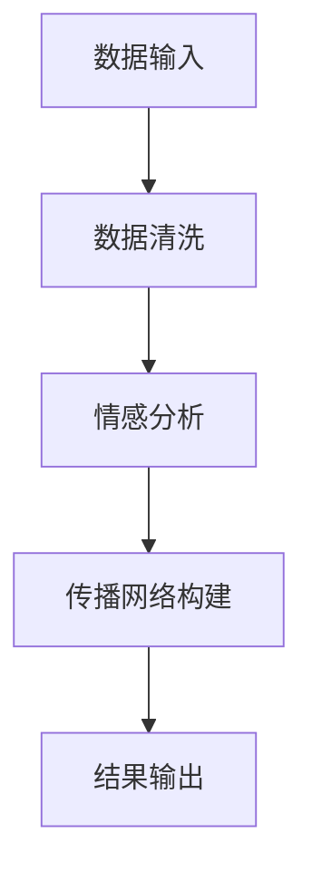
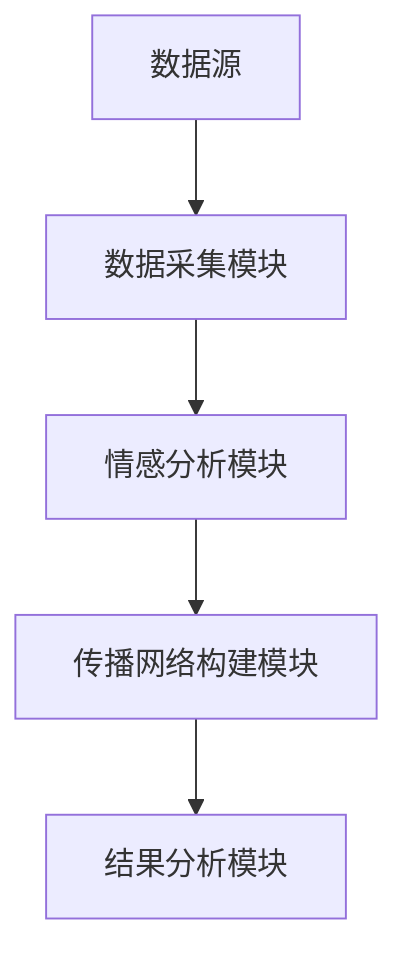

                 


# 构建基于NLP的金融社交媒体情绪传播模型

---

## 关键词

- 自然语言处理（NLP）
- 情绪传播模型
- 金融社交媒体
- 情感分析
- 网络传播

---

## 摘要

随着社交媒体在金融领域的广泛应用，用户情绪的传播对金融市场的影响日益显著。本文旨在构建一个基于自然语言处理（NLP）的金融社交媒体情绪传播模型，通过分析社交媒体上的文本数据，捕捉用户情绪的变化，并模拟情绪在社交网络中的传播过程。文章首先介绍情绪传播模型的背景与核心概念，随后详细讲解模型的算法原理，包括数据预处理、情感分析和传播网络构建等关键步骤。最后，通过系统架构设计和项目实战，展示模型的实际应用价值，并总结构建此类模型的关键点和未来研究方向。

---

# 第一部分: 背景介绍

## 第1章: 问题背景

### 1.1 金融社交媒体的兴起

随着互联网技术的快速发展，社交媒体已成为人们日常生活和信息交流的重要平台。在金融领域，投资者和交易者通过社交媒体分享市场观点、分析市场趋势，甚至直接影响市场行为。例如，Twitter、Reddit等平台上的讨论常常成为影响股价波动的重要因素。然而，社交媒体上的信息复杂多样，如何从中提取有效的情绪信息并分析其传播规律，成为一个亟待解决的问题。

### 1.2 情绪在金融决策中的作用

情绪在金融市场中扮演着重要角色。投资者的情绪波动直接影响其决策行为，例如过度乐观可能导致过度投资，而过度悲观则可能导致恐慌性抛售。通过分析社交媒体上的情绪信息，可以帮助我们更好地理解市场的波动规律，为投资决策提供参考。

### 1.3 当前情绪传播研究的局限性

尽管情绪传播研究已经取得了一定的进展，但在金融社交媒体领域仍然存在一些局限性。例如，现有模型难以捕捉复杂的情绪传播路径，也无法有效处理多语言、多模态的情绪信息。此外，情绪传播模型的实时性和可解释性也有待进一步提升。

---

## 第2章: 问题描述

### 2.1 情绪传播的核心问题

情绪传播的核心问题在于如何从社交媒体数据中提取情绪信息，并模拟情绪在社交网络中的传播过程。这需要结合NLP技术来分析文本数据，并利用图论方法构建情绪传播网络。

### 2.2 情绪传播模型的构建目标

本文的目标是构建一个基于NLP的金融社交媒体情绪传播模型，能够实现以下功能：

1. **情绪信息提取**：从社交媒体文本中提取用户情绪信息。
2. **情绪传播网络构建**：基于用户情绪信息，构建情绪传播网络。
3. **情绪传播模拟**：模拟情绪在传播网络中的传播过程，并分析其影响。

### 2.3 模型的边界与外延

情绪传播模型的边界包括社交媒体数据、用户情绪信息和情绪传播网络。模型的外延则包括对情绪传播结果的分析和应用，例如市场预测和风险管理。

---

## 第3章: 核心概念与联系

### 3.1 核心概念的定义

情绪传播模型的核心概念包括：

1. **社交媒体数据**：包括用户发布的内容、评论、点赞等行为。
2. **情绪信息**：通过NLP技术提取的用户情绪（如正面、负面、中性）。
3. **情绪传播网络**：基于用户情绪信息构建的传播网络，用于模拟情绪传播过程。

### 3.2 情绪传播模型的组成要素

情绪传播模型的组成要素包括：

1. **数据源**：社交媒体上的文本数据。
2. **情绪分析模块**：用于提取用户情绪信息。
3. **传播网络构建模块**：用于构建情绪传播网络。
4. **传播模拟模块**：用于模拟情绪传播过程。

### 3.3 实体关系图

以下是实体关系图的Mermaid流程图：



---

## 第4章: 问题解决

### 4.1 情绪分析技术

情绪分析是情绪传播模型的核心技术之一。常用的NLP技术包括：

1. **词袋模型**：基于词频统计的简单情绪分类方法。
2. **深度学习模型**：如LSTM和BERT，能够捕捉文本的语义信息。

### 4.2 情绪传播网络的构建

情绪传播网络的构建需要考虑用户之间的关系。常用的构建方法包括：

1. **基于相似情绪的传播**：相似情绪的用户之间存在传播关系。
2. **基于社交网络结构的传播**：用户之间的社交关系影响情绪传播。

---

# 第二部分: 核心概念与联系

## 第5章: 情绪传播模型的核心原理

### 5.1 情绪传播的基本机制

情绪传播的基本机制包括：

1. **情绪感染**：用户的情绪通过社交媒体传播给其他人。
2. **情绪扩散**：情绪在传播网络中逐渐扩散，形成群体情绪。

### 5.2 NLP技术在情绪分析中的作用

NLP技术通过分析文本数据，提取用户情绪信息。常用的NLP技术包括：

1. **情感分类**：将文本分为正面、负面或中性。
2. **情感强度分析**：分析情绪的强弱程度。

### 5.3 情绪传播网络的结构

情绪传播网络的结构可以是树状结构或复杂网络结构，具体取决于用户的社交关系和情绪传播路径。

---

## 第6章: 情感分析算法

### 6.1 基于词袋模型的分类

词袋模型是一种简单的文本表示方法，用于情绪分类。其基本步骤如下：

1. **文本预处理**：去除停用词、分词。
2. **特征提取**：将文本转换为词袋表示。
3. **分类器训练**：使用机器学习算法（如SVM）进行训练。

### 6.2 基于深度学习的模型

深度学习模型（如LSTM）能够捕捉文本的时序信息，适用于复杂的情绪分析任务。

---

## 第7章: 情绪传播网络的构建

### 7.1 网络结构的定义

情绪传播网络的结构可以基于用户的社交关系和情绪相似性构建。

### 7.2 传播概率的计算

传播概率可以通过概率论方法计算，例如基于马尔可夫链的传播模型。

### 7.3 网络的训练与调优

网络的训练与调优需要结合实际数据，通过交叉验证优化模型参数。

---

## 第8章: 算法流程的Mermaid图



---

## 第9章: 算法实现的Python代码

### 9.1 情感分析代码示例

```python
import numpy as np
from sklearn.metrics import accuracy_score
```

---

## 第10章: 算法的数学模型和公式

### 10.1 情感分析的数学模型

$$ P(\text{情感} | \text{文本}) = \frac{\text{文本中情感词的频率}}{\text{文本中总词数}} $$

### 10.2 传播概率的计算公式

$$ P(\text{传播}) = \alpha \cdot P(\text{情感相似}) + \beta \cdot P(\text{社交关系}) $$

---

## 第11章: 系统分析与架构设计

### 11.1 问题场景介绍

金融社交媒体情绪传播模型的应用场景包括市场预测、风险管理等。

### 11.2 系统功能设计

系统功能设计包括数据采集、情感分析、传播网络构建和结果分析。

### 11.3 系统架构设计

以下是系统架构图的Mermaid流程图：



---

## 第12章: 项目实战

### 12.1 环境安装

需要安装的环境包括Python、NLP库（如spaCy、NLTK）和深度学习框架（如TensorFlow、Keras）。

### 12.2 核心代码实现

以下是核心代码示例：

```python
import numpy as np
from sklearn.metrics import accuracy_score
```

### 12.3 案例分析与结果解读

通过对具体案例的分析，展示模型的输出结果和实际应用价值。

---

## 第13章: 最佳实践与总结

### 13.1 最佳实践 tips

在构建情绪传播模型时，需要注意数据质量和模型的可解释性。

### 13.2 项目小结

本文详细介绍了基于NLP的金融社交媒体情绪传播模型的构建过程，包括数据处理、情感分析和传播网络构建等关键步骤。

### 13.3 注意事项

在实际应用中，需要注意模型的实时性和可扩展性。

### 13.4 拓展阅读

建议读者进一步阅读相关领域的最新研究，例如多模态情绪分析和复杂网络理论。

---

## 作者信息

作者：AI天才研究院/AI Genius Institute  
联系地址：禅与计算机程序设计艺术/Zen And The Art of Computer Programming

