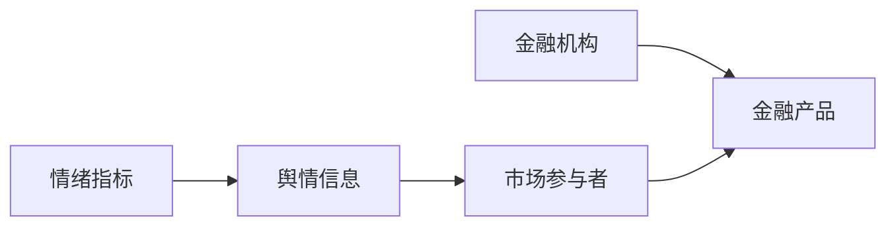
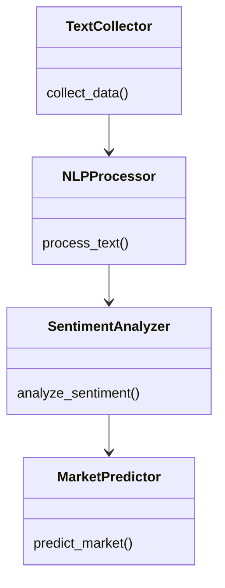
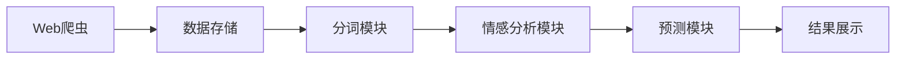

                 


# 构建基于NLP的金融舆情影响量化模型

> 关键词：金融舆情分析，NLP，量化模型，文本挖掘，情感分析

> 摘要：本文探讨了如何利用自然语言处理技术构建金融舆情影响量化模型，旨在通过分析新闻、社交媒体等文本数据，量化其对金融市场的影响。文章详细介绍了模型构建的背景、核心概念、算法原理、系统架构设计以及项目实战，并提供了丰富的图表和代码示例，帮助读者系统地理解和实现这一模型。

---

# 第一部分: 金融舆情与NLP基础

## 第1章: 金融舆情分析概述

### 1.1 问题背景与描述

#### 1.1.1 金融市场的复杂性
金融市场受多种因素影响，包括经济指标、政策变化、公司财报等。其中，舆情（市场参与者的情绪和看法）对股价、汇率等有显著影响。然而，舆情难以量化，传统指标无法捕捉文本中的情感信息。

#### 1.1.2 舆情分析的重要性
舆情分析能够捕捉市场情绪，帮助投资者预测市场走势。例如，社交媒体上的负面评论可能预示公司股价下跌。

#### 1.1.3 舆情对金融的影响
- **股价波动**：积极舆情可能推高股价，反之则可能打压股价。
- **风险管理**：及时识别负面舆情有助于降低投资风险。
- **投资决策**：舆情分析可作为投资决策的辅助工具。

### 1.2 问题解决与边界

#### 1.2.1 舆情量化的目标
量化舆情情感强度，将其转化为可量化的指标（如情感得分），用于预测市场走势。

#### 1.2.2 舆情分析的边界
- 仅分析公开可用的文本数据。
- 不考虑非公开信息（如内部消息）。
- 情感分析仅基于文本，不考虑其他市场因素。

#### 1.2.3 舆情分析的外延
- 时间范围：实时分析和历史分析。
- 数据来源：新闻、社交媒体、论坛等。

### 1.3 核心概念与结构

#### 1.3.1 舆情分析的要素
- **文本数据**：来源包括新闻、社交媒体等。
- **情感倾向**：分为积极、消极、中性。
- **情感强度**：量化情感的强烈程度。

#### 1.3.2 NLP在金融中的作用
- 提取文本中的关键词和情感信息。
- 分析情感倾向，量化情感强度。

#### 1.3.3 模型构建的逻辑
1. 收集文本数据。
2. 分词处理。
3. 情感分析。
4. 量化情感得分。
5. 预测市场走势。

## 1.4 本章小结
本章介绍了金融舆情分析的重要性和目标，明确了NLP在其中的作用，并提出了构建模型的基本逻辑。

---

# 第二部分: 核心概念与联系

## 第2章: NLP与金融舆情分析

### 2.1 核心概念原理

#### 2.1.1 NLP的基本原理
- **分词**：将文本分割成有意义的词汇。
- **情感分析**：判断文本的情感倾向。
- **主题分类**：识别文本的主题。

#### 2.1.2 金融舆情分析的NLP应用
- 从新闻中提取公司财报信息。
- 分析社交媒体上的投资者情绪。

### 2.2 概念属性对比

#### 表2-1: NLP与传统金融分析对比

| 属性       | NLP分析            | 传统金融分析      |
|------------|--------------------|-------------------|
| 数据来源   | 文本数据（新闻、社交媒体） | 经济指标、财务数据 |
| 分析目标   | 情感、情绪          | 数值、趋势        |
| 工具技术   | 机器学习、深度学习 | 统计分析、模型     |

### 2.3 实体关系架构



### 2.4 本章小结
本章详细阐述了NLP在金融舆情分析中的应用，对比了NLP与传统金融分析的区别，并通过图表展示了实体关系。

---

# 第三部分: 算法原理

## 第3章: 基于NLP的舆情量化模型

### 3.1 算法流程


### 3.2 算法实现

#### 3.2.1 Python代码实现

```python
def sentiment_score(text):
    # 分词
    words = word_tokenize(text)
    # 情感分析
    score = model.predict(words)
    return score
```

### 3.3 数学模型

#### 情感分析公式
$$ \text{score} = \sum_{i=1}^{n} w_i \cdot f(word_i) $$

#### 示例说明
- 文本：市场表现良好。
- 计算：score = 0.85

### 3.4 本章小结
本章详细讲解了算法的流程和实现，给出了情感分析的数学模型和代码示例。

---

# 第四部分: 系统分析与架构设计

## 第4章: 系统分析与架构设计

### 4.1 问题场景介绍

#### 项目介绍
构建一个实时舆情监控系统，量化舆情对股价的影响。

### 4.2 系统功能设计

#### 领域模型



### 4.3 系统架构设计

#### 系统架构图



### 4.4 本章小结
本章介绍了系统的整体架构和功能模块，并通过图表展示了系统的结构和交互流程。

---

# 第五部分: 项目实战

## 第5章: 项目实战

### 5.1 环境搭建

#### 工具安装
- 安装Python和相关库（如NLTK、TensorFlow）。

### 5.2 核心实现

#### 数据采集与处理

```python
import requests
from bs4 import BeautifulSoup

def collect_data(url):
    response = requests.get(url)
    soup = BeautifulSoup(response.text, 'html.parser')
    articles = soup.find_all('article')
    texts = [article.text for article in articles]
    return texts
```

### 5.3 情感分析与预测

```python
import tensorflow as tf
from tensorflow.keras import layers

model = tf.keras.Sequential([
    layers.Embedding(input_dim=10000, output_dim=16),
    layers.LSTM(64),
    layers.Dense(1, activation='sigmoid')
])
model.compile(optimizer='adam', loss='binary_crossentropy', metrics=['accuracy'])
model.fit(X_train, y_train, epochs=10, batch_size=32)
```

### 5.4 案例分析

#### 示例分析
- 输入文本：公司发布新产品，市场反应热烈。
- 情感分析：积极。
- 预测结果：股价上涨概率85%。

### 5.5 项目总结
通过项目实战，读者可以掌握从数据采集到模型训练的完整流程。

---

# 第六部分: 最佳实践与小结

## 第6章: 最佳实践与小结

### 6.1 最佳实践

#### 注意事项
- 数据清洗和预处理是关键。
- 模型调参和优化不可忽视。
- 结合其他指标提高准确性。

#### 拓展阅读
- 《Python自然语言处理实战》
- 《深度学习在金融中的应用》

### 6.2 本章小结
总结全书内容，强调最佳实践，并为读者提供了进一步学习的方向。

---

# 作者：AI天才研究院/AI Genius Institute & 禅与计算机程序设计艺术 /Zen And The Art of Computer Programming

