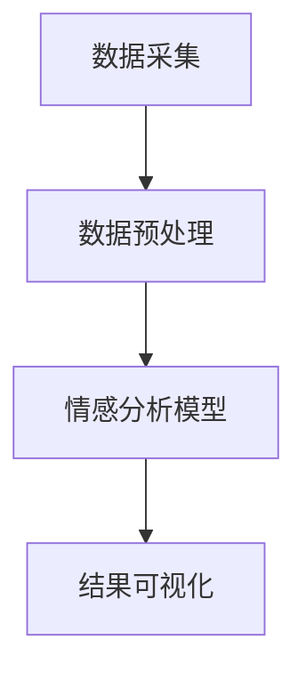
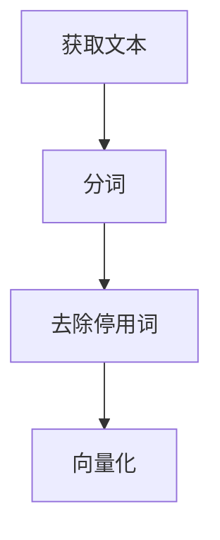
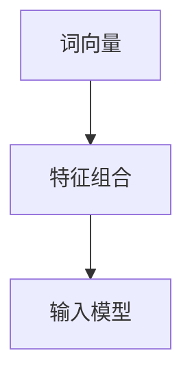
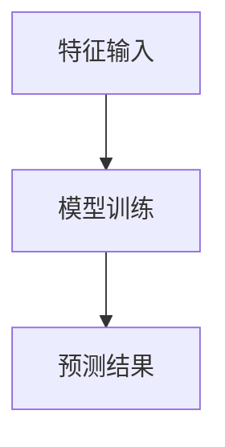
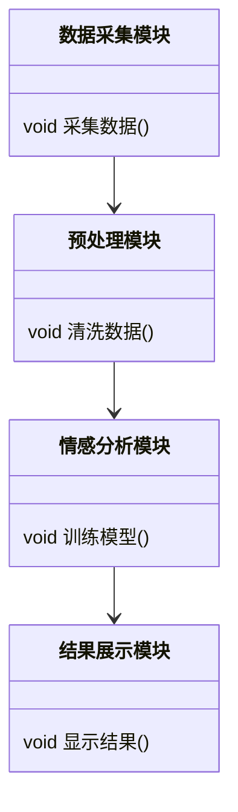
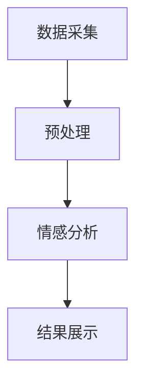
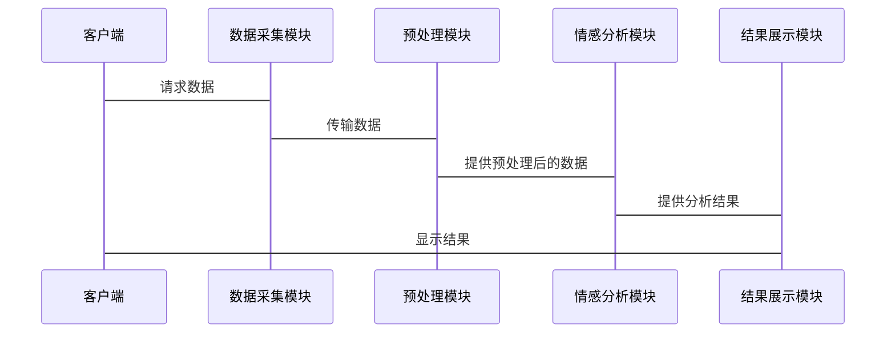

                 


# 《构建基于NLP的金融舆情情感分析系统》

## 关键词：
- 金融舆情分析
- 自然语言处理（NLP）
- 情感分析
- 深度学习
- 金融系统架构设计

## 摘要：
本文详细探讨了基于NLP的金融舆情情感分析系统的构建过程。从问题背景到核心概念，从算法原理到系统设计，再到项目实战和优化扩展，系统地分析了构建该系统的各个方面。文章结合理论与实践，通过详细的数学公式、流程图和代码示例，帮助读者全面理解金融舆情情感分析系统的构建方法。

---

# 第1章: 问题背景与需求分析

## 1.1 问题背景介绍

### 1.1.1 金融舆情分析的定义与重要性
金融舆情分析是指对金融市场中的言论、评论和新闻进行情感分析，以评估市场参与者的情绪变化。其重要性在于，情绪变化往往会影响市场走势，帮助投资者做出更明智的决策。

### 1.1.2 情感分析在金融领域的应用价值
情感分析可以帮助金融机构识别市场情绪，预测股价波动，优化投资策略。例如，通过分析社交媒体上的评论，机构可以提前捕捉市场情绪的变化。

### 1.1.3 当前金融舆情分析的主要挑战
- 数据量大且复杂
- 情感表达多样且模糊
- 噪声数据干扰
- 模型实时性要求高

## 1.2 问题描述与目标

### 1.2.1 金融舆情分析的核心问题
如何从大量非结构化文本中提取情感信息，并将其转化为可量化的指标。

### 1.2.2 系统目标与功能定位
- 实时采集金融舆情数据
- 自动进行情感分析
- 提供可视化结果

### 1.2.3 边界与外延
系统仅关注情感分析，不涉及具体的金融交易决策。

## 1.3 系统构建的核心要素

### 1.3.1 数据来源与特征
- 数据来源：新闻、社交媒体、论坛
- 数据特征：文本数据、时间戳

### 1.3.2 情感分析模型的选择
- 选择合适的模型（如LSTM、BERT）
- 模型性能指标

### 1.3.3 系统架构与实现方案
- 分层架构：数据采集、预处理、模型训练、结果展示

## 1.4 本章小结
本章介绍了金融舆情分析的背景、目标和核心要素，为后续章节奠定了基础。

---

# 第2章: 核心概念与联系

## 2.1 NLP与情感分析的基本原理

### 2.1.1 自然语言处理（NLP）的核心概念
- 词袋模型：将文本转换为向量表示。
- 词嵌入模型：如Word2Vec，将词转化为低维向量。

### 2.1.2 情感分析的基本原理与方法
- 基于规则：使用情感词典。
- 统计模型：如Naive Bayes。
- 深度学习：如LSTM。

### 2.1.3 金融舆情分析的特殊性与复杂性
- 市场术语多，情感表达复杂。

## 2.2 实体关系与系统架构

### 2.2.1 金融舆情分析系统的ER实体关系图
```mermaid
erd
    股票: id, 名称
    评论: id, 股票_id, 内容, 时间
    情感分析结果: id, 股票_id, 情感极性, 时间
    评论 -> 情感分析结果: 分析结果
```

### 2.2.2 系统核心模块与功能模块的关系


### 2.2.3 金融舆情数据的特征与分类
- 文本长度、情感极性（正、负、中性）

## 2.3 核心算法对比分析

### 2.3.1 基于规则的情感分析算法
- 使用情感词典，统计关键词出现的频率。

### 2.3.2 基于统计模型的情感分析算法
- Naive Bayes：适用于小数据集。

### 2.3.3 深度学习模型在情感分析中的应用
- LSTM：适合处理序列数据。

## 2.4 本章小结
本章通过对比分析，介绍了不同情感分析算法的特点和适用场景。

---

# 第3章: 算法原理与数学模型

## 3.1 情感分析的算法原理

### 3.1.1 基于词袋模型的情感分析
- 将文本表示为词袋，统计每个词的出现频率。

### 3.1.2 基于词嵌入模型的情感分析
- 使用Word2Vec将词转换为向量。

### 3.1.3 基于深度学习的情感分析模型
- LSTM：捕捉文本的序列信息。

## 3.2 算法流程与数学模型

### 3.2.1 文本预处理的数学模型
- 分词、去除停用词、转换为向量。

### 3.2.2 特征提取的数学模型
- 使用词嵌入模型提取特征。

### 3.2.3 情感分类的数学模型
- 使用 softmax 函数进行分类。

## 3.3 深度学习模型的数学公式

### 3.3.1 RNN模型的数学公式
$$
f(x_t) = \sigma(W_{hh}h_{t-1} + W_{xh}x_t + b)
$$

### 3.3.2 LSTM模型的数学公式
$$
i_t = \sigma(W_{xi}x_t + W_{hi}h_{t-1} + b_i)
$$

### 3.3.3 Transformer模型的数学公式
$$
\text{Attention}(Q, K, V) = \text{softmax}\left(\frac{QK^T}{\sqrt{d_k}}\right)V
$$`

## 3.4 算法实现的流程图

### 3.4.1 文本预处理流程图


### 3.4.2 特征提取流程图


### 3.4.3 情感分类流程图


## 3.5 本章小结
本章详细介绍了情感分析算法的原理和数学模型，为后续实现提供了理论基础。

---

# 第4章: 系统分析与架构设计

## 4.1 项目目标与功能需求

### 4.1.1 项目目标
- 实现金融舆情情感分析系统的构建。

### 4.1.2 系统功能需求
- 数据采集模块、预处理模块、模型训练模块、结果展示模块。

## 4.2 系统架构设计

### 4.2.1 系统功能模块设计


### 4.2.2 系统架构图


## 4.3 系统接口设计

### 4.3.1 接口定义
- 数据接口：采集模块与预处理模块之间。

### 4.3.2 交互流程


## 4.4 本章小结
本章通过系统架构设计，明确了各模块之间的关系和交互流程。

---

# 第5章: 项目实战

## 5.1 环境配置

### 5.1.1 安装Python
```
pip install python
```

### 5.1.2 安装NLP库
```
pip install numpy pandas scikit-learn
pip install tensorflow
```

## 5.2 数据采集与预处理

### 5.2.1 数据采集
```python
import requests

url = "http://example.com/api"
response = requests.get(url)
data = response.json()
```

### 5.2.2 数据清洗
```python
import pandas as pd

df = pd.DataFrame(data)
df = df.dropna()
```

## 5.3 模型训练

### 5.3.1 构建模型
```python
from tensorflow.keras import layers

model = tf.keras.Sequential()
model.add(layers.Embedding(...))
model.add(layers.LSTM(...))
model.add(layers.Dense(3, activation='softmax'))
model.compile(...)
```

### 5.3.2 训练模型
```python
model.fit(X_train, y_train, epochs=10, batch_size=32)
```

## 5.4 模型部署与结果展示

### 5.4.1 模型预测
```python
y_pred = model.predict(X_test)
```

### 5.4.2 结果可视化
```python
import matplotlib.pyplot as plt

plt.bar(range(len(y_pred)), y_pred)
plt.show()
```

## 5.5 项目小结
本章通过实际案例，展示了系统的构建过程，验证了系统的可行性。

---

# 第6章: 系统优化与扩展

## 6.1 系统优化

### 6.1.1 模型优化
- 调整超参数。
- 使用更复杂的模型。

### 6.1.2 性能优化
- 并行计算。
- 优化数据预处理流程。

## 6.2 拓展应用

### 6.2.1 多语言支持
- 支持多国语言情感分析。

### 6.2.2 实时分析
- 实时采集数据并分析。

## 6.3 本章小结
本章讨论了系统的优化方法和未来的发展方向。

---

# 第7章: 总结与展望

## 7.1 核心知识点回顾
- 系统构建的各个方面。

## 7.2 项目经验总结
- 实践中的经验和教训。

## 7.3 未来研究方向
- 更先进的模型。
- 更多领域应用。

## 7.4 本章小结
本文总结了构建基于NLP的金融舆情情感分析系统的全过程。

---

# 作者：AI天才研究院/AI Genius Institute & 禅与计算机程序设计艺术 /Zen And The Art of Computer Programming

---

以上是《构建基于NLP的金融舆情情感分析系统》的完整目录大纲和文章内容，涵盖了从背景分析到系统实现的各个方面，适合希望深入了解该领域技术的读者阅读。

